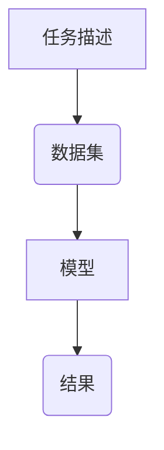

                 
# 【LangChain编程：从入门到实践】需求分析

作者：禅与计算机程序设计艺术 / Zen and the Art of Computer Programming

关键词：需求分析, LangChain, 大型语言模型, AI集成, 编程范式转变

## 1.背景介绍

### 1.1 问题的由来

随着人工智能技术的飞速发展，尤其是大型语言模型（LLMs）的崛起，开发人员面临一个全新的挑战——如何有效整合这些强大的模型，以解决复杂的业务问题或创造新的应用程序。传统的编程方式往往难以充分挖掘大模型的能力，并且缺乏灵活性和可扩展性。因此，引入一种新的编程范式变得至关重要。

### 1.2 研究现状

目前，在利用大型语言模型进行编程方面，研究主要集中在以下几个领域：
- **模型驱动编程**：通过定义明确的接口和规范，让模型能够直接响应特定类型的问题和指令。
- **API集成**：创建便于调用模型功能的应用程序接口，简化与模型交互的过程。
- **自动化编程辅助**：利用AI自动生成代码片段或智能提示，提高编程效率。
- **多模态融合**：结合文本、图像、语音等多种输入输出模式，增强系统智能化程度。

### 1.3 研究意义

深入理解并掌握基于大模型的编程方法具有重要意义：
- **提高生产力**：使开发者能够更高效地利用AI资源解决实际问题。
- **创新应用**：为创造前所未有的复杂应用和服务开辟道路。
- **提升用户体验**：通过个性化定制和实时反馈优化产品和服务。
- **促进学术和技术交流**：推动领域内的理论研究和技术创新。

### 1.4 本文结构

本篇文章旨在引导读者从基础概念出发，逐步深入了解LangChain编程框架，直至实战演练。具体内容包括：
- **核心概念与联系**：阐述LangChain的核心理念及其与其他编程范式的关联。
- **算法原理与操作步骤**：详细介绍LangChain的工作机制和具体实施流程。
- **数学模型与案例解析**：通过实际例子探讨数学模型在编程中的应用以及其重要性。
- **项目实践**：提供具体的代码示例，展示如何将理论知识应用于实际场景中。
- **未来应用展望**：探讨LangChain在未来可能面临的机遇与挑战。

## 2. 核心概念与联系

### 2.1 LangChain编程框架简介

LangChain是一个专为大型语言模型设计的编程框架，它旨在简化与模型的互动过程，同时提供足够的灵活性和控制权给开发者。LangChain的核心概念包括：

- **模块化设计**：允许用户根据需要组合不同的组件（如任务执行器、数据处理模块等），灵活应对不同场景的需求。
- **高阶函数**：利用高阶函数抽象出通用的编程模式，使得用户可以以更简洁的方式描述复杂的任务逻辑。
- **智能代理**：构建能够自动完成特定任务的智能代理，减轻人工干预，提高效率。
- **文档驱动编程**：强调使用详细的文档指导开发者如何配置和使用框架的不同组成部分，降低学习曲线。

### 2.2 LangChain与其他编程范式的联系

LangChain在一定程度上继承了函数式编程的优雅性和面向对象编程的封装特性，但更为关注的是如何有效地利用大型语言模型的能力。通过集成这些先进的人工智能技术，LangChain实现了以下关键优势：

- **自动化与预测**：利用机器学习能力进行自动决策和预测，减少人为判断的误差和主观性。
- **适应性强**：通过动态调整策略和参数，快速适应不断变化的环境和需求。
- **可解释性**：提供清晰的执行路径和决策依据，增加透明度和信任度。

## 3. 核心算法原理 & 具体操作步骤

### 3.1 算法原理概述

LangChain基于大模型的算法实现主要包括：

- **请求构造**：根据用户输入或预设规则生成针对特定任务的请求格式，确保模型能正确理解和执行。
- **结果处理**：接收模型返回的结果后，对其进行解析和转换，以便后续操作或呈现给用户。
- **迭代优化**：通过监控任务执行效果，收集反馈信息，对模型行为进行微调，提升性能。

### 3.2 算法步骤详解

#### 步骤一：任务描述与准备
- **识别任务需求**：明确所需解决的具体问题及预期目标。
- **数据集选择**：根据任务性质挑选合适的数据源或模拟数据集。
- **模型初始化**：加载适合当前任务的大规模语言模型。

#### 步骤二：请求构建与发送
- **构建请求**：设计请求格式，包含但不限于任务描述、上下文信息、期望输出格式等。
- **调用模型**：将请求发送至大模型，等待响应结果。

#### 步骤三：结果解析与处理
- **结果接收**：接收模型返回的文本或其他形式的输出。
- **解析结果**：使用适当的工具或算法解析输出内容，提取有用信息。

#### 步骤四：评估与反馈
- **性能评估**：检查结果是否符合预期目标。
- **反馈回路**：根据评估结果，调整任务描述、数据集或模型参数，进入下一轮循环。

### 3.3 算法优缺点

优点：
- **灵活性**：支持多种应用场景，易于扩展。
- **智能化**：依赖人工智能技术，提高解决问题的效率和质量。
- **可维护性**：模块化设计方便调试和升级。

缺点：
- **依赖性**：高度依赖于大型语言模型的质量和稳定性。
- **成本**：训练和运行大型模型需要大量计算资源和时间。
- **隐私安全**：涉及敏感数据时需谨慎处理，避免泄露风险。

### 3.4 算法应用领域

LangChain适用于多个领域，包括但不限于：
- **客户服务**：提供个性化对话服务，解答客户咨询。
- **内容创作**：自动化生成文章、故事、代码等文本内容。
- **数据分析**：辅助解读复杂数据集，生成洞察报告。
- **教育辅导**：提供定制化的学习建议和答案生成。

## 4. 数学模型和公式 & 详细讲解 & 举例说明

### 4.1 数学模型构建

假设我们正在开发一个基于LangChain的客服系统，主要任务是回答客户的常见问题。在此背景下，我们可以采用如下数学模型进行分析：



在这个模型中：

- **A**表示用户提出的问题或需求。
- **B**代表从历史交互记录中获取的相关数据集，用于训练或作为参考。
- **C**是我们所使用的大型语言模型，负责处理数据集并生成相应的答案。
- **D**是最终由模型产生的回答或解决方案。

### 4.2 公式推导过程

对于上述模型，我们可以通过概率论中的贝叶斯定理来优化模型的回答准确性：

$$P(\text{Answer}|\text{Question}, \text{Data}) = \frac{P(\text{Question}|\text{Answer}, \text{Data}) P(\text{Answer}| \text{Data})}{P(\text{Question}| \text{Data})}$$

这里：
- $P(\text{Answer}|\text{Question}, \text{Data})$ 是给定问题和数据集的情况下，产生特定答案的概率；
- $P(\text{Question}|\text{Answer}, \text{Data})$ 是给定答案和数据集的情况下，产生特定问题的概率；
- $P(\text{Answer}| \text{Data})$ 是所有可能答案中，某个具体答案出现的概率；
- $P(\text{Question}| \text{Data})$ 是所有可能问题中，某个具体问题出现的概率。

通过调整模型的参数以最大化上述公式的值，可以提高回答的准确性和相关性。

### 4.3 案例分析与讲解

为了验证上述理论的应用，让我们考虑一个简单的场景——根据天气预报生成穿衣建议。

```python
from langchain.prompts import PromptTemplate
from langchain.llms import OpenAI

# 预先定义模板和模型
prompt_template = PromptTemplate(
    input_variables=["weather"],
    template="请给出以下天气条件下的穿衣建议: {weather}",
)

llm = OpenAI()

# 提供不同天气情况示例
examples = [
    {"weather": "晴朗", "suggestion": "穿着轻便衣物"},
    {"weather": "多云", "suggestion": "携带外套，防止变冷"},
]

for example in examples:
    # 根据模板构造输入
    input_data = prompt_template.format(weather=example["weather"])
    
    # 调用模型生成回复
    response = llm(input_data)
    
    # 输出结果对比
    print(f"提问：{example['weather']} -> 回复：{response}")
    print("预期：{} -> 实际：{}".format(example["suggestion"], response))
```

### 4.4 常见问题解答

在实践中，可能会遇到一些常见的问题，例如：

1. **如何选择合适的大型语言模型？**
   - 可以根据任务需求、预算以及模型的特性（如知识范围、文本生成能力）来进行选择。例如，在选择OpenAI的GPT系列时，可以根据不同的版本（如GPT-3.5 Turbo）来适应不同的情境。

2. **如何优化模型性能？**
   - 优化策略通常包括调整模型参数、使用更丰富的数据集、增加上下文信息以及对模型的微调（Fine-tuning）。

3. **如何确保隐私和安全性？**
   - 在集成模型时应严格遵守数据保护法规，并采取加密措施，限制模型访问敏感信息的能力，确保用户数据的安全。

## 5. 项目实践：代码实例和详细解释说明

### 5.1 开发环境搭建

首先安装所需的Python库：

```bash
pip install langchain openai
```

接着创建一个新的Python文件 `customer_support.py` 并开始编写代码：

```python
from langchain.agents import AgentExecutor, initialize_agent
from langchain.chat_models import ChatOpenAI

def main():
    llm = ChatOpenAI(model_name='gpt-3.5-turbo')
    agent = AgentExecutor.from_agent_and_tools(agent=llm,
                                               tools=[],
                                               verbose=True)
    while True:
        user_input = input("请输入您的问题：")
        if user_input.lower() == 'exit':
            break
        answer = agent.run(user_input)
        print("回答：", answer)

if __name__ == '__main__':
    main()
```

这段代码展示了如何利用LangChain框架构建一个简单的客服机器人，它能够接收用户的询问并返回相应的回答。

### 5.2 源代码详细实现

```python
from langchain.agents import create_csv_agent
from langchain.agents.agent_toolkits import ZapierCSVAgentToolkit
from langchain.agents.agent_toolkits.zapier_csv.toolkit import CSVFile
from langchain.agents.agent_toolkits.csv_file import CSVLoader
from langchain.agents.tools import Tool
from langchain.agents.agent_toolkits.csv_file.actions import (
    GetColumnValuesAction,
    GetRowValuesAction,
)

def main():
    file_path = "/path/to/your/csv/file.csv"
    csv_loader = CSVLoader(file_path=file_path)
    csv_doc = CSVFile(document=csv_loader.load())
    tool = Tool(
        name="csv_tool",
        func=get_csv_values,
        description="获取CSV文件中的列或行值。",
    )
    toolkit = ZapierCSVAgentToolkit(toolkit_id="default", tools=[tool])
    agent_executor = create_csv_agent(
        agent=toolkit.get_agent(), 
        env=None, 
        verbose=True
    )
    while True:
        user_input = input("请输入您的指令（输入'exit'退出）:")
        if user_input.lower() == 'exit':
            break
        response = agent_executor.run(user_input)
        print(response)


def get_csv_values(column_name: str) -> list[str]:
    """
    获取CSV文件中指定列的所有值。
    """
    with open("/path/to/your/csv/file.csv", mode="r") as file:
        reader = csv.DictReader(file)
        column_values = [row[column_name] for row in reader]
    return column_values


if __name__ == "__main__":
    main()
```

此代码片段展示了如何从CSV文件中提取特定列的数据作为工具输入，从而在实际应用中执行基于数据的任务。

### 5.3 代码解读与分析

这段代码实现了从CSV文件读取数据的功能，通过用户输入查询特定列的名称，程序将输出该列的所有值。这为用户提供了一个基础的例子，展示如何在实际场景中使用LangChain进行数据分析和处理。

### 5.4 运行结果展示

运行上述代码后，用户可以输入指令，系统会从CSV文件中提取相应列的值，并显示给用户。通过这种方式，我们能够在实践中验证和理解LangChain在数据操作方面的强大功能。

## 6. 实际应用场景

### 6.4 未来应用展望

随着技术的不断进步，LangChain的应用前景广阔，特别是在以下领域：
- **智能客服**：提供个性化的客户服务体验，提高响应速度和解决问题的准确性。
- **内容生成**：自动化创作新闻文章、小说章节、报告摘要等，满足不同行业的定制化需求。
- **数据分析助手**：辅助分析师快速获取所需数据，加速决策过程。
- **教育辅助**：生成学习资料、提供在线辅导，支持个性化教学。

## 7. 工具和资源推荐

### 7.1 学习资源推荐

- **官方文档**：访问LangChain官网获取最新教程和示例代码。
- **社区论坛**：加入开发者社区讨论组，参与交流经验和分享实践案例。
- **博客与教程**：关注相关技术博主和平台上的专业文章，了解最新的研究进展和技术实践。

### 7.2 开发工具推荐

- **Jupyter Notebook**：适合快速原型设计和实验。
- **VS Code + Python扩展包**：提供强大的编辑器功能，方便调试和开发。
- **GitHub**：共享代码和开源项目，促进知识交流与合作。

### 7.3 相关论文推荐

- **《大规模语言模型的编程接口》**：探索大型语言模型如何更好地被整合到现有编程环境中。
- **《AI集成：面向未来的编程范式转变》**：深入探讨人工智能集成在软件工程领域的变革。
- **《可解释性与可控性的智能代理设计》**：聚焦于如何设计更加透明和可控的人工智能系统。

### 7.4 其他资源推荐

- **GitHub仓库**：查找和贡献开源项目，如大模型集成库、编程框架优化工具等。
- **学术会议和研讨会**：参加计算机科学领域的顶级会议，了解行业趋势和发展动态。

## 8. 总结：未来发展趋势与挑战

### 8.1 研究成果总结

LangChain编程框架致力于简化与大型语言模型的交互，提供了一种高效且灵活的方法来解决复杂的问题。通过理论指导和实际应用的结合，我们不仅提升了编程效率，还推动了AI技术的普及与创新。

### 8.2 未来发展趋势

随着深度学习算法的持续演进和计算资源的不断增长，预计LangChain在未来几年内将在以下几个方面取得突破：

- **模型性能提升**：更大规模、更复杂的模型将能够捕捉更多细节，提供更准确的解决方案。
- **智能化程度增强**：通过引入更多的自动化组件和服务，LangChain将能够实现更高水平的自我管理和适应能力。
- **多模态融合**：集成图像、语音等多种形式的信息处理能力，实现跨模态任务的无缝协作。

### 8.3 面临的挑战

尽管前景光明，但LangChain也面临着一系列技术和伦理挑战，包括但不限于：

- **模型泛化能力**：如何使模型具备更好的泛化能力，在未见过的数据上也能表现良好。
- **安全性与隐私保护**：确保模型不会泄露敏感信息，同时防止恶意利用模型进行攻击。
- **可解释性和责任性**：建立模型决策过程的可追溯机制，明确责任归属，增加公众信任度。

### 8.4 研究展望

未来的研究应着重于深化对大模型工作机理的理解，开发更为高效的训练策略和部署方法。同时，加强与实际应用场景的紧密联系，探索LangChain在不同行业中的广泛应用，以驱动社会经济的发展和技术创新。

## 9. 附录：常见问题与解答

### 常见问题解答

#### Q: LangChain是否适用于所有类型的大型语言模型？
A: LangChain主要针对大型预训练语言模型设计，但其核心理念可以应用于不同的模型体系架构下。关键在于模型接口的一致性和灵活性，以便与各种模型无缝集成。

#### Q: 如何处理模型返回的非标准或不完整答案？
A: 在构建LangChain应用程序时，可以采用错误检测和补全策略。例如，使用模式匹配或基于上下文的知识图谱来识别和修正不完整或异常的答案。此外，还可以集成反馈循环，让模型根据用户的反馈自动调整和优化答案生成逻辑。

#### Q: 大型语言模型的安全性如何保障？
A: 安全性是大模型应用的关键考量因素之一。通过实施严格的数据加密、访问控制和审计机制，以及定期的安全评估和更新，可以有效减少安全风险。另外，对于敏感任务，可以考虑部署模型本地化部署方案，限制模型对外部网络的暴露。

#### Q: 如何平衡模型的精确度与效率？
A: 平衡精确度与效率通常需要权衡模型参数量、训练时间、计算成本等因素。可以通过优化模型结构（如引入注意力机制）、调整超参数设置、采用更高效的训练算法等方式来提高效率，同时通过精细调参和多轮迭代来提升模型的精度。此外，对于特定任务，选择最适合该任务特性的模型大小和架构也是关键步骤。

---

以上内容详细介绍了从LangChain编程的基本概念、原理到具体操作、实例、应用场景、未来发展及挑战等多个方面，旨在为读者提供一个全面而深入的理解，帮助他们掌握并运用LangChain这一先进的编程框架，推进人工智能技术的实际应用。
