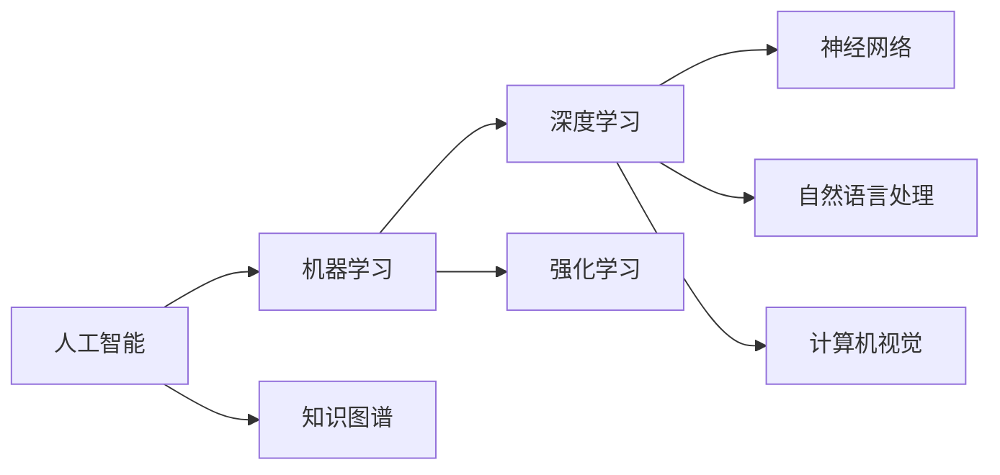

# 人工智能(Artificial Intelligence) - 原理与代码实例讲解

作者：禅与计算机程序设计艺术 / Zen and the Art of Computer Programming

关键词：人工智能、机器学习、深度学习、神经网络、自然语言处理、计算机视觉、强化学习、知识图谱

## 1. 背景介绍

### 1.1 问题的由来

人工智能(Artificial Intelligence, AI)是计算机科学领域的一个重要分支,旨在研究如何让计算机模拟人类的智能行为,使其具备感知、学习、推理和解决问题的能力。自20世纪50年代以来,人工智能经历了从早期的符号主义到后来的连接主义,再到如今的深度学习等多个发展阶段。特别是近年来,随着大数据和算力的飞速发展,人工智能取得了突破性的进展,在语音识别、图像分类、自然语言处理等领域达到甚至超越了人类的水平。

### 1.2 研究现状

目前,人工智能已经广泛应用于各行各业,如智能客服、无人驾驶、医学影像诊断、金融风控等。谷歌、微软、亚马逊等科技巨头以及国内的百度、阿里、腾讯等公司都在大力投入人工智能的研发。与此同时,各国政府也纷纷出台相关政策,支持人工智能产业的发展。中国政府提出了"新一代人工智能发展规划",力争在2030年使中国成为世界主要人工智能创新中心。

### 1.3 研究意义 

人工智能作为引领未来发展的战略性技术,对推动经济社会发展、提升国家竞争力具有重要意义。研究人工智能,一方面有助于我们更好地理解人类智能的本质,另一方面也为解决现实世界中的复杂问题提供了新的思路和方法。通过对人工智能原理的深入剖析和代码实践,可以培养更多的人工智能人才,推动人工智能技术的创新发展。

### 1.4 本文结构

本文将全面介绍人工智能的原理和代码实践。第2部分阐述人工智能的核心概念及其内在联系。第3部分重点讲解人工智能的几大核心算法。第4部分给出相关的数学模型和公式推导。第5部分通过代码实例演示如何用Python实现经典的人工智能算法。第6部分探讨人工智能的实际应用场景。第7部分推荐相关的学习资源和开发工具。第8部分总结人工智能未来的发展趋势和面临的挑战。第9部分列举了一些常见问题解答。

## 2. 核心概念与联系

人工智能涉及的核心概念主要包括:

- 机器学习:使计算机系统能够自动改进性能的一种方法。通过学习数据集,机器可以在没有明确编程的情况下获得新的知识和技能。
- 深度学习:机器学习的一个分支,模仿人脑的神经网络结构,通过构建多层神经网络,实现对数据的高层抽象。
- 神经网络:一种模拟生物神经系统的计算模型,由大量的节点(神经元)通过链接互联而成。通过调整神经元之间链接的权重,网络可以对输入信号进行非线性变换,从而学习到数据背后的规律。
- 自然语言处理:研究如何让计算机理解、生成和处理人类语言,如文本分类、情感分析、机器翻译等。
- 计算机视觉:使计算机能够从图像或视频中获取信息,如物体检测、人脸识别等。
- 强化学习:通过与环境的交互,使智能体学会如何采取行动以获得最大的累积奖励。在围棋、自动驾驶等领域取得了重大突破。
- 知识图谱:以图的形式表示客观世界中的实体及其关系,赋予了机器更强的知识理解和推理能力。

这些概念之间并非孤立,而是相互关联、相互促进的。机器学习为人工智能奠定了理论基础,深度学习则极大地提升了机器学习的性能。神经网络是深度学习的核心架构。自然语言处理和计算机视觉是人工智能的两大应用方向。强化学习使智能体具备了自主学习的能力。知识图谱为人工智能系统注入了先验知识。下图展示了这些概念之间的内在联系。

## 3. 核心算法原理 & 具体操作步骤

### 3.1 算法原理概述

人工智能涉及的核心算法主要有以下几类:

1. 监督学习算法:通过带标签的训练数据学习输入到输出的映射关系,代表算法有决策树、支持向量机、逻辑回归等。
2. 无监督学习算法:从无标签数据中发掘数据的内在结构和规律,代表算法有聚类、主成分分析、自编码器等。  
3. 深度学习算法:通过构建多层神经网络对数据进行表示学习,代表算法有卷积神经网络(CNN)、循环神经网络(RNN)、生成对抗网络(GAN)等。
4. 强化学习算法:通过智能体与环境的交互,使智能体学会采取最优策略,代表算法有Q-learning、策略梯度等。
5. 自然语言处理算法:对文本数据进行分析和处理,代表算法有词向量(word2vec)、注意力机制(Attention)、Transformer等。
6. 计算机视觉算法:从图像数据中提取特征,代表算法有尺度不变特征变换(SIFT)、卷积神经网络(CNN)等。

### 3.2 算法步骤详解

以卷积神经网络(CNN)为例,详细讲解其算法步骤:

1. 输入层:将图像数据输入到网络中。
2. 卷积层:使用卷积核对图像进行卷积操作,提取局部特征。卷积核在图像上滑动,对重叠区域进行点积运算,得到特征图。
3. 激活层:对卷积层的输出使用非线性激活函数(如ReLU),增加网络的非线性表达能力。 
4. 池化层:对特征图进行下采样,减小数据维度,提取主要特征。常用的池化操作有最大池化和平均池化。
5. 全连接层:将池化层输出的特征图展平成一维向量,通过全连接的方式对特征进行组合,生成最终的预测结果。
6. 输出层:使用Softmax函数将全连接层的输出转化为概率分布,进行多分类预测。
7. 损失函数:比较预测结果与真实标签,计算预测误差。常用的损失函数有交叉熵损失函数。
8. 反向传播:根据损失函数计算梯度,使用优化算法(如随机梯度下降)更新网络权重,使损失函数最小化。 

经过多轮迭代训练,CNN可以学习到图像数据的高层语义特征,在图像分类、目标检测等任务上取得了巨大成功。

### 3.3 算法优缺点

以下分析卷积神经网络的优缺点:

优点:
- 局部连接和权重共享,大大减少了网络参数,使训练更加高效。
- 卷积核可以自动学习到图像的局部特征,具有平移不变性。
- 多层网络结构可以学习到图像的层次化特征表示,从低级到高级,从具体到抽象。
- 在图像分类、目标检测、语义分割等任务上达到了远超传统方法的性能。

缺点:  
- 需要大量的带标签的训练数据,获取成本高。
- 网络结构和超参数的设计需要依靠经验,缺乏理论指导。
- 训练时间长,计算资源消耗大。
- 泛化能力有限,容易过拟合。
- 可解释性差,难以理解网络学到的特征。

### 3.4 算法应用领域

卷积神经网络在计算机视觉领域得到了广泛应用,主要包括:

- 图像分类:将图像划分到预定义的类别中,如CIFAR-10、ImageNet等数据集。
- 目标检测:检测图像中的目标物体并给出其位置和类别,代表算法有RCNN、YOLO、SSD等。 
- 语义分割:对图像中的每个像素进行分类,标识其所属的物体类别,如FCN、U-Net等。
- 人脸识别:检测和识别图像中的人脸,如DeepFace、FaceNet等。
- 行为识别:对视频中的人体行为进行分类,如双流网络、3D卷积等。
- 医学影像分析:辅助医生进行疾病诊断,如肺结节检测、糖尿病视网膜病变分级等。

除了计算机视觉,CNN还被用于语音识别、自然语言处理等领域,展现出了强大的特征学习能力和广阔的应用前景。

## 4. 数学模型和公式 & 详细讲解 & 举例说明

### 4.1 数学模型构建

卷积神经网络可以表示为一个多层感知机模型,每一层对应一个数学运算:

- 卷积层:
$$
\mathbf{X}_{j}^{l} = f(\sum_{i \in M_{j}} \mathbf{X}_{i}^{l-1} * \mathbf{W}_{ij}^{l} + \mathbf{b}_{j}^{l})
$$
其中,$\mathbf{X}_{j}^{l}$表示第$l$层第$j$个特征图,$\mathbf{X}_{i}^{l-1}$表示上一层第$i$个特征图,$\mathbf{W}_{ij}^{l}$和$\mathbf{b}_{j}^{l}$分别表示卷积核的权重和偏置,$M_j$表示与第$j$个特征图连接的上一层特征图集合,$f$表示激活函数,如ReLU: $f(x)=max(0,x)$。$*$表示卷积操作。

- 池化层:
$$
\mathbf{X}_{j}^{l} = f(\beta_{j}^{l} \cdot down(\mathbf{X}_{j}^{l-1}) + \mathbf{b}_{j}^{l})
$$  
其中,$down()$表示池化函数,如最大池化或平均池化。$\beta_{j}^{l}$和$\mathbf{b}_{j}^{l}$分别表示缩放因子和偏置。

- 全连接层:
$$
\mathbf{y} = f(\mathbf{W} \cdot \mathbf{x} + \mathbf{b})
$$
其中,$\mathbf{x}$表示上一层的输出向量,$\mathbf{W}$和$\mathbf{b}$分别表示权重矩阵和偏置向量。

- 损失函数以交叉熵为例:
$$
J(\mathbf{W}) = -\frac{1}{m} \sum_{i=1}^{m} \sum_{j=1}^{n} y_{ij} \log(\hat{y}_{ij}) + (1-y_{ij}) \log(1-\hat{y}_{ij}) + \lambda \Vert \mathbf{W} \Vert^2
$$
其中,$y_{ij}$表示第$i$个样本第$j$类的真实标签,$\hat{y}_{ij}$表示预测概率。$\lambda \Vert \mathbf{W} \Vert^2$表示L2正则化项,用于防止过拟合。

- 反向传播:
$$
\mathbf{W}^{l} := \mathbf{W}^{l} - \alpha \cdot \frac{\partial J}{\partial \mathbf{W}^{l}}
$$
$$
\mathbf{b}^{l} := \mathbf{b}^{l} - \alpha \cdot \frac{\partial J}{\partial \mathbf{b}^{l}}
$$
其中,$\alpha$表示学习率。反向传播根据链式法则,从输出层开始,逐层计算损失函数对权重和偏置的梯度,并根据梯度下降法更新网络参数。

### 4.2 公式推导过程

以下推导卷积层输出的计算公式:

假设输入特征图为$\mathbf{X} \in \mathbb{R}^{H \times W \times C