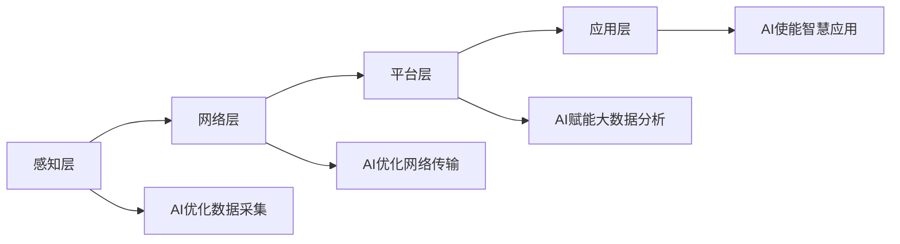

# 人工智能与物联网:结合与挑战

关键词：人工智能、物联网、智能物联、边缘计算、深度学习、智能感知、数据分析、实时决策

## 1. 背景介绍
### 1.1  问题的由来
随着人工智能(Artificial Intelligence, AI)和物联网(Internet of Things, IoT)技术的快速发展,二者的融合已成为当前学术界和产业界关注的热点。人工智能赋予物联网系统以智能化的能力,使其具备数据分析、模式识别、决策优化等功能;物联网则为人工智能提供了海量的数据来源和应用场景。AI+IoT正在催生一个智能互联的新时代。

然而,AI与IoT的结合也面临诸多挑战:海量异构数据的实时处理、算法模型的轻量化、数据安全与隐私保护、资源受限环境下的优化部署等。这些问题亟需学术界和产业界携手攻克。

### 1.2  研究现状 
当前,国内外已有大量学者开展了AI+IoT融合的研究。一方面,研究人员提出了多种IoT数据处理与分析算法,如边缘计算、联邦学习等,以应对IoT环境下的资源和隐私约束。另一方面,轻量级深度学习模型如MobileNet、SqueezeNet不断涌现,以期在资源受限的IoT设备上实现AI算法的高效部署。

同时,工业界巨头如IBM、微软、亚马逊等纷纷推出了AIoT平台及解决方案,力图打造端到端的智能物联生态。一些创新型企业也推出了软硬件结合的AIoT产品,如智能音箱、智能摄像头等,受到市场欢迎。

### 1.3  研究意义
AI与IoT的融合研究对于推动智慧城市、智能制造、智慧医疗、智慧农业等领域发展具有重要意义。通过AI赋能,IoT系统将具备更强大的感知、分析、决策、控制、优化能力,有望大幅提升生产效率,改善生活品质。同时,AIoT技术也将催生出全新的商业模式和产业生态。

此外,AI+IoT融合所涉及的前沿技术如知识图谱、类脑计算、群体智能等,对于人工智能基础理论的发展也具有重要的学术价值。

### 1.4  本文结构
本文将重点探讨人工智能与物联网融合的关键技术、实现路径、应用案例以及面临的机遇与挑战。第2章介绍AIoT的核心概念;第3章重点阐述AIoT的关键技术;第4章给出数学建模与算法详解;第5章通过项目实践演示AIoT系统的实现;第6章分析AIoT的典型应用场景;第7章梳理AIoT相关的开发工具与学习资源;第8章总结全文并展望AIoT的发展前景;第9章附录解答一些常见问题。

## 2. 核心概念与联系

人工智能和物联网是两个密切相关又各有侧重的技术领域。

人工智能是研究、开发用于模拟、延伸和扩展人的智能的理论、方法、技术及应用系统的一门新的技术科学。它通过机器学习、知识表示、自动推理等技术,赋予机器感知、认知、决策等智能。

物联网则是通过射频识别(RFID)、红外感应器、全球定位系统、激光扫描器等信息传感设备,按约定的协议,把任何物品与互联网相连接,进行信息交换和通信,以实现智能化识别、定位、跟踪、监控和管理的一种网络。

AIoT指将人工智能技术应用于物联网,以提升物联网的智能化水平。一方面,IoT为AI提供了真实世界的海量数据,使AI算法得以训练和优化;另一方面,AI赋予IoT以智能分析与决策能力,使其从单纯的数据采集向智慧应用升级。二者结合,将使万物智联成为可能。

具体而言,AI与IoT主要在感知层、网络层、平台层、应用层四个层面融合。

在感知层,AI可用于优化IoT设备的数据采集与预处理,如数据降噪、特征提取等。同时,IoT为AI提供了丰富的感知数据来源。

在网络层,AI可用于优化IoT的路由、流量调度、资源分配等,以提升通信效率。物联网则为AI提供了分布式的计算存储基础设施。

在平台层,AI与大数据、云计算平台深度融合,可对IoT数据进行存储、清洗、分析、挖掘,提炼价值洞见。

在应用层,AI使IoT系统具备语音交互、人脸识别、智能诊断、预测性维护等多种智慧应用能力,大幅拓展了物联网的应用场景和商业价值。

总的来说,人工智能作为使能技术,物联网作为基础设施,二者相互促进、协同发展,共同构筑起万物智能互联的新时代。下图给出了AI与IoT融合的总体架构:

## 3. 核心算法原理 & 具体操作步骤
### 3.1  算法原理概述
AIoT系统涉及多种人工智能算法,主要包括机器学习、深度学习、迁移学习、联邦学习、增强学习等。这些算法可用于IoT数据的特征工程、分类预测、异常检测等任务。考虑到IoT场景的资源约束特点,还需对算法进行轻量化、分布式改进。

以深度学习为例,其基本原理是通过构建多层神经网络,对输入数据进行层层抽象和表征学习,最终映射到输出。深度学习模型包括卷积神经网络(CNN)、循环神经网络(RNN)、长短期记忆网络(LSTM)等,可用于IoT数据的分类、预测、异常检测等。但标准的深度模型往往参数量大,不适合部署在资源受限的IoT设备上。需要采用模型压缩、知识蒸馏等方法进行优化。

### 3.2  算法步骤详解
以卷积神经网络在IoT图像分类任务中的应用为例,其主要步骤如下:

1. 数据采集:通过物联网摄像头等设备采集图像数据,并进行必要的预处理如尺寸归一化等。
2. 数据标注:由人工或算法对采集的图像数据进行标注,确定其所属类别,用于训练模型。  
3. 模型设计:根据任务需求设计CNN模型结构,如网络深度、卷积核大小、池化层设置等。
4. 模型训练:利用已标注的图像数据集对模型进行训练,通过反向传播算法更新模型参数。
5. 模型评估:利用验证集对训练好的模型进行性能评估,如准确率、召回率等指标。
6. 模型优化:采用早停、正则化、参数剪枝、量化等方法对模型进行优化,提升其性能和效率。
7. 模型部署:将优化后的模型转换为适合在IoT设备上运行的格式,并集成到IoT系统中。
8. 在线推理:IoT设备利用训练好的模型对新采集的图像数据进行实时分类。
9. 模型更新:定期利用新采集的数据对模型进行增量训练,使其适应环境变化。

### 3.3  算法优缺点
深度学习在IoT领域的优点主要有:
- 强大的特征学习能力,可从复杂环境数据中提取高层特征。
- 端到端的建模方式,减少了对人工特征工程的依赖。  
- 在图像、语音、视频等感知类任务上表现出色。

其缺点主要有:
- 模型参数量大,不适合直接部署在资源受限的IoT设备上。
- 训练时需要大量标注数据,数据获取和标注成本高。
- 模型训练和推理的计算开销大,实时性有待提高。
- 模型的可解释性较差,难以理解其内部决策机制。

### 3.4  算法应用领域
深度学习在物联网领域已得到广泛应用,如:
- 智能家居:利用CNN对家居摄像头数据进行分析,实现人脸识别、异常行为检测等功能。
- 工业互联网:利用LSTM对设备运行数据进行建模,实现设备健康监测与预测性维护。
- 自动驾驶:利用CNN对车载传感器数据进行融合,实现道路目标检测、语义分割等。
- 智慧医疗:利用CNN对医学影像数据进行分析,辅助疾病诊断和药物筛选。

未来,深度学习有望与迁移学习、联邦学习、知识图谱等技术相结合,进一步拓展其在AIoT领域的应用。

## 4. 数学模型和公式 & 详细讲解 & 举例说明
### 4.1  数学模型构建
以卷积神经网络的数学模型为例。假设第 $l$ 层是一个卷积层,其输入为 $a^{[l-1]}$,输出为 $a^{[l]}$,卷积核参数为 $W^{[l]}$,偏置为 $b^{[l]}$,激活函数为 $g^{[l]}$,则卷积运算可表示为:

$$z^{[l]} = W^{[l]} * a^{[l-1]} + b^{[l]}$$

$$a^{[l]} = g^{[l]}(z^{[l]})$$

其中 $*$ 表示卷积操作。这里假设使用ReLU作为激活函数,即:

$$g^{[l]}(z) = max(0, z)$$

卷积层之后通常接一个池化层,对特征图进行下采样。以最大池化为例,假设池化窗口大小为 $2 \times 2$,则有:

$$a^{[l]}_{i,j} = max(a^{[l-1]}_{2i,2j}, a^{[l-1]}_{2i,2j+1}, a^{[l-1]}_{2i+1,2j}, a^{[l-1]}_{2i+1,2j+1})$$

其中 $a^{[l]}_{i,j}$ 表示第 $l$ 层池化后的特征图在 $(i,j)$ 位置的值。

通过交替使用卷积层和池化层,可构建出完整的卷积神经网络。

### 4.2  公式推导过程
以卷积神经网络的反向传播公式为例。考虑均方误差损失函数:

$$J(W,b) = \frac{1}{m} \sum_{i=1}^{m} (a^{[L](i)} - y^{(i)})^2$$

其中 $a^{[L](i)}$ 为第 $i$ 个样本的网络输出, $y^{(i)}$ 为其真实标签, $m$ 为样本总数。

反向传播的目标是求解损失函数 $J$ 对每一层权重 $W^{[l]}$ 和偏置 $b^{[l]}$ 的梯度 $\frac{\partial J}{\partial W^{[l]}}$ 和 $\frac{\partial J}{\partial b^{[l]}}$。根据链式法则,有:

$$\frac{\partial J}{\partial W^{[l]}} = \frac{\partial J}{\partial z^{[l]}} \frac{\partial z^{[l]}}{\partial W^{[l]}} = \delta^{[l]} * (a^{[l-1]})^T$$

$$\frac{\partial J}{\partial b^{[l]}} = \frac{\partial J}{\partial z^{[l]}} \frac{\partial z^{[l]}}{\partial b^{[l]}} = \delta^{[l]}$$

其中 $\delta^{[l]} = \frac{\partial J}{\partial z^{[l]}}$ 为第 $l$ 层的敏感度,可通过下式递归计算:

$$\delta^{[l]} = \left\{
\begin{aligned}
& (\frac{\partial J}{\partial a^{[L]}} \odot g^{[L]'}(z^{[L]}))\ \ \ \ \ \ \ \ \ \ \ \ \ \ \ \ \ \ \ \ \ \ \ \ \ \ \ \ \ \ \ \ \ \ \ \ \ \ \ \ \ \ \ \ \ \ \ \ \ \ \ \ \ \ \ \ \ \ \ \ \ \ \ \ \ \ \ \ \ \ \ \ \ \ \ (l = L) \\
& ((W^{[l+1]})^T