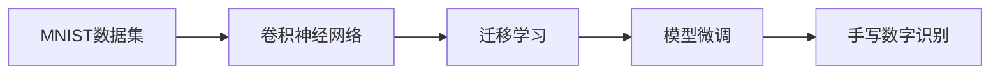
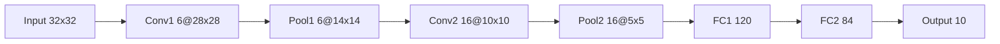

好的,我会严格按照您提供的要求和大纲来撰写这篇技术博客文章。以下是文章的正文内容:

# 从零开始大模型开发与微调：MNIST数据集的特征和标签介绍

关键词:MNIST数据集,手写数字识别,深度学习,卷积神经网络,迁移学习,模型微调

## 1. 背景介绍

### 1.1 问题的由来

在人工智能和机器学习领域,手写数字识别是一个经典的计算机视觉问题。它不仅是图像分类任务的基础,也是验证机器学习算法性能的重要基准。而MNIST数据集作为手写数字识别的标准数据集,在推动这一领域的发展中发挥了关键作用。

### 1.2 研究现状

目前,基于深度学习的方法在MNIST数据集上取得了接近100%的识别准确率。一些经典的卷积神经网络如LeNet-5和AlexNet,以及更先进的ResNet、DenseNet等网络结构,都在MNIST上进行了验证和优化。此外,MNIST数据集还被广泛用于迁移学习、模型压缩、模型攻击等研究。

### 1.3 研究意义  

尽管MNIST数据集已被广泛研究,但对于初学者来说,从零开始构建一个手写数字识别系统仍然是一个很好的学习过程。通过亲自动手实践,可以加深对卷积神经网络、反向传播算法等深度学习基础知识的理解。同时,在自己构建的模型基础上尝试迁移学习和模型微调等技术,有助于快速掌握现有大模型的使用方法。

### 1.4 本文结构

本文将首先介绍MNIST数据集的基本情况,包括图像的特征表示和标签定义。然后,我们将从头搭建一个简单的卷积神经网络,并在MNIST数据集上进行训练和测试。在此基础上,本文将尝试使用预训练的大模型进行迁移学习,通过模型微调的方式进一步提高识别准确率。最后,我们总结MNIST数据集应用的一些经验教训,并展望手写数字识别技术的发展前景。

## 2. 核心概念与联系

在探讨MNIST数据集之前,有必要先了解几个核心概念:

- 卷积神经网络(CNN):一种专门用于处理网格拓扑结构数据(如图像)的神经网络。它通过局部连接和权值共享,大大减少了网络参数数量,加快了训练速度。CNN已成为图像分类任务的主流方法。

- 迁移学习:将一个问题上学习过的模型应用到另一个相似但不完全相同的问题上。它通过借鉴已有知识,加快了模型的学习速度,降低了对训练数据的需求。在图像分类中,常用ImageNet预训练模型进行迁移学习。

- 模型微调:在迁移学习时,为适应新的任务,对预训练模型的部分层的权重进行重新训练,使其更好地拟合新数据。通常只微调模型的最后几层,而保持前面层的权重不变。

下图展示了这几个概念之间的关系:



可以看到,卷积神经网络是处理MNIST图像数据的基础。在此基础上,我们可以利用迁移学习和模型微调等技术,进一步提高手写数字识别的性能。

## 3. 核心算法原理 & 具体操作步骤

### 3.1 算法原理概述

本文采用卷积神经网络进行MNIST手写数字识别,其核心是卷积和池化操作:

- 卷积操作使用一组可学习的过滤器在输入图像上滑动,提取局部特征。
- 池化操作对卷积输出进行下采样,降低特征图的空间维度。

通过交替使用这两种操作,CNN能够自动学习图像的层次化特征表示,从而对图像进行分类。

### 3.2 算法步骤详解

使用CNN进行MNIST手写数字识别的主要步骤如下:

1. 数据准备:加载MNIST数据集,将图像归一化到[0,1]范围,并进行one-hot编码。
2. 搭建CNN模型:设计卷积层、池化层和全连接层的排列组合。
3. 模型训练:定义损失函数和优化器,送入训练数据进行训练。
4. 模型评估:在测试集上评估模型性能,计算识别准确率。
5. 模型微调(可选):加载预训练模型,冻结部分层,微调剩余层以适应MNIST任务。

### 3.3 算法优缺点

CNN用于MNIST手写数字识别的优点包括:

- 通过卷积和池化操作,CNN能够自动提取图像的空间层次特征。
- 局部连接和权值共享使CNN的参数数量大大减少,降低了过拟合风险。
- 平移不变性使CNN对图像的位置变化具有鲁棒性。

但CNN也存在一些局限性:

- 对于尺度、旋转等变化,CNN的不变性较差。
- CNN需要大量标注数据进行训练,否则容易过拟合。
- CNN的计算量较大,对硬件要求较高。

### 3.4 算法应用领域

除了手写数字识别,CNN还被广泛应用于以下领域:

- 人脸识别:DeepFace、DeepID等
- 图像分类:AlexNet、VGGNet、ResNet等
- 目标检测:R-CNN、YOLO、SSD等
- 图像分割:FCN、U-Net、DeepLab等

此外,CNN的思想也被拓展到语音识别、自然语言处理等领域。

## 4. 数学模型和公式 & 详细讲解 & 举例说明

### 4.1 数学模型构建

CNN的数学模型可以表示为一个多层复合函数:

$$y = f(x; \theta) = f_L(...f_2(f_1(x; \theta_1); \theta_2)...; \theta_L)$$

其中,$x$为输入图像,$y$为输出类别标签,$\theta_i$为第$i$层的参数,$L$为网络的层数。每一层$f_i$可以是卷积、池化或全连接层。

以卷积层为例,其数学表达式为:

$$h_{i,j}^l = \sigma(\sum_{a=0}^{F_h-1}\sum_{b=0}^{F_w-1}\sum_{c=0}^{C_{l-1}-1}W_{a,b,c}^lx_{i+a,j+b,c}^{l-1} + b^l)$$

其中,$h_{i,j}^l$为第$l$层第$(i,j)$个神经元的输出,$W_{a,b,c}^l$为卷积核的权重,$b^l$为偏置项,$\sigma$为激活函数,$F_h$和$F_w$为卷积核的高和宽,$C_{l-1}$为上一层的通道数。

### 4.2 公式推导过程

以上卷积公式可以通过以下步骤推导得出:

1. 定义卷积核的大小为$F_h \times F_w \times C_{l-1}$。
2. 将卷积核在输入特征图上滑动,每次滑动计算卷积核与当前窗口内像素的内积。
3. 将内积结果加上偏置项,然后通过激活函数得到输出特征图。
4. 重复步骤2-3,直到遍历整个输入特征图,得到完整的输出特征图。

类似地,可以推导出池化层和全连接层的数学表达式。

### 4.3 案例分析与讲解

以LeNet-5为例,其网络结构如下:



可以看到,LeNet-5包含2个卷积层、2个池化层和2个全连接层。其中:

- 第一个卷积层有6个5x5的卷积核,stride为1,padding为0。
- 第一个池化层为2x2最大池化,stride为2。
- 第二个卷积层有16个5x5的卷积核,stride为1,padding为0。
- 第二个池化层为2x2最大池化,stride为2。
- 第一个全连接层有120个神经元,第二个全连接层有84个神经元。
- 输出层有10个神经元,对应0-9十个数字。

LeNet-5是早期CNN的代表性结构,虽然网络较浅,但已经体现出卷积、池化、全连接层的基本思想。后来的CNN在此基础上不断加深加宽,得到了更强的特征提取和分类能力。

### 4.4 常见问题解答

问:MNIST数据集的图像大小是多少?
答:MNIST数据集的图像大小为28x28,为灰度图像。但通常会在周围填充2个像素,得到32x32的输入尺寸,这样卷积时不需要额外的padding。

问:为什么要使用ReLU激活函数?
答:ReLU(Rectified Linear Unit)函数在正数部分等于自身,在负数部分等于0。相比Sigmoid和Tanh函数,ReLU能够缓解梯度消失问题,加速网络收敛。同时,ReLU计算简单,能够减少训练时间。

问:如何处理MNIST图像的旋转和缩放变化?
答:可以在训练集上进行数据增强,随机对图像进行旋转和缩放,使得网络学习到这些变化。另一种方法是使用空间变换网络(STN),通过学习一个仿射变换矩阵,自动对图像进行校正。

## 5. 项目实践：代码实例和详细解释说明

下面我们使用PyTorch实现一个简单的CNN,并在MNIST数据集上进行训练和测试。

### 5.1 开发环境搭建

首先确保已经安装了PyTorch、torchvision和matplotlib等库:

```bash
pip install torch torchvision matplotlib
```

### 5.2 源代码详细实现

```python
import torch
import torch.nn as nn
import torch.optim as optim
import torchvision
import torchvision.transforms as transforms
import matplotlib.pyplot as plt

# 定义超参数
BATCH_SIZE = 128
EPOCHS = 10
DEVICE = torch.device("cuda" if torch.cuda.is_available() else "cpu")

# 加载MNIST数据集
train_dataset = torchvision.datasets.MNIST(root='./data', 
                                           train=True, 
                                           transform=transforms.ToTensor(),  
                                           download=True)

test_dataset = torchvision.datasets.MNIST(root='./data', 
                                          train=False, 
                                          transform=transforms.ToTensor())

train_loader = torch.utils.data.DataLoader(dataset=train_dataset, 
                                           batch_size=BATCH_SIZE, 
                                           shuffle=True)

test_loader = torch.utils.data.DataLoader(dataset=test_dataset, 
                                          batch_size=BATCH_SIZE, 
                                          shuffle=False)

# 定义CNN模型
class CNN(nn.Module):
    def __init__(self):
        super(CNN, self).__init__()
        self.conv1 = nn.Sequential(         
            nn.Conv2d(
                in_channels=1,              
                out_channels=16,            
                kernel_size=5,              
                stride=1,                   
                padding=2,                  
            ),                              
            nn.ReLU(),                      
            nn.MaxPool2d(kernel_size=2),    
        )
        self.conv2 = nn.Sequential(         
            nn.Conv2d(16, 32, 5, 1, 2),     
            nn.ReLU(),                      
            nn.MaxPool2d(2),                
        )
        self.out = nn.Linear(32 * 7 * 7, 10)

    def forward(self, x):
        x = self.conv1(x)
        x = self.conv2(x)
        x = x.view(x.size(0), -1)          
        output = self.out(x)
        return output

# 实例化模型并移至GPU
model = CNN().to(DEVICE)

# 定义损失函数和优化器
criterion = nn.CrossEntropyLoss()
optimizer = optim.Adam(model.parameters(), lr=0.001)

# 训练模型
total_step = len(train_loader)
for epoch in range(EPOCHS):
    for i, (images, labels) in enumerate(train_loader):
        images = images.to(DEVICE)
        labels = labels.to(DEVICE)
        
        # 前向传播
        outputs = model(images)
        loss = criterion(outputs, labels)
        
        # 反向传播和优化
        optimizer.zero_grad()
        