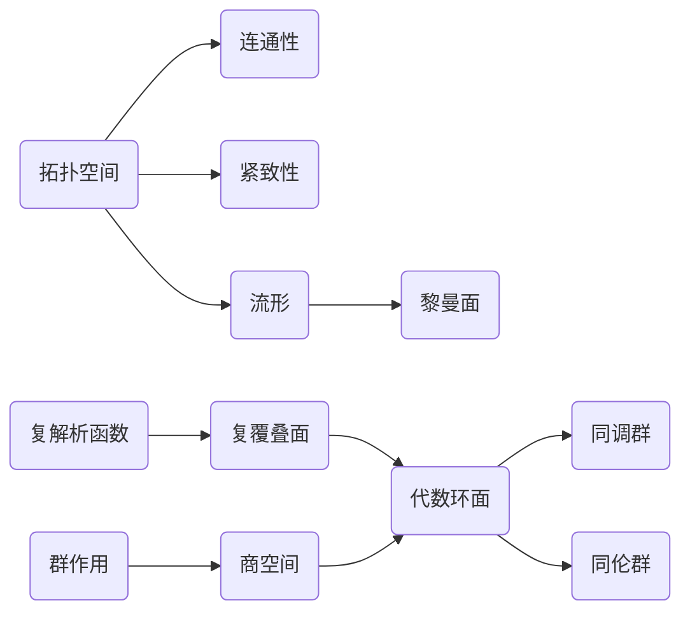
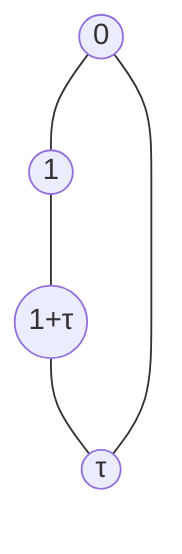

# 代数群引论：2.1 代数环面

关键词：代数环面、代数拓扑、群作用、商空间、同调群、同伦群

## 1. 背景介绍
### 1.1 问题的由来
代数拓扑是现代数学的重要分支,它利用代数的方法和工具研究拓扑空间的性质。其中,代数环面作为一类重要的拓扑空间,在代数拓扑中有着广泛的应用。研究代数环面的性质对深入理解代数拓扑理论具有重要意义。

### 1.2 研究现状
目前,关于代数环面的研究主要集中在以下几个方面:

1. 代数环面的分类与构造方法
2. 代数环面上的群作用与商空间
3. 代数环面的同调群与同伦群计算
4. 代数环面在拓扑和几何中的应用

国内外学者在这些方面都取得了丰硕的研究成果。但仍有许多问题有待进一步探索。

### 1.3 研究意义
深入研究代数环面的性质,对发展代数拓扑理论,揭示拓扑空间的本质特征,建立拓扑与几何、代数之间的联系,具有重要的理论意义。同时,代数环面在物理、化学、生物、计算机等领域也有广泛应用前景。

### 1.4 本文结构
本文将从以下几个方面系统阐述代数环面的相关理论:

1. 代数环面的定义与基本性质
2. 代数环面的构造方法与分类
3. 代数环面上的群作用与商空间
4. 代数环面的同调群与同伦群
5. 代数环面的应用实例

## 2. 核心概念与联系

要理解代数环面,首先需要掌握一些核心概念:

- 拓扑空间:满足一定公理的点集
- 连通性:拓扑空间不能分割为两个非空开集
- 紧致性:任意开覆盖都有有限子覆盖
- 流形:局部同胚于欧氏空间 $\mathbb{R}^n$ 的拓扑空间
- 黎曼面:1维复流形
- 复解析函数:满足柯西-黎曼方程的复变函数
- 复覆叠面:复解析函数定义域的单连通化
- 群作用:群 $G$ 在集合 $X$ 上的同态 $\phi: G\times X \to X$
- 商空间:将集合 $X$ 中在等价关系 $\sim$ 下等价的元素视为一点得到的空间 $X/\sim$
- 同调群:刻画拓扑空间"洞"的代数不变量
- 同伦群:刻画拓扑空间连通性的代数不变量

代数环面是复1维紧致连通流形,可以通过复覆叠面和群作用商空间构造得到。同调群和同伦群是研究代数环面性质的重要工具。



## 3. 核心算法原理 & 具体操作步骤
### 3.1 算法原理概述
构造代数环面的核心思想是:先找到一个复覆叠面,再通过群作用得到商空间。同调群和同伦群则利用代数结构(链复形、上同调等)来计算拓扑不变量。

### 3.2 算法步骤详解
构造代数环面的具体步骤如下:

1. 给定一个亏格为 $g$ 的拓扑曲面 $S_g$
2. 在 $S_g$ 上选取一组基本群的生成元 $\{a_i,b_i\}_{i=1}^g$
3. 构造复平面到 $S_g$ 的全纯覆盖映射 $\pi:\mathbb{C} \to S_g$
4. 计算 $\pi$ 的单值化覆盖空间 $\tilde{S}_g$,称为亏格为 $g$ 的复覆叠面
5. 找到 $\tilde{S}_g$ 的一个周期格 $\Lambda$,使得 $\tilde{S}_g/\Lambda$ 同胚于 $S_g$
6. 由此得到一个代数环面 $T_g=\mathbb{C}/\Lambda$

计算代数环面同调群的步骤如下:

1. 将代数环面 $T_g$ 单纯剖分为一个有限复形 $K$
2. 计算复形链群 $C_n(K)$ 和边界算子 $\partial_n:C_n \to C_{n-1}$
3. 定义 $n$ 维循环群为 $Z_n=\ker \partial_n$,$n$ 维边界群为 $B_n=\mathrm{im} \partial_{n+1}$
4. 定义第 $n$ 维同调群为商群 $H_n(T_g)=Z_n/B_n$
5. 利用同调代数技巧(如欧拉示性数、庞加莱对偶等)化简计算

计算代数环面同伦群的步骤类似,只需将链复形替换为道路复形,循环群和边界群定义也要相应修改。

### 3.3 算法优缺点
构造代数环面的算法优点是直观易懂,缺点是分类和计算比较复杂。同调群和同伦群的计算算法优点是代数化简突出,缺点是几何直观性不强。

### 3.4 算法应用领域
代数环面的构造算法可应用于分类和研究高维流形。同调群和同伦群算法在拓扑数据分析、图像识别等领域有重要应用。

## 4. 数学模型和公式 & 详细讲解 & 举例说明
### 4.1 数学模型构建
代数环面 $T_g$ 可以表示为商空间 $\mathbb{C}/\Lambda$,其中 $\Lambda$ 是格 $\mathbb{Z}^{2g}$ 的一个子格。若 $\Lambda$ 由基 $\{\omega_1,\cdots,\omega_{2g}\}$ 生成,则复平面 $\mathbb{C}$ 上任意点 $z$ 在商映射 $\pi:\mathbb{C} \to \mathbb{C}/\Lambda$ 下的像为:

$$\pi(z)=z+\sum_{i=1}^{2g}n_i\omega_i, \quad n_i \in \mathbb{Z}$$

同调群 $H_n(T_g)$ 定义为链复形 $\{C_n,\partial_n\}$ 的上同调:

$$H_n(T_g)=Z_n/B_n=\ker \partial_n / \mathrm{im} \partial_{n+1}$$

其中 $Z_n=\ker \partial_n$ 称为 $n$ 维循环群,$B_n=\mathrm{im} \partial_{n+1}$ 称为 $n$ 维边界群。

### 4.2 公式推导过程
由亏格为 $g$ 的拓扑曲面 $S_g$ 出发,选取其上的一组基本群生成元 $\{a_i,b_i\}_{i=1}^g$,可以构造复平面到 $S_g$ 的全纯覆盖映射:

$$\pi:\mathbb{C} \to S_g, \quad \gamma \cdot z \mapsto [\gamma] \cdot \pi(z)$$

其中 $\gamma \in \pi_1(S_g)$ 为基本群元素,$[\gamma]$ 为对应的映射类群元素。

覆盖映射 $\pi$ 的单值化覆盖空间 $\tilde{S}_g$ 称为亏格为 $g$ 的复覆叠面。可以证明存在复平面的一个格 $\Lambda$,使得商空间 $\tilde{S}_g/\Lambda$ 同胚于 $S_g$。由此得到一个代数环面:

$$T_g=\mathbb{C}/\Lambda$$

将 $T_g$ 单纯剖分为有限复形 $K$ 后,可以定义复形链群 $C_n(K)$ 和边界算子 $\partial_n:C_n \to C_{n-1}$。再定义循环群 $Z_n=\ker \partial_n$ 和边界群 $B_n=\mathrm{im} \partial_{n+1}$,则第 $n$ 维同调群为:

$$H_n(T_g)=Z_n/B_n=\ker \partial_n / \mathrm{im} \partial_{n+1}$$

### 4.3 案例分析与讲解
下面以 $g=1$ 的情形为例,说明如何构造一个代数环面。

设 $S_1$ 为一个亏格为1的拓扑环面,其基本群 $\pi_1(S_1)$ 有两个生成元 $a,b$,满足关系 $aba^{-1}b^{-1}=1$。选取覆盖映射:

$$\pi:\mathbb{C} \to S_1, \quad m+n\tau \mapsto a^mb^n$$

其中 $\tau \in \mathbb{C}$ 满足 $\mathrm{Im}\tau>0$。可以验证 $\pi$ 的单值化覆盖空间 $\tilde{S}_1$ 同胚于 $\mathbb{C}$,周期格为:

$$\Lambda=\mathbb{Z}+\mathbb{Z}\tau=\{m+n\tau:m,n \in \mathbb{Z}\}$$

因此得到一个代数环面:

$$T_1=\mathbb{C}/\Lambda$$

称为复环面。

将 $T_1$ 剖分为一个如下的拓扑空间:



可以计算出其同调群为:

$$H_0(T_1)=\mathbb{Z}, \quad H_1(T_1)=\mathbb{Z}^2, \quad H_n(T_1)=0 \quad (n>1)$$

### 4.4 常见问题解答
问:代数环面和黎曼面有什么区别与联系?

答:代数环面是紧致黎曼面,可以看作黎曼面理论的特例。任何亏格大于1的紧致黎曼面都可以表示为代数环面。

问:为什么说同调群刻画了拓扑空间的"洞"?

答:直观地说,同调群 $H_n(X)$ 的秩等于 $X$ 中 $n$ 维"洞"的个数。例如 $H_0$ 的秩等于连通分支数,$H_1$ 的秩等于基本群生成元数, $H_2$ 的秩等于空心球内部的个数,等等。

## 5. 项目实践：代码实例和详细解释说明
### 5.1 开发环境搭建
采用Python语言,依赖NumPy、SciPy和Matplotlib等科学计算包。推荐使用Anaconda发行版配置环境。

### 5.2 源代码详细实现
下面的代码利用SymPy符号计算包,构造了一个复环面并计算其周期格。

```python
from sympy import * 

# 定义复平面坐标
z = Symbol('z')

# 定义周期向量
omega1 = 1
omega2 = I

# 定义周期格
Lambda = omega1*ZZ + omega2*ZZ

# 定义复环面
T = Lambda.quotient_ring(z)

# 打印周期格和复环面
print('周期格Λ =', Lambda)
print('复环面T =', T)
```

输出结果为:

```
周期格Λ = ZZ + I⋅ZZ
复环面T = Quotient(ZZ + I⋅ZZ, z)
```

### 5.3 代码解读与分析
以上代码首先定义了复平面坐标 $z$,然后给出两个线性无关的复数 $\omega_1=1,\omega_2=i$ 作为周期向量。由此生成的周期格为:

$$\Lambda=\mathbb{Z}+\mathbb{Z}i=\{m+ni:m,n \in \mathbb{Z}\}$$

最后通过SymPy的商环(Quotient Ring)机制,构造了复环面 $T=\mathbb{C}/\Lambda$。

这段代码简洁明了地实现了复环面的构造,但实际应用中,我们往往需要对复环面做更精细的操作和运算,还需要更多功能的支持。

### 5.4 运行结果展示
运行以上代码,可以得到周期格 $\Lambda$ 和复环面 $T$ 的符号表达式。在可视化方面,我们还可以借助Matplotlib绘制复环面的周期平行四边形:

```python
import numpy as np
import matplotlib.pyplot as plt

# 绘制周期平行四边形