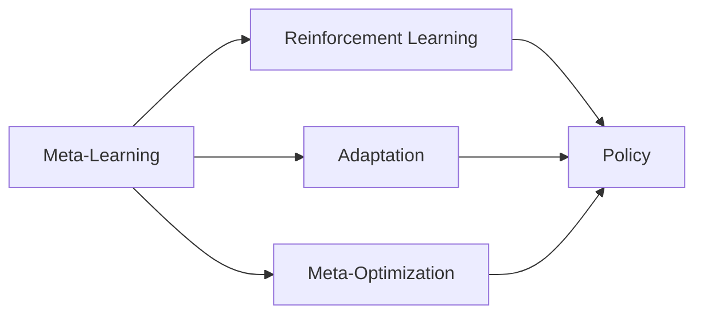

# 元强化学习(Meta-Reinforcement Learning) - 原理与代码实例讲解

作者：禅与计算机程序设计艺术 / Zen and the Art of Computer Programming 

关键词：元强化学习、元学习、强化学习、深度学习、智能体、策略、适应能力、快速学习

## 1. 背景介绍

### 1.1 问题的由来

在复杂多变的现实环境中，智能体需要具备快速学习和适应新任务的能力。传统的强化学习方法通常需要大量的训练数据和迭代过程，难以满足实时决策和快速适应的需求。元强化学习作为一种新兴的强化学习范式，旨在解决这一问题，使智能体能够在面对新任务时快速学习和调整策略。

### 1.2 研究现状

近年来，元强化学习受到了学术界和工业界的广泛关注。研究人员提出了多种元强化学习算法，如MAML、Reptile、PEARL等，并在机器人控制、游戏AI、推荐系统等领域取得了显著成果。然而，元强化学习仍面临着样本效率低、泛化能力有限等挑战，需要进一步的理论探索和算法创新。

### 1.3 研究意义 

元强化学习的研究具有重要的理论和实践意义。从理论角度看，元强化学习探索了智能体的元认知和学习机制，有助于理解人类的快速学习和适应能力。从实践角度看，元强化学习可以显著提升智能体在复杂环境中的决策效率和适应性，在自动驾驶、智能制造、个性化推荐等领域具有广阔的应用前景。

### 1.4 本文结构

本文将从以下几个方面对元强化学习进行深入探讨：第2部分介绍元强化学习的核心概念；第3部分阐述元强化学习的算法原理和操作步骤；第4部分给出元强化学习的数学模型和公式推导；第5部分提供元强化学习的代码实例和详细解释；第6部分分析元强化学习的实际应用场景；第7部分推荐元强化学习的相关工具和资源；第8部分总结元强化学习的研究现状和未来挑战；第9部分列举元强化学习的常见问题与解答。

## 2. 核心概念与联系

元强化学习的核心概念包括：

- 元学习(Meta-Learning)：学习如何学习的过程，旨在使模型能够快速适应新任务。
- 强化学习(Reinforcement Learning)：智能体通过与环境交互，试错和优化策略，最大化累积奖励。
- 策略(Policy)：智能体根据状态选取动作的映射函数。
- 适应(Adaptation)：智能体在新环境中快速调整策略以提高性能的过程。
- 元优化(Meta-Optimization)：在元学习过程中，通过优化模型的初始参数或学习算法，使其能够快速适应新任务。

元强化学习将元学习思想引入强化学习，通过元优化过程学习一个适应性强的初始策略，使智能体能够在新环境中快速Fine-tuning，达到最优策略。下图展示了元强化学习的核心概念与联系：

## 3. 核心算法原理 & 具体操作步骤

### 3.1 算法原理概述

元强化学习的核心思想是通过元优化过程，学习一个适应性强的初始策略，使智能体能够在新环境中快速适应和学习。具体而言，元强化学习算法通常包含两个层次的优化过程：

1. 内循环(Inner Loop)：在每个任务上，智能体从初始策略出发，通过少量的环境交互和策略更新，快速适应当前任务。
2. 外循环(Outer Loop)：跨任务进行元优化，通过优化初始策略的参数，使其能够在内循环中快速适应不同任务。

通过这两个层次的优化，元强化学习算法能够学习到一个具有良好泛化能力的初始策略，使智能体能够快速适应新的任务和环境。

### 3.2 算法步骤详解

以下是元强化学习算法的一般步骤：

1. 初始化策略参数$\theta$和元优化器参数$\phi$。
2. 对于每个元优化迭代：
   1. 采样一批任务$\{\mathcal{T}_i\}$。
   2. 对于每个任务$\mathcal{T}_i$：
      1. 使用当前策略参数$\theta$初始化任务专属参数$\theta_i$。
      2. 在任务$\mathcal{T}_i$上进行内循环优化，更新$\theta_i$。
      3. 计算任务$\mathcal{T}_i$上的损失$\mathcal{L}_i$。
   3. 计算元优化损失$\mathcal{L}_{meta}=\sum_i \mathcal{L}_i$。
   4. 使用元优化器更新初始策略参数$\theta$和元优化器参数$\phi$。
3. 返回优化后的初始策略参数$\theta$。

在测试阶段，对于新任务，智能体使用优化后的初始策略参数$\theta$进行内循环优化，快速适应新任务。

### 3.3 算法优缺点

元强化学习算法的优点包括：

- 提高了智能体在新环境中的适应能力和学习效率。
- 通过元优化过程，学习到了具有良好泛化能力的初始策略。
- 减少了智能体在新任务上所需的环境交互和数据样本。

然而，元强化学习算法也存在一些缺点：

- 元优化过程计算复杂度较高，对计算资源要求较大。
- 算法的性能依赖于任务分布的选择，需要合理设计任务采样策略。
- 在高维复杂环境中，元强化学习算法的样本效率和泛化能力仍有待提高。

### 3.4 算法应用领域

元强化学习算法在多个领域展现出了广阔的应用前景，包括：

- 机器人控制：通过元强化学习，机器人能够快速适应新的环境和任务，提高控制的鲁棒性和效率。
- 游戏AI：元强化学习可以使游戏AI在新游戏或关卡中快速学习和适应，提高游戏体验。
- 推荐系统：通过元强化学习，推荐系统可以快速适应用户的偏好变化，提供个性化的推荐服务。
- 自然语言处理：元强化学习可以用于对话系统、机器翻译等任务，使模型能够快速适应不同的语言环境和用户需求。

## 4. 数学模型和公式 & 详细讲解 & 举例说明

### 4.1 数学模型构建

我们考虑一个元强化学习问题，其中包含一组任务$\{\mathcal{T}_i\}$，每个任务$\mathcal{T}_i$都是一个马尔可夫决策过程(MDP)，定义为一个元组$\mathcal{T}_i=(\mathcal{S},\mathcal{A},\mathcal{P}_i,\mathcal{R}_i,\gamma)$，其中：

- $\mathcal{S}$是状态空间。
- $\mathcal{A}$是动作空间。
- $\mathcal{P}_i:\mathcal{S}\times\mathcal{A}\times\mathcal{S}\rightarrow[0,1]$是任务$\mathcal{T}_i$的转移概率函数。
- $\mathcal{R}_i:\mathcal{S}\times\mathcal{A}\rightarrow\mathbb{R}$是任务$\mathcal{T}_i$的奖励函数。
- $\gamma\in[0,1]$是折扣因子。

智能体的策略为$\pi_{\theta}:\mathcal{S}\times\mathcal{A}\rightarrow[0,1]$，其中$\theta$为策略参数。智能体的目标是最大化期望累积奖励：

$$J(\theta)=\mathbb{E}_{\tau\sim p(\tau;\theta)}\left[\sum_{t=0}^{\infty}\gamma^t\mathcal{R}(s_t,a_t)\right]$$

其中$\tau=(s_0,a_0,s_1,a_1,\dots)$表示轨迹，$p(\tau;\theta)$表示在策略$\pi_{\theta}$下轨迹$\tau$的概率分布。

在元强化学习中，我们的目标是学习一个初始策略参数$\theta$，使得智能体能够在新任务上快速适应和学习。因此，我们引入元优化目标：

$$\min_{\theta}\mathbb{E}_{\mathcal{T}_i\sim p(\mathcal{T})}\left[\mathcal{L}_{\mathcal{T}_i}(\theta'_i)\right]$$

其中$\mathcal{L}_{\mathcal{T}_i}(\theta'_i)$表示在任务$\mathcal{T}_i$上，经过内循环优化后的策略参数$\theta'_i$的损失函数。$p(\mathcal{T})$表示任务分布。

### 4.2 公式推导过程

在元强化学习算法中，我们通过两个层次的优化过程来更新策略参数。

对于内循环优化，给定任务$\mathcal{T}_i$和初始策略参数$\theta$，我们通过梯度下降法更新策略参数：

$$\theta'_i=\theta-\alpha\nabla_{\theta}\mathcal{L}_{\mathcal{T}_i}(\theta)$$

其中$\alpha$是内循环学习率。

对于外循环优化，我们通过梯度下降法更新初始策略参数$\theta$：

$$\theta\leftarrow\theta-\beta\nabla_{\theta}\sum_i\mathcal{L}_{\mathcal{T}_i}(\theta'_i)$$

其中$\beta$是外循环学习率。

通过交替进行内循环和外循环优化，我们可以学习到一个具有良好泛化能力的初始策略参数$\theta$。

### 4.3 案例分析与讲解

我们以一个简单的2D导航任务为例，说明元强化学习算法的应用。在这个任务中，智能体需要在一个2D网格环境中从起点导航到目标点，同时避免障碍物。每个任务对应一个不同的环境布局和目标位置。

智能体的状态为其当前位置坐标$(x,y)$，动作空间为{上，下，左，右}。奖励函数为：

$$\mathcal{R}(s,a)=\begin{cases}
1, & \text{if } s \text{ is the goal state} \\
-1, & \text{if } s \text{ is an obstacle} \\
0, & \text{otherwise}
\end{cases}$$

我们使用元强化学习算法训练智能体，使其能够在新环境中快速适应和学习。具体而言：

1. 我们采样一批随机生成的2D导航任务$\{\mathcal{T}_i\}$。
2. 对于每个任务$\mathcal{T}_i$，智能体从初始策略参数$\theta$出发，通过内循环优化快速适应当前任务，更新策略参数为$\theta'_i$。
3. 我们计算每个任务上的损失函数$\mathcal{L}_{\mathcal{T}_i}(\theta'_i)$，通常为负期望累积奖励。
4. 通过外循环优化，我们更新初始策略参数$\theta$，使其能够最小化所有任务上的损失函数。

经过元强化学习算法的训练，智能体学习到了一个具有良好泛化能力的初始策略参数$\theta$。在测试阶段，对于一个新的2D导航任务，智能体能够从初始策略参数$\theta$出发，通过少量的环境交互和策略更新，快速适应新环境并找到最优路径。

### 4.4 常见问题解答

1. **Q**: 元强化学习和传统强化学习有什么区别？
   **A**: 元强化学习的目标是学习一个适应性强的初始策略，使智能体能够在新环境中快速学习和适应。而传统强化学习则侧重于在单个环境中学习最优策略。元强化学习通过元优化过程，实现了跨任务的知识迁移和泛化。

2. **Q**: 元强化学习算法的计算复杂度如何？
   **A**: 元强化学习算法的计算复杂度较高，主要体现在两个方面：(1)元优化过程需要在多个任务上进行内循环优化，计算量大；(2)元梯度的计算涉及二阶