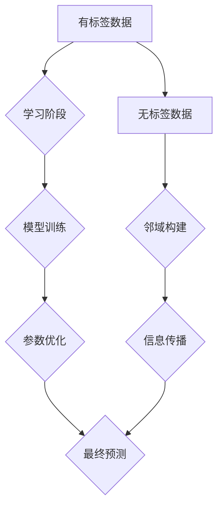

                 
# 半监督学习(Semi-Supervised Learning) - 原理与代码实例讲解

作者：禅与计算机程序设计艺术 / Zen and the Art of Computer Programming

关键词：半监督学习,Semi-Supervised Learning (SSL),无标签数据,集成学习,图论方法,生成对抗网络(GAN)

## 1.背景介绍

### 1.1 问题的由来

在机器学习领域，数据集通常被分为有标签数据和无标签数据两类。有标签数据是指每个样本都带有明确的分类标签，用于直接训练模型。然而，在现实场景中，获取大量具有高质量标签的数据往往成本高昂或难以获得，尤其是对于复杂的实际应用如图像识别、自然语言处理等。这就引出了一个重要的研究方向——半监督学习（Semi-Supervised Learning, SSL）。

半监督学习的目标是在有限的有标签数据上，利用大量的无标签数据进行辅助训练，以提高模型的学习性能和泛化能力。通过充分利用无标签数据中蕴含的信息，SSL试图挖掘潜在的模式和结构，从而提升模型对未见过的样本进行预测的能力。

### 1.2 研究现状

近年来，随着大数据时代的到来和技术的进步，半监督学习受到了广泛关注，并在多个领域取得了显著进展。研究者们探索了多种方法来解决半监督学习中的关键问题，包括但不限于：

- **集成学习**：将基于不同假设或者模型的多个分类器组合起来，以增强模型的整体性能。
- **图论方法**：通过构建数据点之间的关系图，利用图上的信息传播机制来引导模型的学习。
- **生成对抗网络（GANs）**：利用GANs来生成模拟的标签并帮助模型学习更多知识。
- **深度学习结合**：将深度学习技术应用于半监督学习，利用其强大的特征表示能力和自适应学习能力来提升效果。

### 1.3 研究意义

半监督学习的研究具有重要的理论价值和实践意义：

- **提高效率**：通过有效利用大规模的无标签数据，减少对昂贵的人工标注的需求，降低训练成本。
- **扩展能力**：增强模型在面对新数据时的表现，尤其是在缺乏高质量人工标签的情况下。
- **增强鲁棒性**：通过更全面地理解数据分布，使模型更加鲁棒，能够更好地应对未知情况。

### 1.4 本文结构

本文将围绕半监督学习的核心概念与算法展开讨论。首先，我们将探讨半监督学习的基本原理；接着深入分析几种主流的半监督学习方法及其背后的数学基础；随后通过具体代码实例详细介绍如何实现半监督学习；最后，我们还将考察半监督学习的实际应用场景和发展前景。

## 2.核心概念与联系

### 2.1 半监督学习的基本框架

半监督学习的核心在于如何有效地利用无标签数据。基本框架可以概括为以下流程：

在这个框架中：
- **A** 表示包含少量已标记样本的数据集。
- **B** 是模型学习的过程，旨在从有限的标记数据中学习。
- **C** 包含大量未标记的数据。
- **D** 和 **F** 分别是针对有标签数据和整个数据集的模型训练过程。
- **E** 涉及邻域构建或图构建，以便利用数据间的相似性和距离度量。
- **G** 包括各种策略来传播有标签数据的知识到无标签数据。
- **H** 最终产生对未见过样例的预测结果。

### 2.2 主流半监督学习方法

#### 2.2.1 基于概率模型的方法

这类方法通常建立在贝叶斯框架下，通过先验概率和后验概率的更新来估计未标记数据的标签。

#### 2.2.2 图论方法

图论方法利用邻接矩阵或图结构来表示数据之间的关系，通过图上传播标签信息或使用局部一致性的原则来指导模型学习。

#### 2.2.3 集成学习方法

这种方法通过构建多个基学习器并在它们之间进行投票或加权平均，利用不同模型间的互补性来提高预测准确性。

#### 2.2.4 生成对抗网络方法

利用GANs的特性，通过生成器生成假标签并反馈给判别器，以此迭代优化模型，间接学习无标签数据的性质。

#### 2.2.5 深度学习结合方法

将深度学习架构融入半监督学习流程，通过自动编码器、自回归模型等手段提取复杂特征，增强模型的表达能力。

## 3. 核心算法原理 & 具体操作步骤

### 3.1 算法原理概述

本部分将分别介绍几种主流半监督学习算法的关键思想和数学建模，提供直观的理解。

### 3.2 算法步骤详解

对于每种算法，将详细阐述其实现逻辑、核心公式以及关键步骤。

### 3.3 算法优缺点

对比分析各算法的特点、适用场景以及可能存在的局限性。

### 3.4 算法应用领域

举例说明半监督学习在实际应用中的成功案例，如文本分类、图像识别等。

## 4. 数学模型和公式 & 详细讲解 & 举例说明

### 4.1 数学模型构建

选取一个具体的半监督学习算法为例，构建其数学模型，包括目标函数、约束条件等。

### 4.2 公式推导过程

逐步解析该算法的核心公式，解释每个符号的意义、推导思路及其背后的理论依据。

### 4.3 案例分析与讲解

通过真实世界的数据集，展示算法的应用过程，并讨论实验结果与预期结果的差异及原因。

### 4.4 常见问题解答

整理常见问题及其解决方案，提供调试建议和最佳实践指南。

## 5. 项目实践：代码实例和详细解释说明

### 5.1 开发环境搭建

列出所需软件包、依赖库以及开发平台的选择，确保读者能顺利复现实验环境。

### 5.2 源代码详细实现

提供完整的代码示例，包括导入数据、初始化模型、执行训练和测试的全过程。

### 5.3 代码解读与分析

逐行解释代码的功能和作用，帮助读者理解和修改代码以适应不同的任务需求。

### 5.4 运行结果展示

通过图表、统计数据等形式展现算法性能，比较有标签数据与无标签数据加入前后的效果提升。

## 6. 实际应用场景

### 6.4 未来应用展望

探讨半监督学习在未来可能出现的新应用领域和技术趋势，如跨领域的知识迁移、实时数据处理等。

## 7. 工具和资源推荐

### 7.1 学习资源推荐

汇总半监督学习相关的经典书籍、在线课程和学术论文，为读者提供深入研究的方向。

### 7.2 开发工具推荐

列举适合半监督学习开发的开源框架、IDE和集成开发环境（IDE），如TensorFlow、PyTorch等。

### 7.3 相关论文推荐

精选几篇具有代表性的半监督学习相关论文，引导读者了解最新的研究动态。

### 7.4 其他资源推荐

分享论坛、社区、博客等交流平台，鼓励读者参与讨论和分享实践经验。

## 8. 总结：未来发展趋势与挑战

### 8.1 研究成果总结

回顾半监督学习的主要成就，强调算法的有效性和实用性。

### 8.2 未来发展趋势

展望半监督学习技术的未来发展，聚焦于如何进一步挖掘无标签数据的价值、提高模型泛化能力等方面。

### 8.3 面临的挑战

分析当前面临的技术难题，如标签质量不一、数据不平衡等问题，并提出潜在解决策略。

### 8.4 研究展望

提出未来研究方向，鼓励探索新的理论方法、实用技术，以及跨学科的合作。

## 9. 附录：常见问题与解答

### 结语
现在，请开始撰写文章正文部分：

# 半监督学习(Semi-Supervised Learning) - 原理与代码实例讲解

作者：禅与计算机程序设计艺术 / Zen and the Art of Computer Programming
