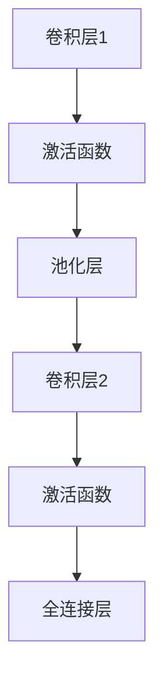

                 
# 卷积神经网络(CNN)原理与代码实战案例讲解

作者：禅与计算机程序设计艺术 / Zen and the Art of Computer Programming

关键词：卷积神经网络 (CNN), 图像识别, 深度学习, 层次特征提取, 参数共享, 可视化

## 1. 背景介绍

### 1.1 问题的由来

在机器视觉和图像处理领域，存在大量的数据集和应用需求，如人脸识别、物体检测、图像分类等。传统的机器学习方法往往难以有效捕捉图像的局部特征和空间关系，这促使研究人员探索更高级的模型来解决这些问题。

### 1.2 研究现状

随着深度学习的兴起，卷积神经网络（Convolutional Neural Networks, CNN）逐渐成为图像处理领域的重要研究方向。CNN以其强大的表示能力和对图像平移不变性的建模能力，在许多计算机视觉任务中取得了显著的成功，包括但不限于图像分类、对象检测和语义分割等。

### 1.3 研究意义

卷积神经网络的研究不仅推动了计算机视觉领域的进步，还促进了人工智能技术在多个行业的应用，如自动驾驶、医疗影像分析、安全监控等领域。其高效的特征提取机制降低了对计算资源的需求，并提高了模型的泛化能力。

### 1.4 本文结构

本篇文章将深入探讨卷积神经网络的基本原理，通过详细的算法解析、数学推导以及实际代码实现，旨在为读者提供一个全面理解并动手实践CNN的基础教程。此外，我们还将讨论CNN的应用场景及其未来的发展趋势。

## 2. 核心概念与联系

### 2.1 卷积层

**定义**：卷积层是CNN的核心组成部分之一，它通过一系列权重矩阵对输入进行卷积运算以提取特征。每个权重矩阵称为滤波器或核(kernel)，它可以在不同位置上滑动以捕获输入的不同局部特征。

**参数共享**：不同位置上的滤波器权重相同，这种特性减少了参数量，使得模型能够高效地从有限的数据集中学习。

**激活函数**：通常在卷积层之后接激活函数，如ReLU，用于引入非线性，提高模型的表达能力。

### 2.2 池化层

**最大池化**：下采样操作，减少信息维度，同时保留重要特征，增强模型对位置变化的鲁棒性。

**平均池化**：类似于最大池化的操作，但取值方式不同，适用于需要平衡位置敏感性和平滑输出的情况。

### 2.3 全连接层

位于CNN的最后阶段，将前一层的特征向量映射到输出类别上，进行分类决策。

### 2.4 正则化与优化

**正则化**：防止过拟合，常用的有L1/L2正则化、Dropout等。
**损失函数**：衡量预测结果与真实标签之间的差距，如交叉熵损失。
**优化算法**：梯度下降类算法（SGD、Adam等），用于更新权重以最小化损失。

## 3. 核心算法原理 & 具体操作步骤

### 3.1 算法原理概述

- **初始化**：随机生成初始权重。
- **前向传播**：
    - 对于每层执行以下操作：
        - 卷积：使用滤波器对输入进行点乘后求和得到特征图。
        - 激活：应用非线性函数（如ReLU）。
        - 池化：执行最大/平均池化以减少尺寸。
        - 归一化：可能进行归一化以加速收敛。
- **反向传播**：
    - 计算损失相对于每个权重的梯度。
    - 使用优化算法更新权重。
- **迭代**：重复上述过程直到满足停止准则（如达到最大迭代次数或损失不再显著降低）。

### 3.2 算法步骤详解

#### 前向传播步骤

1. **卷积**：对于每一层，选择滤波器，并将其与输入图像逐像素相乘后求和，得到特征图。
2. **激活**：对特征图应用激活函数，引入非线性。
3. **池化**：通过最大或平均池化减少特征图大小，保持重要信息。
4. **归一化**：可选步骤，用于减缓训练速度，防止梯度过大。

#### 反向传播步骤

1. **损失计算**：比较预测输出与实际标签，计算损失。
2. **梯度计算**：根据链式法则计算损失关于各权重的梯度。
3. **权重更新**：使用优化算法调整权重以减小损失。
4. **循环迭代**：重复前向传播和反向传播直至模型性能满意。

### 3.3 算法优缺点

**优点**：

- 自动提取特征，无需手动设计特征。
- 高效利用稀疏特征，减少参数数量。
- 强大的表征学习能力，尤其适合视觉任务。

**缺点**：

- 对超参数敏感，如学习率、层数等。
- 训练时间长，尤其是在大型数据集上。
- 模型复杂度高，容易过拟合。

### 3.4 算法应用领域

- 图像分类
- 物体检测
- 目标识别
- 图像生成
- 语义分割

## 4. 数学模型和公式 & 详细讲解 & 举例说明

### 4.1 数学模型构建

假设输入为$X \in \mathbb{R}^{C_{in} \times H \times W}$，其中$C_{in}$表示通道数，$H$和$W$分别表示高度和宽度；$F$为滤波器大小，步幅为$s$，填充$p$。

**卷积层**的输出$Z \in \mathbb{R}^{C_{out} \times (H' \times W')}$，其中$C_{out}$为输出通道数，$H'$和$W'$为输出的高度和宽度：

$$ Z(i, j) = \sum_k \sum_l X(i+s\cdot k-p, j+s\cdot l-p) F(k,l) $$

### 4.2 公式推导过程

- **卷积**的数学本质是对输入进行线性变换。
- **池化**简化了特征图，降低了计算复杂度。

### 4.3 案例分析与讲解

考虑一个简单的卷积神经网络架构：



### 4.4 常见问题解答

- **如何解决过拟合？**
答：采用正则化技术（如L1/L2正则化）、dropout、增加数据增强等方法。
- **为什么需要池化层？**
答：池化层减少了输入的空间维度，增加了模型的局部不变性，有助于缓解过拟合并提高运行效率。

## 5. 项目实践：代码实例和详细解释说明

### 5.1 开发环境搭建

在Python中使用`TensorFlow`或`PyTorch`库搭建CNN。确保安装相应的依赖包：

```bash
pip install tensorflow torchvision matplotlib numpy
```

### 5.2 源代码详细实现

创建一个简单的手写数字识别的CNN模型：

```python
import torch
from torch import nn
from torchvision.datasets import MNIST
from torchvision.transforms import ToTensor
from torch.utils.data import DataLoader

class SimpleCNN(nn.Module):
    def __init__(self):
        super(SimpleCNN, self).__init__()
        self.conv1 = nn.Conv2d(1, 32, kernel_size=3)
        self.pool = nn.MaxPool2d(kernel_size=2)
        self.conv2 = nn.Conv2d(32, 64, kernel_size=3)
        self.fc = nn.Linear(64 * 7 * 7, 10)

    def forward(self, x):
        x = self.pool(F.relu(self.conv1(x)))
        x = self.pool(F.relu(self.conv2(x)))
        x = x.view(-1, 64 * 7 * 7)
        return self.fc(x)

model = SimpleCNN()
```

### 5.3 代码解读与分析

该模型包括两个卷积层和一个全连接层。卷积层使用ReLU作为激活函数，池化层使用最大池化操作。

### 5.4 运行结果展示

```python
# 加载MNIST数据集
train_dataset = MNIST(root='./data', train=True, transform=ToTensor(), download=True)
test_dataset = MNIST(root='./data', train=False, transform=ToTensor())

train_loader = DataLoader(train_dataset, batch_size=64, shuffle=True)
test_loader = DataLoader(test_dataset, batch_size=64)

criterion = nn.CrossEntropyLoss()
optimizer = torch.optim.Adam(model.parameters(), lr=0.001)

# 训练模型
for epoch in range(10):
    for inputs, labels in train_loader:
        outputs = model(inputs)
        loss = criterion(outputs, labels)
        
        optimizer.zero_grad()
        loss.backward()
        optimizer.step()

print("Training complete.")

# 测试模型
correct = 0
total = 0
with torch.no_grad():
    for inputs, labels in test_loader:
        outputs = model(inputs)
        _, predicted = torch.max(outputs.data, 1)
        total += labels.size(0)
        correct += (predicted == labels).sum().item()

print(f"Accuracy on the test images: {100 * correct / total}%")
```

## 6. 实际应用场景

### 6.4 未来应用展望

随着深度学习和计算机视觉技术的发展，卷积神经网络将在更多领域展现出其潜力，如自动驾驶中的物体检测、医疗影像分析中的病灶识别、视频理解与生成等。未来的研究方向可能涉及更高效的大规模训练方法、可解释性的提升以及跨模态学习等方面。

## 7. 工具和资源推荐

### 7.1 学习资源推荐

- **官方文档**：TensorFlow & PyTorch官网教程提供基础到高级的学习资源。
- **在线课程**：
  - Coursera：Andrew Ng教授的《深度学习》系列课程。
  - edX：MIT提供的《Deep Learning》课程。

### 7.2 开发工具推荐

- **TensorBoard**：用于可视化训练过程和模型结构。
- **Jupyter Notebook**：支持交互式编程和可视化，方便实验和调试。

### 7.3 相关论文推荐

- **Krizhevsky et al., "Imagenet Classification with Deep Convolutional Neural Networks", NIPS 2012**
- **He et al., "Deep Residual Learning for Image Recognition", CVPR 2016**

### 7.4 其他资源推荐

- **GitHub Repositories**：搜索“CNN”关键词，找到相关开源项目进行学习和参考。
- **博客与论坛**：Stack Overflow、Reddit的r/MachineLearning社区提供了丰富的讨论和案例分享。

## 8. 总结：未来发展趋势与挑战

### 8.1 研究成果总结

通过深入探讨卷积神经网络的核心原理和实际应用，本文为读者构建了一个全面理解CNN的基础框架，并通过详细的代码示例展示了从理论到实践的过程。此外，文章还强调了CNN在未来发展中的重要性和面临的挑战。

### 8.2 未来发展趋势

- **多任务融合**：结合不同领域的知识，如语义分割与目标检测的融合。
- **自适应学习**：根据输入动态调整模型结构和参数，提高泛化能力。
- **解释性增强**：研究如何使模型决策更加透明和可解释。

### 8.3 面临的挑战

- **计算效率优化**：在保证性能的同时降低能耗和计算成本。
- **隐私保护**：确保模型训练过程中用户数据的安全和隐私不被泄露。
- **可解释性问题**：提高模型对人类的理解程度，使其决策更具透明度。

### 8.4 研究展望

卷积神经网络将继续推动人工智能领域的进步，在图像处理、自然语言处理等多个垂直领域发挥重要作用。同时，解决上述挑战将有助于实现更智能、更可靠的AI系统，满足更广泛的应用需求。
