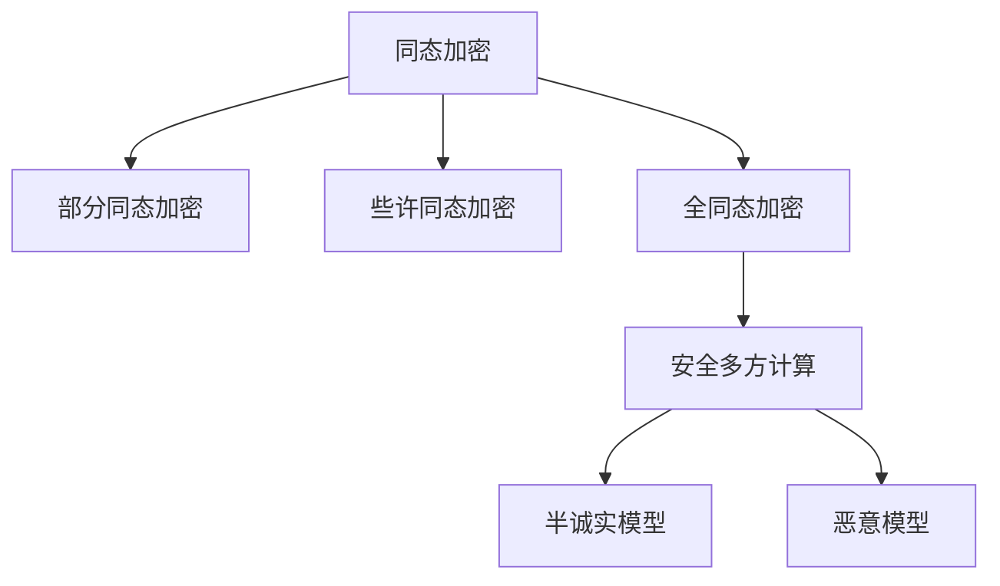

# 同态加密与安全多方计算原理与代码实战案例讲解

作者：禅与计算机程序设计艺术 / Zen and the Art of Computer Programming 

关键词：同态加密、安全多方计算、隐私保护、密码学、数据安全

## 1. 背景介绍
### 1.1  问题的由来
在大数据时代,随着云计算、物联网、人工智能等新兴技术的快速发展,海量数据被收集和利用。然而,这些数据中往往包含了个人隐私信息,如何在数据共享和分析利用的同时保护隐私安全,成为了一个亟待解决的问题。传统的数据加密方法虽然能够保护数据不被窃取,但同时也限制了加密数据的使用。为了平衡数据可用性和隐私安全,同态加密和安全多方计算应运而生。

### 1.2  研究现状
近年来,国内外学者在同态加密和安全多方计算领域开展了大量研究。比较有代表性的成果包括:Gentry在2009年提出了第一个全同态加密方案[1],为同态加密的发展奠定了基础;Yao在1982年提出了安全两方计算问题[2],开创了安全多方计算的先河;Goldreich等人系统地提出了安全多方计算的理论框架[3]。目前,同态加密和安全多方计算已经在隐私保护数据挖掘、安全信息检索、电子投票等领域得到了广泛应用。

### 1.3  研究意义
同态加密和安全多方计算的研究对于解决大数据时代的隐私安全问题具有重要意义。一方面,它为敏感数据的共享和分析利用提供了新的解决思路,有助于充分挖掘数据价值;另一方面,隐私保护措施增强了用户信任,有利于形成数据共享的良性生态。此外,同态加密和安全多方计算的研究也推动了密码学、信息安全等领域的发展。

### 1.4  本文结构
本文将从以下几个方面对同态加密和安全多方计算进行系统阐述:第2节介绍相关核心概念;第3节讲解核心算法原理;第4节建立数学模型并给出公式推导;第5节通过代码实例演示算法实现;第6节分析实际应用场景;第7节推荐相关工具和资源;第8节总结全文并展望未来;第9节列举常见问题解答。

## 2. 核心概念与联系
同态加密(Homomorphic Encryption)是一种特殊的加密形式,它允许对密文进行某些操作,得到的结果解密后与对明文进行同样操作的结果一致。根据支持的操作类型,同态加密可分为部分同态加密(Partially HE)、些许同态加密(Somewhat HE)和全同态加密(Fully HE)。部分同态加密只支持同态加法或同态乘法运算;些许同态加密支持有限次数的同态加法和乘法运算;全同态加密则支持任意次数的同态加法和乘法运算。

安全多方计算(Secure Multi-Party Computation,MPC)是指在若干互不信任的参与方之间,在不泄露各自隐私数据的前提下,共同完成某个计算任务的协议。根据参与方掌握的信息,安全多方计算可分为半诚实模型和恶意模型。半诚实模型假设参与方会按照协议执行,但会试图从协议过程中获取额外信息;恶意模型假设参与方可能主动偏离协议,试图破坏协议的安全性。

同态加密与安全多方计算的关系如下图所示:

可以看出,全同态加密是实现通用安全多方计算的重要工具。利用全同态加密,各参与方可以将隐私数据加密后上传,然后在密文上执行计算,最后联合解密得到计算结果,在整个过程中隐私数据都是加密的,从而实现了隐私保护下的数据共享计算。

## 3. 核心算法原理 & 具体操作步骤
### 3.1  算法原理概述
全同态加密的核心是构造同态乘法运算,即给定密文 $Enc(m_1)$ 和 $Enc(m_2)$,如何得到 $Enc(m_1 \cdot m_2)$,并且保证解密结果与明文直接相乘一致。下面以Gentry的全同态加密方案为例进行讲解。

### 3.2  算法步骤详解
Gentry方案的核心是利用格(Lattice)上的困难问题构造全同态加密算法,主要步骤如下:

1. 构造一个理想格 $L$,选择格基 $B=(b_1,\cdots,b_n)$。

2. 定义加密函数 $Enc(m)=m+p\cdot r$,其中 $m$ 为明文,$r$ 为随机噪声,$p$ 为大整数。

3. 定义解密函数 $Dec(c)=(c \mod p) \mod 2$,其中 $c$ 为密文。

4. 对密文 $c_1=m_1+p\cdot r_1,c_2=m_2+p\cdot r_2$ 执行乘法运算:

$$
\begin{aligned}
c_1 \cdot c_2 &= (m_1+p\cdot r_1)(m_2+p\cdot r_2) \\
&= m_1m_2 + p(m_1r_2+m_2r_1) + p^2r_1r_2 \\
&= m_1m_2 + p\cdot noise
\end{aligned}
$$

可以看出,密文乘积仍然是明文乘积加上一个噪声项,只要噪声项不太大,就可以正确解密。为了控制噪声增长,需要引入模数转换和噪声管理技术。

5. 执行同态加法运算:

$$
\begin{aligned}
c_1 + c_2 &= (m_1+p\cdot r_1) + (m_2+p\cdot r_2) \\
&= (m_1+m_2) + p(r_1+r_2)
\end{aligned}
$$

同态加法运算只是简单的密文加法,不会引入额外噪声。

6. 进行 bootstrapping 操作,刷新密文以降低噪声。

通过以上步骤,Gentry方案实现了全同态加密。在此基础上,后续工作提出了许多改进方案,如BGV方案[4]、GSW方案[5]等,在安全性和效率上都有大幅提升。

### 3.3  算法优缺点
Gentry全同态加密方案的优点是首次证明了全同态加密的可行性,为后续研究奠定了基础。但其缺点也很明显:计算效率低、密文膨胀严重、密钥管理复杂,难以直接应用于实践。

### 3.4  算法应用领域
尽管目前的全同态加密方案还不够高效,但其潜在的应用价值已得到广泛认可,在以下领域具有广阔的应用前景:

- 隐私保护机器学习:利用全同态加密实现多方安全计算,在保护数据隐私的同时开展联合建模。
- 安全信息检索:用户加密查询关键词,服务器直接在密文上检索,返回加密结果。
- 医疗数据共享:患者就诊数据经过加密后可以在不同医疗机构间安全共享,方便进行数据分析。
- 金融风控:多个金融机构加密各自用户数据,联合构建风控模型,既能整合数据又能保护隐私。

## 4. 数学模型和公式 & 详细讲解 & 举例说明
### 4.1  数学模型构建
为了形式化描述全同态加密,我们给出如下数学定义:

定义1. 全同态加密。
一个全同态加密方案 $\mathcal{E}$ 由四个多项式时间算法 $(KeyGen, Enc, Dec, Eval)$ 组成:

- 密钥生成算法 $KeyGen(1^\lambda)$:输入安全参数 $1^\lambda$,输出公钥 $pk$ 和私钥 $sk$。
- 加密算法 $Enc(pk,m)$:输入公钥 $pk$ 和明文 $m$,输出密文 $c$。
- 解密算法 $Dec(sk,c)$:输入私钥 $sk$ 和密文 $c$,输出明文 $m$。
- 同态求值算法 $Eval(pk,f,c_1,\cdots,c_t)$:输入公钥 $pk$、电路 $f$ 和一组密文 $c_1,\cdots,c_t$,输出 $f(c_1,\cdots,c_t)$ 的加密结果 $c_f$。

且满足解密正确性:对任意多项式有界电路 $f$ 和明文 $m_1,\cdots,m_t$,有:

$$
\begin{aligned}
& KeyGen(1^\lambda) \rightarrow (pk,sk) \\
& \forall i\in[t],Enc(pk,m_i) \rightarrow c_i \\
& Eval(pk,f,c_1,\cdots,c_t) \rightarrow c_f \\
& Dec(sk,c_f)=f(m_1,\cdots,m_t)
\end{aligned}
$$

### 4.2  公式推导过程
下面我们推导Gentry全同态加密方案的同态乘法公式。

令 $c_1=m_1+p\cdot r_1,c_2=m_2+p\cdot r_2$ 表示两个密文,其中 $m_1,m_2$ 为明文消息,$r_1,r_2$ 为随机噪声,$p$ 为大整数。

则它们的乘积为:

$$
\begin{aligned}
c_1 \cdot c_2 &= (m_1+p\cdot r_1)(m_2+p\cdot r_2) \\
&= m_1m_2 + p(m_1r_2+m_2r_1) + p^2r_1r_2 \\
&= m_1m_2 + p\cdot (m_1r_2+m_2r_1+pr_1r_2) \\
&= m_1m_2 + p\cdot noise
\end{aligned}
$$

其中 $noise=m_1r_2+m_2r_1+pr_1r_2$,表示同态乘法引入的噪声。

经过解密可得:

$$
\begin{aligned}
Dec(c_1 \cdot c_2) &= ((m_1m_2 + p\cdot noise) \mod p) \mod 2 \\
&= (m_1m_2 \mod p) \mod 2 \\
&= m_1m_2 \mod 2
\end{aligned}
$$

上式表明,只要噪声项 $noise$ 在模 $p$ 意义下不会太大,经过解密就可以得到正确的明文乘积。

### 4.3  案例分析与讲解
下面我们以一个简单的例子来说明全同态加密的计算过程。

假设明文空间为 $\{0,1\}$,随机噪声 $r$ 的二进制长度为 $\lambda$。

令 $m_1=1,m_2=0$,选取 $p=1024$,则加密后的密文为:

$$
\begin{aligned}
c_1 &= 1 + 1024 \cdot r_1 \\
c_2 &= 0 + 1024 \cdot r_2
\end{aligned}
$$

假设 $r_1=10111001\cdots,r_2=11001010\cdots$,则密文乘积为:

$$
\begin{aligned}
c_1 \cdot c_2 &= (1 + 1024 \cdot r_1)(0 + 1024 \cdot r_2) \\
&= 1024^2 \cdot r_1r_2 \\
&= 1024 \cdot noise
\end{aligned}
$$

其中噪声项:
$$
noise = 1024 \cdot r_1r_2 = 11011110\cdots
$$

对密文乘积进行解密:

$$
\begin{aligned}
Dec(c_1 \cdot c_2) &= (1024 \cdot noise \mod 1024) \mod 2 \\
&= 0
\end{aligned}
$$

可以看出,解密结果与明文乘积 $1 \times 0=0$ 一致,说明同态乘法计算正确。

### 4.4  常见问题解答

问题1:全同态加密的安全性如何保证?

全同态加密的安全性基于格上的困难问题,如最短向量问题(SVP)、最近向量问题(CVP)等。这些问题被认为是量