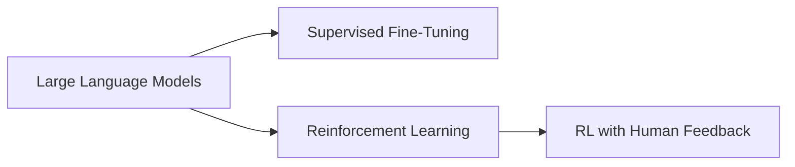

# 大规模语言模型从理论到实践 SFT模型和RL模型评估

关键词：大规模语言模型、监督微调(SFT)、强化学习(RL)、InstructGPT、ChatGPT、RLHF

## 1. 背景介绍
### 1.1 问题的由来
近年来,随着深度学习技术的快速发展,大规模语言模型(Large Language Models, LLMs)在自然语言处理(NLP)领域取得了突破性进展。以GPT-3、PaLM、OPT等为代表的LLMs展现出了惊人的语言理解和生成能力,引发了学术界和工业界的广泛关注。

然而,原始的LLMs虽然具备强大的语言建模能力,但在实际应用中仍然存在一些问题,如生成内容不可控、缺乏指令遵循能力、易产生有害或错误信息等。为了进一步提升LLMs的可用性和安全性,研究者们提出了一系列改进方法,其中监督微调(Supervised Fine-Tuning, SFT)和强化学习(Reinforcement Learning, RL)是两种备受关注的技术路线。

### 1.2 研究现状 
SFT是一种基于人工标注数据对预训练语言模型进行微调的方法。通过在特定任务上微调,可以使LLMs更好地适应目标领域,提高指令遵循能力和输出质量。代表性的SFT模型包括InstructGPT[^1]、Tk-Instruct[^2]等。

RL则是一种通过奖励函数引导模型学习策略的方法。将RL应用于LLMs可以使其学会根据人类偏好生成更加安全、有益的内容。代表性的RL模型包括GPT-3 with RL[^3]、ChatGPT[^4]等。特别地,ChatGPT采用了RLHF(Reinforcement Learning from Human Feedback)方法,取得了广受好评的效果。

### 1.3 研究意义
深入研究SFT和RL在LLMs中的应用,对于进一步提升LLMs的性能和实用价值具有重要意义。一方面,这有助于我们更好地理解语言智能的本质,探索通用人工智能(AGI)的实现路径。另一方面,高质量、可控的LLMs将在智能问答、知识检索、创意辅助等诸多领域发挥巨大作用,推动人工智能产业的快速发展。

### 1.4 本文结构
本文将围绕SFT模型和RL模型展开深入探讨。第2节介绍相关的核心概念;第3节阐述SFT和RL的算法原理;第4节建立数学模型并给出公式推导;第5节通过代码实例演示具体实现;第6节分析实际应用场景;第7节推荐相关工具和资源;第8节总结全文并展望未来。

## 2. 核心概念与联系
- 大规模语言模型(LLMs):基于海量文本数据训练的神经网络模型,具备强大的语言理解和生成能力,代表模型如GPT-3、PaLM、OPT等。
- 监督微调(SFT):利用人工标注数据在特定任务上对预训练语言模型进行微调,以提升模型在目标领域的表现。
- 强化学习(RL):通过环境反馈(奖励函数)不断优化智能体的决策,使其学会执行特定任务的一类机器学习方法。
- 人类反馈强化学习(RLHF):一种将人类偏好引入RL训练过程的方法,通过人类反馈引导模型学习安全、有益的行为策略,代表模型如ChatGPT。

LLMs是SFT和RL的基础,二者都是在预训练语言模型的基础上,通过额外的训练步骤提升模型性能。SFT利用人工标注数据提供直接的监督信号,而RL则通过奖励函数提供间接的反馈信号。RLHF则进一步将人类判断引入RL训练,以更好地契合人类偏好。它们的关系如下图所示:

## 3. 核心算法原理 & 具体操作步骤
### 3.1 算法原理概述
#### 3.1.1 监督微调(SFT)
SFT的核心思想是利用人工标注的数据对预训练语言模型进行微调,使其适应特定任务。设预训练模型参数为$\theta$,微调数据集为$\mathcal{D}=\{(x_i,y_i)\}_{i=1}^N$,其中$x_i$为输入,$y_i$为标注的输出。SFT的目标是最小化以下损失函数:

$$\mathcal{L}_{SFT}(\theta)=\sum_{i=1}^N \ell(f_{\theta}(x_i), y_i)$$

其中$f_{\theta}$为语言模型,$\ell$为损失函数,如交叉熵损失。

#### 3.1.2 强化学习(RL)
RL的目标是通过智能体与环境的交互,学习一个最优策略$\pi^*$以最大化期望累积奖励:

$$\pi^* = \arg\max_{\pi} \mathbb{E}_{\tau \sim \pi}[\sum_{t=0}^{\infty} \gamma^t r_t]$$

其中$\tau$为轨迹,$\gamma$为折扣因子,$r_t$为第$t$步的奖励。策略$\pi$可以是一个参数化的概率模型,如语言模型$f_{\theta}$。

在LLMs的RL训练中,环境通常由人工构建,奖励函数可以基于人类偏好设计。RLHF进一步引入人类反馈,通过比较模型输出的优劣来指导策略学习。

### 3.2 算法步骤详解
#### 3.2.1 SFT步骤
1. 准备预训练语言模型$f_{\theta}$和微调数据集$\mathcal{D}=\{(x_i,y_i)\}_{i=1}^N$。
2. 根据任务设计输入模板,将$x_i$转换为模型输入形式。
3. 使用$\mathcal{D}$训练模型,最小化损失函数$\mathcal{L}_{SFT}(\theta)$,得到微调后的模型参数$\theta^*$。
4. 使用$\theta^*$初始化模型,进行推理和生成。

#### 3.2.2 RL步骤
1. 准备预训练语言模型$f_{\theta}$,设计奖励函数$r$和训练环境。
2. 根据当前策略$\pi_{\theta}$生成一组轨迹$\{\tau_i\}_{i=1}^M$。
3. 计算每个轨迹的累积奖励$R(\tau_i)=\sum_{t=0}^{T} \gamma^t r_t$。
4. 使用策略梯度方法更新策略参数$\theta$,最大化目标函数$J(\theta)=\mathbb{E}_{\tau \sim \pi_{\theta}}[R(\tau)]$。
5. 重复步骤2-4,直到策略收敛或达到预设的训练轮数。

RLHF在第3步引入人类反馈,通过比较不同轨迹的优劣来计算奖励。

### 3.3 算法优缺点
SFT的优点是实现简单,可以充分利用人工标注数据提升模型性能。缺点是需要大量高质量的标注数据,泛化能力有限。

RL的优点是可以通过设计奖励函数引导模型学习,不需要大量标注数据。缺点是奖励函数设计具有挑战性,训练过程不稳定,时间开销大。

RLHF在RL的基础上引入人类反馈,可以更好地契合人类偏好。但其缺点是需要大量人工参与,成本较高。

### 3.4 算法应用领域
SFT和RL在LLMs的应用领域非常广泛,包括但不限于:
- 智能问答:通过微调或RL训练,使LLMs能够针对特定领域给出准确、有针对性的回答。
- 对话系统:通过RL引入对话策略,使LLMs能够进行多轮交互,提供个性化服务。
- 内容生成:通过RL引导LLMs生成高质量、可控的文本内容,如新闻、创意写作等。
- 知识图谱问答:通过微调将知识图谱信息注入LLMs,增强其查询和推理能力。

## 4. 数学模型和公式 & 详细讲解 & 举例说明
### 4.1 数学模型构建
我们以SFT和RL在LLMs中的应用为例,建立相应的数学模型。

对于SFT,我们考虑一个预训练的语言模型$f_{\theta}:\mathcal{X} \rightarrow \mathcal{Y}$,其中$\mathcal{X}$为输入空间,$\mathcal{Y}$为输出空间。给定微调数据集$\mathcal{D}=\{(x_i,y_i)\}_{i=1}^N$,SFT的目标是最小化经验风险:

$$\min_{\theta} \frac{1}{N} \sum_{i=1}^N \ell(f_{\theta}(x_i), y_i)$$

其中$\ell:\mathcal{Y} \times \mathcal{Y} \rightarrow \mathbb{R}$为损失函数,衡量模型输出与真实标签的差异。

对于RL,我们考虑一个马尔可夫决策过程(MDP)$\mathcal{M}=(\mathcal{S},\mathcal{A},\mathcal{P},\mathcal{R},\gamma)$,其中$\mathcal{S}$为状态空间,$\mathcal{A}$为动作空间,$\mathcal{P}$为转移概率,$\mathcal{R}$为奖励函数,$\gamma$为折扣因子。语言模型$f_{\theta}$定义了一个策略$\pi_{\theta}:\mathcal{S} \rightarrow \mathcal{P}(\mathcal{A})$,即在给定状态下选择动作的概率分布。RL的目标是最大化期望累积奖励:

$$\max_{\theta} J(\theta) = \mathbb{E}_{\tau \sim \pi_{\theta}}[\sum_{t=0}^{\infty} \gamma^t r_t]$$

其中$\tau=(s_0,a_0,r_0,s_1,a_1,r_1,...)$为一个轨迹,$r_t=\mathcal{R}(s_t,a_t)$为第$t$步的奖励。

### 4.2 公式推导过程
对于SFT,我们可以使用梯度下降法求解优化问题。模型参数$\theta$的更新公式为:

$$\theta \leftarrow \theta - \eta \nabla_{\theta} \frac{1}{N} \sum_{i=1}^N \ell(f_{\theta}(x_i), y_i)$$

其中$\eta$为学习率。当损失函数$\ell$为交叉熵损失时,上式等价于最大化似然估计:

$$\max_{\theta} \frac{1}{N} \sum_{i=1}^N \log p_{\theta}(y_i|x_i)$$

对于RL,我们可以使用策略梯度方法求解优化问题。根据策略梯度定理,目标函数$J(\theta)$的梯度为:

$$\nabla_{\theta} J(\theta) = \mathbb{E}_{\tau \sim \pi_{\theta}}[\sum_{t=0}^{\infty} \gamma^t r_t \nabla_{\theta} \log \pi_{\theta}(a_t|s_t)]$$

在实践中,我们通过采样轨迹来估计上式,得到梯度估计:

$$\nabla_{\theta} J(\theta) \approx \frac{1}{M} \sum_{i=1}^M [\sum_{t=0}^{T} \gamma^t r_t^{(i)} \nabla_{\theta} \log \pi_{\theta}(a_t^{(i)}|s_t^{(i)})]$$

其中$\{(\tau^{(i)},R^{(i)})\}_{i=1}^M$为采样得到的轨迹和累积奖励。

### 4.3 案例分析与讲解
我们以一个简单的情感分类任务为例,说明如何使用SFT微调一个预训练语言模型。

假设我们有一个情感分类数据集$\mathcal{D}=\{(x_i,y_i)\}_{i=1}^N$,其中$x_i$为文本输入,$y_i \in \{0,1\}$为情感标签(0表示负面,1表示正面)。我们希望微调一个预训练的语言模型$f_{\theta}$,使其能够准确预测文本的情感倾向。

首先,