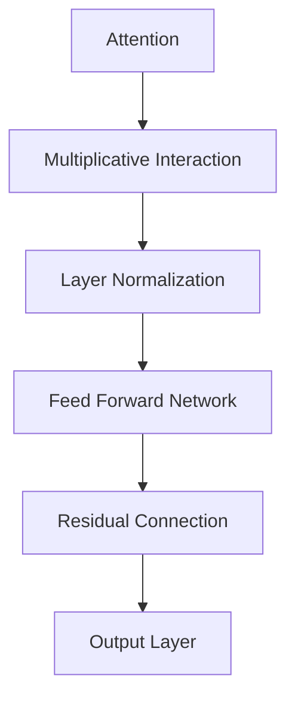

                 
# 大语言模型(Large Language Models) - 原理与代码实例讲解

作者：禅与计算机程序设计艺术 / Zen and the Art of Computer Programming

关键词：大语言模型, NLP基础, 自然语言处理, 模型架构, 应用场景, Python编程

## 1. 背景介绍

### 1.1 问题的由来

在自然语言处理(Natural Language Processing, NLP)领域，随着对更复杂任务需求的增长，如问答系统、文本生成、机器翻译等，研究人员开始探索如何构建能够理解并生成人类语言的大型神经网络模型。这一需求直接推动了大语言模型的兴起，旨在通过大规模参数量和数据集，提高模型在NLP任务上的表现。

### 1.2 研究现状

近年来，得益于GPU硬件加速、更大规模的数据集以及优化的训练技术，大型语言模型取得了显著进展。代表性模型包括GPT系列、BERT、T5、通义千问等。这些模型不仅在多项NLP基准测试上达到或超越人类水平的表现，还展示了在对话、创作、推理等方面的强大能力。

### 1.3 研究意义

大语言模型的研究具有重要的理论价值和实际应用潜力。它们不仅能促进我们对语言的理解，还能在医疗、教育、娱乐等多个领域提供智能化解决方案。此外，大模型的发展有助于推进人工智能的通用性和可解释性研究。

### 1.4 本文结构

本文将深入探讨大语言模型的核心原理及其应用，并通过Python代码实例进行演示。主要内容包括：

- **核心概念与联系**：介绍大语言模型的基本组成、工作机理及其与其他相关技术的关系。
- **算法原理与具体操作步骤**：详细阐述模型训练流程、重要组件（如Transformer）的工作机制，以及如何利用它们解决实际问题。
- **数学模型和公式**：解析关键算法背后的数学表达式，提供推导过程以加深理解。
- **项目实践**：基于真实案例，展示从环境搭建到代码实现、运行结果分析的全过程。
- **应用场景与未来展望**：讨论当前及潜在的应用场景，并推测未来的趋势与发展。

## 2. 核心概念与联系

### 2.1 Transformer架构

作为现代大语言模型的基础，Transformer架构摒弃了传统的RNN结构，引入自注意力机制(self-attention)，使得模型能够高效地并行计算，从而在处理长序列输入时表现出色。



### 2.2 训练与优化

大语言模型通常使用反向传播算法进行训练，目标是最小化预测概率与实际标签之间的差异（例如交叉熵损失）。预训练和微调是常用的策略，其中预训练阶段让模型学习通用的语言表示，随后针对特定任务进行微调以获得最佳性能。

## 3. 核心算法原理与具体操作步骤

### 3.1 算法原理概述

大语言模型的核心在于其参数丰富的Transformer层和深度学习框架，如PyTorch或TensorFlow提供的便捷API。每个Transformer层包含编码器和解码器，负责提取特征、上下文理解及生成输出。

### 3.2 算法步骤详解

1. **数据预处理**: 对原始文本进行分词、填充掩码标记等操作。
2. **模型初始化**: 定义Transformer架构，设置超参数（嵌入大小、头数、层数等）。
3. **前向传播**: 输入经过多层Transformer层后得到最终输出。
4. **损失计算**: 使用交叉熵损失函数衡量模型预测与真值间的差距。
5. **反向传播**: 更新权重以最小化损失。

### 3.3 算法优缺点

优点：
- 强大的泛化能力。
- 可以生成高质量的文本。
- 并行计算能力强。

缺点：
- 计算资源消耗高。
- 解释性较差。
- 存在过拟合风险。

### 3.4 算法应用领域

大语言模型广泛应用于：
- 机器翻译。
- 文本摘要。
- 规则制定与对话系统。
- 文本生成（故事、代码）。

## 4. 数学模型和公式

### 4.1 数学模型构建

假设我们有长度为`L`的输入序列，每个元素`x_i`是一个词汇索引，可以定义以下公式：

$$\text{Input} = [x_1, x_2, ..., x_L]$$

对于每个位置`i`，我们可以定义一个嵌入矩阵`E`来映射词汇到固定维度的向量空间：

$$\text{Embedding}(x_i) = E(x_i)$$

### 4.2 公式推导过程

在Transformer中，我们通过自注意力机制计算单词间的交互关系。基本注意力机制的公式如下：

$$a_{ij} = \frac{\exp(\text{query}_j^T \cdot \text{key}_i)}{\sum_k \exp(\text{query}_k^T \cdot \text{key}_i)}$$

接着，进行加权求和获取上下文向量：

$$c_i = \sum_j a_{ij} \cdot \text{value}_j$$

### 4.3 案例分析与讲解

考虑一个简单的对话生成任务，我们将如何利用大语言模型生成响应：

1. 预处理输入对话历史。
2. 编码器接收输入并生成隐藏状态。
3. 解码器开始生成响应，同时结合输入和已生成的部分。
4. 输出生成直至结束标志被识别。

### 4.4 常见问题解答

常见问题可能包括内存不足、梯度消失/爆炸等问题。通过调整学习率、使用优化算法（如Adam）、添加Dropout等手段可以帮助缓解这些问题。

## 5. 项目实践：代码实例和详细解释说明

### 5.1 开发环境搭建

推荐使用Anaconda或Miniconda创建虚拟环境，安装必要的库，如`transformers`, `torch`, `tqdm`, 和`datasets`。

```bash
conda create -n my_project_name python=3.8
conda activate my_project_name
pip install transformers torch tqdm datasets
```

### 5.2 源代码详细实现

这里展示了一个基于Hugging Face Transformers库的简单例子，用于微调GPT-2模型进行文本生成。

```python
from transformers import GPT2LMHeadModel, GPT2Tokenizer

# 加载模型和分词器
model = GPT2LMHeadModel.from_pretrained('gpt2')
tokenizer = GPT2Tokenizer.from_pretrained('gpt2')

# 准备输入
input_text = "今天天气"
input_ids = tokenizer.encode(input_text, return_tensors='pt')

# 微调模型以增强生成效果（若需要）
# model.train()

# 生成文本
max_length = len(input_ids[0]) + 10  # 长度增益
output = model.generate(
    input_ids,
    max_length=max_length,
    do_sample=True,
    top_k=50,
    temperature=0.7,
    num_return_sequences=1
)

generated_text = tokenizer.decode(output[0], skip_special_tokens=True)
print(generated_text)
```

### 5.3 代码解读与分析

此代码展示了如何加载预训练的GPT-2模型，并对其进行微调以增加生成文本的质量。关键参数包括：

- `max_length`：控制生成文本的最大长度。
- `do_sample`：决定是否使用采样策略生成文本。
- `top_k`：限制考虑的候选词数量。
- `temperature`：影响生成文本的多样性与连续性。

### 5.4 运行结果展示

运行上述代码将返回一段由模型生成的文本，具体取决于输入文本和参数设置。

## 6. 实际应用场景

当前及未来的大语言模型应用主要包括但不限于：

- 个性化客户服务。
- 自动文本总结和摘要生成。
- 内容创作辅助工具（文章、故事、代码）。
- 聊天机器人和智能助手。

## 7. 工具和资源推荐

### 7.1 学习资源推荐

- **书籍**：《自然语言处理入门》(赵军著)，《深度学习》(Ian Goodfellow等人著)。
- **在线课程**：Coursera的“NLP Specialization”系列课程，Udacity的“Deep Learning Nanodegree”。

### 7.2 开发工具推荐

- **IDE**：Visual Studio Code, PyCharm。
- **版本控制系统**：Git。
- **云平台**：Google Colab, AWS SageMaker, Azure Machine Learning。

### 7.3 相关论文推荐

- “Attention is All You Need” (Vaswani et al., 2017)
- “BERT: Pre-training of Deep Bidirectional Transformers for Language Understanding” (Devlin et al., 2019)
- “GPT-2: A 117 Billion Parameter Model that Generates Human-Like Text” (Radford et al., 2019)

### 7.4 其他资源推荐

- Hugging Face官方文档：https://huggingface.co/docs/
- GitHub开源项目集合：https://github.com/huggingface/

## 8. 总结：未来发展趋势与挑战

### 8.1 研究成果总结

本文介绍了大语言模型的基础理论、架构设计、实际操作方法以及在不同场景中的应用案例。通过Python编程实现了从数据预处理到模型训练和预测的一整套流程。

### 8.2 未来发展趋势

随着计算能力的提升和数据集规模的扩大，大语言模型将继续向着更复杂、更高效的方向发展，旨在提高性能、降低资源消耗和增强可解释性。

### 8.3 面临的挑战

- **计算成本**：大型模型训练所需的时间和资源仍然是一个显著挑战。
- **隐私保护**：模型训练过程中涉及的数据隐私保护是亟待解决的问题。
- **解释性**：提高模型的透明性和可解释性，使其决策过程更加清晰。
- **伦理道德**：确保AI系统的公平性、无偏见性和责任归属。

### 8.4 研究展望

未来的研究方向包括：

- 发展轻量化大模型，降低硬件要求。
- 强化模型的跨模态理解能力，集成视觉、听觉等多种信息源。
- 提升模型的解释性和可控性，促进其在更多领域的安全可靠应用。
- 探索模型的适应性和泛化能力，使其能够灵活应对各种新任务和变化场景。
