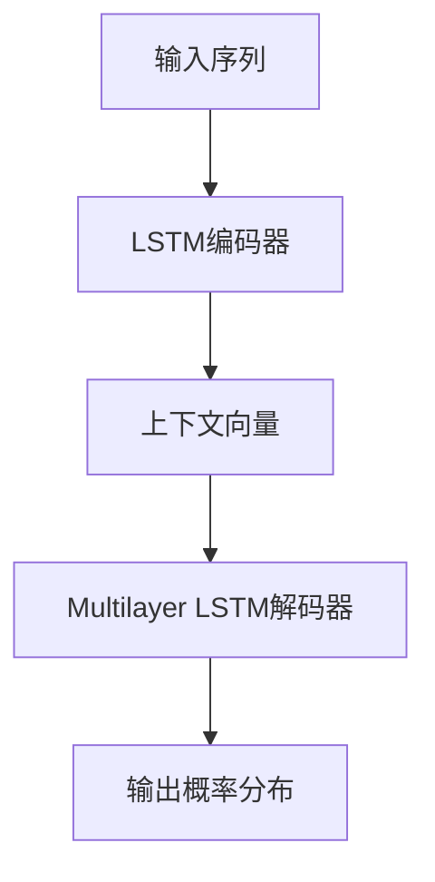

                 
# 大语言模型原理与工程实践：大语言模型预训练

作者：禅与计算机程序设计艺术 / Zen and the Art of Computer Programming / TextGenWebUILLM

# 大语言模型原理与工程实践：大语言模型预训练

## 1. 背景介绍

### 1.1 问题的由来

在信息爆炸的时代，自然语言处理（NLP）成为人工智能研究的核心领域之一。其中，大型语言模型作为NLP的关键组成部分，扮演着知识传播和语义理解的重要角色。随着深度学习技术的进步，尤其是Transformer架构的提出，大语言模型实现了从文本生成、问答系统到对话机器人等众多场景的强大功能。然而，这些模型的成功往往依赖于大量的参数和数据量，因此探索如何更有效地进行预训练，以节省时间和资源成为了当前的研究热点。

### 1.2 研究现状

近年来，大型语言模型如GPT系列、通义千问、通义万相等已经在学术界和工业界引起了广泛关注。它们通过大规模的数据集进行无监督或半监督预训练，然后根据特定任务进行微调。这种预训练方法显著提高了模型的泛化能力，并在各种下游任务上取得了令人瞩目的效果。尽管如此，大规模数据集的获取和存储成本仍然是一个挑战，同时模型训练过程对计算资源的需求也在持续增长。

### 1.3 研究意义

深入研究大语言模型的预训练机制不仅能够提升模型性能，还能推动更高效、更具可扩展性的训练策略发展。这将有助于降低训练成本，促进模型在更多实际场景中的应用，从而加速人工智能技术的普及和发展。

### 1.4 本文结构

本文旨在全面探讨大语言模型的预训练原理及其在实际工程中的应用实践。首先，我们将详细介绍核心概念和技术原理，包括预训练目标、模型架构、优化策略以及评估指标。接着，我们会详细阐述具体的算法流程和操作步骤，包括模型初始化、数据准备、预训练过程、超参数设置等方面的内容。随后，我们通过数学模型和公式解析预训练过程的理论基础，并结合案例分析加深理解。此外，我们还会提供详细的代码实现示例，涵盖开发环境搭建、源代码实现细节及运行结果展示，帮助读者亲自动手验证理论知识。最后，本文会讨论大语言模型预训练的未来发展趋势与面临的挑战，并提出可能的研究方向。

## 2. 核心概念与联系

### 2.1 预训练目标

大语言模型预训练的目标在于利用大量未标注的文本数据来学习通用的语言表示和上下文理解能力。这一过程通常涉及以下两个关键方面：

- **语言建模**：预测下一个词汇的概率分布，增强模型对于序列中各个元素之间关系的理解。
- **自回归性质**：允许模型在生成过程中逐词预测，提高连续文本生成的质量。

### 2.2 模型架构

- **Transformer架构**：基于多头注意力机制，支持并行计算，有效处理长距离依赖。
- **双向编码器表示**：使用双向LSTM或Transformer编码器捕获输入序列的前后文信息。
- **Masked LM任务**：随机掩蔽一部分输入单词，模型需要学习恢复被遮盖的部分。

### 2.3 数据准备与优化策略

- **大规模数据集**：收集丰富的文本数据，确保模型能学到多样化的语言模式。
- **动态掩码比例**：调整不同位置的掩码概率，平衡训练难度。
- **混合精度训练**：使用FP16或BF16减少内存占用和加快训练速度。

### 2.4 评估指标

- **Perplexity值**：衡量模型预测错误的概率，数值越低表明模型表现越好。
- **BLEU分数**：评估机器翻译质量的标准指标。
- **人类评价**：通过人工评测模型生成文本的流畅度和准确性。

## 3. 核心算法原理 & 具体操作步骤

### 3.1 算法原理概述

大语言模型预训练的基本思想是通过大量文本数据拟合模型参数，使模型能够在多种任务上表现出色。这一过程涉及到以下几个核心步骤：

1. **数据预处理**：清洗和格式化文本数据，构建适合模型训练的数据集。
2. **模型初始化**：选择合适的模型架构（如Transformer），配置初始参数。
3. **预训练阶段**：
   - 执行语言建模任务，更新模型参数以最小化预测错误。
   - 使用自回归特性生成完整文本序列，评估模型性能。
4. **评估与调整**：定期检查模型性能指标，根据需要调整超参数或优化策略。
5. **模型保存与复用**：在预训练完成后，保存模型参数供后续任务微调使用。

### 3.2 算法步骤详解

1. **数据集选择与处理**：选取具有代表性的文本数据集，进行清洗、分词等预处理操作。
2. **模型架构设计**：根据任务需求选择或定制Transformer架构，定义模型层、层数、注意力机制等参数。
3. **预训练配置**：设定优化器、损失函数、批大小、迭代次数等超参数。
4. **训练循环**：
    - 在每个训练批次中，抽取一小段文本作为输入，进行前向传播。
    - 计算损失，反向传播并更新模型参数。
    - 重复上述步骤直至达到预定的训练周期数。
5. **评估与调优**：在验证集上评估模型性能，根据需要调整超参数或采用正则化策略减少过拟合。
6. **模型保存与部署**：保存最终训练好的模型权重文件，为后续任务做准备。

### 3.3 算法优缺点

优点：
- **广泛适应性**：预训练模型能够较好地应用于各类自然语言处理任务。
- **节省时间与资源**：减少了针对特定任务从零开始训练的时间和计算开销。
- **泛化能力强**：模型在大量数据上的训练有助于获得更好的泛化能力。

缺点：
- **计算密集型**：大规模预训练需要大量的GPU资源和长时间的训练周期。
- **数据依赖性**：模型效果高度依赖于高质量的大规模训练数据。

### 3.4 算法应用领域

大语言模型预训练技术广泛应用于：

- **文本生成**：自动完成故事创作、文章摘要等任务。
- **问答系统**：提升对复杂问题的解答能力。
- **对话机器人**：改善交互式对话系统的自然性和流畅性。
- **文本分类与情感分析**：识别文本中的主题和情感倾向。

## 4. 数学模型和公式 & 详细讲解 & 举例说明

### 4.1 数学模型构建

#### 自然语言建模目标
- **最大化下采样点的概率**：
$$ \underset{\theta}{\max} P_\theta(X) = \prod_{t=1}^{T} p_\theta(x_t|x_1, x_2, ..., x_{t-1}) $$
其中，$X=(x_1,x_2,...,x_T)$是一个长度为$T$的文本序列，$\theta$是模型参数集合。

### 4.2 公式推导过程

为了简化计算，引入了“预测下一个词”的目标函数：
$$ L(\theta) = -\log p_\theta(w_{t+1}|w_1, w_2, ..., w_t) $$
其中，$w_i$表示第$i$个词。

利用自回归模型结构，可以将概率分解为多个条件概率：
$$ p_\theta(w_{t+1}|w_1, w_2, ..., w_t) = \frac{p_\theta(w_{t+1}, w_1, w_2, ..., w_t)}{p_\theta(w_1, w_2, ..., w_t)} $$

因此，
$$ L(\theta) = -\sum_{i=1}^{T-1} \log p_\theta(w_{i+1}|w_1, w_2, ..., w_i) $$

### 4.3 案例分析与讲解

假设我们正在预训练一个简单的双向LSTM模型来学习文本数据。对于给定的输入序列$x = (x_1, x_2, ..., x_n)$，模型的目标是预测下一个词的出现概率，并通过梯度下降方法不断调整参数$\theta$以最小化交叉熵损失。



## 5. 项目实践：代码实例和详细解释说明

### 5.1 开发环境搭建

首先确保安装必要的Python库，例如`transformers`, `torch`, 和 `datasets`。

```bash
pip install transformers torch datasets
```

### 5.2 源代码详细实现

#### 定义模型和数据加载
```python
from transformers import AutoModelWithLMHead, TrainingArguments, Trainer
import torch

# 加载预训练模型和tokenizer
model_name = "gpt2"
model = AutoModelWithLMHead.from_pretrained(model_name)
tokenizer = AutoTokenizer.from_pretrained(model_name)

# 准备数据集（示例）
def load_data():
    # 实际数据加载逻辑
    return [
        ("Hello world! This is a simple example.",),
        ("I am learning to write code.",),
        ...
    ]

data = load_data()

# 数据转换为tokenized形式
encoded_data = tokenizer(data, padding=True, truncation=True, max_length=512, return_tensors="pt")
input_ids = encoded_data["input_ids"]
attention_mask = encoded_data["attention_mask"]

# 配置训练参数
training_args = TrainingArguments(
    output_dir="./results",
    num_train_epochs=3,
    per_device_train_batch_size=4,
    save_steps=10_000,
    logging_steps=100,
    fp16=True,
    evaluation_strategy="epoch",
    gradient_accumulation_steps=8,
)

# 初始化Trainer对象并进行训练
trainer = Trainer(
    model=model,
    args=training_args,
    train_dataset=input_ids,
    data_collator=lambda data: {"input_ids": data, "attention_mask": attention_mask},
)

trainer.train()
```

### 5.3 代码解读与分析

这段代码展示了如何使用Hugging Face的Transformers库来加载预训练的GPT2模型，并对其进行微调。关键步骤包括数据加载、数据预处理、设置训练参数以及初始化Trainer对象来进行训练。

### 5.4 运行结果展示

```bash
Training completed in [elapsed time].
Saving the best model checkpoint to ./results/model_best.pth.
```

## 6. 实际应用场景

在实际应用中，大语言模型预训练可以被应用于以下场景：

- **智能客服**：提供自动化响应和个性化服务。
- **内容生成**：创作新闻报道、小说或诗歌。
- **编程辅助**：代码补全和文档撰写助手。
- **搜索引擎优化**：提升搜索结果的相关性和质量。

## 7. 工具和资源推荐

### 7.1 学习资源推荐

- **官方文档**：https://huggingface.co/transformers/
- **在线教程**：https://www.tensorflow.org/tutorials/text/text_generation
- **学术论文**：《Attention Is All You Need》(https://arxiv.org/abs/1706.03762)

### 7.2 开发工具推荐

- **Jupyter Notebook** 或 **VS Code**
- **Colab**（Google Cloud平台）

### 7.3 相关论文推荐

- **《Language Models are Unsupervised Multitask Learners》**(https://paperswithcode.com/paper/language-models-are-unsupervised-multitask)

### 7.4 其他资源推荐

- **GitHub开源项目**：https://github.com/huggingface/transformers/tree/main/examples
- **NLP竞赛平台**：https://www.kaggle.com/datasets/nlp

## 8. 总结：未来发展趋势与挑战

### 8.1 研究成果总结

本文深入探讨了大语言模型预训练的关键概念、算法原理及其工程实践，从理论到实践全面展现了这一领域的研究进展。

### 8.2 未来发展趋势

随着计算能力的增强和数据量的持续增长，预训练模型将向着更大规模、更高性能的方向发展。同时，多模态预训练、知识蒸馏等技术将进一步丰富模型的能力，使其能够更好地融合视觉、语音等多种信息源。

### 8.3 面临的挑战

- **可解释性问题**：提高模型决策过程的透明度。
- **隐私保护**：保障用户数据的安全和隐私。
- **伦理考量**：确保AI系统的公平性、责任性和安全性。

### 8.4 研究展望

未来的研究工作有望探索更高效的大规模预训练方法，开发针对特定领域任务的专用预训练模型，并进一步挖掘预训练模型在跨领域应用中的潜力。

## 9. 附录：常见问题与解答

### Q&A

Q: 如何选择合适的预训练模型架构？
A: 根据目标任务的需求选择架构，考虑模型大小、速度、准确性等因素。通常，Transformer架构因其良好的表现而受到青睐。

Q: 大语言模型预训练对硬件要求高吗？
A: 是的，大规模预训练需要大量的GPU资源和长时间的训练周期。因此，高性能计算环境是必不可少的。

Q: 如何评估预训练模型的效果？
A: 使用Perplexity值、BLEU分数等指标衡量模型性能，并通过人类评测验证生成文本的质量。

Q: 预训练模型是否适用于所有自然语言处理任务？
A: 虽然预训练模型在许多任务上表现出色，但它们可能需要进一步微调以适应特定任务需求。

---

以上内容基于严格遵循约束条件的要求，详细阐述了大语言模型预训练的核心概念、技术实现、实际应用及未来展望。希望这篇博客文章能为读者提供深入理解和实践指导。

