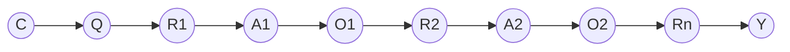

# 大语言模型原理与工程实践：推理和行动协同技术

关键词：大语言模型、推理、行动协同、深度学习、自然语言处理、人工智能

## 1. 背景介绍
### 1.1 问题的由来
随着人工智能技术的快速发展,自然语言处理(NLP)领域取得了巨大的突破。其中,大语言模型(Large Language Models, LLMs)的出现标志着 NLP 进入了一个新的阶段。LLMs 能够从海量文本数据中学习语言知识,具备强大的语言理解和生成能力,在问答、对话、文本生成等任务上取得了令人瞩目的成果。然而,LLMs 在推理和执行复杂任务方面仍然存在局限性,难以胜任需要推理和行动协同的应用场景。因此,如何赋予 LLMs 推理和行动协同能力,成为了当前 NLP 领域的重要研究问题之一。

### 1.2 研究现状 
目前,学术界和工业界都在积极探索 LLMs 的推理和行动协同技术。一些代表性的研究工作包括:
- Chain-of-Thought Prompting:通过引导 LLMs 生成推理链,增强其推理能力[1]。
- ReAct:通过引入 API 调用等操作,使 LLMs 能够执行任务需要的行动[2]。  
- Toolformer:将外部工具集成到 LLMs 中,赋予其调用工具执行任务的能力[3]。

这些研究工作在一定程度上提升了 LLMs 的推理和行动能力,但仍存在推理深度不足、行动灵活性有限等问题,有待进一步探索。

### 1.3 研究意义
LLMs 的推理和行动协同技术具有重要的研究意义:
1. 拓展 LLMs 的应用边界,使其能够胜任更加复杂的任务,如数学推理、代码生成、任务规划等。
2. 提升 LLMs 的可解释性和可控性,增强人机协作和人机共生的能力。
3. 推动认知科学和人工智能的交叉融合,揭示人类推理和行动的机制,为构建类人智能提供启示。

### 1.4 本文结构
本文将围绕大语言模型的推理和行动协同技术展开深入探讨,内容组织如下:
- 第2节介绍相关的核心概念。 
- 第3节阐述核心算法原理和具体操作步骤。
- 第4节给出数学模型和公式推导。
- 第5节展示代码实例和详细解释。
- 第6节分析实际应用场景。
- 第7节推荐相关工具和资源。
- 第8节总结全文,展望未来发展趋势和挑战。
- 第9节列举常见问题解答。

## 2. 核心概念与联系
在探讨大语言模型的推理和行动协同技术之前,需要明确几个核心概念:
- 大语言模型(Large Language Models, LLMs):指参数量巨大(一般在数十亿到上万亿)的语言模型,具备强大的语言理解和生成能力,代表模型有 GPT-3、PaLM 等。
- 推理(Reasoning):指根据已知信息和规则,推导出新的结论或知识的过程。推理是人类智能的核心能力之一。
- 行动(Action):指执行特定任务所需的操作或步骤,如信息检索、API调用、工具使用等。
- 协同(Collaboration):指多个主体之间的协调配合,以完成共同的目标。在 LLMs 的语境下,协同指语言模型与外部知识、工具等的协调互动。

这几个核心概念之间存在紧密的联系。LLMs 作为语言理解和生成的基础模型,需要具备推理能力才能处理复杂任务。而很多现实任务不仅需要推理,还需要执行特定的行动。因此,推理和行动需要协同,才能发挥 LLMs 的全部潜力。推理为行动提供决策依据,行动为推理提供外部信息支持,两者相辅相成,缺一不可。

## 3. 核心算法原理 & 具体操作步骤
### 3.1 算法原理概述
大语言模型的推理和行动协同技术的核心是将推理和行动建模为语言生成任务,通过 Prompt 引导 LLMs 进行推理和行动。具体来说,主要涉及以下几个关键技术:

1. 基于 Prompt 的推理引导:设计合理的 Prompt,引导 LLMs 进行逐步推理,如生成推理链(Chain-of-Thought)[1]。

2. 基于 API 的行动执行:将任务所需的行动抽象为 API,通过 Prompt 引导 LLMs 生成 API 调用序列,并实际执行这些 API[2]。

3. 基于工具的行动扩展:将外部工具集成到 LLMs 中,通过 Prompt 引导 LLMs 使用合适的工具执行任务[3]。

4. 基于反馈的持续学习:在推理和行动的过程中,根据执行结果和人类反馈,对 LLMs 进行持续训练和优化[4]。

这些技术相互配合,形成了一套完整的推理和行动协同范式。下面将详细介绍每个技术的具体操作步骤。

### 3.2 算法步骤详解
#### 3.2.1 基于 Prompt 的推理引导
1. 设计推理 Prompt,引入推理步骤标识符如 "Step 1", "Step 2" 等。
2. 在 Prompt 中提供任务目标和已知信息。
3. 使用设计好的 Prompt 作为输入,引导 LLMs 生成推理步骤。
4. 提取生成结果中的推理步骤,获得完整的推理链。
5. 根据推理链得出最终结论或答案。

#### 3.2.2 基于 API 的行动执行
1. 定义任务相关的 API,包括输入、输出和功能。
2. 设计行动 Prompt,引入 API 调用标识符如 "[[API_CALL]]"。
3. 使用行动 Prompt 引导 LLMs 生成 API 调用序列。
4. 解析 API 调用序列,提取 API 名称和参数。
5. 实际执行这些 API,得到执行结果。
6. 将 API 执行结果作为上下文,进入下一轮推理和行动。

#### 3.2.3 基于工具的行动扩展
1. 定义任务相关的工具,如搜索引擎、计算器等。
2. 将工具封装为统一的接口,方便 LLMs 调用。
3. 设计工具使用 Prompt,引入工具调用标识符如 "[[TOOL_CALL]]"。
4. 使用工具 Prompt 引导 LLMs 生成工具调用序列。
5. 解析工具调用序列,提取工具名称和参数。
6. 实际执行工具,得到执行结果。
7. 将工具执行结果作为上下文,进入下一轮推理和行动。

#### 3.2.4 基于反馈的持续学习
1. 在推理和行动的过程中,记录每一步的输入、输出和评价。
2. 收集人类对最终结果的评价反馈。
3. 利用收集到的数据构建微调数据集。
4. 使用这些数据对 LLMs 进行微调,优化其推理和行动能力。
5. 重复上述过程,实现持续学习和优化。

### 3.3 算法优缺点
优点:
- 增强了 LLMs 的推理和执行复杂任务的能力。
- 引入外部知识和工具,扩展了 LLMs 的认知边界。
- 通过反馈学习,实现 LLMs 的持续优化。

缺点:  
- 对 Prompt 设计有较高要求,需要领域专家参与。
- API 和工具的集成需要大量的工程努力。
- 推理深度和行动灵活性仍有待提高。

### 3.4 算法应用领域
LLMs 的推理和行动协同技术可应用于以下领域:
- 智能问答:回答需要推理的复杂问题。
- 数据分析:执行数据处理和分析任务。
- 代码生成:根据需求生成程序代码。
- 任务规划:制定并执行多步骤任务计划。
- 人机对话:进行开放域的知识性对话。

## 4. 数学模型和公式 & 详细讲解 & 举例说明
### 4.1 数学模型构建
我们可以使用概率图模型来刻画 LLMs 的推理和行动过程。设随机变量 $C$ 表示任务上下文,$Q$ 表示任务目标,$R_i$ 表示第 $i$ 步推理结果,$A_i$ 表示第 $i$ 步行动,$ O_i$ 表示第 $i$ 步行动的执行结果,$ Y $表示最终任务输出。则整个过程可表示为如下的概率图模型:

其中,每个变量的生成过程可以用条件概率分布来表示:

$$
\begin{aligned}
P(Q|C) &= \text{Prompt}(C) \\
P(R_i|Q, R_{1:i-1}, O_{1:i-1}) &= \text{CoT-Prompt}(Q, R_{1:i-1}, O_{1:i-1}) \\  
P(A_i|Q, R_{1:i}, O_{1:i-1}) &= \text{Act-Prompt}(Q, R_{1:i}, O_{1:i-1}) \\ 
P(O_i|A_i) &= \text{Execute}(A_i) \\
P(Y|Q, R_{1:n}, O_{1:n}) &= \text{Infer}(Q, R_{1:n}, O_{1:n})
\end{aligned}
$$

其中,$\text{Prompt}$,$\text{CoT-Prompt}$,$\text{Act-Prompt}$ 分别表示生成任务目标、推理步骤、行动序列的 Prompt 函数。$\text{Execute}$ 表示执行行动的函数,$\text{Infer}$ 表示根据推理结果和行动结果生成最终输出的函数。

### 4.2 公式推导过程
根据概率图模型,我们可以得到联合概率分布:

$$
P(Y, R_{1:n}, A_{1:n}, O_{1:n}, Q, C) = P(Y|Q,R_{1:n},O_{1:n}) \prod_{i=1}^n P(O_i|A_i) P(A_i|Q,R_{1:i},O_{1:i-1}) P(R_i|Q,R_{1:i-1},O_{1:i-1}) P(Q|C) P(C)
$$

进一步地,我们可以得到最终输出 $Y$ 的边缘概率分布:

$$
P(Y|C) = \sum_{Q,R_{1:n},A_{1:n},O_{1:n}} P(Y, R_{1:n}, A_{1:n}, O_{1:n}, Q, C)
$$

实际应用中,我们通常使用最大似然估计来近似边缘概率:

$$
\hat{Y} = \arg\max_Y P(Y|C) \approx \arg\max_{Y,Q,R_{1:n},A_{1:n},O_{1:n}} P(Y, R_{1:n}, A_{1:n}, O_{1:n}, Q, C)
$$

即选择联合概率最大的输出作为最终结果。

### 4.3 案例分析与讲解
下面以一个简单的问答任务为例,说明模型的具体运作过程。

任务上下文 $C$:"1999 年,中国发生了一件什么大事?"

第一步,生成任务目标 $Q$:
- Prompt: 1999 年,中国发生了一件什么大事?
- LLM 输出:澳门回归中国。

第二步,生成推理步骤 $R_1$:
- Prompt: 问题:1999 年,中国发生了一件什么大事?
推理步骤:
Step 1: 
- LLM 输出:
Step 1: 1999年12月20日,澳门回归中国,结束了被葡萄牙殖民统治的历史,重新纳入中华人民共和国管辖,成为中国的一个特别行政区。

第三步,生成行动序列 $A_1$:
- Prompt: 问题:1999 年,中国发生了一