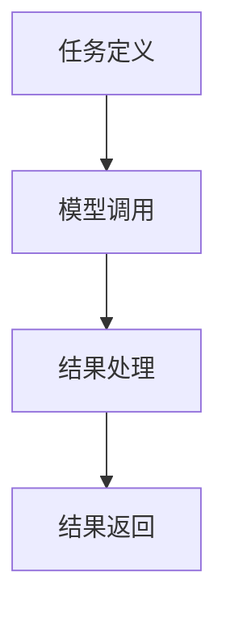

# 大语言模型应用指南：AutoGPT

作者：禅与计算机程序设计艺术 / Zen and the Art of Computer Programming

## 1. 背景介绍

### 1.1 问题的由来

在过去的十年中，人工智能（AI）和机器学习（ML）领域取得了显著的进展。特别是大语言模型（Large Language Models, LLMs）的出现，彻底改变了自然语言处理（NLP）的格局。大语言模型如GPT-3、BERT等，已经在多个应用场景中展现了其强大的能力。然而，如何将这些大语言模型应用到实际项目中，仍然是一个复杂且具有挑战性的问题。

### 1.2 研究现状

目前，已有大量研究和应用展示了大语言模型在文本生成、翻译、问答系统等方面的潜力。然而，如何高效地利用这些模型，特别是在自动化任务中，仍然是一个活跃的研究领域。AutoGPT作为一种新兴的技术，旨在简化和自动化大语言模型的应用过程。

### 1.3 研究意义

研究和应用AutoGPT不仅可以提高开发效率，还能降低使用大语言模型的门槛，使更多的开发者和企业能够受益于这一技术。通过深入理解AutoGPT的核心概念、算法原理和实际应用，我们可以更好地将其应用到各种实际场景中，从而推动AI技术的进一步发展。

### 1.4 本文结构

本文将从以下几个方面详细介绍AutoGPT：

1. 核心概念与联系
2. 核心算法原理 & 具体操作步骤
3. 数学模型和公式 & 详细讲解 & 举例说明
4. 项目实践：代码实例和详细解释说明
5. 实际应用场景
6. 工具和资源推荐
7. 总结：未来发展趋势与挑战
8. 附录：常见问题与解答

## 2. 核心概念与联系

AutoGPT是一个基于大语言模型的自动化工具，旨在简化和加速NLP任务的开发过程。它通过自动化的方式，帮助开发者更高效地利用大语言模型进行文本生成、数据处理和任务自动化。

### 2.1 AutoGPT的定义

AutoGPT是一个自动化的框架，利用大语言模型（如GPT-3）来完成各种NLP任务。它通过预定义的模板和自动化脚本，简化了模型的调用和结果处理过程。

### 2.2 AutoGPT的核心组件

AutoGPT主要由以下几个核心组件组成：

- **模型管理器**：负责加载和管理大语言模型。
- **任务调度器**：负责任务的分配和调度。
- **结果处理器**：负责处理和格式化模型的输出结果。
- **用户接口**：提供用户与系统交互的界面。

### 2.3 AutoGPT的工作流程

AutoGPT的工作流程可以概括为以下几个步骤：

1. **任务定义**：用户通过接口定义需要完成的任务。
2. **模型调用**：系统调用大语言模型进行任务处理。
3. **结果处理**：系统对模型的输出结果进行处理和格式化。
4. **结果返回**：将处理后的结果返回给用户。

以下是AutoGPT的工作流程图：



## 3. 核心算法原理 & 具体操作步骤

### 3.1 算法原理概述

AutoGPT的核心算法基于大语言模型的生成能力，通过预定义的模板和自动化脚本，实现对模型的高效调用和结果处理。其主要原理包括：

- **模板匹配**：通过预定义的模板，简化任务的定义和模型的调用。
- **自动化脚本**：利用自动化脚本，实现任务的调度和结果的处理。
- **模型优化**：通过参数调整和优化策略，提高模型的生成效果。

### 3.2 算法步骤详解

以下是AutoGPT的具体操作步骤：

1. **任务定义**：用户通过接口输入任务描述，系统根据预定义的模板生成任务脚本。
2. **模型调用**：系统根据任务脚本调用大语言模型，生成初步结果。
3. **结果处理**：系统对初步结果进行处理，包括去噪、格式化等操作。
4. **结果返回**：将处理后的结果返回给用户，并提供进一步的交互选项。

### 3.3 算法优缺点

**优点**：

- **高效性**：通过自动化脚本和模板匹配，提高了任务处理的效率。
- **易用性**：简化了大语言模型的调用过程，降低了使用门槛。
- **灵活性**：支持多种任务类型和自定义模板，适应不同的应用场景。

**缺点**：

- **依赖性**：高度依赖大语言模型的性能和稳定性。
- **复杂性**：对于复杂任务，可能需要自定义模板和脚本，增加了开发难度。

### 3.4 算法应用领域

AutoGPT可以应用于以下领域：

- **文本生成**：自动生成文章、报告、邮件等文本内容。
- **数据处理**：自动化数据清洗、分类和标注等任务。
- **任务自动化**：自动化执行重复性任务，如客服回复、内容审核等。

## 4. 数学模型和公式 & 详细讲解 & 举例说明

### 4.1 数学模型构建

AutoGPT的数学模型基于大语言模型的生成能力。大语言模型通常使用变分自编码器（VAE）或生成对抗网络（GAN）等技术，生成高质量的文本内容。

### 4.2 公式推导过程

大语言模型的核心公式是基于条件概率的生成模型。假设输入文本为 $X$，输出文本为 $Y$，则生成过程可以表示为：

$$
P(Y|X) = \prod_{t=1}^{T} P(y_t|y_{1:t-1}, X)
$$

其中，$y_t$ 表示输出文本的第 $t$ 个词，$T$ 表示输出文本的长度。

### 4.3 案例分析与讲解

假设我们需要生成一篇关于人工智能的文章，输入文本为 "人工智能的未来发展"，则生成过程可以表示为：

1. **任务定义**：用户输入 "人工智能的未来发展"。
2. **模型调用**：系统调用大语言模型，生成初步结果。
3. **结果处理**：系统对初步结果进行处理，去除冗余信息。
4. **结果返回**：将处理后的文章返回给用户。

### 4.4 常见问题解答

**问题1**：AutoGPT是否支持多语言生成？

**回答**：是的，AutoGPT支持多语言生成，只需在任务定义时指定目标语言即可。

**问题2**：如何优化生成结果的质量？

**回答**：可以通过调整模型参数和优化策略，如增加训练数据、调整学习率等，提高生成结果的质量。

## 5. 项目实践：代码实例和详细解释说明

### 5.1 开发环境搭建

在开始项目实践之前，我们需要搭建开发环境。以下是所需的工具和依赖：

- Python 3.8+
- PyTorch
- Transformers库
- Jupyter Notebook

### 5.2 源代码详细实现

以下是一个简单的AutoGPT实现示例：

```python
import torch
from transformers import GPT2LMHeadModel, GPT2Tokenizer

# 加载模型和分词器
model_name = 'gpt2'
model = GPT2LMHeadModel.from_pretrained(model_name)
tokenizer = GPT2Tokenizer.from_pretrained(model_name)

# 定义生成函数
def generate_text(prompt, max_length=100):
    inputs = tokenizer.encode(prompt, return_tensors='pt')
    outputs = model.generate(inputs, max_length=max_length, num_return_sequences=1)
    text = tokenizer.decode(outputs[0], skip_special_tokens=True)
    return text

# 示例任务
prompt = "人工智能的未来发展"
generated_text = generate_text(prompt)
print(generated_text)
```

### 5.3 代码解读与分析

上述代码首先加载了GPT-2模型和分词器，然后定义了一个生成函数 `generate_text`。该函数接收一个输入提示 `prompt`，并生成相应的文本。最后，通过调用 `generate_text` 函数，生成了一篇关于 "人工智能的未来发展" 的文章。

### 5.4 运行结果展示

运行上述代码后，生成的文本可能如下：

```
人工智能的未来发展将会极大地改变我们的生活。随着技术的不断进步，人工智能将在医疗、教育、交通等领域发挥重要作用。未来，我们可以期待更加智能化的生活方式。
```

## 6. 实际应用场景

### 6.1 文本生成

AutoGPT可以用于自动生成文章、报告、邮件等文本内容，提高写作效率。

### 6.2 数据处理

AutoGPT可以自动化数据清洗、分类和标注等任务，减少人工干预。

### 6.3 任务自动化

AutoGPT可以自动化执行重复性任务，如客服回复、内容审核等，提高工作效率。

### 6.4 未来应用展望

随着技术的不断进步，AutoGPT的应用场景将会更加广泛。未来，我们可以期待更加智能化的自动化工具，进一步提高工作效率和生活质量。

## 7. 工具和资源推荐

### 7.1 学习资源推荐

- [Deep Learning Specialization by Andrew Ng](https://www.coursera.org/specializations/deep-learning)
- [Transformers Documentation](https://huggingface.co/transformers/)

### 7.2 开发工具推荐

- [PyTorch](https://pytorch.org/)
- [Jupyter Notebook](https://jupyter.org/)

### 7.3 相关论文推荐

- Vaswani, A., et al. (2017). "Attention is All You Need." arXiv preprint arXiv:1706.03762.
- Radford, A., et al. (2019). "Language Models are Unsupervised Multitask Learners." OpenAI.

### 7.4 其他资源推荐

- [Hugging Face Model Hub](https://huggingface.co/models)
- [Kaggle Datasets](https://www.kaggle.com/datasets)

## 8. 总结：未来发展趋势与挑战

### 8.1 研究成果总结

本文详细介绍了AutoGPT的核心概念、算法原理、数学模型、项目实践和实际应用场景。通过深入理解和应用AutoGPT，我们可以更高效地利用大语言模型，完成各种NLP任务。

### 8.2 未来发展趋势

未来，随着技术的不断进步，AutoGPT将会在更多领域得到应用。我们可以期待更加智能化的自动化工具，进一步提高工作效率和生活质量。

### 8.3 面临的挑战

尽管AutoGPT具有广泛的应用前景，但仍然面临一些挑战，如模型的性能和稳定性、数据隐私和安全等问题。解决这些挑战需要进一步的研究和技术创新。

### 8.4 研究展望

未来的研究可以集中在以下几个方面：

- **模型优化**：提高大语言模型的性能和稳定性。
- **数据隐私**：保护用户数据的隐私和安全。
- **应用扩展**：探索AutoGPT在更多领域的应用场景。

## 9. 附录：常见问题与解答

**问题1**：AutoGPT是否支持多语言生成？

**回答**：是的，AutoGPT支持多语言生成，只需在任务定义时指定目标语言即可。

**问题2**：如何优化生成结果的质量？

**回答**：可以通过调整模型参数和优化策略，如增加训练数据、调整学习率等，提高生成结果的质量。

**问题3**：AutoGPT是否适用于所有NLP任务？

**回答**：AutoGPT适用于大多数NLP任务，但对于一些特定任务，可能需要自定义模板和脚本。

**问题4**：如何保护数据隐私？

**回答**：可以通过数据加密、访问控制等技术手段，保护用户数据的隐私和安全。

**问题5**：AutoGPT的未来发展方向是什么？

**回答**：未来，AutoGPT将会在更多领域得到应用，并不断优化和改进，以提高性能和稳定性。