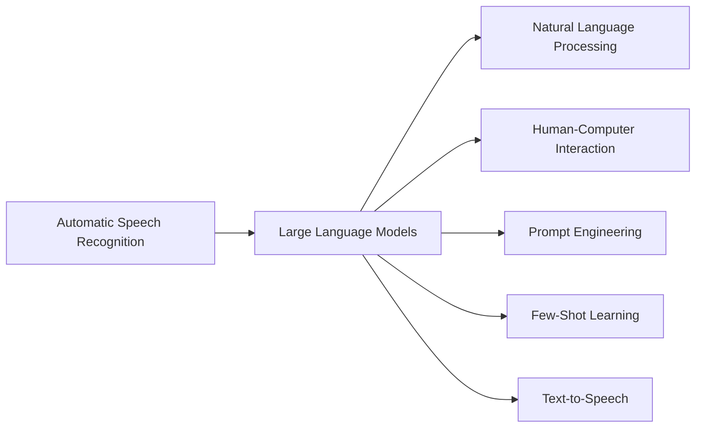
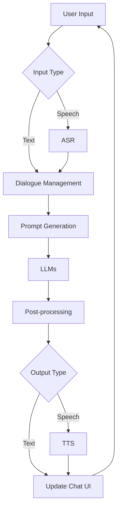

# 大语言模型应用指南：交互格式

作者：禅与计算机程序设计艺术 / Zen and the Art of Computer Programming

## 1. 背景介绍

### 1.1 问题的由来

随着人工智能技术的快速发展，大语言模型(Large Language Models, LLMs)已经成为自然语言处理(Natural Language Processing, NLP)领域的研究热点。LLMs 通过在海量文本数据上进行预训练，能够学习到丰富的语言知识和常识，在许多 NLP 任务上取得了突破性的进展，如机器翻译、问答系统、文本摘要等。然而，如何有效地利用 LLMs 的强大能力，设计出友好易用的人机交互界面，让普通用户能够轻松使用 LLMs 的能力，仍然是一个亟待解决的问题。

### 1.2 研究现状

目前，学术界和工业界已经提出了多种 LLMs 的交互方式，主要可以分为以下几类：

1. 基于 API 调用的交互方式。用户通过 HTTP 请求与 LLMs 后端服务进行通信，传入输入文本，获取输出结果。这种方式适合集成到现有的软件系统中，但对普通用户不够友好。

2. 基于聊天界面的交互方式。借鉴即时通讯软件的界面设计，用户通过与 AI 助手进行多轮对话的方式来使用 LLMs 的能力。代表性的系统有 ChatGPT、Claude 等。这种方式比较直观，适合普通用户使用。

3. 基于 Prompt 的交互方式。用户通过输入特定格式的 Prompt 来引导 LLMs 执行特定的任务。Prompt 可以包含任务描述、输入输出格式定义、示例等信息。代表性的系统有 GPT-3 的 Prompt Engineering。这种方式灵活性高，可以执行复杂的任务，但对用户的学习成本较高。

4. 基于语音的交互方式。用户通过语音输入来与 LLMs 进行交互，LLMs 的输出也通过语音合成技术转换为音频。代表性的系统有 Siri、Alexa 等。这种方式适合在移动端和智能音箱等场景下使用。

5. 其他交互方式。如通过图形界面配置 LLMs 的参数和任务，通过自然语言描述执行特定功能等。

### 1.3 研究意义

探索 LLMs 的交互格式具有重要的研究意义：

1. 提高 LLMs 的可用性。设计良好的交互格式可以降低普通用户使用 LLMs 的门槛，让更多人受益于 LLMs 技术的进步。

2. 拓展 LLMs 的应用场景。不同的交互格式适用于不同的应用场景，研究交互格式可以拓宽 LLMs 的应用领域。

3. 提升用户体验。优化 LLMs 的交互设计可以显著提升用户使用 LLMs 的体验和效率。

4. 推动 NLP 技术的进步。交互格式的改进可以反过来促进 LLMs 模型和算法的优化。

### 1.4 本文结构

本文将围绕 LLMs 的交互格式展开深入探讨，主要内容安排如下：

第2部分介绍了 LLMs 交互中涉及的一些核心概念，并分析它们之间的联系。

第3部分重点介绍了 LLMs 交互的核心算法原理，并给出了具体的操作步骤。

第4部分从数学角度对 LLMs 交互涉及的模型和公式进行了详细推导和案例分析。

第5部分通过代码实例和详细的注释说明，演示了如何实现一个 LLMs 交互系统。

第6部分讨论了 LLMs 交互格式在实际应用中的典型场景，并展望了未来的应用前景。

第7部分推荐了 LLMs 交互相关的学习资源、开发工具和研究论文。

第8部分对全文进行了总结，分析了 LLMs 交互技术未来的发展趋势和面临的挑战。

第9部分的附录中列出了一些常见问题及其解答。

## 2. 核心概念与联系

在探讨 LLMs 交互格式之前，我们首先需要了解其中涉及的一些核心概念：

- 大语言模型(Large Language Models, LLMs)：指参数量巨大(一般在数十亿到上万亿)的深度学习语言模型，通过在大规模文本语料上进行预训练，可以学习到丰富的语言知识，具有强大的自然语言理解和生成能力。代表性的 LLMs 有 GPT-3、PaLM、LaMDA 等。

- 交互格式(Interaction Format)：指人类用户与 LLMs 进行交互的方式和界面设计。常见的交互格式有 API、聊天界面、Prompt等。交互格式的设计直接影响 LLMs 的可用性和用户体验。

- 自然语言处理(Natural Language Processing, NLP)：研究计算机如何处理、理解和生成人类语言的一门学科。LLMs 是 NLP 领域的重要突破，在机器翻译、信息抽取、文本生成等任务上取得了显著进展。

- 人机交互(Human-Computer Interaction, HCI)：研究人与计算机之间的交互和界面设计的学科。LLMs 作为一种新型的人工智能系统，其交互设计需要遵循 HCI 的原则和方法。

- 提示工程(Prompt Engineering)：指通过精心设计输入给 LLMs 的提示(Prompt)，引导其执行特定的 NLP 任务的技术。优质的 Prompt 可以显著提升 LLMs 在下游任务上的表现。

- 少样本学习(Few-Shot Learning)：指 LLMs 通过学习少量示例就能够掌握新任务的能力。得益于预训练阶段学到的丰富知识，LLMs 可以实现"学习如何学习"，快速适应新任务。

- 语音识别(Automatic Speech Recognition, ASR)：将人类语音转换为计算机可读文本的技术。ASR 使得用户可以通过语音与 LLMs 进行交互。

- 语音合成(Text-to-Speech, TTS)：将文本转换为人类语音的技术。TTS 使得 LLMs 的输出结果可以以语音的形式呈现给用户。

这些概念之间有着紧密的联系。LLMs 是 NLP 领域的重大进展，其交互格式的设计需要遵循 HCI 的原则。Prompt Engineering 和 Few-Shot Learning 是提升 LLMs 性能的重要技术。ASR 和 TTS 使得 LLMs 可以通过语音模态与人类进行交互。这些概念共同构成了 LLMs 交互格式的理论和技术基础。

## 3. 核心算法原理 & 具体操作步骤

### 3.1 算法原理概述

LLMs 的交互涉及多个模块和算法，主要包括：

1. 语言模型(Language Model)：LLMs 的核心是基于 Transformer 架构的语言模型，通过自监督学习从大规模语料中学习语言知识。常见的 LLMs 有 GPT 系列、BERT 系列等。

2. 语音识别(ASR)：将用户的语音输入转换为文本。主流的 ASR 系统基于深度学习算法，如 CTC、LAS 等。

3. 语音合成(TTS)：将 LLMs 生成的文本转换为语音输出。主流的 TTS 系统基于端到端的深度学习算法，如 Tacotron、WaveNet 等。

4. 对话管理(Dialogue Management)：控制人机对话的流程和策略。主要任务包括意图识别、槽位填充、状态跟踪、对话策略等。常用的算法有基于规则的有限状态机、基于强化学习的对话策略等。

5. 自然语言生成(Natural Language Generation, NLG)：根据对话状态和知识库信息生成回复文本。LLMs 强大的语言生成能力使其成为 NLG 的首选方法。

### 3.2 算法步骤详解

以基于聊天界面的 LLMs 交互为例，其典型的处理步骤如下：

1. 用户通过界面输入文本或语音。

2. 如果输入为语音，则调用 ASR 模块将其转换为文本。

3. 对话管理模块对用户输入进行意图识别和槽位填充，更新对话状态。

4. 根据对话状态和知识库信息，生成 Prompt 文本。

5. 将 Prompt 文本输入给 LLMs，生成回复文本。

6. 对 LLMs 生成的文本进行后处理，如过滤不恰当内容、格式化等。

7. 如果需要语音回复，则调用 TTS 模块将文本转换为语音。

8. 将回复文本或语音返回给用户，更新聊天界面。

9. 重复步骤 1-8，直到用户结束对话。

### 3.3 算法优缺点

基于 LLMs 的交互算法具有以下优点：

1. 语言理解和生成能力强大，可以支持开放域的对话。

2. 通过 Prompt 引导，可以灵活地执行各种 NLP 任务。

3. 借助 ASR 和 TTS 技术，可以实现多模态交互。

但也存在一些局限性：

1. LLMs 生成的内容可能存在事实性错误、逻辑矛盾等问题。

2. 对于特定领域的知识，需要额外的微调或知识注入。

3. 推理速度受限于模型规模，实时交互有一定延迟。

4. 隐私和安全风险，用户数据可能被误用或泄露。

### 3.4 算法应用领域

LLMs 的交互算法可以应用于多个领域，如：

1. 智能客服：提供 24 小时全天候的客户服务，解答常见问题。

2. 个人助理：帮助用户管理日程、邮件、信息等。

3. 教育助手：辅导学生学习，答疑解惑。

4. 医疗助理：提供医疗咨询、病情分析等服务。

5. 金融顾问：提供投资建议、风险评估等服务。

6. 娱乐聊天：陪伴用户聊天，讲笑话，玩文字游戏等。

## 4. 数学模型和公式 & 详细讲解 & 举例说明

### 4.1 数学模型构建

LLMs 的核心是基于 Transformer 架构的语言模型。以 GPT 系列模型为例，其数学模型可以表示为：

$$P(x_1, ..., x_n) = \prod_{i=1}^n P(x_i | x_1, ..., x_{i-1})$$

其中，$x_1, ..., x_n$ 表示输入文本序列的 token，$P(x_i | x_1, ..., x_{i-1})$ 表示在给定前 $i-1$ 个 token 的条件下，第 $i$ 个 token 的条件概率。

GPT 模型使用 Transformer 的 Decoder 结构来建模这个条件概率：

$$h_0 = Embedding(x_1, ..., x_n)$$
$$h_l = Transformer\_Decoder(h_{l-1}), l=1,...,L$$
$$P(x_i | x_1, ..., x_{i-1}) = Softmax(Linear(h_L[i]))$$

其中，$Embedding$ 层将离散的 token 映射为连续的向量表示，$Transformer\_Decoder$ 为 Transformer 的 Decoder 模块，$L$ 为 Decoder 的层数，$Linear$ 为线性变换层，$Softmax$ 为归一化函数。

### 4.2 公式推导过程

Transformer Decoder 的核心是自注意力机制(Self-Attention)和前馈神经网络(Feed-Forward Network, FFN)。

对于第 $l$ 层的第 $i$ 个位置，其自注意力机制可以表示为：

$$Q_i^l = h_{l-1}[i] W_Q^l$$
$$