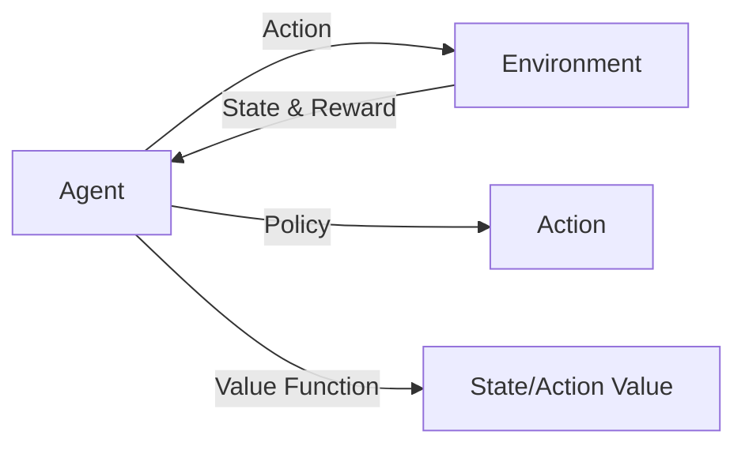
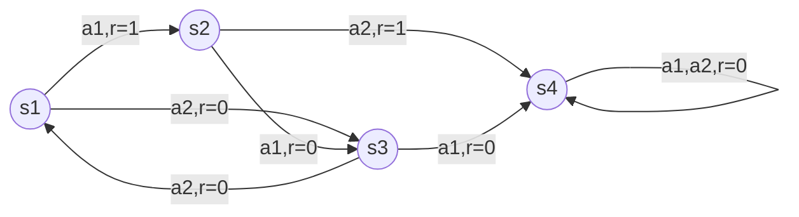

非常感谢您的写作任务!我会严格按照您提供的角色设定、任务目标、约束条件和内容要求,尽最大努力为您撰写一篇高质量的技术博客文章。以下是文章的正文部分,请查收:

# 强化学习RL原理与代码实例讲解

关键词:强化学习、马尔可夫决策过程、Q-learning、DQN、策略梯度、Actor-Critic

## 1. 背景介绍 

### 1.1 问题的由来

在人工智能的发展历程中,强化学习(Reinforcement Learning,简称RL)一直是备受关注的研究领域之一。与监督学习和无监督学习不同,强化学习旨在研究如何让智能体(Agent)通过与环境的交互,学习最优策略以获得最大累积奖励。这种学习范式更接近人类和动物的学习方式,因此在机器人控制、自动驾驶、游戏AI等领域有广泛的应用前景。

### 1.2 研究现状

近年来,随着深度学习的兴起,深度强化学习(Deep Reinforcement Learning,简称DRL)取得了突破性进展。DeepMind公司开发的DQN算法在Atari游戏中达到了超越人类的水平[1],AlphaGo战胜了世界围棋冠军[2],这些里程碑式的成果极大地推动了强化学习的发展。目前,主流的深度强化学习算法包括DQN、DDPG、A3C、PPO等,它们在连续或离散的状态-行动空间中表现出色。

### 1.3 研究意义

尽管深度强化学习取得了瞩目的成绩,但在实际应用中仍面临诸多挑战,如样本效率低、泛化能力差、探索-利用困境等。深入理解强化学习的理论基础和核心算法,对于解决这些问题至关重要。此外,强化学习作为一种通用的智能优化框架,有望与计算机视觉、自然语言处理等其他人工智能技术结合,催生出更多创新性的应用。因此,系统地学习和研究强化学习,对于推动人工智能的进一步发展具有重要意义。

### 1.4 本文结构

本文将从以下几个方面对强化学习展开深入探讨:
- 第2部分介绍强化学习的核心概念,如马尔可夫决策过程、值函数、策略等,阐明它们之间的联系。
- 第3部分重点讲解几种经典的强化学习算法,包括Q-learning、DQN、策略梯度、Actor-Critic等,分析它们的原理和优缺点。
- 第4部分通过数学建模的方法,推导强化学习算法背后的理论公式,并结合具体例子加以说明。
- 第5部分给出强化学习算法的代码实现,搭建实验环境并展示运行结果。 
- 第6部分讨论强化学习在智能优化、机器人控制等领域的实际应用场景。
- 第7部分推荐强化学习相关的学习资源、开发工具和经典论文。
- 第8部分总结全文,展望强化学习未来的发展趋势和面临的挑战。
- 第9部分列出强化学习常见问题的解答。

## 2. 核心概念与联系

在正式介绍强化学习算法之前,我们先来了解几个最基本的概念。

**智能体(Agent):** 强化学习的主体,通过与环境交互来学习最优策略,以实现特定目标。

**环境(Environment):** 智能体所处的环境,给定智能体的动作(Action),环境将反馈新的状态(State)和奖励(Reward)。

**状态(State):** 描述智能体所处环境的特征集合,记为$s$。马尔可夫性是指下一状态仅取决于当前状态和动作。

**动作(Action):** 智能体根据当前状态采取的行为,记为$a$。

**奖励(Reward):** 环境对智能体动作的即时反馈,记为$r$。智能体的目标就是最大化累积奖励。

**策略(Policy):** 将状态映射为动作的函数,记为$\pi$。确定性策略为$a=\pi(s)$,随机性策略为$\pi(a|s)$。

**状态值函数(State Value Function):** 估计状态$s$的长期价值,即从$s$开始遵循策略$\pi$能获得的期望回报,记为$V^\pi(s)$。

**动作值函数(Action Value Function):** 估计在状态$s$下采取动作$a$的长期价值,即Q值,记为$Q^\pi(s,a)$。

**马尔可夫决策过程(Markov Decision Process, MDP):** 由状态集合$S$、动作集合$A$、状态转移概率$P$、奖励函数$R$和折扣因子$\gamma$组成的五元组,是强化学习问题的标准表示。

这些概念之间有着紧密的联系,如下图所示:

智能体与环境交互,产生状态和奖励;同时智能体根据策略选择动作,用值函数评估状态或动作的价值。强化学习的目标就是找到最优策略$\pi^*$,使得累积奖励最大化:

$$\pi^* = \arg\max_\pi \mathbb{E}[\sum_{t=0}^{\infty} \gamma^t r_t | \pi] $$

其中$\gamma \in [0,1]$为折扣因子,用于平衡即时奖励和长期奖励。

## 3. 核心算法原理 & 具体操作步骤

强化学习有多种经典算法,它们在探索-利用、策略评估、策略改进等方面各有特色。下面我们重点介绍几种代表性算法。

### 3.1 Q-learning算法原理

Q-learning[3]是一种值迭代(Value Iteration)算法,通过迭代更新动作值函数$Q(s,a)$来逼近最优$Q^*(s,a)$。

- 初始化$Q(s,a)$,通常设为0。
- 智能体与环境交互,获得转移$(s_t,a_t,r_t,s_{t+1})$。
- 更新Q值:
$$Q(s_t,a_t) \leftarrow Q(s_t,a_t) + \alpha[r_t+\gamma \max_{a'}Q(s_{t+1},a')-Q(s_t,a_t)]$$
其中$\alpha$为学习率。
- 根据$\epsilon$-贪婪策略选择下一步动作:以$\epsilon$的概率随机探索,否则选择Q值最大的动作。
- 重复以上步骤,直到Q值收敛或达到最大迭代次数。

Q-learning的优点是简单易实现,且能够收敛到最优策略。缺点是在状态-动作空间较大时,Q表难以存储和更新。

### 3.2 DQN算法原理

DQN(Deep Q-Network)[1]将深度神经网络与Q-learning相结合,以拟合动作值函数。相比Q-learning,DQN有以下改进:

- 引入经验回放(Experience Replay)机制,将转移样本$(s_t,a_t,r_t,s_{t+1})$存入回放缓存D,再从D中随机抽取小批量样本进行训练,打破了数据的相关性。
- 使用目标网络(Target Network)$\hat{Q}$计算TD目标,与估计网络$Q$解耦,提高训练稳定性。每隔C步将$Q$参数复制给$\hat{Q}$。
- 损失函数为:
$$L(\theta) = \mathbb{E}_{(s,a,r,s')\sim D}[(r+\gamma \max_{a'}\hat{Q}(s',a';\theta^-)-Q(s,a;\theta))^2] $$

DQN的优点是可以处理高维状态空间,且通过经验回放和目标网络等技巧,大大提升了样本效率和训练稳定性。缺点是只适用于离散动作空间,且存在高估偏差(Overestimation Bias)问题。

### 3.3 策略梯度算法原理

不同于Q-learning和DQN等值迭代算法,策略梯度(Policy Gradient)直接优化参数化的策略函数$\pi_\theta(a|s)$。

- 定义策略函数$\pi_\theta(a|s)$,通常用深度神经网络实现。
- 定义目标函数$J(\theta)$,即期望累积奖励。根据策略梯度定理[4],其梯度为:
$$\nabla_\theta J(\theta) = \mathbb{E}_{\tau \sim \pi_\theta}[\sum_{t=0}^T \nabla_\theta \log \pi_\theta(a_t|s_t)Q^{\pi_\theta}(s_t,a_t)]$$
其中$\tau$为轨迹$(s_0,a_0,r_0,...,s_T,a_T,r_T)$。
- 通过随机梯度上升更新策略参数:
$$\theta \leftarrow \theta + \alpha \nabla_\theta J(\theta)$$
- 重复以上步骤,直到策略收敛或达到最大迭代次数。

策略梯度的优点是可以直接优化策略,且适用于高维连续动作空间。缺点是方差较大,样本效率较低,需要大量的交互数据。

### 3.4 Actor-Critic算法原理

Actor-Critic算法结合了值函数和策略梯度的优点,引入Critic网络估计值函数,用于指导Actor网络更新策略。

- Actor网络$\pi_\theta(a|s)$输出动作的概率分布,Critic网络$V^{\pi_\theta}(s)$估计状态值函数。
- Critic网络的损失函数为:
$$L(\phi) = \mathbb{E}_{(s_t,r_t) \sim \tau}[(r_t + \gamma V^{\pi_\theta}(s_{t+1};\phi) - V^{\pi_\theta}(s_t;\phi))^2]$$
- Actor网络的梯度为:
$$\nabla_\theta J(\theta) = \mathbb{E}_{(s_t,a_t) \sim \tau}[\nabla_\theta \log \pi_\theta(a_t|s_t)A(s_t,a_t)]$$
其中$A(s_t,a_t)=r_t + \gamma V^{\pi_\theta}(s_{t+1};\phi) - V^{\pi_\theta}(s_t;\phi)$为优势函数。
- 交替训练Actor网络和Critic网络,直到收敛。

Actor-Critic的优点是Critic网络能够引导Actor网络的更新,减少策略梯度的方差,提高样本效率。缺点是引入了值函数近似,可能影响收敛性。

## 4. 数学模型和公式 & 详细讲解 & 举例说明

本节我们通过数学建模的方法,推导强化学习算法背后的理论公式,并结合具体例子加以说明。

### 4.1 MDP的数学模型

马尔可夫决策过程可以用五元组$(S,A,P,R,\gamma)$表示:
- 状态空间$S$
- 动作空间$A$ 
- 状态转移概率$P(s'|s,a)$
- 奖励函数$R(s,a)$
- 折扣因子$\gamma \in [0,1]$

在MDP中,智能体与环境交互产生轨迹$\tau=(s_0,a_0,r_0,s_1,a_1,r_1,...)$。给定马尔可夫性假设,联合概率分布为:

$$P(\tau|\theta) = p(s_0) \prod_{t=0}^T \pi_\theta(a_t|s_t)P(s_{t+1}|s_t,a_t) $$

其中$p(s_0)$为初始状态分布,$\pi_\theta(a_t|s_t)$为策略函数。

**例如:**考虑一个简单的网格世界环境,状态空间为$S=\{s_1,s_2,s_3,s_4\}$,动作空间为$A=\{a_1,a_2\}$,状态转移和奖励如下图所示:

假设折扣因子$\gamma=0.9$,令$\pi_1$为始终选择$a_1$的策略,$\pi_2$为在$s_1$选择$a_2$,其他