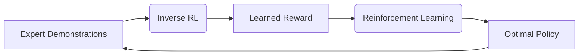

强化学习Reinforcement Learning与逆强化学习：理论与实践

作者：禅与计算机程序设计艺术 / Zen and the Art of Computer Programming 

关键词：强化学习、逆强化学习、马尔可夫决策过程、价值函数、策略梯度、模仿学习、最大熵原理、逆最优控制

## 1. 背景介绍
### 1.1 问题的由来
强化学习(Reinforcement Learning, RL)作为一种重要的机器学习范式,其灵感来源于心理学中的行为主义理论。不同于监督学习需要标注数据,RL致力于通过智能体(Agent)与环境(Environment)的交互过程,来学习最优策略以获得最大累积奖励。近年来,RL在AlphaGo、自动驾驶、推荐系统等领域取得了瞩目成就,展现出广阔的应用前景。

然而,传统RL方法在实际应用中仍面临诸多挑战,如奖励稀疏、样本效率低、泛化能力差等。为克服这些难题,逆强化学习(Inverse Reinforcement Learning, IRL)应运而生。IRL旨在从专家演示中学习隐含的奖励函数,再利用学到的奖励来优化策略。通过对专家行为的模仿学习,IRL可以更高效地求解复杂任务。

### 1.2 研究现状 
近年来,强化学习和逆强化学习领域涌现出许多创新性的工作。Mnih等人提出的DQN[1]算法,首次将深度学习与Q学习结合,实现了在Atari游戏中的人类水平控制。Silver等人提出的AlphaGo系列算法[2,3],融合了蒙特卡洛树搜索与深度神经网络,在围棋领域连续取得突破。

在逆强化学习方面,Abbeel和Ng[4]提出了一种基于特征期望的算法,用线性组合特征函数来表示奖励。Ziebart等人[5]基于最大熵原理提出了一种概率图模型IRL算法。Finn等人[6]提出了一种基于样本的高效IRL算法GCL。Fu等人[7]提出了一种对抗式IRL框架AIRL,利用对抗训练来学习奖励函数。这些研究极大地推动了IRL理论与应用的发展。

### 1.3 研究意义
强化学习与逆强化学习的结合,有望进一步提升智能体的学习效率与泛化能力,拓展RL的应用边界。一方面,IRL可以从专家数据中学习更加准确和鲁棒的奖励函数,缓解RL中奖励设计的难题。另一方面,将IRL学到的奖励用于RL训练,可以加速策略搜索,降低探索成本。此外,IRL还为机器人模仿学习、自动驾驶、推荐系统等应用领域带来新的思路。

### 1.4 本文结构
本文将全面阐述强化学习与逆强化学习的理论基础与前沿进展,重点探讨二者的结合与应用。第2节介绍RL与IRL的核心概念与联系。第3节详细讲解RL与IRL的核心算法原理与具体步骤。第4节阐述RL与IRL所涉及的数学模型与公式推导。第5节给出RL与IRL的代码实例与详细解释。第6节讨论RL与IRL在机器人、自动驾驶、推荐系统等领域的应用场景。第7节推荐RL与IRL的相关学习资源与开发工具。第8节总结全文,展望RL与IRL的未来发展趋势与面临的挑战。

## 2. 核心概念与联系
强化学习和逆强化学习的核心概念如下:

- 状态(State): 描述智能体所处的环境状况,记为 $s$。
- 动作(Action): 智能体与环境交互时采取的行为,记为 $a$。
- 策略(Policy): 将状态映射到动作的函数,记为 $\pi(a|s)$。
- 轨迹(Trajectory): 智能体与环境交互产生的状态-动作序列,记为 $\tau=(s_0,a_0,s_1,a_1,...)$。 
- 奖励函数(Reward Function): 评估每个状态或状态-动作对的好坏,记为 $r(s)$ 或 $r(s,a)$。
- 价值函数(Value Function): 评估状态或状态-动作对的长期累积奖励,记为 $V^\pi(s)$ 或 $Q^\pi(s,a)$。
- 模型(Model): 描述环境的状态转移概率 $p(s'|s,a)$ 和奖励函数 $r(s,a)$。

强化学习的目标是通过与环境交互,学习一个最优策略 $\pi^*$ 以最大化期望累积奖励:

$$
\pi^* = \arg \max_{\pi} \mathbb{E}_{\tau \sim \pi} \left[ \sum_{t=0}^{\infty} \gamma^t r(s_t, a_t) \right]
$$

其中 $\gamma \in [0,1]$ 为折扣因子。

逆强化学习则致力于从专家轨迹数据 $\mathcal{D} = \{\tau_1, \tau_2, ...\}$ 中恢复隐含的奖励函数 $\hat{r}$,再用 $\hat{r}$ 来训练策略:

$$
\begin{aligned}
\hat{r} & = \arg \max_{r} \mathcal{L} (\mathcal{D}, r) \\
\hat{\pi} & = \arg \max_{\pi} \mathbb{E}_{\tau \sim \pi} \left[ \sum_{t=0}^{\infty} \gamma^t \hat{r}(s_t, a_t) \right] 
\end{aligned}
$$

其中 $\mathcal{L}$ 为优化的目标函数,如最大似然或最大熵。

RL与IRL的关系可以总结为:
1. IRL可以用于解决RL中奖励设计的难题,从而提升RL的性能。
2. IRL学到的奖励函数可以作为RL的训练目标,指导策略学习。 
3. RL可以为IRL提供数据来源,即专家轨迹数据。
4. 将IRL与RL集成到统一框架,有望实现更高效、鲁棒的智能体学习。

下图展示了RL与IRL的交互关系:

## 3. 核心算法原理 & 具体操作步骤
### 3.1 算法原理概述
#### 3.1.1 强化学习算法
强化学习可分为基于值(Value-based)、基于策略(Policy-based)和基于模型(Model-based)三大类算法。

基于值的方法通过学习价值函数,如状态值函数 $V(s)$ 或状态-动作值函数 $Q(s,a)$,再根据价值函数采取贪婪策略。代表算法有:
- Q-learning
- Sarsa 
- DQN

基于策略的方法直接对策略函数 $\pi_{\theta}(a|s)$ 进行参数化和优化,其中 $\theta$ 为策略参数。优化目标是最大化期望累积奖励 $J(\theta) = \mathbb{E}_{\tau \sim \pi_{\theta}} [R(\tau)]$。代表算法有:
- REINFORCE 
- Actor-Critic
- PPO
- TRPO

基于模型的方法通过学习环境动力学模型 $p(s'|s,a)$ 和奖励函数 $r(s,a)$,再利用模型进行规划与控制。代表算法有:
- Dyna 
- iLQR
- PILCO

#### 3.1.2 逆强化学习算法
逆强化学习旨在从专家轨迹数据中恢复隐含的奖励函数。主要分为三类方法:
1. 基于特征期望的方法:假设奖励函数可以用状态特征的线性组合表示,即 $r(s) = w^T \phi(s)$,其中 $w$ 为特征权重, $\phi(s)$ 为状态特征。代表算法有:
   - 特征期望匹配[4]
   - 最大熵IRL[5]
   - 相对熵IRL
2. 基于概率图模型的方法:将轨迹数据建模为隐马尔可夫模型或条件随机场,从而推断奖励函数。代表算法有:
   - 高斯过程IRL
   - 隐变量模型
3. 基于对抗学习的方法:利用生成对抗网络(GAN)框架,将奖励函数建模为判别器,通过最小化专家轨迹与生成轨迹的分布差异来学习奖励。代表算法有:
   - GAN-GCL
   - GAIL
   - AIRL[7]

### 3.2 算法步骤详解
下面以 Q-learning 和 AIRL 为例,详细介绍强化学习和逆强化学习的算法步骤。

#### 3.2.1 Q-learning算法
Q-learning是一种经典的无模型、异策略的时间差分学习算法,用于学习最优状态-动作值函数 $Q^*(s,a)$。

算法步骤如下:
1. 初始化Q表 $Q(s,a)$,对所有 $s\in\mathcal{S}, a\in\mathcal{A}$,令 $Q(s,a)=0$
2. 重复以下步骤,直到收敛:
   - 初始化状态 $s$
   - 重复以下步骤,直到 $s$ 为终止状态:
     - 根据 $\epsilon$-贪婪策略,以 $\epsilon$ 的概率随机选择动作 $a$,否则选择 $a=\arg\max_{a'} Q(s,a')$
     - 执行动作 $a$,观察奖励 $r$ 和下一状态 $s'$
     - 更新Q值:
     $$Q(s,a) \leftarrow Q(s,a) + \alpha [r + \gamma \max_{a'} Q(s',a') - Q(s,a)]$$
     - $s \leftarrow s'$
3. 输出最优策略 $\pi^*(s) = \arg\max_a Q(s,a)$

其中 $\alpha \in (0,1]$ 为学习率, $\gamma \in [0,1]$ 为折扣因子。

#### 3.2.2 AIRL算法
AIRL(Adversarial Inverse Reinforcement Learning)是一种基于对抗学习的逆强化学习算法,通过训练生成器(Generator)和判别器(Discriminator)来恢复奖励函数。

算法步骤如下:
1. 输入:专家轨迹数据 $\mathcal{D} = \{\tau_1, \tau_2, ...\}$,初始化生成器 $G_{\theta}$ 和判别器 $D_{\omega}$ 的参数 $\theta,\omega$
2. 重复以下步骤,直到收敛:
   - 从 $\mathcal{D}$ 中采样一批专家轨迹 $\{\tau^E_i\}_{i=1}^m$
   - 利用生成器 $G_{\theta}$ 生成一批轨迹 $\{\tau^G_i\}_{i=1}^m$
   - 更新判别器参数 $\omega$,最大化目标函数:
   $$\mathcal{L}_D(\omega) = \frac{1}{m} \sum_{i=1}^m \left[ \log D_{\omega}(\tau^E_i) + \log (1-D_{\omega}(\tau^G_i)) \right]$$
   - 更新生成器参数 $\theta$,最小化目标函数:
   $$\mathcal{L}_G(\theta) = \frac{1}{m} \sum_{i=1}^m \left[ -\log D_{\omega}(\tau^G_i) \right]$$
3. 输出学到的奖励函数 $\hat{r}(s,a) = \log D_{\omega}(s,a) - \log (1-D_{\omega}(s,a))$

其中 $D_{\omega}(s,a)$ 表示判别器将状态-动作对 $(s,a)$ 分类为专家示范的概率。通过最小化专家轨迹与生成轨迹的分布差异,AIRL可以恢复隐含的奖励函数。

### 3.3 算法优缺点
Q-learning的优点是:
- 简单易实现,适用于离散状态和动作空间
- 无需环境模型,可以在线学习
- 收敛性有理论保证

Q-learning的缺点是:
- 难以处理连续状态和动作空间
- 容易过拟合,泛化能力差
- 探索效率低,容易陷入局部最优

AIRL的优点是:  
- 可以从