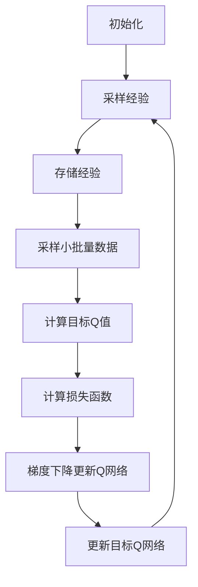

# 强化学习Reinforcement Learning中价值函数近似方法解读

## 1. 背景介绍

### 1.1 问题的由来

在强化学习领域中,价值函数是一个关键概念。它用于估计一个状态或状态-行为对在给定策略下的预期累积回报。传统的强化学习算法,如Q-learning和Sarsa,需要维护一个价值函数表,其中包含了每个状态或状态-行为对的价值估计。然而,当状态空间或行为空间非常大时,这种表格方法就变得不切实际了,因为它需要大量的内存来存储所有的价值估计。

这就引出了价值函数近似(Value Function Approximation)的概念。价值函数近似旨在使用一个紧凑的函数逼近器(如神经网络)来表示价值函数,而不是使用一个庞大的表格。这种方法不仅可以节省内存,而且还可以更好地处理连续状态空间和行为空间,并提供更好的泛化能力。

### 1.2 研究现状

近年来,随着深度学习技术的发展,基于神经网络的价值函数近似方法在强化学习领域取得了巨大的成功。一些著名的算法,如深度Q网络(Deep Q-Network, DQN)和优势actor-critic(Advantage Actor-Critic, A2C),都采用了神经网络来近似价值函数或行为策略。这些算法在许多任务上都取得了超越人类水平的性能,如Atari游戏和国际象棋。

然而,价值函数近似也面临着一些挑战,如不稳定的训练过程、样本效率低下和泛化能力有限等。研究人员一直在探索各种技术来解决这些问题,如经验回放(Experience Replay)、目标网络(Target Network)和双重学习(Double Learning)等。

### 1.3 研究意义

价值函数近似是强化学习领域的一个核心问题,对于实现通用人工智能(Artificial General Intelligence, AGI)至关重要。通过研究价值函数近似方法,我们可以更好地理解智能体如何评估当前状态的价值,并做出最优决策。此外,价值函数近似也有着广泛的应用前景,如机器人控制、自动驾驶和智能决策系统等。

### 1.4 本文结构

本文将详细介绍强化学习中价值函数近似的相关概念、算法原理和实现方法。我们将首先介绍价值函数近似的核心概念及其与其他强化学习概念的联系。然后,我们将深入探讨几种主要的价值函数近似算法,包括其数学模型、公式推导和具体实现步骤。接下来,我们将通过代码示例和实际应用场景,帮助读者更好地理解这些算法。最后,我们将总结价值函数近似的未来发展趋势和面临的挑战。

## 2. 核心概念与联系

在介绍价值函数近似之前,我们需要先了解一些强化学习中的核心概念。

**马尔可夫决策过程(Markov Decision Process, MDP)**: 强化学习问题通常被建模为MDP,它由一组状态(S)、一组行为(A)、状态转移概率(P)、回报函数(R)和折扣因子(γ)组成。智能体在每个时间步通过观察当前状态并选择一个行为,然后接收来自环境的回报,并转移到下一个状态。目标是找到一个策略(π),使得在该策略下的预期累积回报最大化。

**价值函数(Value Function)**: 价值函数用于估计一个状态或状态-行为对在给定策略下的预期累积回报。我们通常关注两种价值函数:状态价值函数(V(s))和行为价值函数(Q(s,a))。它们分别定义为:

$$V^{\pi}(s) = \mathbb{E}_{\pi}\left[\sum_{t=0}^{\infty}\gamma^{t}R_{t+1} | S_0=s\right]$$
$$Q^{\pi}(s,a) = \mathbb{E}_{\pi}\left[\sum_{t=0}^{\infty}\gamma^{t}R_{t+1} | S_0=s, A_0=a\right]$$

其中,γ是折扣因子,用于平衡immediate reward和future reward的权重。

**贝尔曼方程(Bellman Equations)**: 贝尔曼方程是价值函数必须满足的一组等式,它将价值函数与MDP的其他组成部分(状态转移概率、回报函数和折扣因子)联系起来。对于状态价值函数,我们有:

$$V^{\pi}(s) = \sum_{a}\pi(a|s)\sum_{s'}P(s'|s,a)\left[R(s,a,s')+\gamma V^{\pi}(s')\right]$$

对于行为价值函数,我们有:

$$Q^{\pi}(s,a) = \sum_{s'}P(s'|s,a)\left[R(s,a,s')+\gamma\sum_{a'}{\pi(a'|s')Q^{\pi}(s',a')}\right]$$

**时序差分学习(Temporal Difference Learning)**: 时序差分学习是一类用于估计价值函数的算法,它通过不断更新价值估计来最小化时序差分误差(Temporal Difference Error)。一些著名的时序差分算法包括Q-learning和Sarsa。

**策略迭代(Policy Iteration)**: 策略迭代是另一类强化学习算法,它通过交替执行策略评估(Policy Evaluation)和策略改进(Policy Improvement)两个步骤来找到最优策略。在策略评估阶段,我们估计当前策略的价值函数;在策略改进阶段,我们基于估计的价值函数更新策略。

价值函数近似与上述概念密切相关。它旨在使用一个紧凑的函数逼近器(如神经网络)来表示价值函数,从而避免维护一个庞大的价值函数表。这种方法不仅可以节省内存,而且还可以更好地处理连续状态空间和行为空间,并提供更好的泛化能力。

## 3. 核心算法原理 & 具体操作步骤

### 3.1 算法原理概述

价值函数近似的核心思想是使用一个参数化的函数逼近器(如神经网络)来表示价值函数,而不是使用一个庞大的表格。我们定义一个函数逼近器V̂(s,θ)或Q̂(s,a,θ),其中θ是函数逼近器的参数。目标是通过优化这些参数,使得函数逼近器的输出尽可能接近真实的价值函数。

为了优化参数θ,我们通常采用某种形式的梯度下降法。具体来说,我们定义一个损失函数,用于衡量函数逼近器的输出与真实价值函数之间的差异。然后,我们计算该损失函数相对于参数θ的梯度,并沿着梯度的反方向更新参数,以最小化损失函数。

不同的价值函数近似算法采用了不同的损失函数和优化方法。一些著名的算法包括:

- **深度Q网络(Deep Q-Network, DQN)**: 这是一种基于Q-learning的算法,它使用一个深度神经网络来近似行为价值函数Q(s,a)。DQN采用了一些技巧,如经验回放(Experience Replay)和目标网络(Target Network),以稳定训练过程。
- **优势actor-critic(Advantage Actor-Critic, A2C)**: A2C是一种actor-critic算法,它同时使用两个神经网络:一个用于近似行为策略(actor),另一个用于近似价值函数(critic)。A2C通过最大化期望回报与基线值函数之间的优势(advantage)来更新这两个网络。
- **深度确定性策略梯度(Deep Deterministic Policy Gradient, DDPG)**: DDPG是一种用于连续控制任务的actor-critic算法。它使用一个actor网络来近似确定性策略,并使用一个critic网络来近似行为价值函数Q(s,a)。DDPG还采用了一些技巧,如软更新(Soft Updates)和经验回放,以提高训练稳定性。

### 3.2 算法步骤详解

以DQN算法为例,我们可以将其分解为以下几个主要步骤:

1. **初始化回放缓冲区(Replay Buffer)和Q网络**:
   - 创建一个空的回放缓冲区,用于存储智能体与环境的交互经验。
   - 初始化一个Q网络,该网络将状态s作为输入,输出每个可能行为a的Q值Q(s,a)。

2. **采样经验并存储到回放缓冲区**:
   - 使用当前的Q网络与环境交互,采集一批经验(s, a, r, s')。
   - 将这些经验存储到回放缓冲区中。

3. **从回放缓冲区采样小批量数据**:
   - 从回放缓冲区中随机采样一个小批量的经验。

4. **计算目标Q值**:
   - 对于每个经验(s, a, r, s')中的s',使用目标Q网络计算其所有可能行为的Q值Q'(s', a')。
   - 目标Q值y = r + γ * max(Q'(s', a'))。

5. **计算损失函数并进行梯度下降**:
   - 计算当前Q网络对于(s, a)的预测Q值Q(s, a)。
   - 计算损失函数L = (y - Q(s, a))^2。
   - 计算损失函数L相对于Q网络参数的梯度。
   - 使用梯度下降法更新Q网络的参数。

6. **定期更新目标Q网络**:
   - 每隔一定步骤,将Q网络的参数复制到目标Q网络中,以提高训练稳定性。

7. **重复步骤2-6,直到算法收敛**。

上述步骤可以用以下Mermaid流程图来概括:

需要注意的是,不同的价值函数近似算法可能会有一些细微的差异,但它们的基本思路是相似的:使用函数逼近器来表示价值函数,并通过优化一个损失函数来更新函数逼近器的参数。

### 3.3 算法优缺点

价值函数近似算法相对于传统的表格方法有以下优点:

- **内存效率**: 使用函数逼近器(如神经网络)可以用较少的内存来表示价值函数,而不需要维护一个庞大的表格。
- **处理连续空间**: 价值函数近似可以很好地处理连续的状态空间和行为空间,而表格方法通常只适用于离散的空间。
- **泛化能力**: 函数逼近器具有一定的泛化能力,可以对未见过的状态或行为做出合理的价值估计。

然而,价值函数近似也存在一些缺点和挑战:

- **不稳定的训练过程**: 使用神经网络作为函数逼近器可能会导致训练过程不稳定,需要采用一些技巧(如经验回放和目标网络)来缓解这个问题。
- **样本效率低下**: 价值函数近似算法通常需要大量的训练数据才能converge,这降低了它们的样本效率。
- **局部最优陷阱**: 由于使用了非线性函数逼近器(如神经网络),优化过程可能会陷入局部最优解。
- **超参数调优**: 价值函数近似算法通常包含许多超参数(如学习率、网络结构等),需要进行大量的调优工作。

### 3.4 算法应用领域

价值函数近似算法已被广泛应用于各种强化学习任务,包括:

- **游戏AI**: 价值函数近似在Atari游戏、国际象棋、围棋等游戏中取得了巨大的成功,展现出超越人类水平的性能。
- **机器人控制**: 在连续控制任务中(如机器人手臂控制和行走控制),价值函数近似算法(如DDPG)可以直接从原始传感器数据中学习控制策略。
- **自动驾驶**: 价值函数近似可以用于训练自动驾驶系统,从模拟环境中学习驾驶策略。
- **推荐系统**: 在推荐系统中,价值函数近似可以用于估计某个推荐行为(如推荐一部电影)的长期价值,从而做出最优决策。
- **对话