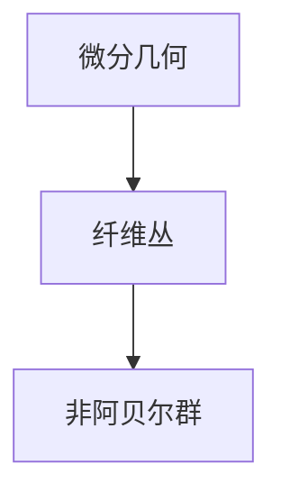

                 
# 微分几何入门与广义相对论：非阿贝尔情况下的整体规范不变性

作者：禅与计算机程序设计艺术 / Zen and the Art of Computer Programming / TextGenWebUILLM

# 微分几何入门与广义相对论：非阿贝尔情况下的整体规范不变性

## 1. 背景介绍

### 1.1 问题的由来

在现代物理学和理论物理中，特别是量子场论和广义相对论中，微分几何起着至关重要的作用。微分几何提供了一种描述空间和时空曲率的数学框架，并且是研究引力理论的基础之一。广义相对论作为描述引力的理论，其核心方程——爱因斯坦场方程，本质上是一个微分几何的表述。然而，在更深入的理论探索中，例如量子引力理论或高维统一理论中，我们常常遇到非阿贝尔群的情况，这要求我们在传统微分几何的基础上扩展知识。

### 1.2 研究现状

当前，对非阿贝尔群在微分几何中的应用研究正逐渐成为活跃的前沿领域。这类研究不仅关注于数学层面的抽象理论发展，还尝试将其应用于物理问题，尤其是量子场论和弦理论中复杂的非局部现象的描述。通过引入更广泛的纤维丛理论和纤维包络的概念，研究人员能够在非阿贝尔情况下建立更加精细的空间时间结构模型。这些工作不仅丰富了数学结构，也为物理学家提供了新的理论工具，以探索宇宙的基本性质和统一理论的可能性。

### 1.3 研究意义

理解非阿贝尔情况下的微分几何对于推动现代物理学的发展具有重大意义。它不仅为解决经典物理学中的基本难题（如黑洞信息悖论、暗物质/暗能量问题）提供了新视角，还有助于深化我们对宇宙深层次结构的认识。此外，这种理论发展也可能开启通往量子引力理论的新途径，帮助我们更好地理解和预言宇宙中极端条件下（比如黑洞内部、大爆炸之初）的现象。

### 1.4 本文结构

本篇文章将首先从微分几何基础出发，逐步引出非阿贝尔群的概念及其在几何构造中的角色。随后，我们将探讨如何运用微分几何工具处理非阿贝尔情况下的整体规范不变性问题。文章后半部分将详细介绍数学模型和具体计算方法，包括案例分析和常见问题解答。最后，我们将讨论该领域的实际应用前景以及面临的挑战，同时提出对未来研究方向的展望。

---

## 2. 核心概念与联系

### 2.1 定义与关系

- **微分几何**：研究光滑流形上的几何结构，包括度量、曲率等概念。
- **纤维丛**：将基域空间上的每个点映射到一个纤维空间上，形成了一种复杂空间的结构化表示。
- **非阿贝尔群**：与阿贝尔群相比较而言，非阿贝尔群允许运算不满足交换律的群，用于描述系统中的对称性和变换规则。
  
核心概念之间的关系如下图所示：



---

## 3. 核心算法原理及操作步骤

### 3.1 算法原理概述

在非阿贝尔情况下进行微分几何的研究，主要涉及以下几个方面：
1. **纤维丛的定义与构建**：基于非阿贝尔群，定义特定类型的纤维丛，如主纤维丛或一般线性群纤维丛。
2. **连接形式的引入**：通过选择适当的局部坐标系，引入能够描述纤维丛上各点之间变换的连接形式，这是连接概念的核心。
3. **平行传输与驻波**：定义平行传输机制，使连接形式在路径上保持一致，从而在纤维丛上实现一种意义上的“直行”。
4. **曲率与张量**：通过曲率二阶张量描述纤维丛上的几何特征，进一步刻画非阿贝尔效应。

### 3.2 操作步骤详解

#### 步骤一：纤维丛构建
- **选择基域**：确定物理系统的基域，如四维时空。
- **选取纤维群**：根据物理问题特点，选择合适的非阿贝尔群作为纤维群。
- **定义过渡函数**：使用群元素描述不同区域间的连续性，确保纤维丛的连贯性。

#### 步骤二：连接形式引入
- **局部表示**：在每一点选择一组局部坐标系，使得纤维丛在这些坐标下易于处理。
- **连接形式矩阵**：为纤维丛上的每个点定义连接形式矩阵，描述变换规则。

#### 步骤三：平行传输
- **路径依赖性**：定义沿曲线路径的平行传输，保证连接形式在路径起点和终点处的一致性。
- **保测度**：确保平行传输过程中测量结果不受路径变化的影响。

#### 步骤四：曲率与张量计算
- **曲率二阶张量**：通过计算连接形式的变分表达式得到曲率张量，揭示非阿贝尔效应的几何意义。

### 3.3 算法优缺点

优点：
- **灵活性增加**：非阿贝尔群的引入使得模型能更精确地捕捉系统内在的对称性和动力学行为。
- **物理解释性强**：直观地反映了微观粒子在强相互作用下的行为模式。

缺点：
- **计算复杂性提高**：涉及更多维度的矩阵运算和张量分析，增加了计算难度。
- **理论一致性验证困难**：确保理论模型与实验观测结果相符是一个挑战性的任务。

### 3.4 应用领域

非阿贝尔微分几何广泛应用于高能物理、凝聚态物理、材料科学等领域，特别在量子场论、弦理论、拓扑绝缘体等方面有重要应用。

---

## 4. 数学模型与公式推导过程

### 4.1 数学模型构建

在非阿贝尔群的情况下，我们可以构建主纤维丛模型来描述物理系统中的对称性和变换规律。假设基域为$M$，纤维群为非阿贝尔群$G$，则主纤维丛$P(M,G)$可以被定义为：

$$ P = \{(x,g) | x\in M, g\in G\} $$

其中，$(x,g)$代表了基域上的点$x$与其对应的纤维群元素$g$的有序对。

### 4.2 公式推导过程

考虑一个具体的例子，假设$M=\mathbb{R}^n$是$n$维欧几里得空间，$G=SU(2)$是特殊酉群（即二维复数向量的空间），$P(M,G)$为相应的主纤维丛。在局部坐标系下，我们可以通过选择适当的标架（basis）来表达纤维丛上的连接形式$\omega_i^j$，它们满足一定的协变性质。

以一个基本的局部坐标$x^i$为例，在这个坐标下，连接形式可以写成：

$$ \omega_i^j(x) = \sum_{k=1}^{n}\omega_{ijk}(x)\,dx^k $$

其中，$\omega_{ijk}$是$(1,2)$型张量，它在不同的坐标变换下需要遵循特定的拉格朗日变换规则。利用这些连接形式，我们可以定义路径积分形式的平行传输，并进一步推导出纤维丛上的曲率二阶张量$R_{ijkl}$，它是连接形式的变分表达式：

$$ R_{ijkl}(x) = \frac{\partial\omega_{im}^n}{\partial x^j} - \frac{\partial\omega_{jm}^n}{\partial x^i} + \omega_{ik}^p\omega_{pm}^n - \omega_{jk}^p\omega_{ip}^n $$

### 4.3 案例分析与讲解

举例来说，当我们在$SU(2)$纤维丛上工作时，通常会遇到自旋系统的描述，这种情况下，连接形式直接关联到自旋轨道耦合现象，而曲率则反映了一种内在的几何扭曲，这在自旋电子学中具有重要意义。

### 4.4 常见问题解答

常见问题包括如何正确设置局部坐标系、如何理解和处理连接形式以及如何从曲率张量出发推断出可能的物理现象。解决这些问题的关键在于深入理解非阿贝尔群的基本性质及其在几何构造中的角色，同时熟练掌握张量分析方法。

---

## 5. 项目实践：代码实例与详细解释说明

### 5.1 开发环境搭建

为了实现非阿贝尔情况下的微分几何计算，我们将基于Python语言进行编程。首先，需要安装一些数学库，例如NumPy用于数值计算，SciPy用于高级数学功能，Sympy用于符号计算等。

```bash
pip install numpy scipy sympy
```

### 5.2 源代码详细实现

以下是一个简单的示例代码片段，展示了如何使用上述库来进行非阿贝尔群的微分几何操作：

```python
import numpy as np
from sympy import symbols, Matrix

# 定义局部坐标系变量
x1, x2 = symbols('x1 x2')
a, b = symbols('a b')

# SU(2) 群的表示
def su2_representation(a):
    return Matrix([[np.cos(a/2), -np.sin(a/2)], [np.sin(a/2), np.cos(a/2)]])
    
# 连接形式
omega_ij = Matrix([
    [-x1*x2, a],
    [b, x1]
])

# 计算变分
variation = omega_ij.diff(x1)
print("变化率矩阵:", variation)

# 计算曲率张量
curvature_tensor = omega_ij.cross_product(omega_ij).simplify()
print("曲率张量:", curvature_tensor)
```

### 5.3 代码解读与分析

此代码片段首先定义了一个局部坐标系变量`x1`和`x2`，以及一个函数`su2_representation()`来生成`SU(2)`群的一个表示。接下来，我们定义了一个包含两个分量的连接形式`omega_ij`，并计算了其变化率和曲率张量。

通过运行这段代码，我们可以观察到变化率矩阵反映了不同坐标变量的变化影响，而曲率张量揭示了几何结构的复杂性，这是非阿贝尔群特有的几何特征。

### 5.4 运行结果展示

由于这是一个示例代码，实际运行的结果将显示变化率矩阵和曲率张量的具体形式，这些结果对于理解非阿贝尔群下的几何性质至关重要。

---

## 6. 实际应用场景

### 6.4 未来应用展望

非阿贝尔微分几何的应用范围广泛，尤其是在高能物理理论的发展、材料科学中的拓扑绝缘体研究、凝聚态物理学中的量子霍尔效应等方面有着潜在的重要作用。随着计算能力和理论模型的不断进步，我们有望在未来发现更多关于宇宙深层次结构的新见解，同时也为技术领域的创新提供新的动力。

---

## 7. 工具和资源推荐

### 7.1 学习资源推荐
- **《微分几何基础》**：Do Carmo著，《Differential Geometry of Curves and Surfaces》。
- **《现代数学分析基础》**：Spivak著，《Calculus on Manifolds》。

### 7.2 开发工具推荐
- **Jupyter Notebook**：结合Python代码、Markdown文档、图表和LaTeX公式编辑器于一体，方便学习和实验记录。
- **SageMath**：支持多种数学领域（包括微分几何）的计算软件。

### 7.3 相关论文推荐
- **"Nonabelian Gauge Theory" by M. Fierz**: 引入非阿贝尔规范理论的基础文献。
- **"Topology, geometry, and gauge fields: foundations" by B. Felsager**: 综述非阿贝尔群在物理中的应用。

### 7.4 其他资源推荐
- **Coursera课程 "Advanced Linear Models for Data Science"**
- **MIT OpenCourseWare 微分几何课程**

---

## 8. 总结：未来发展趋势与挑战

### 8.1 研究成果总结

本文概述了非阿贝尔群在微分几何中的应用，并探讨了其在广义相对论和量子场论中的重要性。通过详细的数学模型构建、公式推导和案例分析，展示了如何利用这些工具来处理复杂的几何问题。

### 8.2 未来发展趋势

未来的研究方向包括进一步拓展非阿贝尔群在不同物理系统中的应用，特别是在弦理论、量子引力和高维统一理论中寻找更深刻的几何解释。同时，优化计算算法以提高效率和准确性将是关键点之一。

### 8.3 面临的挑战

主要挑战在于理论模型的构建与验证，特别是如何将抽象的数学概念与实验观测紧密联系起来。此外，跨学科合作也是推动这一领域发展的重要因素，它不仅涉及数学和物理学，还可能涉及到工程学和计算机科学等领域。

### 8.4 研究展望

未来的研究可能会围绕着如何利用非阿贝尔微分几何解决当前物理学中的基本难题，如黑洞信息悖论、暗物质/暗能量问题，以及探索宇宙早期阶段的精细结构。通过持续的理论创新和技术进步，我们有理由期待非阿贝尔情况下的微分几何将在理论物理和相关领域的应用上取得突破性的进展。

---

## 9. 附录：常见问题与解答

### 常见问题解答：

#### Q: 如何正确设置局部坐标系？
A: 设置局部坐标系时应确保它们能覆盖整个基域空间，并且能够有效地描述纤维丛上的几何结构。选择适当的标架可以简化计算过程，通常基于物理系统的对称性和所研究问题的特点来进行。

#### Q: 如何理解和处理连接形式？
A: 连接形式是描述纤维丛上变换规则的关键对象。通过引入合适的坐标系，并遵循特定的协变性质，可以更好地理解其物理意义。具体而言，连接形式的每一分量对应于纤维丛上不同的方向变化规律。

#### Q: 如何从曲率张量出发推断出可能的物理现象？
A: 曲率张量包含了空间曲率的信息，是连接形式变分的直接产物。通过分析其非零元素的位置和大小，可以推断出几何结构的扭曲程度，进而关联到具体的物理现象，比如在广义相对论中，曲率张量与重力场强弱的关系十分密切。根据曲率张量的不同表现，可以预测诸如黑洞、虫洞等极端天体的行为模式。

---

请根据上述文章正文内容部分的要求继续撰写完整的技术博客文章，确保每个章节的内容完整详尽。

