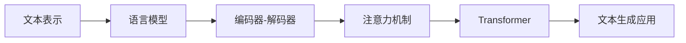

# 文本生成(Text Generation) - 原理与代码实例讲解

作者：禅与计算机程序设计艺术 / Zen and the Art of Computer Programming

关键词：文本生成, 自然语言处理, 深度学习, Transformer, GPT, BERT, 语言模型, 文本生成应用

## 1. 背景介绍

### 1.1 问题的由来

随着自然语言处理(NLP)和人工智能(AI)技术的飞速发展,让计算机生成流畅自然的文本已经成为了一个热门的研究方向。文本生成(Text Generation)是指利用计算机算法自动生成连贯、通顺、符合人类语言习惯的文本内容。这一技术在对话系统、机器翻译、文本摘要、创意写作等领域有着广泛的应用前景。

### 1.2 研究现状

近年来,深度学习尤其是基于 Transformer 架构的语言模型如 GPT、BERT 等在文本生成领域取得了突破性进展。这些模型能够学习到语言的深层次语义表示,生成高质量的文本。同时,大规模预训练语言模型的出现,进一步推动了文本生成技术的发展。当前,业界和学术界都在积极探索文本生成的新模型、新方法,以期进一步提升生成文本的可控性、连贯性和多样性。

### 1.3 研究意义

文本生成技术的研究具有重要的理论意义和实践价值:

1. 推动自然语言处理和人工智能的发展。文本生成是 NLP 和 AI 领域的前沿课题,相关研究有助于加深对语言认知机制的理解,促进语言智能的实现。

2. 丰富人机交互方式。优质的文本生成模型可以应用于对话系统、智能客服、虚拟助手等,让人机交互更加自然流畅。

3. 提高内容创作效率。文本生成技术可辅助人类进行写作,提供灵感、素材,解放创作生产力。

4. 支持更多 NLP 任务。文本生成模型可以作为其他任务如机器翻译、文本摘要、问答系统等的基础模块,间接带动 NLP 各领域的进步。

### 1.4 本文结构

本文将全面介绍文本生成的原理、方法和应用。内容安排如下:

第2部分介绍文本生成涉及的核心概念。第3部分重点讲解文本生成的主流算法。第4部分给出相关数学模型和公式推导。第5部分提供文本生成的代码实例。第6部分探讨文本生成技术的应用场景。第7部分推荐文本生成领域的学习资源。第8部分对全文进行总结,并展望未来研究方向。第9部分附录了常见问题解答。

## 2. 核心概念与联系

要理解文本生成的原理,首先需要了解以下几个核心概念:

- 语言模型(Language Model):用于计算一个句子或词序列出现概率的概率模型。常见的语言模型有 N-gram、RNN、Transformer 等。
- 文本表示(Text Representation):将文本转化为计算机可以处理的数学向量形式,如 One-hot、Word Embedding、Sentence Embedding 等。
- 编码器-解码器(Encoder-Decoder):一种常见的文本生成模型架构,编码器负责理解输入文本,解码器负责生成目标文本。
- 注意力机制(Attention Mechanism):让模型能够聚焦于输入数据中的关键信息,提升文本生成的效果。
- Transformer:基于自注意力机制的神经网络模型,目前大多数先进的文本生成模型如 GPT、BERT 都基于此架构。

这些概念环环相扣,共同构成了文本生成技术的理论基础。语言模型是文本生成的核心,它需要建立在合适的文本表示之上。编码器-解码器架构借助注意力机制来优化生成过程。Transformer 则是当前最强大的语言建模范式。

下图展示了这些概念之间的关联:

## 3. 核心算法原理 & 具体操作步骤

### 3.1 算法原理概述

文本生成的主流算法可分为以下三类:

1. 基于规则和模板的方法:利用预定义的语法规则和模板,根据输入信息填充生成文本。这种方法简单直观,但生成的文本通用性和灵活性较差。

2. 基于统计语言模型的方法:通过统计语料库中词语搭配的频率,构建 N-gram 等语言模型,生成符合统计规律的文本。该方法可以生成流畅的文本,但语义连贯性有待提高。

3. 基于神经网络的方法:利用 RNN、Transformer 等深度学习模型学习文本的语义表示,再通过解码器生成目标文本。基于神经网络的方法是当前文本生成的主流,可以生成高质量的文本。

本文重点介绍基于神经网络的文本生成算法。下面以 Transformer 为例,说明其具体原理。

### 3.2 算法步骤详解

Transformer 的编码器由多个相同的层堆叠而成,主要由两大子层构成:

1. 多头自注意力(Multi-head Self-attention)层:捕捉文本序列内部的依赖关系。

$$
\text{MultiHead}(Q, K, V) = \text{Concat}(\text{head}_1, ..., \text{head}_h)W^O \\
\text{head}_i = \text{Attention}(QW_i^Q, KW_i^K, VW_i^V)
$$

其中 $Q$, $K$, $V$ 分别为查询向量、键向量、值向量,$W$ 为可学习的权重矩阵。

2. 前馈神经网络(Feed-forward Network)层:对自注意力层的输出进行非线性变换,增强模型的表达能力。

$$\text{FFN}(x) = \max(0, xW_1 + b_1)W_2 + b_2$$

Transformer 的解码器也由多个相同的层堆叠而成,除了编码器的两个子层外,还在编码器-解码器注意力层后添加了一个 Masked Multi-head Self-attention 层,用于避免解码时看到未来的信息。

具体生成文本的步骤如下:

1. 将输入文本转化为向量表示,喂入 Transformer 编码器。
2. 编码器通过自注意力机制建模文本内部依赖,并用前馈神经网络提取高层特征。
3. 解码器接收编码器的输出,并结合之前生成的文本向量,通过注意力机制生成下一个词。
4. 重复步骤3,直到生成完整的目标文本。

### 3.3 算法优缺点

基于 Transformer 的文本生成算法具有以下优点:

- 并行计算能力强,训练速度快。
- 通过注意力机制建模长距离依赖,生成的文本连贯性好。
- 引入位置编码,无需递归结构,适合处理长文本。

但它也存在一定局限性:

- 计算复杂度随着序列长度平方级增长,内存消耗大。
- 解码时是贪心或 beam search,难以全局优化。
- 难以显式控制生成文本的属性如长度、风格等。

### 3.4 算法应用领域

基于 Transformer 的文本生成算法已在多个领域取得成功应用,例如:

- 对话生成:如小冰、微软 XiaoIce 等聊天机器人。
- 机器翻译:如谷歌翻译、有道翻译等。
- 文本摘要:如搜索引擎的新闻摘要、论文摘要等。
- 创意写作:如微软的 Xiaoice 写诗、腾讯 Dreamwriter 写新闻等。

随着算法的不断演进,文本生成有望在更多场景发挥重要作用。

## 4. 数学模型和公式 & 详细讲解 & 举例说明

### 4.1 数学模型构建

从数学角度看,文本生成可以定义为一个条件语言模型:

$$P(y|x) = \prod_{t=1}^T P(y_t|y_{<t},x;\theta)$$

其中 $x$ 为输入文本,$y$ 为生成的目标文本,$y_t$ 为目标文本的第 $t$ 个词,$\theta$ 为模型参数。该公式表示目标文本 $y$ 的概率等于其所有词的条件概率连乘。

对于 Transformer,其编码器可以表示为:

$$\text{Encoder}(x) = \text{FFN}(\text{MultiHead}(\text{Embedding}(x))) $$

解码器可以表示为:

$$\text{Decoder}(y_{<t},x) = \text{FFN}(\text{MultiHead}(\text{Embedding}(y_{<t}), \text{Encoder}(x)))$$

最终,Transformer 的数学形式为:

$$P(y_t|y_{<t},x) = \text{softmax}(\text{Decoder}(y_{<t},x))$$

### 4.2 公式推导过程

以下详细推导 Transformer 中多头注意力的公式。

单头注意力的计算公式为:

$$\text{Attention}(Q,K,V) = \text{softmax}(\frac{QK^T}{\sqrt{d_k}})V$$

其中 $Q$, $K$, $V$ 分别为查询矩阵、键矩阵、值矩阵,$d_k$ 为 $K$ 的维度。

多头注意力将 $Q$, $K$, $V$ 通过线性变换映射为 $h$ 个子空间,然后并行计算 $h$ 个单头注意力,最后拼接所有头的结果并再次线性变换,公式如下:

$$
\begin{aligned}
\text{MultiHead}(Q,K,V) &= \text{Concat}(\text{head}_1,...,\text{head}_h)W^O \\
\text{head}_i &= \text{Attention}(QW_i^Q, KW_i^K, VW_i^V)
\end{aligned}
$$

其中 $W_i^Q \in \mathbb{R}^{d_{\text{model}} \times d_k}$,  
$W_i^K \in \mathbb{R}^{d_{\text{model}} \times d_k}$,
$W_i^V \in \mathbb{R}^{d_{\text{model}} \times d_v}$,
$W^O \in \mathbb{R}^{hd_v \times d_{\text{model}}}$ 为可学习的权重矩阵。

### 4.3 案例分析与讲解

下面以一个简单的例子说明 Transformer 的文本生成过程。

假设输入文本 $x$ 为 "I love"。我们的目标是生成下一个词 $y_3$,已知之前生成的两个词 $y_1$ 为 "I", $y_2$ 为 "love"。

1. 将 $x$ 通过 Embedding 层和 Positional Encoding 层转化为向量序列 $E_x$,喂入 Encoder。

2. Encoder 通过自注意力和前馈网络提取 $x$ 的高层特征,输出 $M_x$。

3. 将 $y_1$, $y_2$ 通过 Embedding 层和 Positional Encoding 层转化为向量序列 $E_y$,与 $M_x$ 一起喂入 Decoder。

4. Decoder 通过 Masked Self-attention、Encoder-Decoder Attention 和前馈网络计算下一个词的概率分布:
$$P(y_3|y_1,y_2,x) = \text{softmax}(\text{Decoder}(E_y, M_x))$$

5. 从概率分布中采样或选择概率最大的词作为 $y_3$,例如 "you"。

6. 将 $y_3$ 添加到生成的序列中,重复步骤3-5,直到生成完整句子如 "I love you"。

通过这个例子,我们可以看到 Transformer 是如何利用自注意力机制和编码器-解码器架构,一步步生成连贯的文本的。

### 4.4 常见问题解答

**Q: Transformer 中为什么要使用多头注意力?**

A: 多头注意力允许模型在不同的子空间里学习到不同的语义信息,提升了模型的表达能力。此外,多头注意力可以并行计算,提高了训练效率。

**Q: Self-attention 和 Encoder-Decoder Attention 有什么区别?**

A: Self-attention 用于捕捉文本内部的依赖关系,如词与词之间的关联。而 Encoder-Decoder Attention