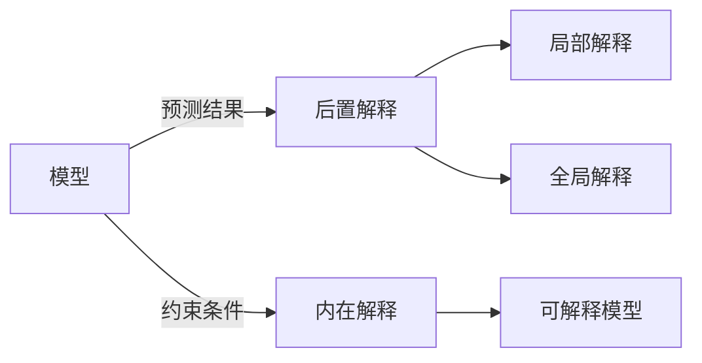

# 模型可解释性原理与代码实战案例讲解

关键词：模型可解释性, 机器学习, 深度学习, 特征重要性, SHAP, LIME, 代码实战

## 1. 背景介绍

### 1.1 问题的由来
随着机器学习和深度学习模型在各个领域的广泛应用,模型的决策过程日益成为一个"黑箱"。尽管这些模型在预测和分类任务上取得了非常好的性能,但是它们内部的工作机制对于用户和开发者来说却是不透明的。这引发了人们对模型可解释性的关注和讨论。

### 1.2 研究现状
目前,学术界和工业界都在积极地研究模型可解释性问题。已经提出了多种用于解释模型的方法,如特征重要性排序、基于实例的解释、反事实解释等。代表性的工作有LIME、SHAP等。一些机器学习平台也开始提供模型解释工具。但总的来说,模型可解释性仍处于起步阶段,还有许多理论和实践问题有待进一步研究。

### 1.3 研究意义 
模型可解释性研究具有重要意义:

1. 提高用户对模型的信任。当模型给出一个预测或决策时,如果能解释其背后的原因,将增强用户的信心。

2. 发现模型的潜在问题。通过解释模型,我们可以发现模型可能存在的偏差、异常行为等问题,有助于改进模型。

3. 满足法规和道德要求。在一些关键领域如金融、医疗等,法律法规要求模型具备可解释性。而在涉及伦理问题的场景中,模型的决策也需要给出合理解释。

4. 促进人机协作。可解释性使得人类专家能够理解模型的决策过程,基于自己的经验知识提供反馈,形成人机协同决策,发挥人机互补的优势。

### 1.4 本文结构
本文将系统地探讨模型可解释性的原理和方法,梳理相关概念,介绍主流算法,并通过代码实战案例演示可解释性技术的应用。内容安排如下:

- 第2部分:介绍模型可解释性的核心概念,以及与相关概念的联系。
- 第3部分:讲解两种主要的模型可解释性算法LIME和SHAP的原理和操作步骤。  
- 第4部分:介绍模型可解释性常用的数学模型,并通过公式推导和案例分析加以说明。
- 第5部分:以一个实际项目为例,演示可解释性方法的代码实现。
- 第6部分:讨论模型可解释性技术在实际场景中的应用现状和未来前景。
- 第7部分:推荐模型可解释性相关的学习资源、开发工具和文献。
- 第8部分:总结全文,展望未来研究方向和挑战。
- 第9部分:附录,解答一些常见问题。

## 2. 核心概念与联系

模型可解释性的核心概念如下:

- 可解释性(Interpretability):指人类能够理解模型的决策过程和结果背后的原因。可解释性是一个定性概念。

- 可解释(Interpretable):如果一个模型或它的预测结果能够被人类所理解,我们就说该模型是可解释的。线性模型通常是可解释的,而深度神经网络则较难解释。

- 解释(Explanation):对模型或其预测进行解释的结果,旨在回答"为什么"的问题。解释可以是对整个模型的总体分析,也可以是对单个预测实例的局部分析。

- 黑盒模型(Black-box Model):内部工作机制不透明、难以解释的模型。典型的如深度学习模型。

- 白盒模型(White-box Model):内部结构和原理对用户透明,具有天然可解释性的模型,如决策树、线性回归等。

- 后置解释(Post-hoc Explanation):在黑盒模型训练完成后,再对其进行解释的方法。代表性方法有LIME、SHAP等。

- 内在解释(Intrinsic Explanation):将可解释性作为约束条件,在模型训练过程中就引入的解释方法。

可解释性与其他概念的联系:

- 可解释性与准确性并不矛盾。通过合理的设计,可以在保证准确性的同时提高模型的可解释性。

- 可解释性有助于提高模型的鲁棒性,找出模型的脆弱点,防止对抗性攻击。

- 可解释性与公平性问题相关。解释模型有助于发现模型中可能存在的偏见和不公平决策。

- 可解释性是实现可信人工智能的基础,让人们相信并接受模型的决策。

## 3. 核心算法原理 & 具体操作步骤

本节重点介绍两种后置解释的代表性算法:LIME和SHAP。

### 3.1 LIME算法原理概述

LIME(Local Interpretable Model-agnostic Explanations)是一种对黑盒模型预测结果进行局部解释的算法。它的基本思想是:在待解释的样本附近的局部区域内,用一个可解释的简单模型(如线性模型)去近似黑盒模型的行为。这个简单模型就可以作为局部的解释。

### 3.2 LIME算法步骤详解

1. 选择待解释的目标样本。

2. 在目标样本的邻域内采样扰动样本。通常使用高斯分布在特征空间采样。

3. 利用原始的黑盒模型对所有扰动样本进行预测。

4. 计算每个扰动样本与目标样本的距离,作为样本权重。距离越近权重越大。

5. 用带权重的扰动样本来训练一个简单的线性模型,使其近似黑盒模型在局部的行为。

6. 提取这个线性模型的系数,作为各个特征的重要性得分,得到局部解释。

### 3.3 LIME算法优缺点

优点:
- 算法简单,容易实现。
- 可以适用于任意模型,不要求访问模型内部结构。  
- 解释结果直观,容易理解。

缺点:  
- 采样计算代价较高,对高维数据效率较低。
- 难以衡量局部近似的质量,不能保证解释的完全准确性。
- 多次运行结果可能不一致,稳定性有待提高。

### 3.4 LIME应用领域

LIME在图像、文本、表格等结构化和非结构化数据上都有应用。特别适合于对个体样本进行分析解释的场景,如医疗诊断、用户个性化推荐等。

### 3.5 SHAP算法原理概述

SHAP(SHapley Additive exPlanations)是一种统一的解释框架。它利用博弈论中的Shapley值来衡量特征的贡献。Shapley值衡量了每个特征单独对模型预测结果的平均边际贡献。SHAP将特征的Shapley值视为该特征的重要性得分。

### 3.6 SHAP算法步骤详解

1. 枚举所有可能的特征子集。如对于N个特征,就有2^N个子集。

2. 对每个特征子集,计算使用该子集特征时模型的预测输出。

3. 对每个特征,统计所有包含它的子集与不包含它的子集的预测差异,作为该特征的边际贡献。

4. 对每个特征的边际贡献在所有子集上取平均,得到该特征的Shapley值,作为特征重要性。

5. 将各特征的Shapley值可视化,得到全局和局部的解释。

### 3.7 SHAP算法优缺点

优点:  
- 提供了一种统一的理论解释框架。
- 具有可加性,各特征的解释可以线性叠加。
- 与特征无关,不受特征相关性的影响。
- 可以衡量每个预测的个体解释,也可以评估整体的特征重要性。

缺点:
- 计算代价高,对特征数多的情况难以处理。需要采取近似计算。
- 完全依赖模型,本质上是在给模型的行为赋予解释,而非解释真实世界的规律。
- Shapley值计算基于博弈论假设,在现实任务中并不一定完全成立。

### 3.8 SHAP应用领域

SHAP被广泛用于评估机器学习模型的特征重要性,进行全局或个体样本的可解释性分析。在金融风控、医学影像、自然语言处理等领域都有应用实践。

## 4. 数学模型和公式 & 详细讲解 & 举例说明

### 4.1 LIME的数学模型

LIME的目标是找到一个局部的解释模型 $g$,使其能很好地近似黑盒模型 $f$ 在样本 $x$ 的邻域 $N(x)$ 内的行为。数学上,优化目标可表示为:

$$
\arg\min_{g\in G} L(f, g, N(x)) + \Omega(g)
$$

其中,$G$是所有可能的解释模型(通常是线性模型)的集合,$L$是局部近似误差,$\Omega$是对解释模型复杂度的惩罚项。

样本 $x$ 的邻域 $N(x)$ 通过扰动采样得到。每个扰动样本 $z$ 根据与 $x$ 的距离 $\pi_x(z)$ 设置权重 $w_z$。然后加权拟合简单模型:

$$
\xi(x)=\arg\min_{g\in G} \sum_{z\in N(x)} w_z \cdot (f(z)-g(z))^2 + \Omega(g)
$$

得到的线性模型系数向量 $\xi(x)$ 就是各特征的局部重要性。

### 4.2 SHAP的数学模型

对于模型 $f$,特征 $i$ 的Shapley值定义为其在所有特征子集 $S\subseteq F\setminus\{i\}$ 上的边际贡献的加权平均:

$$
\phi_i(f,x) = \sum_{S\subseteq F\setminus\{i\}} \frac{|S|!(|F|-|S|-1)!}{|F|!} [f_S(x)-f_{S\setminus\{i\}}(x)]
$$

其中,$F$为全体特征集,$f_S(x)$表示仅使用特征子集$S$时模型$f$对样本$x$的预测输出。

Shapley值的性质包括:

- 效率性:所有特征的Shapley值之和等于模型预测值与基准值之差。
$$\sum_{i=1}^{|F|}\phi_i(f,x)=f(x)-E[f(x)]$$

- 对称性:互换两个特征不改变其Shapley值。
$$\phi_i(f,x)=\phi_{\pi(i)}(f_\pi,x),\forall \pi\in\Pi(F)$$

- 虚值性:对模型无影响的特征Shapley值为0。
$$\phi_i(f,x)=0, \text{if } f(S\cup\{i\})=f(S),\forall S\subseteq F\setminus\{i\}$$

### 4.3 案例分析与讲解

以一个简单的三特征模型为例。假设模型对某样本的输出为10,基准值为0。

特征的所有可能子集及其预测输出为:

$\{\}:0, \{x_1\}:3, \{x_2\}:2, \{x_3\}:5,$
$\{x_1,x_2\}:6, \{x_1,x_3\}:8, \{x_2,x_3\}:7, \{x_1,x_2,x_3\}:10$

对特征$x_1$,其Shapley值计算过程为:

$$
\begin{aligned}
\phi_1 &= \frac{0!(3-0-1)!}{3!}[f(\{x_1\})-f(\{\})] \\
&+ \frac{1!(3-1-1)!}{3!}[f(\{x_1,x_2\})-f(\{x_2\})] \\
&+ \frac{1!(3-1-1)!}{3!}[f(\{x_1,x_3\})-f(\{x_3\})] \\ 
&+ \frac{2!(3-2-1)!}{3!}[f(\{x_1,x_2,x_3\})-f(\{x_2,