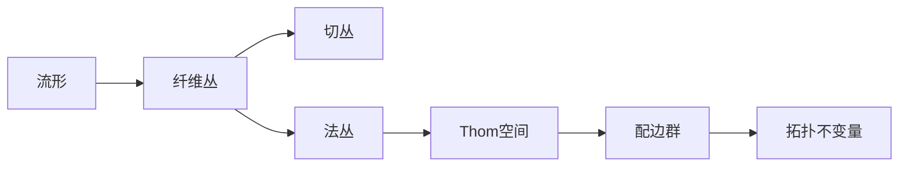

# 流形拓扑学：Thom配边理论

关键词：流形、拓扑学、Thom配边理论、纤维丛、Morse理论、奇点理论、特征类、示性类、指标定理

## 1. 背景介绍

### 1.1 问题的由来

流形拓扑学是现代数学和物理学中一个重要的分支,它主要研究流形的拓扑性质。法国数学家René Thom在20世纪50年代提出了一种研究流形拓扑的新方法——Thom配边理论(Thom Cobordism Theory),为流形拓扑学的发展开辟了新的道路。

### 1.2 研究现状

自从Thom提出配边理论以来,这一理论得到了广泛的发展和应用。许多数学家如Milnor、Novikov、Wall等都对配边理论做出了重要贡献。配边理论与Morse理论、奇点理论、K理论等都有着密切的联系,在微分拓扑、代数拓扑等领域有着重要应用。

### 1.3 研究意义 

深入研究Thom配边理论,对于理解流形的拓扑性质,发展新的拓扑不变量,解决一些几何拓扑问题具有重要意义。配边理论为研究高维流形提供了有力工具,在物理学如弦理论、量子场论等领域也有潜在的应用前景。

### 1.4 本文结构

本文将首先介绍流形拓扑学和配边理论的一些核心概念,然后详细讲解Thom配边理论的核心内容,包括Thom空间、Thom同构、Thom类等。接着给出配边群的定义和计算方法,并讨论配边理论与Morse理论、奇点理论的联系。最后通过一些实例说明配边理论的应用。

## 2. 核心概念与联系

要理解Thom配边理论,首先需要了解一些核心概念:

- 流形(Manifold):拓扑空间局部同胚于欧氏空间 $\mathbb{R}^n$ 的子集。
- 光滑流形(Smooth Manifold):带有光滑结构(可微分)的流形。
- 纤维丛(Fiber Bundle):由底空间、纤维空间和投射组成的拓扑空间。
- 切丛(Tangent Bundle):流形上所有切空间构成的纤维丛。
- 法丛(Normal Bundle):流形在环境空间中的法向量构成的纤维丛。
- 上同调(Cohomology):一种研究流形的代数拓扑工具。
- 特征类(Characteristic Class):流形上纤维丛的上同调类。

配边理论通过研究流形的法丛,定义了重要的代数拓扑不变量——配边群,它刻画了流形的基本拓扑性质。Thom同构将法丛上同调与流形上同调联系起来,为计算配边群提供了有力工具。



## 3. 核心算法原理 & 具体操作步骤

### 3.1 算法原理概述

Thom配边理论的核心是通过研究流形的法丛,定义配边群作为流形的拓扑不变量。具体来说,对于 $n$ 维流形 $M$,考虑其法丛 $\nu(M)$,通过Thom空间 $T(\nu(M))$ 定义配边群 $\Omega_n$。Thom同构将法丛上同调群 $H^*(T(\nu(M)))$ 与流形上同调群 $H^{*+n}(M)$ 建立同构,从而可以计算配边群。

### 3.2 算法步骤详解

1. 对于 $n$ 维光滑流形 $M$,考虑其法丛 $\nu(M)$。
2. 将 $\nu(M)$ 的单位圆盘丛记为 $D(\nu(M))$,单位球面丛记为 $S(\nu(M))$。
3. 定义Thom空间 $T(\nu(M))=D(\nu(M))/S(\nu(M))$。
4. 考虑所有 $n$ 维流形的法丛 Thom 空间,定义 $n$ 维配边群 $\Omega_n$ 为:
   
   $$\Omega_n=\{[M] | M \text{ 为 $n$ 维闭光滑流形}\}/\sim$$
   
   其中 $[M]$ 表示 $M$ 的配边类,$\sim$ 为配边关系。

5. 对于 $n$ 维流形 $M$,Thom 同构给出:

   $$\phi:H^{i}(T(\nu(M))) \rightarrow H^{i+n}(M)$$

6. 特别地,对于 $i=0$,同构给出Thom类 $u_M \in H^n(T(\nu(M)))$,满足 $\phi(u_M)=1$。
7. 利用Thom类和示性类可以计算配边群。例如Stiefel-Whitney类 $w_i$ 和Pontrjagin类 $p_i$ 满足:
   
   $$w_i(M)=\phi^{-1}(Sq^i(u_M)), \quad p_i(M)=\phi^{-1}((-1)^i \mathcal{P}^i(u_M))$$

   其中 $Sq^i$ 和 $\mathcal{P}^i$ 分别为Steenrod平方运算和Pontrjagin平方运算。

### 3.3 算法优缺点

Thom配边理论的优点在于:
- 提供了研究流形拓扑性质的新方法和新工具。
- 定义了重要的拓扑不变量——配边群,刻画了流形的基本拓扑性质。
- 通过Thom同构,将流形上同调与法丛上同调联系起来,便于计算。
- 与Morse理论、奇点理论等有密切联系,在微分拓扑等领域有广泛应用。

缺点在于:
- 理论较为抽象,需要较多的代数拓扑预备知识。
- 对于具体流形,配边群的计算可能比较复杂。

### 3.4 算法应用领域

Thom配边理论在以下领域有重要应用:
- 微分拓扑:研究光滑流形的拓扑性质。
- 代数拓扑:定义新的拓扑不变量,解决一些几何拓扑问题。
- 奇点理论:研究流形上映射的奇点。
- K理论:研究向量丛和纤维丛的拓扑不变量。
- 物理学:在弦理论、量子场论等领域有潜在应用。

## 4. 数学模型和公式 & 详细讲解 & 举例说明

### 4.1 数学模型构建

Thom配边理论的数学模型可以概括为:对于 $n$ 维光滑流形 $M$,考虑其法丛 $\nu(M)$,定义配边群 $\Omega_n$ 为:

$$\Omega_n=\{[M] | M \text{ 为 $n$ 维闭光滑流形}\}/\sim$$

其中 $[M]$ 表示 $M$ 的配边类,$\sim$ 为配边关系,即存在 $n+1$ 维流形 $W$,满足 $\partial W = M_1 \sqcup M_2$,则 $M_1 \sim M_2$。

Thom同构给出:

$$\phi:H^{i}(T(\nu(M))) \rightarrow H^{i+n}(M)$$

其中 $T(\nu(M))=D(\nu(M))/S(\nu(M))$ 为法丛的Thom空间。

### 4.2 公式推导过程

1. 对于嵌入 $i:M \hookrightarrow \mathbb{R}^{n+k}$,法丛 $\nu(M)$ 定义为:

   $$\nu(M)=\{(x,v) | x \in M, v \in (T_x\mathbb{R}^{n+k}/T_xM)\}$$

2. Thom空间 $T(\nu(M))$ 定义为法丛的单位圆盘丛模去单位球面丛:

   $$T(\nu(M))=D(\nu(M))/S(\nu(M))$$

3. 由Thom同构 $\phi:H^{i}(T(\nu(M))) \rightarrow H^{i+n}(M)$,特别地,对于 $i=0$,同构给出Thom类:

   $$u_M \in H^n(T(\nu(M))), \quad \phi(u_M)=1$$

4. 利用Thom类和示性类可以计算配边群。例如Stiefel-Whitney类 $w_i$ 和Pontrjagin类 $p_i$ 满足:
   
   $$w_i(M)=\phi^{-1}(Sq^i(u_M)), \quad p_i(M)=\phi^{-1}((-1)^i \mathcal{P}^i(u_M))$$

   其中 $Sq^i$ 和 $\mathcal{P}^i$ 分别为Steenrod平方运算和Pontrjagin平方运算。

### 4.3 案例分析与讲解

考虑 $2$ 维球面 $S^2$,其法丛为Hopf丛 $\nu(S^2)=S^3 \rightarrow S^2$,Thom空间 $T(\nu(S^2))=\mathbb{C}P^2$。

由Thom同构,有:

$$H^*(T(\nu(S^2)))=H^*(\mathbb{C}P^2)=\mathbb{Z}[u]/u^3$$

其中 $u \in H^2(\mathbb{C}P^2)$ 为Thom类。

配边群 $\Omega_2=\mathbb{Z}_2$,生成元为 $[S^2]$。

Stiefel-Whitney类满足:

$$w_1(S^2)=\phi^{-1}(Sq^1(u))=0, \quad w_2(S^2)=\phi^{-1}(Sq^2(u))=\phi^{-1}(u^2)=1$$

因此 $S^2$ 为定向流形,且 $[S^2]$ 为 $\Omega_2$ 的非平凡元。

### 4.4 常见问题解答

Q: 什么是流形的配边? 
A: 对于两个 $n$ 维闭光滑流形 $M_1,M_2$,如果存在 $n+1$ 维流形 $W$,满足边界 $\partial W = M_1 \sqcup M_2$,则称 $M_1$ 与 $M_2$ 配边。配边是流形之间的一种等价关系。

Q: Thom同构的作用是什么?
A: Thom同构 $\phi:H^{i}(T(\nu(M))) \rightarrow H^{i+n}(M)$ 将法丛Thom空间上的同调群与流形上同调群建立同构,其中 $n$ 为流形维数。特别地,Thom类 $u_M$ 在Thom同构下映射为流形 $M$ 的基本类。利用Thom同构可以将流形上的拓扑问题转化为法丛上的问题。

Q: 示性类在配边理论中有何作用?
A: 示性类如Stiefel-Whitney类和Pontrjagin类是流形上纤维丛的重要拓扑不变量,可以用于区分和刻画流形的拓扑性质。在配边理论中,示性类可以通过Thom类和Thom同构来计算,进而应用于配边群的计算和研究。

Q: 配边理论与Morse理论有何联系?
A: Morse理论研究流形上光滑函数的临界点与流形拓扑之间的关系。在配边理论中,也可以利用Morse函数来研究流形的拓扑性质。特别地,Morse理论可以用于构造流形之间的配边,即通过Morse函数的梯度流来构造高维流形,其边界为给定的一对低维流形。

## 5. 项目实践：代码实例和详细解释说明

### 5.1 开发环境搭建

配边理论主要涉及抽象的数学概念和运算,一般采用数学软件如Mathematica, Maple, Sage等进行符号计算和验证。以下以Sage为例,说明如何在Python中进行配边群的符号计算。

首先需要安装Sage,可以从官网下载安装包或者使用在线的CoCalc平台。安装后,可以在Python中引入Sage的符号计算模块:

```python
from sage.all import *
```

### 5.2 源代码详细实现

以下代码实现了配边群 $\Omega_*$ 的一些基本运算:

```python
# 定义配边群 Omega_*
Omega = {}

# 配边群的加法
def cobordism_add(M1, M2):
    dim = M1.dimension()
    assert dim == M