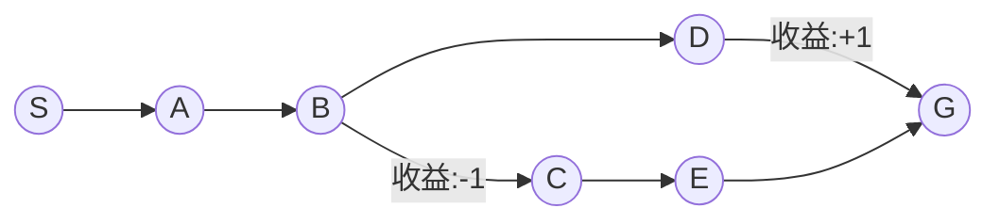

好的,我会严格按照您的要求,以《深度 Q-learning：在边缘计算中的应用》为题,撰写一篇专业的技术博客文章。下面是文章的完整正文部分:

# 深度 Q-learning：在边缘计算中的应用

关键词:深度强化学习、Q-learning、边缘计算、智能物联网、实时决策

## 1. 背景介绍 
### 1.1 问题的由来
随着物联网(Internet of Things, IoT)的快速发展,越来越多的智能设备被部署到网络的边缘。这些设备通常资源有限,难以承担复杂的计算任务。同时,很多IoT应用如自动驾驶、智能家居等对实时决策有很高的需求。因此,如何在边缘设备上实现高效的实时智能决策,成为了一个亟待解决的问题。

### 1.2 研究现状
近年来,强化学习(Reinforcement Learning, RL)特别是深度强化学习(Deep RL)在智能决策领域取得了显著成果。其中,Q-learning作为一种经典的值函数型方法,因其简单有效而被广泛研究。传统Q-learning使用表格(Q-table)存储动作价值,难以处理高维状态空间。为此,研究者提出了深度Q网络(Deep Q-Network, DQN)[1],用深度神经网络逼近动作价值函数,有效扩展了Q-learning的适用范围。此后,Double DQN[2]、Dueling DQN[3]等改进算法被相继提出,不断提升了DQN的性能。

### 1.3 研究意义
尽管DQN在云端服务器上已经取得了不错的效果,但在边缘计算场景下仍面临诸多挑战:1)边缘设备计算资源有限,难以承载庞大的DQN模型;2)IoT应用通常对延迟非常敏感,频繁的云边交互不可接受;3)原始的观测数据量巨大,上传至云端将带来巨大的网络负担。因此,亟需一种轻量化的DQN算法,能够直接在边缘设备上实现端到端的实时决策。本文旨在探索边缘计算友好的DQN改进方法,希望为IoT智能决策提供新的思路。

### 1.4 本文结构
本文后续结构安排如下:第2节介绍Q-learning的基本概念与DQN的核心思想;第3节重点阐述DQN的算法原理与具体步骤;第4节从理论层面探讨DQN的数学基础;第5节给出DQN在边缘计算中的代码实现示例;第6节讨论DQN在IoT领域的典型应用场景;第7节推荐一些学习DQN的工具与资源;第8节总结全文并展望未来;第9节列出一些常见问题解答。

## 2. 核心概念与联系
强化学习是一种重要的机器学习范式,旨在让智能体(agent)通过与环境的交互来学习最优决策。与监督学习不同,RL智能体无法直接获得标签数据,而是根据环境的反馈信号(奖励值)来不断调整策略。Q-learning是一种经典的无模型RL算法,用Q值(Q-value)来评估某状态下采取某动作的长期收益。Q-learning的核心是价值迭代(value iteration),通过更新Q值来逼近最优策略。

传统Q-learning采用查表法存储每个状态-动作对的Q值,当状态空间和动作空间很大时,存储和计算代价将变得难以承受。为解决这一问题,DQN引入深度神经网络作为Q函数的近似,将高维的状态映射到低维的隐空间表示。DQN的本质是价值函数逼近(value function approximation),即用参数化的函数族(如神经网络)来拟合真实的Q函数。通过最小化TD误差,DQN能够在连续状态空间中高效地学习近似最优策略。

## 3. 核心算法原理 & 具体操作步骤
### 3.1 算法原理概述
DQN的核心是Q-learning与深度学习的巧妙结合。一方面,DQN沿用Q-learning的价值迭代思想,通过时序差分(Temporal Difference, TD)学习来更新Q函数;另一方面,DQN用深度神经网络拟合Q函数,将原本的表格存储压缩为网络参数。此外,DQN还引入了经验回放(Experience Replay)和目标网络(Target Network)来提高训练稳定性。

DQN的目标是通过最小化TD误差来逼近最优Q函数Q*(s,a)。根据Bellman最优性方程,最优Q函数满足:
$$Q^*(s,a)=\mathbb{E}_{s'\sim P}[r+\gamma \max_{a'}Q^*(s',a')|s,a]$$

其中,s为当前状态,a为当前动作,r为即时奖励,s'为下一状态,γ为折扣因子。

DQN用函数Q(s,a;θ)来近似Q*(s,a),其中θ为网络参数。为了逼近Bellman最优性方程,DQN最小化如下损失函数:
$$L(\theta)=\mathbb{E}_{(s,a,r,s')\sim D}[(r+\gamma \max_{a'}Q(s',a';\theta^{-})-Q(s,a;\theta))^2]$$

其中,D为经验回放池,(s,a,r,s')为采样的四元组,θ-为目标网络参数。

### 3.2 算法步骤详解
DQN的主要步骤如下:
1. 随机初始化Q网络参数θ,并定期从θ复制给目标网络θ-;
2. 初始化经验回放池D;
3. 对每个episode循环:
   1) 初始化环境状态s;
   2) 对每个step循环:
      a. 根据ε-greedy策略选择动作a,即以ε的概率随机选择,否则选择Q(s,·;θ)最大的a;
      b. 执行动作a,观测奖励r和下一状态s',并存储(s,a,r,s')至D;
      c. 从D中随机采样小批量数据(s_i,a_i,r_i,s'_i);
      d. 计算目标值y_i=r_i+γ*max(a')Q(s'_i,a';θ-);
      e. 最小化损失L(θ)=(y_i-Q(s_i,a_i;θ))^2,并更新Q网络参数θ;
      f. 每C步同步目标网络θ-←θ;
      g. s←s';
   3) 降低探索率ε;
4. 输出训练好的策略π(s)=argmax(a)Q(s,a;θ)。

### 3.3 算法优缺点
DQN的主要优点有:
1. 采用深度神经网络作为Q函数逼近器,可以处理大规模状态空间;
2. 引入经验回放,打破了数据的相关性,提高了样本利用率;
3. 使用目标网络,缓解了训练不稳定的问题。

DQN的缺点包括:
1. Q值估计存在高估偏差(overestimation bias),特别是在奖励稀疏的环境中;
2. 需要大量的训练数据和计算资源,模型规模庞大,不适合资源受限的场景;
3. 探索策略简单,容易陷入局部最优。

### 3.4 算法应用领域
DQN及其变体在许多领域取得了不错的效果,例如:
- 游戏:DQN在Atari 2600游戏中达到了超人类的水平[1];
- 机器人控制:DQN用于机械臂抓取[4]、四足机器人运动规划[5]等;
- 无线通信:DQN用于动态信道分配[6]、能量管理[7]等;
- 推荐系统:DQN用于在线推荐[8]、广告投放[9]等。

## 4. 数学模型和公式 & 详细讲解 & 举例说明
### 4.1 数学模型构建
马尔可夫决策过程(Markov Decision Process, MDP)为强化学习提供了理论基础。一个MDP由四元组(S,A,P,R)定义:
- 状态空间S:所有可能的环境状态集合;
- 动作空间A:智能体在每个状态下可采取的动作集合;
- 转移概率P:状态转移的条件概率分布,P(s'|s,a)表示在状态s下执行动作a后转移到状态s'的概率;
- 奖励函数R:在状态s下采取动作a后获得的即时奖励。

MDP的目标是寻找一个最优策略π*,使得长期累积奖励最大化:
$$\pi^*=\arg\max_{\pi}\mathbb{E}[\sum_{t=0}^{\infty}\gamma^t r_t|\pi]$$

其中,r_t为t时刻获得的奖励,γ为折扣因子。

Q-learning 是一种基于值函数(value function)的无模型RL方法。Q函数Q(s,a)表示在状态s下采取动作a的期望长期奖励:
$$Q(s,a)=\mathbb{E}[\sum_{t=0}^{\infty}\gamma^t r_t|s_0=s,a_0=a,\pi]$$

根据Bellman方程,Q函数满足如下迭代关系:
$$Q(s,a)=\mathbb{E}_{s'\sim P}[r+\gamma \max_{a'}Q(s',a')|s,a]$$

Q-learning的目标是通过不断更新Q值来逼近最优Q函数Q*,进而得到最优策略π*。

### 4.2 公式推导过程
DQN在Q-learning的基础上引入深度神经网络Q(s,a;θ)来拟合Q函数,其中θ为网络参数。为了逼近Bellman最优性方程,DQN最小化均方TD误差:
$$L(\theta)=\mathbb{E}_{(s,a,r,s')\sim D}[(r+\gamma \max_{a'}Q(s',a';\theta^{-})-Q(s,a;\theta))^2]$$

令y=r+γ*max(a')Q(s',a';θ-),则损失函数可简化为:
$$L(\theta)=\mathbb{E}_{(s,a,r,s')\sim D}[(y-Q(s,a;\theta))^2]$$

对损失函数求导,可得梯度:
$$\nabla_{\theta}L(\theta)=\mathbb{E}_{(s,a,r,s')\sim D}[(y-Q(s,a;\theta))\nabla_{\theta}Q(s,a;\theta)]$$

然后,用随机梯度下降法更新参数θ:
$$\theta \leftarrow \theta+\alpha (y-Q(s,a;\theta))\nabla_{\theta}Q(s,a;\theta)$$

其中,α为学习率。重复以上过程,直至Q网络收敛。

### 4.3 案例分析与讲解
下面我们以一个简单的迷宫环境为例,说明DQN的工作原理。如图1所示,智能体的目标是从起点S走到终点G,同时避开障碍物。

图1 迷宫环境示意图

状态空间S={S,A,B,C,D,E,G},动作空间A={上,下,左,右}。每走一步奖励-0.01,撞墙奖励-1,到达G奖励+1。
假设折扣因子γ=0.9,学习率α=0.1,则DQN的训练过程如下:
1. 随机初始化Q网络参数θ;
2. 初始化经验回放池D;
3. 设置初始状态s=S;
4. 在状态s下,根据ε-greedy策略选择动作a=右;
5. 执行动作后,观测到新状态s'=A,奖励r=-0.01,并存储(S,右,-0.01,A)至D;
6. 从D中采样一个批量,计算目标值y=r+γ*max(a')Q(s',a';θ-),并最小化损失(y-Q(s,a;θ))^2;
7. 更新参数θ,并将s=A;
8. 重复4-7直至s=G;
9. 重复3-8,直至Q网络收敛。

训练完成后,智能体的最优策略为:
- 在S时向右走,
- 在A、B时向下走,
- 在C、D、E时向右走。

### 4.4 常见问题解答
**Q: DQN能否处理连续动作空间?**
A: 原始DQN假设动作空间是离散的,每个动作对应一个输出单元。对于