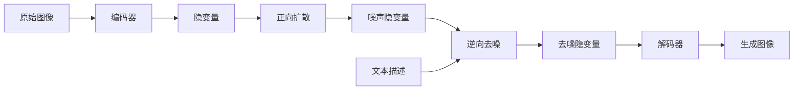

# 潜在扩散模型Latent Diffusion Model原理与代码实例讲解

作者：禅与计算机程序设计艺术 / Zen and the Art of Computer Programming 

关键词：潜在扩散模型, Latent Diffusion Model, 生成模型, 深度学习, 图像生成, 文本到图像生成

## 1. 背景介绍
### 1.1 问题的由来
随着人工智能技术的飞速发展,特别是深度学习的崛起,生成模型在计算机视觉、自然语言处理等领域取得了突破性进展。生成模型旨在学习数据分布,从而能够生成与训练数据相似的新样本。其中,图像生成是一个极具挑战性的任务,传统方法难以生成高质量、多样化的逼真图像。
### 1.2 研究现状
近年来,各种生成模型如VAE[1]、GAN[2]、Diffusion Model[3]等被提出并取得了瞩目成果。其中,Diffusion Model凭借其稳定的训练过程和优异的生成效果受到了广泛关注。基于此,一系列Diffusion Model变体被提出,如DDPM[4]、DDIM[5]等。最近,Latent Diffusion Model(LDM)[6]作为一种全新的Diffusion Model范式脱颖而出,在文本到图像生成任务上取得了惊艳的效果。
### 1.3 研究意义
Latent Diffusion Model为高质量图像生成开辟了新的思路。一方面,它继承了Diffusion Model稳定训练、生成多样性好的优点;另一方面,它将扩散过程定义在图像的低维隐空间,大幅提升了生成效率。此外,LDM可以与CLIP[7]等图文对齐模型结合,实现了从文本描述生成相关图像。这为计算机创意设计、辅助内容创作等应用带来了无限可能。
### 1.4 本文结构 
本文将全面解析Latent Diffusion Model的原理、算法、实现及应用。第2部分介绍LDM的核心概念;第3部分阐述LDM的算法原理与步骤;第4部分给出LDM的数学模型与公式推导;第5部分提供LDM的代码实例与详解;第6部分展望LDM的应用场景;第7部分推荐LDM相关工具和学习资源;第8部分总结全文并展望未来;第9部分列举常见问题解答。

## 2. 核心概念与联系
Latent Diffusion Model的核心概念包括:

- **潜在空间(Latent Space)**: 通过自编码器将高维图像编码到低维隐空间,隐空间中的每个点对应原始图像空间中的一张图像。
- **正向扩散过程(Forward Diffusion Process)**: 通过逐步添加高斯噪声,将数据分布逐渐扰动到易于采样的先验分布(如标准高斯分布)。
- **逆向去噪过程(Reverse Denoising Process)**: 从先验分布出发,通过逐步去噪,最终恢复到数据分布,生成高质量样本。
- **自编码器(Autoencoder)**: 由编码器和解码器组成,用于图像和隐空间的双向映射。其中,编码器将图像映射到隐空间,解码器将隐变量重建为图像。
- **UNet模型**: 一种U型编码器-解码器网络,在LDM中用于对隐变量进行去噪。

LDM采用自编码器将图像压缩到隐空间,然后在隐空间中进行扩散过程。这样不仅降低了计算复杂度,还能通过修改隐变量来控制生成图像的属性。正向扩散过程逐步破坏数据结构,逆向去噪过程利用神经网络逐步恢复数据分布,最终得到高质量的生成图像。

## 3. 核心算法原理 & 具体操作步骤
### 3.1 算法原理概述
Latent Diffusion Model的核心思想是:将扩散模型和自编码器结合,在隐空间中对图像进行建模生成。首先,利用自编码器对图像进行降维,得到对应的隐变量。然后,对隐变量进行扩散造噪和逆向去噪。最后,用解码器将最终的隐变量重建为高质量图像。
### 3.2 算法步骤详解
1. **自编码器训练**: 在图像数据集上训练自编码器,使其能够在编码器-解码器之间重建图像。将训练好的编码器用于后续步骤。
2. **正向扩散过程**: 根据扩散步数T,构建从原始数据分布到先验分布的扩散链。每一步通过添加高斯噪声,逐渐增加图像的随机性。 
3. **逆向去噪过程**: 从先验分布采样隐变量,然后通过T步去噪过程逐步恢复原始数据分布。每一步去噪通过神经网络预测噪声,并从隐变量中减去该噪声。
4. **图像重建**: 使用解码器将最终的隐变量重建为图像。重建图像即为LDM的生成结果。
5. **条件生成(可选)**: 引入条件信息(如文本描述),指导LDM生成与条件相关的图像。可通过将条件编码为向量,与隐变量拼接作为去噪模型的输入。

以下是LDM的总体流程图:



### 3.3 算法优缺点
- 优点:
    - 生成质量高,图像清晰逼真
    - 支持从文本描述生成相关图像
    - 训练稳定,不易发生模式崩溃
    - 隐空间操作灵活,可控制生成图像的属性
- 缺点:  
    - 推理速度慢,生成一张图像需要多步去噪
    - 隐空间抽象能力有限,难以生成高度复杂、细节丰富的图像
    - 需要大规模高质量图文对数据进行训练

### 3.4 算法应用领域
- 艺术设计:根据文本提示自动生成插图、概念设计图、创意海报等
- 游戏开发:生成游戏场景、人物形象、物品贴图等
- 虚拟试衣:根据文本描述生成人物形象wearing特定服饰
- 图像编辑:通过编辑隐变量实现图像的风格转换、属性修改等

## 4. 数学模型和公式 & 详细讲解 & 举例说明
### 4.1 数学模型构建
Latent Diffusion Model的数学模型主要包括三部分:自编码器、正向扩散过程和逆向去噪过程。

**自编码器:**  
给定图像 $x\in \mathbb{R}^{H\times W\times 3}$,自编码器将其编码为隐变量 $z=E(x), z\in \mathbb{R}^{h\times w\times c}$,其中 $H、W$ 为图像高宽, $h、w、c$ 为隐变量的高、宽、通道数,且 $h<H, w<W$。再经过解码器重建为 $\hat{x}=D(z)$,重建目标是最小化重建误差:

$$\mathcal{L}_{recon} = \mathbb{E}_{x\sim q(x)}[\|x - D(E(x))\|_2^2]$$

其中 $q(x)$ 为真实图像分布。

**正向扩散过程:**
定义扩散过程为一系列逐渐添加高斯噪声的马尔可夫链:

$$q(z_t|z_{t-1}) = \mathcal{N}(z_t; \sqrt{1-\beta_t} z_{t-1}, \beta_t \mathbf{I})$$

其中 $\beta_t \in (0,1)$ 是噪声强度系数,满足 $0<\beta_1<\beta_2<\cdots<\beta_T<1$。扩散过程从真实数据分布 $q(z_0)$ 出发,经过T步添加噪声,得到近似于标准高斯分布的 $q(z_T)$。

**逆向去噪过程:**
逆向去噪过程从先验分布 $p(z_T)=\mathcal{N}(\mathbf{0}, \mathbf{I})$ 出发,经过T步去噪,最终得到生成数据分布 $p(z_0)$。每一步去噪通过神经网络 $\epsilon_\theta$ 预测当前步的噪声:

$$z_{t-1} = \frac{1}{\sqrt{\alpha_t}} \Big(z_t - \frac{\beta_t}{\sqrt{1-\bar{\alpha}_t}} \epsilon_\theta(z_t, t)\Big) + \sigma_t \xi$$

其中 $\alpha_t=1-\beta_t, \bar{\alpha}_t=\prod_{i=1}^t \alpha_i$, $\xi$ 是从标准高斯分布采样的随机噪声。去噪网络 $\epsilon_\theta$ 的训练目标是最小化噪声估计误差:

$$\mathcal{L}_{diffuse} = \mathbb{E}_{z_0,\epsilon\sim\mathcal{N}(\mathbf{0},\mathbf{I}), t}\Big[ \| \epsilon - \epsilon_\theta(\sqrt{\bar{\alpha}_t} z_0 + \sqrt{1-\bar{\alpha}_t} \epsilon, t) \|_2^2 \Big]$$

### 4.2 公式推导过程
**重参数化采样:**
为了实现从任意时刻 $t$ 采样 $z_t$,可以利用重参数化技巧,将 $z_t$ 表示为 $z_0$ 和噪声 $\epsilon$ 的线性组合:

$$z_t = \sqrt{\bar{\alpha}_t} z_0 + \sqrt{1-\bar{\alpha}_t} \epsilon$$

其中 $\epsilon\sim\mathcal{N}(\mathbf{0},\mathbf{I})$。这样,训练时只需从真实数据分布 $q(z_0)$ 和噪声先验分布采样,就可以得到任意时刻的 $z_t$。

**去噪步骤推导:**
由贝叶斯法则可知:

$$q(z_{t-1}|z_t) = \frac{q(z_t|z_{t-1})p(z_{t-1})}{p(z_t)}$$

假设 $p(z_t)=\mathcal{N}(z_t; \mathbf{0}, \mathbf{I})$,且 $p(z_{t-1}|z_t)=\mathcal{N}(z_{t-1}; \mu_\theta(z_t,t), \sigma_t^2\mathbf{I})$,其中均值 $\mu_\theta(z_t,t)$ 由神经网络参数化。代入贝叶斯公式,并利用高斯分布的性质,可得:

$$\begin{aligned}
\mu_\theta(z_t,t) &= \frac{1}{\sqrt{\alpha_t}} \Big(z_t - \frac{\beta_t}{\sqrt{1-\bar{\alpha}_t}} \epsilon_\theta(z_t, t)\Big) \\
\sigma_t^2 &= \frac{1-\bar{\alpha}_{t-1}}{1-\bar{\alpha}_t} \beta_t
\end{aligned}$$

因此,去噪过程的每一步可表示为:

$$z_{t-1} = \mu_\theta(z_t,t) + \sigma_t \xi$$

其中 $\xi\sim\mathcal{N}(\mathbf{0},\mathbf{I})$。将 $\mu_\theta(z_t,t)$ 代入即得到去噪步骤的更新公式。

### 4.3 案例分析与讲解
下面以一个简单的二维高斯分布为例,直观演示LDM的扩散和去噪过程。

假设真实数据分布为 $z_0\sim\mathcal{N}(\mu, \Sigma)$,其中:

$$\mu=\begin{bmatrix} 1 \\ 2 \end{bmatrix}, \Sigma=\begin{bmatrix} 1 & 0 \\ 0 & 2 \end{bmatrix}$$

扩散过程中,每一步添加的高斯噪声为:

$$\beta_t=\frac{t}{T}, t=1,2,\cdots,T$$

经过T=100步扩散后,数据分布演变如下:

```python
import numpy as np
import matplotlib.pyplot as plt

# 真实数据分布参数
mu = np.array([1, 2])
Sigma = np.array([[1, 0], [0, 2]])

# 扩散过程参数
T = 100
beta = np.linspace(