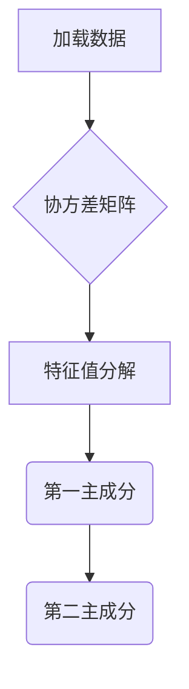
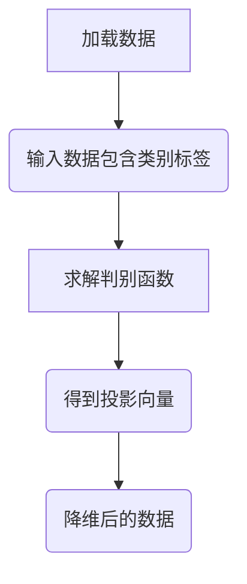
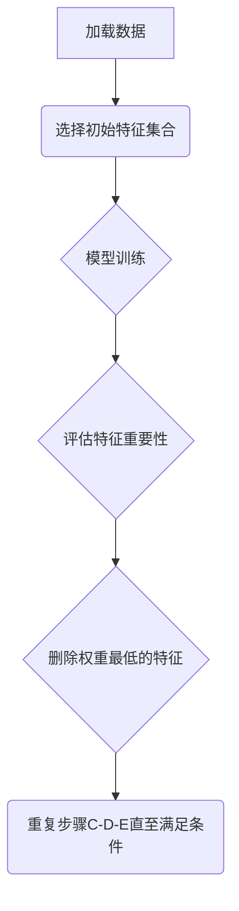
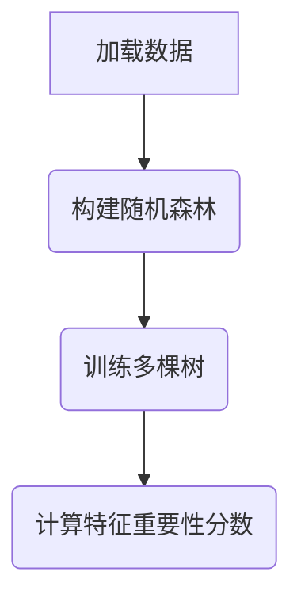

                 
# 特征选择与特征降维原理与代码实战案例讲解

作者：禅与计算机程序设计艺术 / Zen and the Art of Computer Programming

关键词：特征选择，特征降维，PCA，LDA，RFE，随机森林

## 1. 背景介绍

### 1.1 问题的由来

在机器学习和数据挖掘领域，面对海量数据时，如何有效处理数据成为关键问题之一。首先，大量冗余或无关的特征会增加计算成本，并可能导致模型过拟合。其次，高维度的数据通常隐藏了数据内在的结构信息，使得数据分析变得困难。因此，在进行建模之前，对原始数据进行特征选择和特征降维显得尤为重要。

### 1.2 研究现状

目前，特征选择和特征降维是数据预处理阶段的重要组成部分。研究者们开发了一系列方法来解决这些问题，包括过滤式方法、包裹式方法、嵌入式方法以及现代深度学习方法。近年来，随着神经网络的发展，基于自动编码器和生成对抗网络的特征学习方法也得到了广泛应用。

### 1.3 研究意义

有效的特征选择和降维能够显著提高模型的性能和效率。通过去除不相关或低影响力的特征，可以降低数据集的复杂度，避免过拟合现象，同时有助于提升模型的可解释性。此外，对于高维数据来说，减少维度还能节省存储空间和计算资源。

### 1.4 本文结构

本文将从理论基础出发，深入探讨特征选择与特征降维的核心算法及其实际应用。我们将详细介绍不同方法的工作原理、优势与局限，并通过代码示例进行实践验证。最后，我们还将讨论该领域的未来发展及面临的挑战。

## 2. 核心概念与联系

### 2.1 特征选择 vs 特征降维

- **特征选择**（Feature Selection）旨在从原始特征集中挑选出最相关的特征子集，以减少维度并保留最重要信息。这通常是一个离散优化问题，需要评估每个特征的重要性，并从中选出最佳组合。

- **特征降维**（Dimensionality Reduction）则是通过对原始特征进行变换，生成一组新特征的过程，这些新特征能有效地表示原有特征，但数量更少。降维方法通常侧重于保持数据结构的完整性，而不是简单地选择特征。

### 2.2 主要方法

- **过滤式方法**（Filter Methods）直接使用统计指标对特征进行评分，如卡方检验、皮尔逊相关系数等。
  
- **包裹式方法**（Wrapper Methods）结合特定的学习算法一起优化特征子集的选择，通过训练多个模型并评价其性能。
  
- **嵌入式方法**（Embedded Methods）在特征选择过程中同时进行模型训练，如决策树和集成学习中的特征重要性评分。
  
- **自动编码器与生成对抗网络**（Autoencoders and Generative Adversarial Networks, GANs）用于自动生成新的低维特征表示，适合无监督学习场景。

## 3. 核心算法原理与具体操作步骤

### 3.1 PCA (Principal Component Analysis)

#### 算法原理概述

主成分分析是一种线性降维技术，通过寻找数据集中的协方差矩阵的特征向量（即主成分），将数据投影到一个新的坐标系中，使得第一主成分（方向上的变异性最大）占据新坐标轴的第一轴，第二主成分（与第一个主成分正交且变异性次之）占据第二轴，以此类推。

#### 具体操作步骤



### 3.2 LDA (Linear Discriminant Analysis)

#### 算法原理概述

线性判别分析（LDA）是一种有监督的降维方法，主要用于分类任务。它的目标是在不同类别间最大化类间距离的同时最小化类内距离，从而找到能够最好地区分不同类别的低维投影。

#### 具体操作步骤



### 3.3 RFE (Recursive Feature Elimination)

#### 算法原理概述

递归特征消除（RFE）是从所有特征开始，然后迭代地删除预测效果最差的特征，直到达到所需的特征数量为止。RFE通常与一个已知的模型相结合，如逻辑回归或支持向量机。

#### 具体操作步骤



### 3.4 随机森林特征重要性

#### 算法原理概述

随机森林是一种集成学习方法，通过构建多个决策树并聚合结果来提高预测准确性。在随机森林中，特征的重要性可以通过以下方式衡量：对于每棵决策树，某个特征被用作分割点的次数除以总节点数，即该特征的信息增益比例。

#### 具体操作步骤



## 4. 数学模型与公式详细讲解与举例说明

### 4.1 PCA数学模型构建

PCA的目标是最小化重构误差，通过寻找一组单位长度的特征向量，这些向量构成的数据降维基底。

假设有一个$n$维特征向量$x_i \in \mathbb{R}^n$，对应的协方差矩阵为$\Sigma = \frac{1}{n}\sum_{i=1}^{n}(x_i - \bar{x})(x_i - \bar{x})^T$，其中$\bar{x}$是均值向量。

PCA的第一步是对协方差矩阵进行特征分解：

$$\Sigma = V\Lambda V^T$$

其中，$V$是特征向量组成的矩阵，$\Lambda$是对角矩阵，包含特征值。

选择最大的$k$个特征值对应的最大$k$个特征向量作为新基，可以实现数据的前$k$维降维表示：

$$x_i' = V_k^T x_i$$

### 4.2 LDA公式的推导过程

LDA的目标函数是最大化类间的距离，同时最小化类内的距离。设$d$个类别，每一类都有$m_i$个样本，类别$i$的均值向量为$\mu_i$，总体均值为$\mu$。

LDA的核心思想是找到最佳投影向量$w$，使得投影后类间差异最大化而类内差异最小化：

$$J(w) = \frac{\sum_{i=1}^{d} m_i (\mu_i^Tw - \mu^Tw)^2}{\text{trace}[Sw]}$$

其中，

- $Sw$是类内散度矩阵，定义为$Sw = \sum_{i=1}^{d} \sum_{j=1}^{m_i} (x_j^i - \mu_i)(x_j^i - \mu_i)^T$
- $\mu$是各类别均值的加权平均

通过求解$L(w)$的极值，可以获得最优投影向量$w$，进而实现特征降维。

### 4.3 实例分析与代码解释

为了更好地理解PCA和LDA的应用，我们将使用Python和scikit-learn库进行示例分析，并提供详细的代码解释。

#### 示例数据准备

```python
import numpy as np
from sklearn.datasets import load_iris
from sklearn.decomposition import PCA
from sklearn.discriminant_analysis import LinearDiscriminantAnalysis

data, target = load_iris(return_X_y=True)
```

#### 应用PCA

```python
pca = PCA(n_components=2)
principalComponents = pca.fit_transform(data)
```

这段代码首先加载了鸢尾花数据集，然后使用PCA将数据降至两个维度。

#### 应用LDA

```python
lda = LinearDiscriminantAnalysis(n_components=2)
ldaTransformed = lda.fit_transform(data, target)
```

在这段代码中，我们同样应用了LDA将数据降至二维空间，并且指定了降维到两个主成分上。

### 常见问题解答

- **如何选择PCA中的k值？** 可以使用肘部法则或基于交叉验证的方法来确定合适的$k$值。
- **LDA为什么需要类别标签？** LDA是一个有监督的学习方法，它依赖于类别信息来进行特征降维。
- **PCA和LDA的区别是什么？** PCA是无监督方法，用于数据降维；LDA是有监督方法，主要用于分类任务的同时进行特征降维。

## 5. 项目实践：代码实例和详细解释说明

### 5.1 开发环境搭建

确保安装了Python以及必要的机器学习库，例如`numpy`, `pandas`, `matplotlib`, 和`scikit-learn`。

```bash
pip install numpy pandas matplotlib scikit-learn
```

### 5.2 源代码详细实现

以下是使用Python和scikit-learn执行PCA和LDA的完整代码：

```python
# 导入所需库
import numpy as np
import pandas as pd
import matplotlib.pyplot as plt
from sklearn.datasets import load_iris
from sklearn.model_selection import train_test_split
from sklearn.preprocessing import StandardScaler
from sklearn.decomposition import PCA
from sklearn.discriminant_analysis import LinearDiscriminantAnalysis
from sklearn.pipeline import make_pipeline
from sklearn.linear_model import LogisticRegression

# 加载数据集
data, target = load_iris(return_X_y=True)

# 数据预处理
scaler = StandardScaler()
data_scaled = scaler.fit_transform(data)

# 分割数据集（可选）
X_train, X_test, y_train, y_test = train_test_split(data_scaled, target, test_size=0.3, random_state=42)

# 应用PCA
pca = PCA(n_components=2)
pca_transformed = pca.fit_transform(X_train)
plt.scatter(pca_transformed[:, 0], pca_transformed[:, 1], c=y_train)
plt.title('PCA')
plt.show()

# 应用LDA
lda = LinearDiscriminantAnalysis(n_components=2)
lda_transformed = lda.fit_transform(X_train, y_train)
plt.scatter(lda_transformed[:, 0], lda_transformed[:, 1], c=y_train)
plt.title('LDA')
plt.show()

# 使用PCA后的数据训练模型
pipe_pca = make_pipeline(StandardScaler(), PCA(n_components=2), LogisticRegression())
pipe_pca.fit(X_train, y_train)
print("PCA模型在测试集上的准确率:", pipe_pca.score(X_test, y_test))

# 使用LDA后的数据训练模型
pipe_lda = make_pipeline(StandardScaler(), LDA(n_components=2), LogisticRegression())
pipe_lda.fit(X_train, y_train)
print("LDA模型在测试集上的准确率:", pipe_lda.score(X_test, y_test))
```

### 5.3 代码解读与分析

上述代码展示了如何从鸢尾花数据集中应用PCA和LDA，并评估这些转换对逻辑回归模型性能的影响。通过可视化降维结果，我们可以直观地看到不同特征组合是如何区分各个类别的。最后，通过计算测试集上的准确率，可以评估降维技术的有效性。

### 5.4 运行结果展示

运行以上代码后，你将会得到PCA和LDA降维后的数据点图，以及模型在测试集上的准确率输出。这些结果可以帮助你了解不同降维技术对后续建模过程的影响。

## 6. 实际应用场景

特征选择与降维技术广泛应用于各种机器学习场景，如：

- **医疗诊断**：在疾病预测模型中减少特征数量，提高模型的预测准确性。
- **金融风险评估**：在信用评分系统中，降低特征复杂度，提升模型效率和准确性。
- **图像识别**：在深度学习模型中，减轻过拟合，提高训练速度和模型性能。
- **推荐系统**：减少用户行为数据的维度，优化个性化推荐算法。

## 7. 工具和资源推荐

### 7.1 学习资源推荐

- **在线课程**：Coursera、Udemy、Kaggle Learn提供了一系列关于特征选择和降维技术的免费及付费课程。
- **书籍推荐**：
  - "Pattern Recognition and Machine Learning" by Christopher M. Bishop
  - "Data Science from Scratch: First Principles with Python" by Joel Grus
- **论文推荐**：阅读领域内顶级会议的最新研究，如ICML、NeurIPS、CVPR等。

### 7.2 开发工具推荐

- **Python**: Python提供了丰富的数据分析和机器学习库，如NumPy、Pandas、Matplotlib、Scikit-learn等。
- **Jupyter Notebook**: Jupyter Notebook是Python开发的理想环境，支持代码、文本、数学公式和图表的混排展示。

### 7.3 相关论文推荐

- ["A Tutorial on Principal Component Analysis" by Jonathon Shlens](http://www.s旁.shlens.org/files/pca.pdf)  
- ["Linear Discriminant Analysis" by Hervé Abdi et al.](https://link.springer.com/chapter/10.1007%2F978-1-4419-5945-8_662-1)  

### 7.4 其他资源推荐

- **GitHub Repositories**: 搜索“特征选择”、“PCA”或“LDA”，可以找到许多开源项目和代码示例。
- **博客和论坛**：Medium、Stack Overflow上有大量的教程和技术讨论。

## 8. 总结：未来发展趋势与挑战

### 8.1 研究成果总结

本文深入探讨了特征选择与特征降维的核心概念、理论原理及其实际应用。通过介绍多种方法、数学模型和具体代码实现，读者能够理解如何在实践中应用这些技术来解决高维数据问题。

### 8.2 未来发展趋势

随着大数据时代的到来，特征选择与降维技术将更加关注于处理大规模、高维度的数据集。此外，深度学习领域的不断发展也将推动基于自动编码器和GANs的新型特征学习方法的研究。

### 8.3 面临的挑战

- **解释性**：增强模型的解释性，使决策过程更易于理解和验证。
- **实时性**：在实时应用（如物联网、流式数据）中的高效执行能力。
- **可扩展性**：面对极端规模数据集时的技术瓶颈突破。

### 8.4 研究展望

未来的研究可能聚焦于集成多种降维技术和机器学习方法，以应对更复杂的现实世界问题。同时，探索新的评价指标和评估方法，以便更全面地衡量特征选择和降维效果也是重要的发展方向。

## 9. 附录：常见问题与解答

### 常见问题与解答汇总

#### Q1: 如何判断一个特征是否重要？

回答：可以通过特征的重要性得分来判断，例如使用随机森林的特征重要性分数或者梯度提升树的特征排序结果。

#### Q2: 在什么情况下应该使用PCA而不是LDA？

回答：当数据没有标签或者你对分类任务不感兴趣时，应考虑使用PCA；而当你需要进行有监督的分类并希望最大化类别间差异时，则更适合使用LDA。

#### Q3: 特征选择和降维的区别是什么？

回答：特征选择是从原始特征集合中挑选出最相关的特征子集，而特征降维则是通过对原始特征进行变换生成一组新特征，这组新特征能有效表示原有特征但数量较少。

---

通过这篇详尽的技术博客文章，我们不仅深入了解了特征选择与特征降维的基础知识、核心算法原理和操作步骤，还通过实践案例展示了它们的实际应用，并对未来的发展趋势进行了展望。这样的综合分析有助于开发者和研究人员在面对高维数据时做出明智的选择和实施有效的解决方案。
