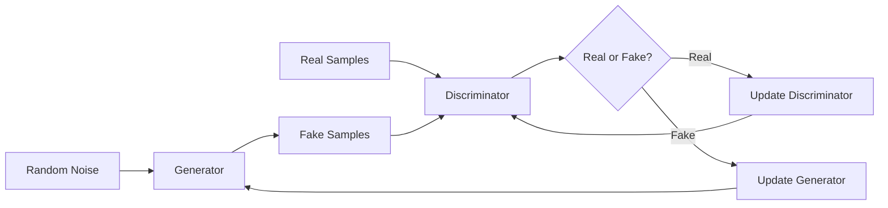

生成对抗网络 (GAN)

作者：禅与计算机程序设计艺术 / Zen and the Art of Computer Programming 

关键词：生成对抗网络、深度学习、无监督学习、图像生成、风格迁移

## 1. 背景介绍

### 1.1 问题的由来
随着深度学习的快速发展,生成模型逐渐成为人工智能领域的研究热点。传统的生成模型如变分自编码器(VAE)虽然能生成较为逼真的图像,但生成图像的清晰度和多样性仍有待提高。如何设计一种能生成高质量、多样化图像的生成模型,成为了一个亟待解决的问题。

### 1.2 研究现状
2014年,Ian Goodfellow等人提出了生成对抗网络(Generative Adversarial Networks, GAN)的概念。与传统的生成模型不同,GAN通过引入对抗学习的思想,巧妙地将生成问题转化为一个二人零和博弈问题。GAN由生成器和判别器两部分组成,生成器负责生成尽可能逼真的样本以欺骗判别器,而判别器则要尽可能分辨出真实样本和生成样本。通过生成器和判别器的反复博弈,最终使生成器能生成与真实数据分布一致的样本。

GAN的提出掀起了生成模型研究的热潮,大量GAN的变体被相继提出,如CGAN、DCGAN、InfoGAN、CycleGAN等,并在图像生成、图像翻译、语音合成、视频预测等领域取得了瞩目成就。尤其是在高清图像生成方面,StyleGAN、BigGAN等模型实现了前所未有的高分辨率、高质量和高多样性。

### 1.3 研究意义
GAN作为一种革命性的生成模型范式,其研究意义主要体现在以下几个方面:

1. 开辟了一条全新的生成模型研究思路。GAN巧妙地将生成问题转化为博弈问题,避免了显式地定义和优化生成数据的概率分布,为生成模型的设计提供了新的思路。 

2. 极大地提升了生成模型的性能。得益于对抗学习机制,GAN生成的图像在真实性和多样性上远超传统方法,使高质量图像生成成为可能。

3. 拓宽了生成模型的应用场景。GAN不仅可用于图像生成,在语音、视频、文本等领域也展现出了巨大的应用潜力,为多模态生成任务带来了新的解决方案。

4. 推动了相关研究领域的进步。GAN将博弈论与深度学习结合,促进了多个交叉学科的研究,如对抗样本、对抗攻防等,为机器学习的安全和鲁棒性问题提供了新的视角。

### 1.4 本文结构
本文将全面介绍生成对抗网络的原理和应用。第2部分阐述GAN的核心概念;第3部分详细讲解GAN的算法原理;第4部分给出GAN的数学模型和公式推导;第5部分通过代码实例演示GAN的实现;第6部分介绍GAN的主要应用场景;第7部分推荐GAN相关的学习资源;第8部分总结全文并展望GAN的未来研究方向;第9部分为常见问题解答。

## 2. 核心概念与联系

生成对抗网络的核心概念包括:

- 生成器(Generator):用于生成尽可能逼真的假样本。生成器通常由随机噪声向量映射到数据空间,试图学习真实数据的分布。

- 判别器(Discriminator):用于判别输入的样本是来自真实数据还是生成器。判别器的目标是最大化正确区分真假样本的概率。

- 对抗学习(Adversarial Learning):生成器和判别器互为对手,在训练过程中不断博弈,最终达到纳什均衡,生成器生成的样本无限接近真实样本分布。

- 损失函数:GAN的目标函数可以表示为一个极小极大博弈问题,生成器和判别器分别最小化和最大化该目标函数,以此来指导模型学习。

下图展示了GAN的基本结构和工作流程:

生成器从随机噪声生成假样本,然后与真实样本一起输入判别器。判别器判断每个样本的真假,并据此计算损失函数更新自身参数。同时,判别器的输出也作为生成器的损失函数,指导生成器生成更加逼真的样本。通过两个网络的反复博弈,最终使生成样本无限逼近真实样本。

GAN中生成器和判别器的具体实现通常采用多层感知机或卷积神经网络,它们分别被训练以最小化和最大化如下损失函数:

$$
\min_G \max_D V(D,G) = \mathbb{E}_{x \sim p_{data}(x)}[\log D(x)] + \mathbb{E}_{z \sim p_z(z)}[\log (1 - D(G(z)))]
$$

其中,$x$表示真实样本,$z$表示随机噪声,$p_{data}$和$p_z$分别表示真实数据和噪声的分布,$G(z)$表示生成器生成的假样本,$D(x)$表示判别器输出的样本为真的概率。

生成器和判别器通过交替地优化上述两个目标,最终达到全局最优,此时判别器无法区分真实样本和生成样本。

## 3. 核心算法原理 & 具体操作步骤

### 3.1 算法原理概述
GAN的核心思想是让两个神经网络相互博弈,通过竞争学习来进行训练。具体而言:

1. 生成器接收一个随机噪声向量作为输入,将其映射到数据空间,生成与真实数据尽可能相似的假样本。

2. 判别器接收真实样本和生成样本,输出每个样本为真实样本的概率。它的目标是最大化正确区分真假样本的概率。

3. 生成器和判别器通过最小最大博弈来优化目标函数。判别器尽量最大化真假样本的区分度,而生成器尽量最小化其生成样本被判别器识破的概率。

4. 随着训练的进行,生成器生成的样本越来越逼真,判别器的判别能力也越来越强。最终两者达到一个动态平衡,生成器生成的样本与真实样本几乎一致。

### 3.2 算法步骤详解
输入:
- 真实数据集$X$
- 随机噪声$Z$的概率分布$p_z(z)$
- 生成器$G$和判别器$D$的初始参数$\theta_g$和$\theta_d$
- 训练迭代次数$N$

输出:
- 训练后的生成器$G$和判别器$D$

算法步骤:
1. 初始化生成器$G$和判别器$D$的参数$\theta_g$和$\theta_d$

2. 重复以下步骤$N$次:

   a) 从真实数据集$X$中采样一批真实样本$\{x^{(1)}, \ldots, x^{(m)}\}$
   
   b) 从先验分布$p_z(z)$中采样一批随机噪声$\{z^{(1)}, \ldots, z^{(m)}\}$
   
   c) 利用生成器$G$生成一批假样本$\{\tilde{x}^{(1)}, \ldots, \tilde{x}^{(m)}\}$,其中$\tilde{x}^{(i)} = G(z^{(i)})$
   
   d) 利用真实样本和生成样本训练判别器$D$,最大化目标函数:
      $$\max_{\theta_d} \frac{1}{m} \sum_{i=1}^m [\log D(x^{(i)}) + \log (1 - D(\tilde{x}^{(i)}))]$$
      
   e) 利用随机噪声生成一批假样本$\{\tilde{x}^{(1)}, \ldots, \tilde{x}^{(m)}\}$
   
   f) 利用生成的假样本训练生成器$G$,最小化目标函数:
      $$\min_{\theta_g} \frac{1}{m} \sum_{i=1}^m \log (1 - D(G(z^{(i)})))$$
      
3. 输出训练后的生成器$G$和判别器$D$

### 3.3 算法优缺点
GAN的主要优点包括:

1. 通过对抗学习机制,生成高质量、细节丰富的样本
2. 避免了显式定义和优化生成数据的概率分布,具有更强的建模能力
3. 可以应用于多种数据类型和任务,具有很好的通用性和扩展性
4. 理论上具有纳什均衡解,保证了算法的收敛性

GAN的主要缺点包括:

1. GAN的训练过程不稳定,容易出现梯度消失、模式崩溃等问题
2. 生成器和判别器的平衡难以控制,容易导致训练震荡
3. 对超参数和网络结构较为敏感,调参难度大
4. 缺乏合适的评价指标,难以量化评估生成样本的质量

### 3.4 算法应用领域
GAN在多个领域展现出了广阔的应用前景,主要包括:

1. 图像生成:利用GAN可以生成逼真的人脸、动物、风景等图像,在电影特效、游戏设计等领域有重要应用。

2. 图像翻译:GAN可以实现图像风格迁移、图像增强、超分辨率重建等翻译任务,改善图像视觉质量。

3. 语音合成:利用GAN可以合成特定人的声音,在语音助手、有声读物等场景下具有应用价值。

4. 视频预测:GAN可以根据视频前几帧预测后续帧,实现视频补帧、视频生成等任务。

5. 异常检测:将GAN用于工业制造、医疗诊断等领域,可以检测出异常样本,及早预警和处理。

6. 数据增强:利用GAN生成的样本可以扩充小样本数据集,缓解深度学习模型的过拟合问题。

## 4. 数学模型和公式 & 详细讲解 & 举例说明

### 4.1 数学模型构建
GAN的数学模型可以表示为一个极小极大博弈问题:

$$\min_G \max_D V(D,G) = \mathbb{E}_{x \sim p_{data}(x)}[\log D(x)] + \mathbb{E}_{z \sim p_z(z)}[\log (1 - D(G(z)))]$$

其中,$G$和$D$分别表示生成器和判别器,$x$表示真实样本,$z$表示随机噪声,$p_{data}$和$p_z$分别表示真实数据和噪声的分布。

这个模型可以解释为:判别器$D$试图最大化将真实样本$x$判别为真和将生成样本$G(z)$判别为假的概率之和,而生成器$G$试图最小化其生成样本被判别器识破的概率。两个网络通过不断地博弈,最终达到纳什均衡,此时生成器生成的样本与真实样本几乎一致。

### 4.2 公式推导过程
为了优化上述极小极大博弈问题,我们通常采用交替训练的方式,即固定生成器$G$训练判别器$D$,再固定判别器$D$训练生成器$G$,循环往复直至算法收敛。

固定$G$,训练$D$的目标函数为:

$$\max_D V(D,G) = \mathbb{E}_{x \sim p_{data}(x)}[\log D(x)] + \mathbb{E}_{z \sim p_z(z)}[\log (1 - D(G(z)))]$$

固定$D$,训练$G$的目标函数为:

$$\min_G V(D,G) = \mathbb{E}_{z \sim p_z(z)}[\log (1 - D(G(z)))]$$

但在实践中,上述生成器目标函数可能导致梯度消失问题,因此通常采用以下目标函数:

$$\max_G \mathbb{E}_{z \sim p_z(z)}[\log D(G(z))]$$

这个目标函数鼓励生成器生成能够欺骗判