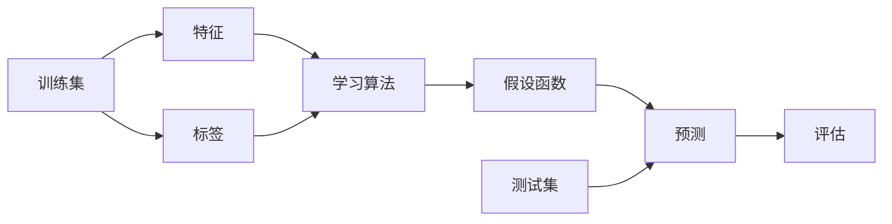

# 监督学习(Supervised Learning) - 原理与代码实例讲解

作者：禅与计算机程序设计艺术 / Zen and the Art of Computer Programming

关键词：监督学习、分类、回归、神经网络、决策树、支持向量机、梯度下降、损失函数

## 1. 背景介绍 

### 1.1 问题的由来

在人工智能和机器学习领域,监督学习是一个非常重要和基础的课题。它旨在让计算机系统从已标注的训练数据中学习,建立映射函数,从而对新的未知数据做出正确的预测。监督学习为计算机视觉、自然语言处理、语音识别等诸多领域提供了强大的工具和方法。

### 1.2 研究现状

目前,监督学习已经取得了巨大的进展。各种高效的算法被提出,如支持向量机、随机森林、神经网络等。特别是近年来,得益于深度学习技术的发展,卷积神经网络、循环神经网络等模型在图像识别、语音识别等任务上取得了超越人类的性能。但是,现有方法仍然存在一些局限,如对大规模标注数据的依赖、泛化能力不足、可解释性差等。

### 1.3 研究意义 

监督学习作为机器学习的重要分支,对于人工智能的发展具有重要意义:

1. 监督学习为计算机提供了自动学习和预测的能力,大大拓展了计算机的应用范围。

2. 研究高效的监督学习算法,有助于提升人工智能系统的性能,加速其在各领域的落地应用。

3. 探索监督学习的内在机理,可以帮助我们更好地理解人类的学习过程,促进认知科学的发展。

### 1.4 本文结构

本文将全面介绍监督学习的原理和方法。内容安排如下:

- 第2部分介绍监督学习的核心概念。
- 第3部分讲解监督学习的主要算法,包括分类和回归算法。 
- 第4部分阐述监督学习的数学原理,并给出公式推导和案例分析。
- 第5部分通过代码实例演示如何使用Python实现监督学习算法。
- 第6部分讨论监督学习的应用场景。
- 第7部分推荐监督学习的学习资源和工具。
- 第8部分总结全文,并展望监督学习的未来发展方向。

## 2. 核心概念与联系

监督学习的核心概念包括:

- 训练集(Training Set):用于训练模型的已标注数据集。
- 测试集(Test Set):用于评估模型性能的未标注数据集。
- 特征(Feature):描述样本属性的变量$x$,通常是向量。
- 标签(Label):样本的真实类别$y$,可以是类别或连续值。
- 假设函数(Hypothesis):即模型$f$,它将特征映射为预测标签$\hat{y}=f(x)$。
- 损失函数(Loss Function):度量模型预测值与真实值的偏差。
- 优化算法(Optimization):通过最小化损失函数来求解最优模型参数。

其中,训练集、特征和标签构成了监督学习的基础。我们希望学习一个假设函数,使其对训练集的预测尽可能接近真实标签。这可以通过最小化损失函数来实现。测试集用于评估学习到的模型在新数据上的泛化性能。

监督学习可以分为分类和回归两大类任务:
- 分类(Classification):标签是离散的类别值,如二分类和多分类。
- 回归(Regression):标签是连续的实数值,如预测房价。

下图展示了监督学习的基本流程:

## 3. 核心算法原理 & 具体操作步骤

监督学习的常用算法包括:

### 3.1 算法原理概述

#### 3.1.1 线性回归

线性回归假设标签$y$可以用特征$x$的线性组合来近似:$f(x)=w^Tx+b$。其中$w$和$b$是待学习的参数。学习过程就是找到最优的$w$和$b$,使得预测值$f(x)$与真实值$y$尽可能接近。

#### 3.1.2 逻辑回归

逻辑回归是线性回归在分类任务上的推广。它引入了Sigmoid函数将线性回归的输出压缩到0-1之间,得到类别1的概率。预测类别时,以0.5为阈值进行判断。

#### 3.1.3 支持向量机

支持向量机(SVM)试图找到一个最大间隔超平面,将不同类别的样本分开。间隔最大化意味着分类面两侧的置信度最高。SVM只依赖于少数支持向量样本,因此对噪声和异常点有较好的鲁棒性。

#### 3.1.4 决策树

决策树通过递归地选择最优划分特征,将数据分割成不同的子集,从而构建一棵树。分类决策树常用信息增益、基尼指数等准则选择划分特征。回归决策树可用平方误差等指标。决策树可解释性强,但容易过拟合。

#### 3.1.5 k近邻

k近邻(KNN)是一种基于实例的学习方法。对新样本,找到训练集中与其最近的k个样本,多数类别或平均值即为预测结果。KNN是非参数化方法,不需要显式训练,但预测时计算量大。

#### 3.1.6 朴素贝叶斯

朴素贝叶斯基于贝叶斯定理和特征独立性假设,学习联合概率分布,并用于预测。先验概率和条件概率通过训练集估计得到。朴素贝叶斯计算简单,适合大规模数据和高维特征。

#### 3.1.7 神经网络

神经网络模仿人脑的结构,由大量神经元节点组成。输入信号经过逐层变换,最终输出预测结果。网络参数通过反向传播算法不断优化,以拟合训练数据。神经网络强大但不透明,需要大量数据和算力。

### 3.2 算法步骤详解

以线性回归为例,详细说明其学习步骤:

1. 构造损失函数,常用均方误差:

$$J(w,b)=\frac{1}{m}\sum_{i=1}^m(f(x^{(i)})-y^{(i)})^2$$

其中$m$为样本数,$x^{(i)},y^{(i)}$为第$i$个样本的特征和标签。

2. 初始化模型参数$w$和$b$,通常随机初始化。

3. 迭代优化参数,重复以下步骤直到收敛:
   
   a. 计算损失函数$J$关于$w$和$b$的梯度:
   
   $$\frac{\partial J}{\partial w_j}=\frac{2}{m}\sum_{i=1}^m(f(x^{(i)})-y^{(i)})x_j^{(i)}$$
   $$\frac{\partial J}{\partial b}=\frac{2}{m}\sum_{i=1}^m(f(x^{(i)})-y^{(i)})$$

   b. 更新参数,学习率为$\alpha$:
   
   $$w_j:=w_j-\alpha \frac{\partial J}{\partial w_j}$$
   $$b:=b-\alpha \frac{\partial J}{\partial b}$$

4. 得到优化后的$w$和$b$,即为最终模型。

5. 用学习到的模型对新样本$x$做预测:$f(x)=w^Tx+b$。

其他算法的学习过程大同小异,都是先构建目标函数,再通过优化算法求解最优参数。区别在于模型假设、目标函数和优化策略的选择。

### 3.3 算法优缺点

- 线性回归和逻辑回归:
  - 优点:简单易懂,计算高效,适合线性可分数据。
  - 缺点:难以刻画复杂非线性关系,对噪声敏感。

- 支持向量机:
  - 优点:擅长处理非线性数据,泛化性能好,鲁棒性强。  
  - 缺点:对参数敏感,难以处理大规模数据。

- 决策树:
  - 优点:可解释性强,灵活多变,适合混合类型特征。
  - 缺点:容易过拟合,对噪声敏感。

- k近邻:
  - 优点:非参数化,简单直观,适合小样本学习。
  - 缺点:计算复杂度高,样本不平衡时表现差。

- 朴素贝叶斯:
  - 优点:计算简单,适合大规模高维数据。
  - 缺点:特征独立性假设较强,难以刻画特征间关系。

- 神经网络:
  - 优点:强大灵活,能够学习复杂模式。
  - 缺点:需要大量数据,训练耗时,不可解释。

### 3.4 算法应用领域

监督学习在许多领域得到了广泛应用,例如:

- 计算机视觉:图像分类、目标检测、语义分割等。
- 自然语言处理:文本分类、情感分析、机器翻译等。
- 语音识别:语音转文字、说话人识别等。
- 生物信息学:基因表达分析、蛋白质结构预测等。
- 金融科技:信用评分、股票预测、异常检测等。

## 4. 数学模型和公式 & 详细讲解 & 举例说明

### 4.1 数学模型构建

监督学习可以用如下数学模型来刻画:

给定训练集$D=\{(x^{(1)},y^{(1)}),(x^{(2)},y^{(2)}),...,(x^{(m)},y^{(m)})\}$,其中$x^{(i)}\in \mathcal{X}$为第$i$个样本的特征向量,$y^{(i)}\in \mathcal{Y}$为其对应的标签,$\mathcal{X}$和$\mathcal{Y}$分别为输入和输出空间。

监督学习的目标是学习一个假设函数$f:\mathcal{X} \rightarrow \mathcal{Y}$,使得$f$在整个样本空间上的期望预测误差最小:

$$\min_{f \in \mathcal{F}} E_{(x,y)}[L(f(x),y)]$$

其中$\mathcal{F}$为假设空间,$L$为损失函数,衡量$f(x)$与$y$的偏差。$E_{(x,y)}$表示对联合分布$P(x,y)$取期望。

然而,联合分布$P(x,y)$往往未知,因此实际上我们优化的是经验风险:

$$\min_{f \in \mathcal{F}} \frac{1}{m}\sum_{i=1}^m L(f(x^{(i)}),y^{(i)})$$

即最小化训练集上的平均损失。

### 4.2 公式推导过程

以线性回归为例,推导其闭式解。

假设$f(x)=w^Tx+b$,损失函数为均方误差:

$$J(w,b)=\frac{1}{m}\sum_{i=1}^m(w^Tx^{(i)}+b-y^{(i)})^2$$

将$J(w,b)$展开:

$$J(w,b)=\frac{1}{m}(w^TX^TXw+2(b-y)^TXw+m(b-\bar{y})^2)$$

其中$X\in R^{m \times n}$为样本矩阵,每行对应一个样本的特征向量;$y\in R^m$为标签向量;$\bar{y}=\frac{1}{m}\sum_{i=1}^my^{(i)}$为标签均值。

令$J(w,b)$对$w$和$b$的偏导为0:

$$\frac{\partial J}{\partial w}=\frac{2}{m}(X^TXw+X^T(b-y))=0$$

$$\frac{\partial J}{\partial b}=\frac{2}{m}\sum_{i=1}^m(w^Tx^{(i)}+b-y^{(i)})=0$$

解得:

$$\hat{w}=(X^TX)^{-1}X^T(y-\bar{y})$$

$$\hat{b}=\bar{y}-\hat{w}^T\bar{x}$$

其中$\bar{x}=\frac{1}{m}\sum_{i=1}^mx^{