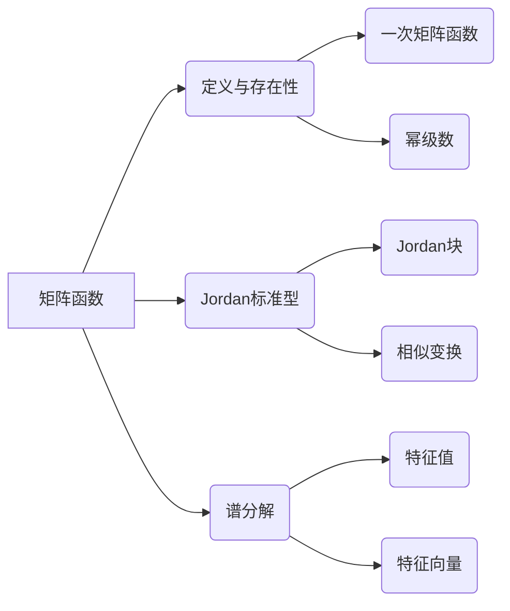

# 矩阵理论与应用：矩阵函数

关键词：矩阵理论、矩阵函数、Jordan标准型、谱分解、矩阵指数、矩阵对数、Fréchet导数、数值计算

## 1. 背景介绍 
### 1.1 问题的由来
矩阵作为线性代数的核心内容,在科学与工程领域有着广泛的应用。矩阵函数作为矩阵理论的重要分支,是将标量函数推广到矩阵的自然延伸。研究矩阵函数不仅具有重要的理论意义,在实际应用中也发挥着关键作用,如量子力学、控制理论、图像处理等领域。

### 1.2 研究现状
目前对矩阵函数的研究主要集中在理论性质的探讨以及数值算法的设计。在理论研究方面,Higham等人对矩阵函数的定义、存在性、唯一性等基本性质进行了系统总结。在数值算法方面,Moler等人提出了多种高效稳定的矩阵函数计算方法,如Schur-Parlett方法、缩放幂法等。但对于病态矩阵、大规模稀疏矩阵等特殊情况,高效算法的设计仍是一个挑战。

### 1.3 研究意义
深入研究矩阵函数的理论与应用具有重要意义:

1. 丰富矩阵理论内涵,促进线性代数的发展
2. 为相关应用领域提供坚实的数学基础和计算工具
3. 推动跨学科交叉融合,催生新的研究方向与成果

### 1.4 本文结构
本文将围绕矩阵函数的理论基础与数值计算两大主题展开:

1. 介绍矩阵函数的基本概念、性质、表示等理论内容
2. 总结几类重要矩阵函数(如指数、对数等)的定义、性质及应用
3. 阐述矩阵函数数值计算的主流算法,并通过算例进行演示说明
4. 讨论矩阵函数在实际问题(如常微分方程)求解中的应用
5. 展望矩阵函数的研究前景、挑战及未来方向

## 2. 核心概念与联系
矩阵函数是在标量函数基础上,将自变量从标量延拓到矩阵而形成的。给定标量函数$f(x)$以及$n$阶方阵$A$,对应的矩阵函数记为$f(A)$。两者在概念和性质上有许多相通之处,但也存在显著区别。

一方面,许多标量函数的性质可以自然推广到矩阵函数,例如:
- 标量的四则运算 $\Rightarrow$ 矩阵的四则运算
- 复合函数 $\Rightarrow$ 矩阵函数复合
- 泰勒级数 $\Rightarrow$ 矩阵泰勒级数

另一方面,矩阵函数也有其特殊性质:
- 矩阵乘法不满足交换律
- 逆、行列式等概念的引入
- 特征值、相似变换的考虑

总的来说,深刻理解矩阵函数与标量函数的联系与区别,是掌握矩阵函数理论的基础。下面梳理几个最核心的矩阵函数概念:



## 3. 核心算法原理 & 具体操作步骤
### 3.1 算法原理概述
计算矩阵函数的核心是将其转化为已知矩阵函数的计算问题。常见的思路有:

1. 利用矩阵的Jordan标准型,将问题化简为Jordan块的函数计算
2. 对角化方法,即利用谱分解将矩阵化为对角阵
3. 幂级数展开,将矩阵函数表示为矩阵多项式

### 3.2 算法步骤详解
以Jordan标准型为例,计算矩阵函数$f(A)$的一般步骤为:

1. 计算矩阵$A$的Jordan标准型$J$: $A=PJP^{-1}$
2. 对Jordan标准型$J$的各个Jordan块$J_i$分别计算$f(J_i)$
3. 将计算结果组装成准对角阵$f(J)=diag(f(J_1),\cdots,f(J_m))$
4. 利用相似变换得到$f(A)=Pf(J)P^{-1}$

其中第2步计算Jordan块矩阵函数的通用公式为:

$$
f(J_i) = \begin{bmatrix} 
f(\lambda_i) & f'(\lambda_i) & \frac{f''(\lambda_i)}{2!} & \cdots & \frac{f^{(n_i-1)}(\lambda_i)}{(n_i-1)!}\\
0 & f(\lambda_i) & f'(\lambda_i) & \cdots & \frac{f^{(n_i-2)}(\lambda_i)}{(n_i-2)!}\\
\vdots & \vdots & \vdots & \ddots & \vdots \\
0 & 0 & 0 & \cdots & f(\lambda_i)
\end{bmatrix}
$$

其中$\lambda_i$为Jordan块$J_i$对应的特征值,$n_i$为块的阶数。

### 3.3 算法优缺点
Jordan标准型算法的主要优点是:

1. 适用于任意矩阵函数的计算
2. 当矩阵为对角阵时,算法简化为对角线元素函数值的计算

但该算法也存在缺陷:

1. 对于重复特征值的情形,需要计算较高阶导数,计算量大
2. 数值稳定性差,容易引入舍入误差

### 3.4 算法应用领域
矩阵函数的数值算法在以下领域有重要应用:

1. 常微分方程数值解
2. 马尔可夫链稳态分布计算
3. 量子力学态演化模拟
4. 图像处理与计算机视觉

## 4. 数学模型和公式 & 详细讲解 & 举例说明
### 4.1 数学模型构建
对于线性常系数微分方程组:

$$
\frac{d\mathbf{x}(t)}{dt} = A\mathbf{x}(t),\quad \mathbf{x}(0)=\mathbf{x}_0
$$

其中$A$为$n$阶常数矩阵,求解该方程组可以利用矩阵指数$e^{At}$。若令$\mathbf{x}(t)=e^{At}\mathbf{x}_0$,则有:

$$
\frac{d\mathbf{x}(t)}{dt} = \frac{d}{dt}(e^{At}\mathbf{x}_0)=Ae^{At}\mathbf{x}_0=A\mathbf{x}(t)
$$

可见$\mathbf{x}(t)=e^{At}\mathbf{x}_0$满足微分方程组。这里矩阵指数$e^{At}$实现了将线性微分方程组转化为矩阵函数计算问题。

### 4.2 公式推导过程
对于矩阵指数$e^A$,利用指数函数的泰勒级数展开有:

$$
e^A = \sum_{k=0}^{\infty}\frac{1}{k!}A^k = I + A + \frac{1}{2!}A^2 + \frac{1}{3!}A^3 + \cdots
$$

当$A$为对角阵时,即$A=diag(\lambda_1,\cdots,\lambda_n)$,矩阵指数简化为:

$$
e^A = \begin{bmatrix}
e^{\lambda_1} & & \\
& \ddots & \\
& & e^{\lambda_n}
\end{bmatrix}
$$

利用Jordan标准型$J$,对一般矩阵$A$也可计算其指数:

$$
e^A = Pe^JP^{-1} = P\cdot diag(e^{J_1},\cdots,e^{J_m})\cdot P^{-1}
$$

其中$e^{J_i}$可由Jordan块指数公式快速计算。

### 4.3 案例分析与讲解
考虑二阶常系数线性微分方程组:

$$
\frac{d}{dt}\begin{bmatrix}x_1\\x_2\end{bmatrix}=\begin{bmatrix}1&2\\-1&0\end{bmatrix}\begin{bmatrix}x_1\\x_2\end{bmatrix},\quad \begin{bmatrix}x_1(0)\\x_2(0)\end{bmatrix}=\begin{bmatrix}1\\0\end{bmatrix}
$$

记系数矩阵为$A$,初值向量为$\mathbf{x}_0$。$A$的特征值为$\lambda_{1,2}=\frac{1\pm\sqrt{3}}{2}$,特征向量为:

$$
\mathbf{v}_1=\begin{bmatrix}1\\\frac{-1+\sqrt{3}}{2}\end{bmatrix},\quad 
\mathbf{v}_2=\begin{bmatrix}1\\\frac{-1-\sqrt{3}}{2}\end{bmatrix}
$$

故$A$可对角化为:

$$
A = P\Lambda P^{-1} = 
\begin{bmatrix}1&1\\\frac{-1+\sqrt{3}}{2}&\frac{-1-\sqrt{3}}{2}\end{bmatrix}
\begin{bmatrix}\lambda_1&\\&\lambda_2\end{bmatrix}
\begin{bmatrix}1&1\\\frac{-1+\sqrt{3}}{2}&\frac{-1-\sqrt{3}}{2}\end{bmatrix}^{-1}
$$

从而矩阵指数为:

$$
e^{At} = Pe^{\Lambda t}P^{-1} = 
\begin{bmatrix}1&1\\\frac{-1+\sqrt{3}}{2}&\frac{-1-\sqrt{3}}{2}\end{bmatrix}
\begin{bmatrix}e^{\lambda_1 t}&\\&e^{\lambda_2 t}\end{bmatrix}
\begin{bmatrix}1&1\\\frac{-1+\sqrt{3}}{2}&\frac{-1-\sqrt{3}}{2}\end{bmatrix}^{-1}
$$

代入初值向量$\mathbf{x}_0$即得到微分方程的解析解:

$$
\mathbf{x}(t)=e^{At}\mathbf{x}_0=\frac{1}{2}\begin{bmatrix}
e^{\lambda_1 t}+e^{\lambda_2 t}\\
\frac{-1+\sqrt{3}}{2}e^{\lambda_1 t} + \frac{-1-\sqrt{3}}{2}e^{\lambda_2 t}
\end{bmatrix}
$$

### 4.4 常见问题解答
Q: 对于任意矩阵$A$,矩阵指数$e^A$是否一定存在?

A: 是的,对于任意$n$阶矩阵$A$,对应的指数矩阵$e^A$总是存在且唯一。这是由指数函数的泰勒级数展开保证的。从几何直观上看,矩阵指数刻画了线性变换的累积效应,具有明确的物理意义。

Q: 计算矩阵对数$\ln(A)$有何难点?

A: 与矩阵指数类似,矩阵对数$\ln(A)$的定义可由对数函数的泰勒级数得到。但对数函数要求自变量大于0,因此矩阵对数对$A$有要求,即$A$的所有特征值必须为正。此外,对数多值性的问题在矩阵对数中也有体现。

## 5. 项目实践：代码实例和详细解释说明
### 5.1 开发环境搭建
本项目采用Python语言,依赖NumPy、SciPy等科学计算库。推荐的开发环境配置:

- Python 3.x
- NumPy
- SciPy 
- Jupyter Notebook

### 5.2 源代码详细实现

下面以计算矩阵指数为例,给出Python的实现代码:

```python
import numpy as np
import scipy.linalg as la

def matrix_exp(A):
    """
    计算矩阵指数exp(A)
    
    参数:
        A: n*n矩阵
        
    返回:
        n*n矩阵exp(A)
    """
    # 计算A的特征值和特征向量
    evals, evecs = la.eig(A) 
    
    # 特征值取指数
    exp_evals = np.exp(evals)
    
    # 构造对角阵
    exp_D = np.diag(exp_evals)
    
    # 计算V*exp(D)*V^(-1)
    exp_