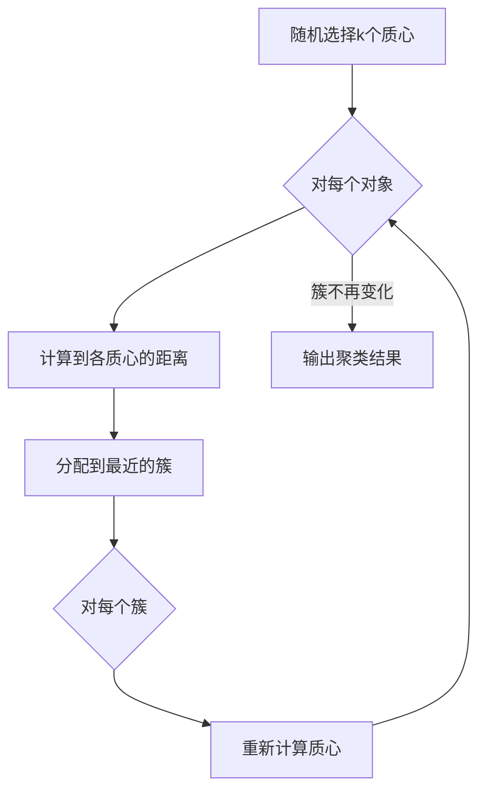
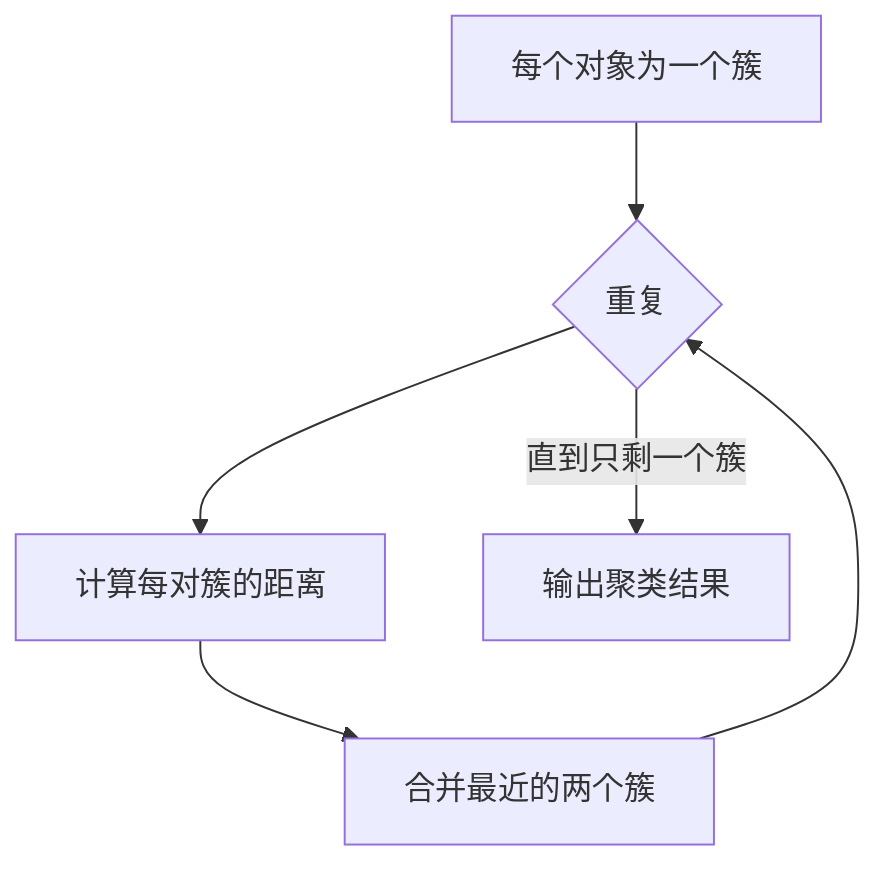
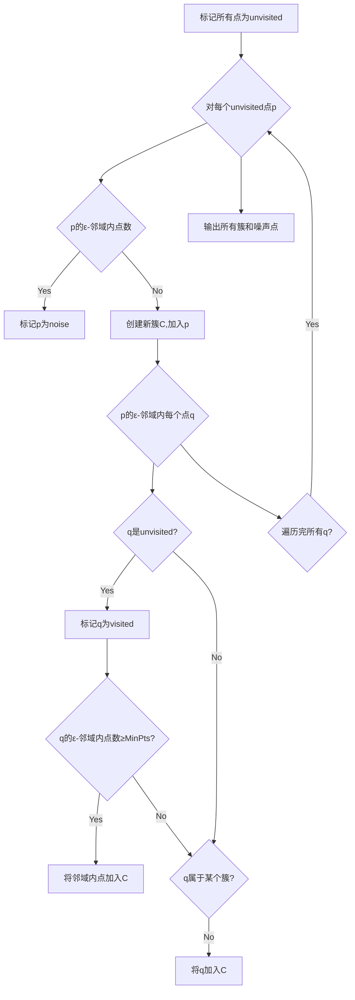

# 聚类(Clustering) - 原理与代码实例讲解

关键词：聚类、无监督学习、K-means、层次聚类、密度聚类、DBSCAN

## 1. 背景介绍
### 1.1 问题的由来
在现实世界中，我们经常面临着对大量未标记数据进行分组的问题。例如，在客户细分、文本聚类、图像分割等领域，我们需要将相似的对象归为一组，以便更好地理解和分析数据。聚类是一种无监督学习方法，旨在解决这类问题。

### 1.2 研究现状
聚类算法已经有几十年的研究历史，各种类型的聚类算法不断涌现。目前，主要的聚类算法可分为基于划分的方法（如K-means）、基于层次的方法（如层次聚类）、基于密度的方法（如DBSCAN）以及基于图的方法等。这些算法在不同的应用场景下各有优劣。

### 1.3 研究意义
聚类分析可以帮助我们发现数据内在的结构和模式，对数据进行压缩和抽象。它在数据挖掘、模式识别、推荐系统等领域有广泛的应用。深入理解聚类算法的原理，并掌握其代码实现，对于从事相关领域的研究人员和工程师来说非常重要。

### 1.4 本文结构
本文将首先介绍聚类的核心概念与不同类型聚类算法之间的联系。然后重点讲解几种经典聚类算法（K-means、层次聚类、DBSCAN）的原理和具体操作步骤。接着通过数学模型和代码实例进一步加深理解。最后探讨聚类算法的实际应用场景和未来发展趋势。

## 2. 核心概念与联系
聚类的目标是将数据集划分为若干个簇，使得同一簇内的对象相似度高，不同簇之间的对象相似度低。这里的相似度可以用距离度量来衡量，常见的有欧氏距离、曼哈顿距离等。 

根据聚类算法的基本思想，可以将其分为以下几类：
- 基于划分的聚类：如K-means，先给定簇的个数，然后不断迭代优化划分，直到达到最优。
- 基于层次的聚类：自底向上或自顶向下地构建树状的聚类结构，如AGNES、DIANA等。  
- 基于密度的聚类：根据对象的密度连通性来划分簇，能够发现任意形状的簇，如DBSCAN。
- 基于图的聚类：将数据对象视为图的节点，相似度为边的权重，通过图的划分来实现聚类。

这些不同类型的算法各有特点，适用于不同的场景。在实际应用中需要根据数据的特性和问题的需求来选择合适的算法。

## 3. 核心算法原理 & 具体操作步骤
本节将重点介绍三种经典的聚类算法：K-means、凝聚层次聚类和DBSCAN。
### 3.1 K-means算法原理
K-means是一种迭代求解的聚类算法，其基本思想是：通过迭代，不断更新每个簇的质心，使得簇内对象到质心的距离平方和最小。

### 3.2 K-means算法步骤详解
1. 随机选择k个对象作为初始质心
2. 重复下面步骤直到簇不再发生变化：
   - 对每个对象，计算它到各个质心的距离，将它分配到最近的簇
   - 对每个簇，重新计算质心（簇内所有对象的均值）
3. 输出最终的簇划分结果

用Mermaid流程图表示如下：

### 3.3 K-means算法优缺点
优点：
- 原理简单，实现容易
- 聚类效果较好，适用于发现球形簇

缺点：  
- 需要预先指定簇的个数k
- 对噪声和异常点敏感
- 容易陷入局部最优

### 3.4 K-means算法应用领域
K-means在以下领域经常用到：
- 市场细分：根据客户属性将其划分为不同的群体
- 图像分割：将图像像素点聚类，分割成不同区域
- 文本聚类：根据文本的特征向量进行聚类

### 3.5 层次聚类算法原理
层次聚类算法通过不断合并最相似的簇来构建一个树状的聚类结构（称为系统树或树形图）。分为凝聚（自底向上）和分裂（自顶向下）两种方法。

### 3.6 凝聚层次聚类算法步骤详解
1. 将每个对象看成一个独立的簇
2. 重复下面步骤，直到所有对象都在一个簇中：
   - 计算每对簇之间的距离
   - 合并距离最近的两个簇
3. 输出层次化的聚类结果

常用的簇间距离定义有：
- 最小距离（single linkage）：取两个簇中最近两个对象的距离
- 最大距离（complete linkage）：取两个簇中最远两个对象的距离
- 平均距离（average linkage）：取两个簇中所有对象距离的均值

用Mermaid流程图表示如下：

### 3.7 凝聚层次聚类优缺点
优点：
- 无需预先指定簇的个数
- 可以生成层次化的聚类结构，表现数据的层次关系

缺点：
- 聚类结果对簇间距离定义敏感  
- 一旦合并操作完成就无法撤销，容易受噪声影响

### 3.8 DBSCAN算法原理
DBSCAN（Density-Based Spatial Clustering of Applications with Noise）是一种基于密度的聚类算法。它将簇定义为密度相连的点的最大集合，能够发现任意形状的簇，并将低密度区域的点标记为噪声。

### 3.9 DBSCAN算法步骤详解
算法需要两个参数：ε（半径）和MinPts（最小点数）。定义点的ε-邻域为以该点为圆心、ε为半径的区域。
1. 标记所有点为unvisited
2. 对每个unvisited的点p：
   - 标记p为visited
   - 如果p的ε-邻域内的点的数量<MinPts，标记p为noise
   - 否则，创建一个新簇C，并将p添加到C。对p的ε-邻域内的所有点q：
     - 如果q是unvisited，标记q为visited，并检查q的ε-邻域。如果邻域内点的数量≥MinPts，将这些点添加到C
     - 如果q不属于任何簇，将q添加到C
3. 输出所有的簇，未分配到簇的点为噪声

用Mermaid流程图表示如下：

### 3.10 DBSCAN算法优缺点
优点：
- 可以发现任意形状的簇
- 对噪声和异常点不敏感
- 无需预先指定簇的个数

缺点：
- 当数据密度不均匀时，聚类质量较差
- 对参数ε和MinPts敏感，难以选择合适的值

### 3.11 DBSCAN算法应用领域
DBSCAN常用于以下场景：
- 异常检测：将异常点检测为噪声
- 空间数据聚类：如地理位置、轨迹等
- 任意形状簇的发现

## 4. 数学模型和公式 & 详细讲解 & 举例说明
本节将介绍聚类算法中常用的距离度量和评价指标，并通过实例说明其计算过程。

### 4.1 距离度量
在聚类算法中，需要计算对象之间的相似度。通常用距离来度量，距离越小表示对象越相似。常用的距离度量有：

1. 欧氏距离（Euclidean Distance）：
两点 $x=(x_1,\ldots,x_n)$ 和 $y=(y_1,\ldots,y_n)$ 之间的欧氏距离定义为：

$$d(x,y)=\sqrt{\sum_{i=1}^n (x_i-y_i)^2}$$

例如，在二维空间中，点 $(1,2)$ 和点 $(4,6)$ 的欧氏距离为：

$$\sqrt{(1-4)^2+(2-6)^2}=\sqrt{9+16}=5$$

2. 曼哈顿距离（Manhattan Distance）：
两点 $x=(x_1,\ldots,x_n)$ 和 $y=(y_1,\ldots,y_n)$ 之间的曼哈顿距离定义为：

$$d(x,y)=\sum_{i=1}^n |x_i-y_i|$$

例如，点 $(1,2)$ 和点 $(4,6)$ 的曼哈顿距离为：

$$|1-4|+|2-6|=3+4=7$$

3. 余弦相似度（Cosine Similarity）：
对于两个向量 $x=(x_1,\ldots,x_n)$ 和 $y=(y_1,\ldots,y_n)$，其余弦相似度定义为：

$$\cos(x,y)=\frac{\sum_{i=1}^n x_i y_i}{\sqrt{\sum_{i=1}^n x_i^2} \sqrt{\sum_{i=1}^n y_i^2}}$$

余弦相似度取值范围为 $[-1,1]$，值越大表示两个向量方向越接近。

例如，向量 $(1,2,3)$ 和向量 $(2,4,6)$ 的余弦相似度为：

$$\frac{1\times 2+2\times 4+3\times 6}{\sqrt{1^2+2^2+3^2}\sqrt{2^2+4^2+6^2}}=\frac{28}{\sqrt{14}\sqrt{56}}=1$$

说明这两个向量方向完全相同。

### 4.2 聚类评价指标
聚类结果的好坏需要用评价指标来衡量。常用的外部指标有：

1. Rand Index：
将聚类结果与真实类别标签进行比较。定义 $a$ 为两个对象在聚类结果和真实标签中都属于同一类的数量，$b$ 为在两者中都属于不同类的数量。则Rand Index定义为：

$$RI=\frac{a+b}{C_n^2}$$

其中，$C_n^2=\frac{n(n-1)}{2}$ 为所有可能的对象对数。$RI$ 的取值范围为 $[0,1]$，值越大表示聚类结果与真实情况越吻合。

2. F-Measure：
将聚类看成一个二分类问题，类别为某个簇或不是该簇。对于每个簇 $i$，定义 $precision_i$ 和 $recall_i$ 如下：

$$precision_i=\frac{TP_i}{TP_i+FP_i}, \quad recall_i=\frac{TP_i}{TP_i+FN_i}$$

其中，$TP_i$、$FP_i$、$FN_i$ 分别表示对于簇 $i$ 的真正例、假正例、假负例的数量。

再定义 $F_i=\frac{2\cdot precision_i \cdot recall_i}{precision_i + recall_i}$，则整个聚类结果的F-Measure为