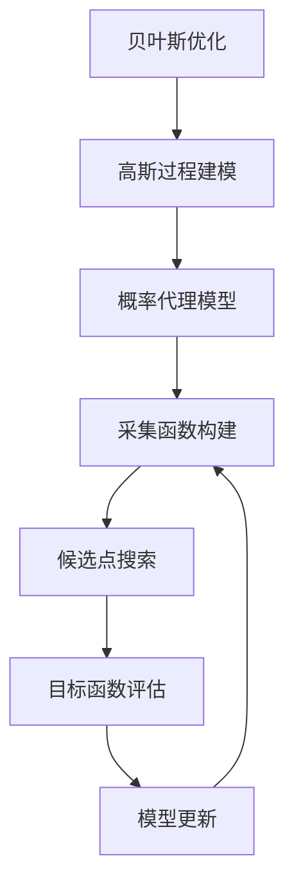

# 贝叶斯优化：高效的模型优化方法

## 1. 背景介绍

### 1.1 问题的由来

在现代科学研究和工程实践中,我们经常会遇到需要优化某些目标函数或性能指标的情况。这些目标函数通常是复杂的、非凸的、多模态的,并且评估目标函数往往是一个计算密集型的黑盒过程。传统的优化算法,如梯度下降法、牛顿法等,依赖于目标函数的梯度信息,但在黑盒情况下,这些梯度信息通常是无法获得的。因此,我们需要一种能够高效地对黑盒函数进行全局优化的新方法。

### 1.2 研究现状  

贝叶斯优化(Bayesian Optimization)作为一种基于统计学习的黑盒优化方法,近年来在机器学习、自动机器学习、神经架构搜索、超参数优化、工业优化等领域受到了广泛关注和应用。贝叶斯优化通过构建概率代理模型来近似目标黑盒函数,并利用采集函数(Acquisition Function)在代理模型上搜索下一个有希望改善目标函数的候选点,从而逐步缩小搜索空间,最终找到全局最优解。

### 1.3 研究意义

贝叶斯优化作为一种高效的黑盒优化方法,具有以下优点:

1. 样本高效:与其他黑盒优化算法相比,贝叶斯优化能够以较少的目标函数评估次数找到相对较优的解。
2. 全局优化:贝叶斯优化能够有效地避免陷入局部最优,从而更有希望找到全局最优解。
3. 鲁棒性强:贝叶斯优化对目标函数的噪声和不确定性具有较强的鲁棒性。
4. 可解释性:贝叶斯优化过程中构建的概率代理模型和采集函数具有一定的可解释性。

因此,研究贝叶斯优化的原理、算法细节及其应用,对于提高黑盒优化的效率,解决实际问题具有重要意义。

### 1.4 本文结构

本文将首先介绍贝叶斯优化的核心概念和基本思想,然后详细阐述贝叶斯优化的核心算法原理和具体操作步骤。接下来,我们将构建贝叶斯优化的数学模型,推导相关公式,并通过案例分析加深理解。之后,我们将通过一个实际项目实践,提供代码实例并进行详细解释说明。最后,我们将探讨贝叶斯优化在实际应用场景中的应用,介绍相关工具和学习资源,总结贝叶斯优化的发展趋势和面临的挑战,并回答一些常见问题。

## 2. 核心概念与联系

贝叶斯优化的核心思想是将目标黑盒函数建模为一个高斯随机过程(Gaussian Process,GP),并利用这个概率代理模型来指导后续的优化过程。

1. **高斯过程建模**:将目标黑盒函数看作是一个高斯随机过程的实现,通过观测到的有限数据点,我们可以对整个函数的分布进行估计和建模。
2. **概率代理模型**:基于高斯过程,我们可以构建目标函数的概率代理模型,即对目标函数的分布和不确定性进行建模和估计。
3. **采集函数构建**:在概率代理模型的基础上,我们构建一个采集函数(Acquisition Function),用于平衡exploitation(利用已知的优化结果)和exploration(探索未知的潜在优化区域)。
4. **候选点搜索**:通过优化采集函数,我们可以找到下一个最有希望改善目标函数的候选点。
5. **目标函数评估**:在新的候选点处评估目标黑盒函数,获得新的观测数据。
6. **模型更新**:利用新的观测数据,更新高斯过程模型和概率代理模型。
7. **迭代优化**:重复上述过程,直到满足终止条件(如最大迭代次数或目标函数值满意)。

通过上述过程,贝叶斯优化能够有效地在高维、非凸、多模态的黑盒函数空间中搜索全局最优解,并且具有较高的样本效率。

## 3. 核心算法原理与具体操作步骤

### 3.1 算法原理概述

贝叶斯优化算法的核心思想是将目标黑盒函数 $f(x)$ 建模为一个高斯随机过程(Gaussian Process,GP),并在该GP模型的基础上,构建一个采集函数(Acquisition Function)来平衡exploitation和exploration,从而指导后续的优化过程。

具体来说,算法原理可概括为以下几个关键步骤:

1. **初始化**:选择一个初始的数据集 $\mathcal{D}_0=\{(x_i,y_i)\}_{i=1}^{n_0}$,其中 $x_i$ 是输入变量, $y_i=f(x_i)$ 是对应的目标函数值。
2. **高斯过程建模**:基于初始数据集 $\mathcal{D}_0$,利用高斯过程回归(Gaussian Process Regression)构建目标函数 $f(x)$ 的概率代理模型,得到 $f(x) \sim \mathcal{GP}(m(x),k(x,x'))$,其中 $m(x)$ 是均值函数, $k(x,x')$ 是核函数(如RBF核)。
3. **采集函数构建**:在概率代理模型的基础上,构建一个采集函数 $\alpha(x)$,用于平衡exploitation和exploration。常用的采集函数包括期望改善量(Expected Improvement,EI)、预测熵搜索(Predictive Entropy Search,PES)等。
4. **候选点搜索**:通过优化采集函数 $\alpha(x)$,找到下一个最有希望改善目标函数的候选点 $x_{n+1}$,即 $x_{n+1}=\arg\max_{x}\alpha(x)$。
5. **目标函数评估**:在新的候选点 $x_{n+1}$ 处评估目标黑盒函数,获得新的观测数据 $y_{n+1}=f(x_{n+1})$。
6. **模型更新**:将新的观测数据 $(x_{n+1},y_{n+1})$ 加入数据集 $\mathcal{D}_{n+1}=\mathcal{D}_n\cup\{(x_{n+1},y_{n+1})\}$,并基于更新后的数据集重新构建高斯过程模型。
7. **迭代优化**:重复步骤3-6,直到满足终止条件(如最大迭代次数或目标函数值满意)。

通过上述过程,贝叶斯优化算法能够有效地在高维、非凸、多模态的黑盒函数空间中搜索全局最优解,并且具有较高的样本效率。

### 3.2 算法步骤详解

现在,我们对贝叶斯优化算法的具体步骤进行更详细的解释:

1. **初始化**

   在算法初始化阶段,我们需要选择一个初始的数据集 $\mathcal{D}_0=\{(x_i,y_i)\}_{i=1}^{n_0}$,其中 $x_i$ 是输入变量, $y_i=f(x_i)$ 是对应的目标函数值。初始数据集的选择对算法的性能有一定影响,通常可以采用一些空间填充设计(如拉丁超立方抽样)来选择初始点,以便更好地覆盖输入空间。

2. **高斯过程建模**

   基于初始数据集 $\mathcal{D}_0$,我们利用高斯过程回归(Gaussian Process Regression)构建目标函数 $f(x)$ 的概率代理模型。高斯过程是一个无限维的概率分布,可以用于对任意函数进行建模和推断。

   在高斯过程回归中,我们假设目标函数 $f(x)$ 服从一个高斯过程的先验分布,即 $f(x) \sim \mathcal{GP}(m(x),k(x,x'))$,其中:

   - $m(x)$ 是均值函数,通常设置为常数0或某些简单的参数化函数。
   - $k(x,x')$ 是核函数(Kernel Function),用于描述输入变量 $x$ 和 $x'$ 之间的相似性。常用的核函数包括RBF核(Radial Basis Function Kernel)、Matérn核等。

   给定观测数据 $\mathcal{D}_0$,我们可以通过高斯过程回归得到目标函数 $f(x)$ 在任意新输入点 $x^*$ 处的后验分布,即 $f(x^*) \sim \mathcal{N}(\mu(x^*),\sigma^2(x^*))$,其中 $\mu(x^*)$ 是均值,代表对目标函数值的预测; $\sigma^2(x^*)$ 是方差,代表预测的不确定性。

3. **采集函数构建**

   在概率代理模型的基础上,我们需要构建一个采集函数(Acquisition Function) $\alpha(x)$,用于平衡exploitation(利用已知的优化结果)和exploration(探索未知的潜在优化区域)。采集函数的设计是贝叶斯优化算法的关键,它决定了算法的收敛性能和全局优化能力。

   常用的采集函数包括:

   - **期望改善量(Expected Improvement,EI)**:定义为目标函数相对于当前最优值的期望改善量。
   - **预测熵搜索(Predictive Entropy Search,PES)**:基于信息论,选择能最大程度减小目标函数后验熵(不确定性)的点。
   - **上确界准则(Upper Confidence Bound,UCB)**:将目标函数的均值和方差进行折中,以一定的置信水平对目标函数的上确界进行优化。

   不同的采集函数具有不同的特点,需要根据具体问题进行选择和调整。

4. **候选点搜索**

   通过优化采集函数 $\alpha(x)$,我们可以找到下一个最有希望改善目标函数的候选点 $x_{n+1}$,即:

   $$x_{n+1}=\arg\max_{x}\alpha(x)$$

   由于采集函数通常是非凸的、多模态的,因此优化采集函数本身也是一个挑战。常用的方法包括启发式搜索算法(如模拟退火)、全局优化算法(如进化算法)等。

5. **目标函数评估**

   在新的候选点 $x_{n+1}$ 处评估目标黑盒函数,获得新的观测数据 $y_{n+1}=f(x_{n+1})$。这一步通常是计算密集型的,需要消耗大量的计算资源。

6. **模型更新**

   将新的观测数据 $(x_{n+1},y_{n+1})$ 加入数据集 $\mathcal{D}_{n+1}=\mathcal{D}_n\cup\{(x_{n+1},y_{n+1})\}$,并基于更新后的数据集重新构建高斯过程模型。通过不断地引入新的观测数据,我们可以逐步改善概率代理模型的精度和可靠性。

7. **迭代优化**

   重复步骤3-6,直到满足终止条件。终止条件可以是最大迭代次数、目标函数值满意、计算资源耗尽等。在每一次迭代中,算法都会在exploitation和exploration之间进行权衡,从而逐步缩小搜索空间,最终找到全局最优解。

通过上述详细的步骤解释,我们可以更好地理解贝叶斯优化算法的工作原理和关键环节。接下来,我们将构建贝叶斯优化的数学模型,推导相关公式,并通过案例分析加深理解。

### 3.3 算法优缺点

贝叶斯优化作为一种高效的黑盒优化方法,具有以下优点:

1. **样本高效**:与其他黑盒优化算法(如网格搜索、随机搜索等)相比,贝叶斯优化能够以较少的目标函数评估次数找到相对较优的解,从