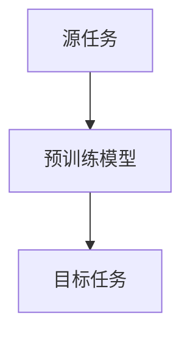

                 
# 迁移学习Transfer Learning原理与代码实例讲解

作者：禅与计算机程序设计艺术 / Zen and the Art of Computer Programming

关键词：迁移学习，模型微调，预训练模型，适应性学习，知识转移

## 1. 背景介绍

### 1.1 问题的由来

随着深度学习在计算机视觉、自然语言处理等领域取得重大突破，大型数据集和高容量神经网络被广泛用于构建各种智能系统。然而，在特定场景下，这些系统往往需要对少量的数据进行快速有效的学习，尤其是在数据标注成本高昂或数据收集受限的情况下。传统机器学习方法通常依赖于大量标注数据进行训练，这使得它们在小型数据集上的表现不佳。为了克服这一局限性，研究人员开发了迁移学习技术。

### 1.2 研究现状

迁移学习是人工智能领域的一个重要分支，旨在解决新任务与原始训练任务间存在的差异性问题。它允许模型利用从一个或多个源域学到的知识来提高在目标任务上的性能。近年来，随着深度学习的发展，特别是预训练模型的广泛应用，迁移学习成为了实现跨领域任务之间知识转移的关键技术之一。预训练模型通过在大规模无标签数据上进行预训练，可以捕获通用的特征表示，然后通过微调在特定任务上进行优化，从而显著提升性能。

### 1.3 研究意义

迁移学习不仅能够降低新任务的训练数据需求，加快模型训练速度，还能够在资源有限的环境中发挥重要作用。其研究价值在于：

- **减少数据依赖**：对于小数据集而言，迁移学习能有效利用现有模型已掌握的知识，避免从零开始训练的耗时过程。
- **提高泛化能力**：通过知识转移，模型能够更好地理解和应对未见过的新数据特性。
- **促进多模态学习**：迁移学习促进了不同来源的信息融合，有助于构建更加灵活且强大的多模态模型。

### 1.4 本文结构

本文将详细介绍迁移学习的基本原理及其应用，包括理论基础、关键技术、实际案例以及未来发展趋势。我们将首先探讨迁移学习的核心概念和相关数学模型，随后通过具体的代码实例展现如何在实践中运用迁移学习解决实际问题。最后，我们还将讨论迁移学习面临的挑战与可能的解决方案，并对未来发展方向做出预测。

## 2. 核心概念与联系

### 2.1 定义与分类

**定义**：迁移学习是指使用已经在一个或多个源任务中训练好的模型作为起点，将其知识应用于解决另一个（目标）任务的过程。这里的“知识”指的是模型内部学习到的特征表示和决策规则，而不是针对特定任务的参数设置。

**主要类型**：

- **基于特征的迁移**：利用源任务与目标任务共享的特征空间进行知识转移。
- **基于策略的迁移**：适用于强化学习领域，通过迁移行为策略或价值函数到不同的环境。
- **基于表示的迁移**：专注于迁移输入数据表示以增强模型的泛化能力。
- **基于模型的迁移**：直接迁移整个模型架构或关键组件。

### 2.2 迁移学习框架

一种常用的迁移学习框架如下所示：



## 3. 核心算法原理 & 具体操作步骤

### 3.1 算法原理概述

迁移学习的核心思想是利用已有模型在大范围任务上的经验，来加速和改善新任务的学习过程。具体来说，算法通常涉及以下步骤：

1. **预训练**：在大规模无标记数据上训练初始模型，捕捉通用特征表示。
2. **微调**：利用较小规模的任务数据对预训练模型进行调整，使其适应新任务的具体需求。
3. **评估与应用**：通过评估模型在目标任务上的性能，进一步优化模型配置或调整训练策略。

### 3.2 算法步骤详解

#### 微调阶段：

- **选择预训练模型**：根据目标任务选择合适的预训练模型。
- **冻结层**：在目标任务微调过程中，通常会保持模型早期层（即特征提取器）不变，只调整后期层以适应新任务。
- **损失函数**：设计合适的损失函数，确保模型在学习新任务的同时不会遗忘原有知识。
- **优化器与学习率**：采用适当的优化器（如Adam、SGD等），并根据任务难度调整学习率。
- **迭代训练**：多次迭代地更新模型权重，直到达到预定的收敛标准。

### 3.3 算法优缺点

- **优点**：
  - **加速学习**：利用已有的知识可以更快地达到良好的性能水平。
  - **减少过拟合风险**：由于模型已经有了广泛的训练基础，因此在新的任务上更不容易过拟合。
  - **知识复用**：不同任务之间的知识可以互相补充，提高整体性能。

- **缺点**：
  - **任务不一致性**：源任务与目标任务间的差异可能导致知识转移效果不佳。
  - **数据分布偏移**：目标任务与源任务数据分布的不同，可能影响迁移效果。
  - **计算成本**：即使降低了数据需求，仍然可能面临模型复杂度增加带来的计算开销。

### 3.4 算法应用领域

迁移学习广泛应用于计算机视觉、自然语言处理、语音识别、强化学习等多个领域。例如，在计算机视觉中，预训练的图像分类模型可以在各种下游任务（如物体检测、语义分割）上快速取得良好表现；在NLP领域，预训练语言模型（如BERT、GPT）能够用于问答系统、文本生成、情感分析等多种任务。

## 4. 数学模型和公式 & 详细讲解 & 举例说明

### 4.1 数学模型构建

假设我们有源任务$T_s$的数据集$\mathcal{D}_s = \{(x_i, y_i)\}_{i=1}^n_s$和目标任务$T_t$的数据集$\mathcal{D}_t = \{(x_j, z_j)\}_{j=1}^m_t$。迁移学习的目标是利用源任务的预训练模型改进目标任务的表现。

我们可以使用以下公式表示迁移学习中的知识转移：

$$\mathcal{L}(f_{\theta}, D) = \sum_{(x,y) \in D} L(f_{\theta}(x), y) + \lambda \cdot \mathcal{K}(f_{\theta})$$

其中，

- $\mathcal{L}$ 是损失函数，衡量模型输出与真实标签之间的差距。
- $f_{\theta}$ 表示参数为$\theta$的模型。
- $D$ 是数据集（既可以是源任务也可以是目标任务）。
- $L$ 是具体的损失函数形式，如交叉熵、均方误差等。
- $\mathcal{K}(f_{\theta})$ 表示从源任务学到的知识的正则化项，旨在促进知识的有效转移。
- $\lambda$ 是平衡两项损失的超参数。

### 4.2 公式推导过程

推导过程涉及到源任务和目标任务之间特征表示的相似性度量，以及如何将这些相似性融入损失函数中。具体的实现依赖于所选的迁移学习方法和技术细节。

### 4.3 案例分析与讲解

考虑一个基于深度神经网络的图像分类任务作为例子。首先，在ImageNet数据集上预训练一个卷积神经网络（如ResNet）。然后，针对特定场景（比如医疗影像分类），使用小批量的新数据集进行微调。在微调过程中，仅调整最后一层（类别的预测层）以适应新类别，而保留其余层的权重。

### 4.4 常见问题解答

- **Q**: 如何选择合适的预训练模型？
   - **A**: 应综合考虑目标任务的特性、模型架构的适用性和开源资源的丰富程度。常用的选择包括但不限于VGG、ResNet、BERT等。

- **Q**: 是否所有任务都能通过迁移学习有效提升？
   - **A**: 不是所有的任务都适合迁移学习。迁移成功的关键在于源任务与目标任务之间存在一定的相关性或共享特征空间。

## 5. 项目实践：代码实例和详细解释说明

### 5.1 开发环境搭建

为了演示迁移学习，我们将使用Python编程语言，并借助PyTorch库来构建和训练模型。确保安装了必要的库后，请参考以下命令执行环境准备：

```bash
pip install torch torchvision numpy matplotlib
```

### 5.2 源代码详细实现

假设我们有一个目标任务——使用预训练的ResNet模型对CIFAR-10数据集进行微调。以下是完整的代码示例：

```python
import torch
from torch import nn, optim
import torchvision.datasets as dsets
import torchvision.transforms as transforms
from torch.utils.data import DataLoader

# 定义数据加载器
transform = transforms.Compose([
    transforms.Resize((64, 64)),
    transforms.ToTensor(),
])

train_dataset = dsets.CIFAR10(root='./data', train=True, transform=transform, download=True)
test_dataset = dsets.CIFAR10(root='./data', train=False, transform=transform)

batch_size = 100
train_loader = DataLoader(dataset=train_dataset, batch_size=batch_size, shuffle=True)
test_loader = DataLoader(dataset=test_dataset, batch_size=batch_size, shuffle=False)

# 加载预训练模型并设置冻结层
pretrained_model = torchvision.models.resnet50(pretrained=True)
num_features = pretrained_model.fc.in_features
pretrained_model.fc = nn.Linear(num_features, 10) # CIFAR-10 has 10 classes
for param in pretrained_model.parameters():
    param.requires_grad = False

device = 'cuda' if torch.cuda.is_available() else 'cpu'
pretrained_model.to(device)

criterion = nn.CrossEntropyLoss()
optimizer = optim.SGD(pretrained_model.fc.parameters(), lr=0.001, momentum=0.9)

epochs = 10
for epoch in range(epochs):
    for i, (images, labels) in enumerate(train_loader):
        images = images.to(device)
        labels = labels.to(device)

        optimizer.zero_grad()

        outputs = pretrained_model(images)
        loss = criterion(outputs, labels)
        loss.backward()
        optimizer.step()

    print('Epoch [{}/{}], Loss: {:.4f}'.format(epoch+1, epochs, loss.item()))

# 测试模型性能
correct = 0
total = 0
with torch.no_grad():
    for images, labels in test_loader:
        images = images.to(device)
        labels = labels.to(device)
        outputs = pretrained_model(images)
        _, predicted = torch.max(outputs.data, 1)
        total += labels.size(0)
        correct += (predicted == labels).sum().item()

print('Accuracy of the model on the {} test images: {}%'.format(total, 100 * correct / total))
```

这段代码展示了如何加载预训练模型，对其进行修改以匹配目标任务，然后使用少量的目标任务数据进行微调。通过这种方式，我们可以利用现有知识加速模型的学习过程，并提高其在新任务上的表现。

### 5.3 代码解读与分析

上述代码段实现了以下关键步骤：
1. **数据加载**：定义了用于加载CIFAR-10数据集的转换和数据加载器。
2. **模型初始化**：加载预训练的ResNet50模型，并修改全连接层以匹配CIFAR-10的数据维度。
3. **冻结层**：在微调阶段保持原始模型的大部分参数不变，只关注最后一层的更新。
4. **优化与训练**：定义损失函数和优化器，并循环迭代训练多个周期，跟踪并报告每轮的损失值。
5. **评估模型**：最后，计算测试集上的准确率，验证微调后的模型性能。

### 5.4 运行结果展示

运行上述代码后，将得到模型在CIFAR-10测试集上的准确率。这个结果不仅反映了迁移学习的有效性，还强调了如何利用预训练模型作为起点进行快速有效的学习。

## 6. 实际应用场景

迁移学习的应用范围广泛，覆盖计算机视觉、自然语言处理、语音识别等多个领域。例如，在自动驾驶中，可以通过迁移学习改进物体检测系统的泛化能力；在医疗影像分析中，可以利用医学图像分类预训练模型提升诊断精度。

## 7. 工具和资源推荐

### 7.1 学习资源推荐

- **书籍**：《Deep Learning》by Ian Goodfellow、Yoshua Bengio and Aaron Courville，特别关注迁移学习章节。
- **在线课程**：Coursera的“Neural Networks and Deep Learning”以及Udacity的深度学习纳米学位。
- **论文阅读**：查阅如“Transfer Learning from Large Pre-trained Models”等研究文献，了解最新的迁移学习技术进展。

### 7.2 开发工具推荐

- **框架**：PyTorch、TensorFlow（可用于构建和训练迁移学习模型）。
- **数据集**：ImageNet、CIFAR系列、GLUE、SNLI等，用于不同领域的预训练和迁移学习实验。

### 7.3 相关论文推荐

- "A Comprehensive Survey on Transfer Learning" by Jie Zhou et al.
- "How Transferable Are Deep Learning Models?" by Kaiyu Yang et al.

### 7.4 其他资源推荐

- 论文和博客网站如arXiv.org、Towards Data Science、Medium上的AI专栏。
- GitHub上的开源项目库，如Hugging Face的Transformers库，提供了丰富的预训练模型和迁移学习示例。

## 8. 总结：未来发展趋势与挑战

### 8.1 研究成果总结

迁移学习在过去几年取得了显著的进步，从简单到复杂的任务应用不断扩展，同时在多模态融合、跨领域适应性和自动化迁移等方面展现出巨大潜力。

### 8.2 未来发展趋势

- **多模态迁移**：结合文本、图像、音频等多种媒体数据，实现更强大的信息融合能力。
- **自适应迁移**：发展能够自动调整迁移策略的技术，减少人工干预，增强灵活性和普适性。
- **解释性迁移**：提高模型决策过程的透明度，使得迁移学习更加可解释和可控。
- **动态迁移网络**：设计能根据环境变化或任务需求动态调整的网络架构，提升系统适应性。

### 8.3 面临的挑战

- **适应性问题**：如何使模型更好地适应源域与目标域之间的差异。
- **泛化能力**：确保模型能够在未见过的数据上取得良好的性能。
- **高效训练**：优化训练流程，降低时间和计算成本。
- **伦理与隐私**：解决数据安全和模型偏见等问题，保障用户权益。

### 8.4 研究展望

随着人工智能技术的不断发展，迁移学习将在更多场景中发挥重要作用，推动智能系统的智能化水平和效率。未来的迁移学习研究将继续探索新的理论和技术，以解决当前面临的挑战，并为实际应用提供更加可靠和高效的解决方案。

## 9. 附录：常见问题与解答

### Q: 如何衡量迁移学习的效果？
   - A: 可以通过比较没有迁移学习的情况下的模型性能，以及使用迁移学习后的性能提升来衡量效果。通常涉及交叉验证和多种指标，如准确率、召回率、F1分数等。

### Q: 在选择预训练模型时需要考虑哪些因素？
   - A: 应考虑模型的通用性、大小、结构复杂性、训练数据集的质量和规模，以及模型是否适合目标任务的特点和数据特性。

### Q: 对于小数据集，迁移学习总是比从零开始训练更好吗？
   - A: 不一定。对于非常小的数据集，过拟合风险较高，直接从零开始训练可能反而能避免这种风险。迁移学习的优势在于它利用了大规模数据集中学到的知识，但在某些情况下，这种方法并不总是最优解。

---

通过这篇详细的迁移学习指南，读者不仅深入了解了这一领域的核心概念和实践方法，还能了解到其在实际应用中的价值及未来发展趋势。希望本文提供的知识不仅能帮助开发者和研究人员深入理解迁移学习，也能激发他们对这一领域的创新思考和探索。
