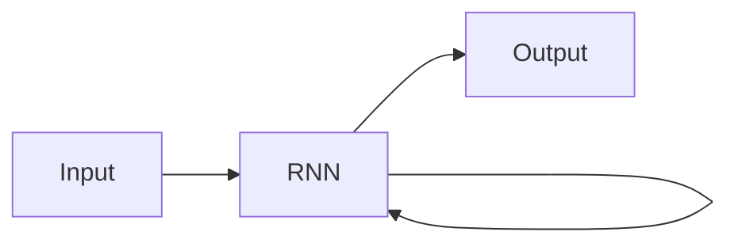

# 递归神经网络 原理与代码实例讲解

作者：禅与计算机程序设计艺术 / Zen and the Art of Computer Programming 

关键词：递归神经网络、深度学习、时间序列、长短期记忆网络、门控循环单元、双向 RNN、序列到序列模型

## 1. 背景介绍

### 1.1  问题的由来

随着人工智能技术的快速发展,处理序列数据的需求日益增长。传统的前馈神经网络在处理序列数据时存在局限性,难以捕捉数据中的长期依赖关系。为了解决这一问题,递归神经网络(Recurrent Neural Network, RNN)应运而生。

### 1.2  研究现状

RNN 在自然语言处理、语音识别、机器翻译等领域取得了显著成果。然而,经典的 RNN 模型存在梯度消失和梯度爆炸问题,限制了其处理长序列的能力。为此,研究者提出了长短期记忆网络(LSTM)和门控循环单元(GRU)等改进模型。此外,双向 RNN 和序列到序列模型等变体也被广泛应用。

### 1.3  研究意义

深入研究 RNN 的原理和实现,对于理解和应用这一强大的深度学习模型至关重要。通过剖析 RNN 的内部机制,我们可以更好地把握其优势和局限,从而设计出更加高效、鲁棒的序列模型。同时,RNN 的代码实现也是每个深度学习实践者必须掌握的技能。

### 1.4  本文结构

本文将从以下几个方面深入探讨 RNN:

1. 介绍 RNN 的核心概念与变体模型之间的联系
2. 详细讲解 RNN 的核心算法原理和具体操作步骤
3. 构建 RNN 的数学模型,并通过公式推导和案例分析加深理解 
4. 基于 Python 和 TensorFlow 框架,完成 RNN 的代码实现,并解读关键代码
5. 探讨 RNN 在实际场景中的应用,展望其未来发展方向
6. 推荐 RNN 相关的学习资源、开发工具和研究论文
7. 总结 RNN 的研究现状、趋势与挑战,并对未来工作提出展望
8. 归纳 RNN 学习过程中的常见问题,给出解答思路

## 2. 核心概念与联系

RNN 是一类用于处理序列数据的神经网络模型。与前馈神经网络不同,RNN 引入了循环连接,使得网络能够记忆之前的信息,从而更好地捕捉序列中的长期依赖关系。下图展示了一个简单的 RNN 结构:

RNN 主要包括以下几种变体模型:

- 基本 RNN:最经典的 RNN 结构,但容易出现梯度消失和梯度爆炸问题。
- 长短期记忆网络(LSTM):引入了门控机制,有效缓解了梯度问题,成为最流行的 RNN 变体。
- 门控循环单元(GRU):LSTM 的简化版本,参数更少,训练更快,同样能够处理长序列。
- 双向 RNN(Bi-RNN):同时考虑序列的前向和后向信息,适用于一些特定任务。
- 深层 RNN:通过增加 RNN 的层数,提升模型的表达能力。
- 序列到序列模型(Seq2Seq):由编码器和解码器两个 RNN 组成,广泛用于机器翻译等任务。

这些变体模型在结构和性能上有所不同,但都继承了 RNN 处理序列数据的核心思想。

## 3. 核心算法原理 & 具体操作步骤

### 3.1  算法原理概述

RNN 的核心思想是在时间维度上共享参数。具体而言,对于序列中的每个时间步,RNN 接收当前时刻的输入和上一时刻的隐藏状态,并输出当前时刻的隐藏状态和预测结果。通过循环连接,RNN 可以将之前时刻的信息传递到当前时刻,实现对序列的建模。

### 3.2  算法步骤详解

以一个简单的 RNN 为例,其前向传播过程可以分为以下步骤:

1. 初始化隐藏状态 $h_0$
2. 对于每个时间步 $t=1,2,...,T$:
   - 将当前时刻的输入 $x_t$ 和上一时刻的隐藏状态 $h_{t-1}$ 拼接成向量 $[x_t, h_{t-1}]$
   - 将拼接后的向量通过权重矩阵 $W$ 和偏置向量 $b$ 进行线性变换,得到中间结果 $z_t$
   - 对 $z_t$ 应用激活函数(通常为双曲正切函数 tanh),得到当前时刻的隐藏状态 $h_t$
   - 将 $h_t$ 通过输出层进行线性变换和激活,得到当前时刻的输出 $y_t$
3. 返回所有时间步的输出序列 $[y_1, y_2, ..., y_T]$

反向传播过程则需要考虑时间维度上的梯度累积,通常使用 BPTT 算法进行训练。

### 3.3  算法优缺点

RNN 的主要优点包括:

- 能够处理任意长度的序列数据
- 通过参数共享,大大减少了模型的参数量
- 可以捕捉序列中的长期依赖关系

但 RNN 也存在一些缺点:

- 容易出现梯度消失和梯度爆炸问题,难以捕捉长期依赖
- 训练速度较慢,对序列长度敏感
- 无法并行计算,内存占用大

针对这些缺点,研究者提出了各种改进方案,如 LSTM、GRU 等门控机制,以及梯度裁剪、层归一化等训练技巧。

### 3.4  算法应用领域

RNN 在以下领域得到了广泛应用:

- 自然语言处理:语言模型、情感分析、命名实体识别等
- 语音识别:声学模型、语言模型等
- 机器翻译:将源语言序列转换为目标语言序列
- 时间序列预测:股票价格预测、天气预报等
- 推荐系统:基于用户行为序列的个性化推荐

此外,RNN 还被用于图像描述、视频分析、手写识别等任务。随着研究的不断深入,RNN 的应用领域也在不断拓展。

## 4. 数学模型和公式 & 详细讲解 & 举例说明

### 4.1  数学模型构建

为了更好地理解 RNN 的内部机制,我们需要建立其数学模型。以一个简单的 RNN 为例,其数学表达式如下:

$$h_t = \tanh(W_{xh}x_t + W_{hh}h_{t-1} + b_h)$$

$$y_t = \text{softmax}(W_{hy}h_t + b_y)$$

其中,$x_t$ 为 $t$ 时刻的输入向量,$h_t$ 为 $t$ 时刻的隐藏状态向量,$y_t$ 为 $t$ 时刻的输出向量。$W_{xh}$、$W_{hh}$、$W_{hy}$ 分别为输入到隐藏层、隐藏层到隐藏层、隐藏层到输出层的权重矩阵,$b_h$ 和 $b_y$ 为隐藏层和输出层的偏置向量。$\tanh$ 为双曲正切激活函数,softmax 为输出层的激活函数。

### 4.2  公式推导过程

为了推导 RNN 的前向传播和反向传播公式,我们需要定义一些中间变量:

$$z_t = W_{xh}x_t + W_{hh}h_{t-1} + b_h$$

$$h_t = \tanh(z_t)$$

$$o_t = W_{hy}h_t + b_y$$

$$y_t = \text{softmax}(o_t)$$

前向传播过程即为依次计算以上四个公式。反向传播则需要计算损失函数对各个参数的梯度。以均方误差损失函数为例:

$$L = \frac{1}{2}\sum_{t=1}^T \Vert y_t - \hat{y}_t \Vert^2$$

其中,$\hat{y}_t$ 为 $t$ 时刻的真实标签。根据链式法则,我们可以推导出损失函数对各个参数的梯度:

$$\frac{\partial L}{\partial W_{hy}} = \sum_{t=1}^T \frac{\partial L}{\partial o_t} \frac{\partial o_t}{\partial W_{hy}} = \sum_{t=1}^T (y_t - \hat{y}_t) h_t^T$$

$$\frac{\partial L}{\partial b_y} = \sum_{t=1}^T \frac{\partial L}{\partial o_t} \frac{\partial o_t}{\partial b_y} = \sum_{t=1}^T (y_t - \hat{y}_t)$$

$$\frac{\partial L}{\partial h_t} = \frac{\partial L}{\partial o_t} \frac{\partial o_t}{\partial h_t} + \frac{\partial L}{\partial h_{t+1}} \frac{\partial h_{t+1}}{\partial h_t} = W_{hy}^T (y_t - \hat{y}_t) + W_{hh}^T \frac{\partial L}{\partial z_{t+1}} \odot (1 - h_{t+1}^2)$$

$$\frac{\partial L}{\partial W_{hh}} = \sum_{t=1}^T \frac{\partial L}{\partial z_t} \frac{\partial z_t}{\partial W_{hh}} = \sum_{t=1}^T \frac{\partial L}{\partial h_t} \odot (1 - h_t^2) h_{t-1}^T$$

$$\frac{\partial L}{\partial W_{xh}} = \sum_{t=1}^T \frac{\partial L}{\partial z_t} \frac{\partial z_t}{\partial W_{xh}} = \sum_{t=1}^T \frac{\partial L}{\partial h_t} \odot (1 - h_t^2) x_t^T$$

$$\frac{\partial L}{\partial b_h} = \sum_{t=1}^T \frac{\partial L}{\partial z_t} \frac{\partial z_t}{\partial b_h} = \sum_{t=1}^T \frac{\partial L}{\partial h_t} \odot (1 - h_t^2)$$

其中,$\odot$ 表示按元素相乘。注意到隐藏层的梯度 $\frac{\partial L}{\partial h_t}$ 包含了两项,一项来自输出层,另一项来自下一时刻的隐藏层。这体现了 RNN 在时间维度上的梯度传递。

### 4.3  案例分析与讲解

为了直观理解 RNN 的计算过程,我们来分析一个简单的案例。假设输入序列为 $[x_1, x_2, x_3]$,其中每个 $x_t$ 都是一个 2 维向量。隐藏层和输出层的维度分别为 3 和 1。我们令初始隐藏状态 $h_0 = [0, 0, 0]^T$。

首先,我们计算第一个时间步的隐藏状态和输出:

$$z_1 = W_{xh}x_1 + W_{hh}h_0 + b_h$$

$$h_1 = \tanh(z_1)$$

$$o_1 = W_{hy}h_1 + b_y$$

$$y_1 = \text{sigmoid}(o_1)$$

接着,我们计算第二个时间步的隐藏状态和输出:

$$z_2 = W_{xh}x_2 + W_{hh}h_1 + b_h$$

$$h_2 = \tanh(z_2)$$

$$o_2 = W_{hy}h_2 + b_y$$

$$y_2 = \text{sigmoid}(o_2)$$

最后,我们计算第三个时间步的隐藏状态和输出:

$$z_3 = W_{xh}x_3 + W_{hh}h_2 + b_h$$

$$h_3 = \tanh(z_3)$$

$$o_3 = W_{hy}h_3 + b_y$$

$$y_3 = \text{sigmoid}(o_3)$$

通过这个过程,我们得到了输出序列 $[y_1, y_2, y_3]$。可以看到,每个时间步的隐藏状态都受到了之前时间步的影响,体现了 RNN 对序列的建模能力。

### 4.4  常见问题解答

1. RNN 中的梯度