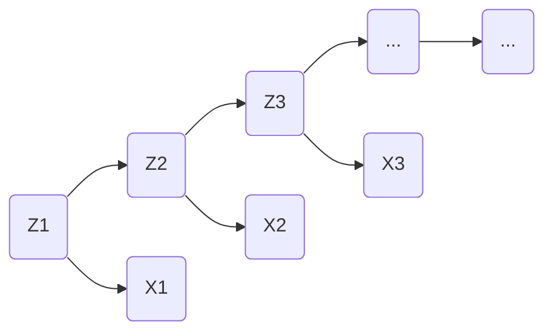

# 隐马尔可夫模型 (Hidden Markov Models, HMM) 原理与代码实例讲解

作者：禅与计算机程序设计艺术 / Zen and the Art of Computer Programming

关键词：隐马尔可夫模型、HMM、概率图模型、时间序列、机器学习

## 1. 背景介绍
### 1.1 问题的由来
在现实世界中,我们经常会遇到一些复杂的时间序列数据,例如语音信号、自然语言文本、生物序列等。这些数据通常具有一定的时序关系和内在规律,但是这种规律往往是隐藏在数据背后的,不易被直接观测到。如何从这些复杂的观测数据中有效地学习到其内在的隐藏状态和转移规律,一直是机器学习和数据挖掘领域的一个重要研究课题。

### 1.2 研究现状
隐马尔可夫模型(Hidden Markov Models, HMM)作为一种经典的概率图模型,为解决上述问题提供了一个强大的理论框架。自20世纪60年代提出以来,HMM在语音识别、自然语言处理、生物信息学等领域得到了广泛应用,并取得了显著的成果。近年来,随着深度学习的兴起,一些研究者尝试将HMM与深度神经网络相结合,以进一步提升模型的表达能力和学习性能。

### 1.3 研究意义
深入理解HMM的理论基础和实现原理,对于我们掌握时间序列建模的基本思路和方法具有重要意义。通过学习HMM,我们可以更好地理解如何利用概率图模型来刻画复杂系统的不确定性和动态变化,并为进一步学习其他高级模型(如条件随机场、递归神经网络等)打下坚实的基础。此外,HMM也为我们提供了一种简洁而又优雅的建模范式,即如何通过隐变量来捕捉数据的内在结构和规律性。

### 1.4 本文结构
本文将从以下几个方面对HMM进行系统性介绍：首先,我们将明确HMM要解决的核心问题,并梳理其与其他相关概念之间的联系。然后,我们将详细讲解HMM的数学定义和三个基本问题,给出相应的算法流程和代码实现。接着,我们将通过一个实际案例来演示HMM的具体应用。最后,我们总结HMM的特点、局限性以及未来的研究方向。

## 2. 核心概念与联系
隐马尔可夫模型是一种用于描述含有隐藏状态的随机过程的概率模型。它的核心思想是,一个事物在每个时刻都处于某个状态,但这些状态是无法直接观测到的,我们只能观测到状态产生的一些外在表现。HMM通过隐状态间的转移概率和隐状态到观测状态的发射概率来刻画整个系统的统计特性。

与HMM密切相关的概念包括:
- 马尔可夫过程:描述状态之间转移的随机过程,当前状态只与前一状态有关。
- 观测序列:由隐状态生成的一系列观测值。
- 转移概率:隐状态之间转移的条件概率。
- 发射概率:由隐状态生成各个观测值的条件概率。

下图给出了HMM的图模型表示:

其中,Z表示隐状态,X表示观测状态,箭头表示依赖关系。可见,HMM是一个有向无环图,由状态序列和观测序列组成。

## 3. 核心算法原理 & 具体操作步骤
### 3.1 算法原理概述
HMM的三个基本问题是其算法的核心,分别为:

1. 评估问题(Evaluation):给定模型参数和观测序列,计算观测序列出现的概率。
2. 解码问题(Decoding):给定模型参数和观测序列,推断最可能的隐状态序列。 
3. 学习问题(Learning):给定观测序列,估计模型参数使得该序列出现的概率最大。

其中,评估问题可用前向算法求解,解码问题可用维特比算法求解,学习问题可用前向-后向算法(Baum-Welch算法)求解。

### 3.2 算法步骤详解

#### 前向算法
1. 输入:HMM模型参数$\lambda=(A,B,\pi)$,观测序列$O=(o_1,o_2,...,o_T)$
2. 初始化:$\alpha_1(i)=\pi_ib_i(o_1), i=1,2,...,N$  
3. 递推:对$t=2,3,...,T$:
$$\alpha_t(i) = \left[\sum_{j=1}^N \alpha_{t-1}(j)a_{ji}\right]b_i(o_t), i=1,2,...,N$$
4. 终止:$P(O|\lambda)=\sum_{i=1}^N\alpha_T(i)$

其中,$\alpha_t(i)$表示在时刻$t$处于状态$i$且观测到$o_1,o_2,...,o_t$的概率。

#### 维特比算法
1. 输入:HMM模型参数$\lambda=(A,B,\pi)$,观测序列$O=(o_1,o_2,...,o_T)$
2. 初始化:$\delta_1(i)=\pi_ib_i(o_1), i=1,2,...,N$
3. 递推:对$t=2,3,...,T$:
$$\delta_t(i) = \max_{1\leq j\leq N}\left[\delta_{t-1}(j)a_{ji}\right]b_i(o_t), i=1,2,...,N$$
4. 终止:$P^*=\max_{1\leq i\leq N}\delta_T(i)$,找到最优路径的终点$i_T^*=\arg\max_{1\leq i\leq N}\delta_T(i)$
5. 回溯:对$t=T-1,T-2,...,1$:
$$i_t^* = \arg\max_{1\leq i\leq N}\left[\delta_t(i)a_{ii_{t+1}^*}\right]$$

其中,$\delta_t(i)$表示在时刻$t$处于状态$i$且观测到$o_1,o_2,...,o_t$的最大概率。

#### Baum-Welch算法
1. 输入:观测序列$O=(o_1,o_2,...,o_T)$,初始模型参数
2. 计算前向概率$\alpha_t(i)$和后向概率$\beta_t(i)$:
$$\beta_t(i)=\sum_{j=1}^Na_{ij}b_j(o_{t+1})\beta_{t+1}(j), t=T-1,T-2,...,1$$
3. 计算$\gamma_t(i)$和$\xi_t(i,j)$:
$$\gamma_t(i)=P(i_t=q_i|O,\lambda)=\frac{\alpha_t(i)\beta_t(i)}{P(O|\lambda)}$$
$$\xi_t(i,j)=P(i_t=q_i,i_{t+1}=q_j|O,\lambda)=\frac{\alpha_t(i)a_{ij}b_j(o_{t+1})\beta_{t+1}(j)}{P(O|\lambda)}$$
4. 更新模型参数:
$$\overline{\pi}_i=\gamma_1(i)$$
$$\overline{a}_{ij}=\frac{\sum_{t=1}^{T-1}\xi_t(i,j)}{\sum_{t=1}^{T-1}\gamma_t(i)}$$
$$\overline{b}_j(k)=\frac{\sum_{t=1,o_t=v_k}^T\gamma_t(j)}{\sum_{t=1}^T\gamma_t(j)}$$
5. 重复步骤2-4直到收敛。

### 3.3 算法优缺点
HMM的主要优点在于:
- 概率框架完备,可以灵活地加入先验知识。
- 训练和预测的计算复杂度较低。
- 对观测噪声有一定的鲁棒性。

其缺点包括:
- 假设的独立性和齐次马尔可夫性在实际问题中往往不成立。
- 容易陷入局部最优,对初始参数敏感。
- 隐状态数需要预先确定,缺乏自适应能力。

### 3.4 算法应用领域
HMM在以下领域得到了广泛应用:
- 语音识别:将语音信号建模为HMM,每个隐状态对应一个语音单元。
- 自然语言处理:用HMM对词性标注、命名实体识别等任务建模。  
- 生物信息学:用profile-HMM描述多序列比对,预测蛋白质家族等。
- 故障诊断:工业系统的状态监测与故障预警。

## 4. 数学模型和公式 & 详细讲解 & 举例说明
### 4.1 数学模型构建
HMM由以下五个部分组成:

1. 隐状态集合$Q=\{q_1,q_2,...,q_N\}$,其中$N$为可能的隐状态数。
2. 观测状态集合$V=\{v_1,v_2,...,v_M\}$,其中$M$为可能的观测状态数。
3. 状态转移概率矩阵$A=[a_{ij}]_{N\times N}$,其中$a_{ij}=P(i_{t+1}=q_j|i_t=q_i)$表示从状态$q_i$转移到状态$q_j$的概率。
4. 观测概率矩阵$B=[b_j(k)]_{N\times M}$,其中$b_j(k)=P(o_t=v_k|i_t=q_j)$表示在状态$q_j$下生成观测$v_k$的概率。
5. 初始状态概率向量$\pi=(\pi_1,\pi_2,...,\pi_N)$,其中$\pi_i=P(i_1=q_i)$为初始时刻处于状态$q_i$的概率。

一个HMM可以表示为$\lambda=(A,B,\pi)$。HMM做了两个基本假设:
1. 齐次马尔可夫性假设:隐状态的转移只与前一时刻的状态有关,即$P(i_t|i_{t-1},o_{t-1},...,i_1,o_1)=P(i_t|i_{t-1})$。
2. 观测独立性假设:某一时刻的观测只与该时刻的隐状态有关,即$P(o_t|i_T,o_T,...,i_{t+1},o_{t+1},i_t,i_{t-1},o_{t-1},...,i_1,o_1)=P(o_t|i_t)$。

### 4.2 公式推导过程
以下是HMM中几个重要公式的推导过程。

观测序列概率:
$$P(O|\lambda)=\sum_I P(O|I,\lambda)P(I|\lambda)$$
其中,$I=(i_1,i_2,...,i_T)$为隐状态序列,$O=(o_1,o_2,...,o_T)$为观测序列。

根据观测独立性假设和齐次马尔可夫性假设,可得:
$$P(O|\lambda)=\sum_{i_1,i_2,...,i_T}\pi_{i_1}b_{i_1}(o_1)a_{i_1i_2}b_{i_2}(o_2)...a_{i_{T-1}i_T}b_{i_T}(o_T)$$

前向概率$\alpha_t(i)$的递推公式:
$$\alpha_t(i)=P(o_1,o_2,...,o_t,i_t=q_i|\lambda)$$
$$=\sum_{j=1}^N P(o_1,o_2,...,o_{t-1},i_{t-1}=q_j|\lambda)P(o_t|i_t=q_i)P(i_t=q_i|i_{t-1}=q_j)$$
$$=\left[\sum_{j=1}^N \alpha_{t-1}(j)a_{ji}\right]b_i(o_t)$$

后向概率$\beta_t(i)$的递推公式:
$$\beta_t(i)=P(o_{t+1},o_{t+2},...,o_T|i_t=q_i,\lambda)$$
$$=\sum_{j=1}^N P(o_{t+1}|i_{t+1}=q_j)P(i_{t+1}=q_j|i_t=q_i)P(o_{t+2},o_{t+3},...,o_T|i_{t+1}=q_j,\lambda)$$
$$=\sum_{j=1}^Na_{ij}b_j(o_{t+1})\