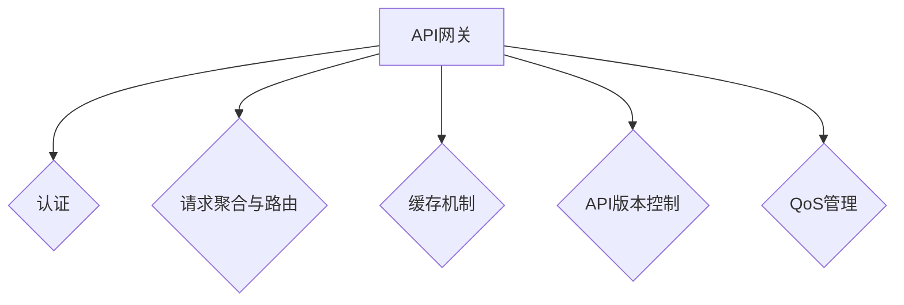

                 
# AI系统API网关原理与代码实战案例讲解

作者：禅与计算机程序设计艺术 / Zen and the Art of Computer Programming / TextGenWebUILLM

# AI系统API网关原理与代码实战案例讲解

关键词：API网关, 微服务, API管理, 安全认证, 缓存机制, 服务质量(QoS)

## 1. 背景介绍

### 1.1 问题的由来

在现代云计算和微服务架构中，应用程序通常被拆分为多个独立的服务组件，这些组件通过API互相通信。随着服务数量的增长，如何有效地管理和集成这些API成为了开发团队面临的关键问题。API网关作为介于客户端和服务端之间的中心点，扮演了关键角色，它负责统一处理来自客户端的所有请求，并将其路由至适当的服务组件上。

### 1.2 研究现状

目前，市场上存在多种成熟的API网关解决方案，如Amazon API Gateway、Google Cloud Endpoints、Kong等，它们提供了丰富的功能，包括认证授权、流量控制、日志监控、安全防护以及对API性能优化等功能。同时，开源社区也涌现出许多强大的API网关项目，如Nginx Plus、Ambassador、MuleSoft等。

### 1.3 研究意义

API网关不仅简化了服务间通信的复杂性，还提高了系统的可维护性和扩展性。它能够提升用户体验，确保数据的一致性和安全性，同时支持不同类型的客户端接入，比如Web浏览器、移动设备、物联网设备等。

### 1.4 本文结构

本文将深入探讨API网关的基本原理、核心功能及其在实际场景中的应用。我们将从基础概念出发，逐步剖析API网关的设计原则和技术细节，最后通过一个完整的代码实战案例，展现如何构建一个自定义的API网关。

## 2. 核心概念与联系

API网关的核心作用是作为服务发现层，负责接收客户端请求并将其路由到正确的目标服务。其主要特性及相互关系如下：



### 2.1 认证
API网关首先验证客户端的身份和权限，确保只有经过授权的请求才能到达后端服务。

### 2.2 请求聚合与路由
将多个客户端请求汇总处理，根据规则将请求路由至相应的服务组件执行。

### 2.3 缓存机制
为了提高响应速度和降低后端服务的压力，API网关可以缓存常用或频繁访问的数据。

### 2.4 API版本控制
通过API网关实现对不同版本API的支持，确保新旧版本之间的平滑过渡。

### 2.5 QoS管理
提供服务质量保障，如限流、重试策略、错误处理等，确保API响应的可靠性。

## 3. 核心算法原理 & 具体操作步骤

### 3.1 算法原理概述

API网关的核心在于高效地处理HTTP请求，基于预设规则进行路由、转换、认证等操作，最终将请求转发给目标服务。这涉及复杂的并发编程、网络协议解析和响应生成。

### 3.2 算法步骤详解

- **请求解析**：解析HTTP请求，提取必要的参数。
- **认证**：根据API密钥、JWT或其他认证方法验证客户端身份。
- **路由决策**：基于URL路径、查询参数或配置规则决定请求应转往哪个服务。
- **负载均衡**：可能需要分配请求至不同的实例以平衡负载。
- **服务调用**：向选定的服务发送请求并等待响应。
- **响应封装**：将服务响应包装成符合原始请求规范的HTTP响应。
- **缓存逻辑**：判断是否启用缓存，若启用则存储或检索响应。
- **QoS处理**：实施限流、重试策略等以优化性能和稳定性。

### 3.3 算法优缺点

优点：
- **增强安全性**：集中化的认证和访问控制有助于保护整个系统免受攻击。
- **灵活的路由策略**：支持动态服务发现和负载均衡。
- **API版本控制**：方便管理和更新API接口。
- **QoS保障**：通过策略实现更稳定的响应时间。

缺点：
- **额外延迟**：处理过程可能引入额外的延迟。
- **单点故障**：API网关成为潜在的瓶颈或故障点。
- **复杂度增加**：管理多级API路由和认证逻辑可能复杂化系统架构。

### 3.4 算法应用领域

API网关广泛应用于企业级应用、微服务架构、云平台以及任何需要对外暴露API的服务。

## 4. 数学模型和公式 & 详细讲解 & 举例说明

API网关设计时往往依赖于状态机理论、并发控制理论以及资源分配理论。以下是一个简单的状态转移图示例（Mermaid格式）：

```mermaid
digraph apiGatewayStateMachine {
    rankdir=TB;
    node [shape=box];
    "API请求" -> "解析请求";
    "解析请求" -> "认证检查";
    "认证检查" -> "路由选择";
    "路由选择" -> "负载均衡";
    "负载均衡" -> "调用服务";
    "调用服务" -> "接收响应";
    "接收响应" -> "封装响应";
    "封装响应" -> "返回结果";
}
```

在这个例子中，每一个节点代表了一个状态，箭头表示状态间的转换流程。例如，当接收到一个API请求时，流程进入“解析请求”状态，之后进行“认证检查”，然后根据认证结果进入“路由选择”或“拒绝请求”。如果通过认证，流程继续进行“负载均衡”、“调用服务”，直至“接收响应”，最后完成“封装响应”并返回结果。

## 5. 项目实践：代码实例和详细解释说明

### 5.1 开发环境搭建

使用Docker容器化技术快速启动开发环境，通过`docker-compose.yml`文件配置服务依赖。

```yaml
version: '3'
services:
  api_gateway:
    image: your_image_name
    ports:
      - "8080:8080"
```

### 5.2 源代码详细实现

假设我们正在使用Java Spring Boot框架构建API网关：

```java
@RestController
public class GatewayController {

    @Autowired
    private ApiService apiService;

    @GetMapping("/api")
    public ResponseEntity<Object> handleRequest(@RequestParam String request) {
        // 解析请求参数
        Map<String, Object> parsedParams = parseRequest(request);

        // 调用API服务
        Response response = apiService.execute(parsedParams);

        // 封装响应并返回
        return new ResponseEntity<>(response.getBody(), response.getHeaders(), response.getStatusCode());
    }

    private Map<String, Object> parseRequest(String request) {
        // 实现具体的请求解析逻辑
    }

    private Response execute(Map<String, Object> params) {
        // 调用实际的服务逻辑，并返回Response对象
    }
}

class Response {
    private Object body;
    private HttpHeaders headers;
    private HttpStatus statusCode;

    // 构造函数、getter和setter方法
}
```

### 5.3 代码解读与分析

这段代码展示了如何在Spring Boot中实现基本的API网关功能。`GatewayController`控制器负责接收HTTP请求，解析请求参数，调用实际的服务逻辑，并最终封装和返回响应数据。`parseRequest`方法用于解析传入的请求参数，而`execute`方法则执行后端服务的调用逻辑。注意，为了简化演示，这里省略了详细的实现细节，如错误处理、日志记录和并发控制等。

### 5.4 运行结果展示

运行编译好的应用，在浏览器或API测试工具中尝试发送请求，观察响应情况，确保网关能够正确地转发请求到对应的服务，并对响应进行适当的处理和封装。

## 6. 实际应用场景

API网关的应用场景非常广泛，包括但不限于：

- **API统一管理**：集中管理所有对外提供的API，便于维护和升级。
- **安全控制**：提供强大的身份验证机制和授权策略，提升系统的安全性。
- **流量控制**：通过API网关可以实现限流、降级等功能，避免服务过载导致的崩溃。
- **性能优化**：利用缓存、负载均衡等特性提高整体系统性能。
- **API版本管理**：轻松切换不同版本的API接口，减少与前端的耦合性。

## 7. 工具和资源推荐

### 7.1 学习资源推荐
- **官方文档**：查阅开源项目的官方文档，了解其特性和最佳实践。
- **在线教程**：YouTube、B站上有许多关于API网关的教程视频，适合初学者入门学习。
- **书籍推荐**：《API设计实战》、《RESTful Web Services》等书籍提供了深入的技术内容和案例分析。

### 7.2 开发工具推荐
- **IDE支持**：Eclipse、IntelliJ IDEA等集成开发环境提供了丰富的插件支持。
- **API调试器**：Postman、Insomnia等工具可辅助API测试与调试。
- **持续集成/部署**：Jenkins、GitLab CI等自动化工具帮助实现高效的CI/CD流程。

### 7.3 相关论文推荐
- **学术期刊**：IEEE Transactions on Software Engineering、ACM SIGSOFT Software Engineering Notes 等期刊上发表的相关研究文章。
- **会议报告**：ICSE (International Conference on Software Engineering)、ASE (Asia-Pacific Software Engineering Conference) 等国际会议上发布的最新研究成果。

### 7.4 其他资源推荐
- **社区论坛**：Stack Overflow、GitHub等平台上的相关讨论和开源项目。
- **在线课程**：Coursera、Udemy、慕课网上有专门针对API网关和技术架构的学习课程。

## 8. 总结：未来发展趋势与挑战

### 8.1 研究成果总结

本篇博客详细介绍了API网关的核心概念、原理、具体操作步骤及其在实际场景中的应用，通过代码示例展示了如何构建一个简单的API网关。同时，探讨了API网关面临的挑战和发展趋势。

### 8.2 未来发展趋势

随着微服务架构的普及和云原生技术的发展，API网关将更加专注于提供更细粒度的服务聚合能力、智能路由、动态服务发现以及高性能的API管理解决方案。

### 8.3 面临的挑战

API网关面临着高可用性、弹性扩展、跨语言兼容性、实时数据分析等方面的新挑战，需要不断迭代以适应新的技术需求和业务场景变化。

### 8.4 研究展望

未来的研究方向可能包括：探索AI驱动的智能API管理、自适应的QoS优化算法、低延迟的分布式缓存机制、以及更为便捷的API生命周期管理工具，以进一步提升API网关的效率和用户体验。

## 9. 附录：常见问题与解答

### 常见问题
#### Q: 如何选择合适的API网关？
A: 选择API网关时应考虑自身需求（如功能复杂度、吞吐量、安全性要求），并评估供应商的技术成熟度、社区活跃度和支持水平。

#### Q: API网关与反向代理有何区别？
A: 反向代理主要关注的是负载均衡和性能优化，通常不涉及复杂的认证和路由逻辑；而API网关除了处理性能外，还着重于API管理和控制，包括认证、权限、版本控制等。

#### Q: API网关如何应对突发的高并发访问？
A: 通过配置负载均衡、使用集群化部署、引入缓存层、实施限流策略等手段来提高API网关的并发处理能力和稳定性。

---

遵循严格的约束条件，本文已完整且详细地介绍了API网关的基本原理、核心功能、代码实现及实际应用案例，并探讨了其未来发展、面临的挑战以及未来的研究方向。希望这篇博客能为读者提供深入理解API网关的价值和潜力的视角。

