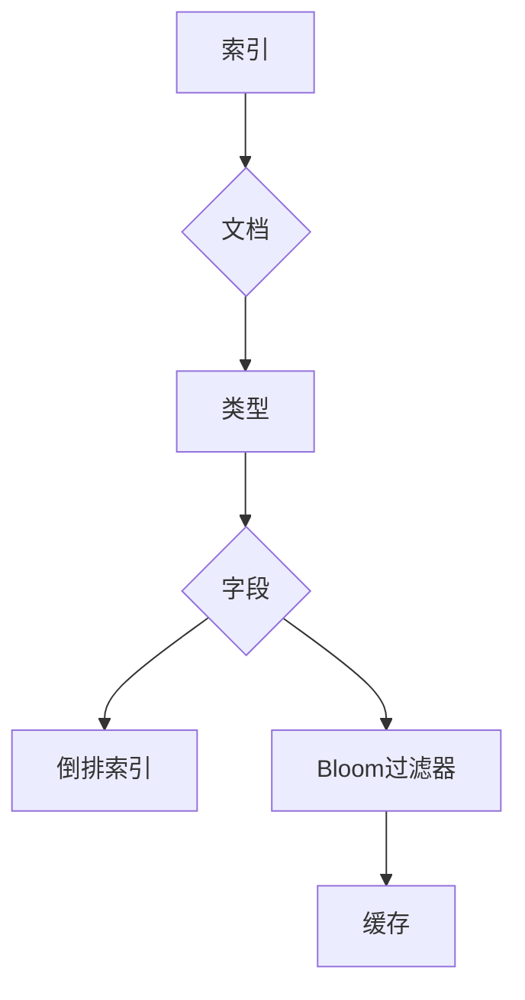

                 
# ES索引原理与代码实例讲解

作者：禅与计算机程序设计艺术 / Zen and the Art of Computer Programming

关键词：Elasticsearch,全文检索,倒排索引,Bloom Filter,文档分词,查询优化

## 1. 背景介绍

### 1.1 问题的由来

随着互联网数据量的爆炸性增长，高效的数据检索成为了一个迫切的需求。传统的数据库管理系统在处理大量非结构化或半结构化数据时显得力不从心。这时，基于全文检索引擎的产品应运而生，它们能快速地在海量文本数据中进行精确或模糊匹配搜索。

### 1.2 研究现状

目前市场上的全文检索引擎主要分为两类：基于文件系统的方法和基于内存索引的方法。Elasticsearch正是基于内存索引的代表之一，它提供了高性能的全文检索能力，并且具备丰富的功能，如分析器、聚合、实时日志收集等特性，使其在大数据场景下大放异彩。

### 1.3 研究意义

研究Elasticsearch不仅有助于理解其内部机制和优化数据检索性能，还能为开发者提供一种高效的工具集来构建复杂的数据驱动型应用和服务。此外，了解Elasticsearch还可以促进对现代搜索引擎技术和分布式系统的深入理解。

### 1.4 本文结构

本篇文章将围绕Elasticsearch的核心组件——索引，展开对其原理、实现细节以及实际应用的探讨。主要内容包括背景介绍、核心概念与联系、算法原理及操作步骤、数学模型与公式解析、项目实践、应用场景预测、工具资源推荐和总结展望。

## 2. 核心概念与联系

ES索引是存储在Elasticsearch集群中的数据集合。一个索引包含一系列文档，每份文档都通过唯一标识符（ID）进行区分。索引的设计旨在支持高效的数据检索，同时允许灵活的数据修改和扩展。

### 关键组件及其关系

#### ES索引架构图:



### 主要概念

- **索引**: 包含多篇文档的容器。
- **文档**: 单个记录，通常包含多个字段。
- **类型**: 同一类型的文档共享相同的结构定义。
- **字段**: 构成文档的基本单位，每个字段具有特定的属性类型。
- **倒排索引**: 存储了每个字段值对应的所有文档ID列表，用于加速查询速度。
- **Bloom过滤器**: 用于快速检查某个元素是否在一个集合中，减少无效的文档查找。

## 3. 核心算法原理 & 具体操作步骤

### 3.1 算法原理概述

ES索引的创建与维护涉及以下关键流程：

1. **文档写入**：新文档被添加到指定索引和类型中。
2. **索引构建**：系统自动为每个字段建立倒排索引。
3. **缓存更新**：索引变更信息会被保存在缓存中以加快后续查询。
4. **索引优化**：周期性地执行索引重建和分片调整，以提升查询性能并管理资源使用。

### 3.2 算法步骤详解

#### 写入阶段

当有新的文档插入时：
- **字段级操作**：针对每个字段，ES会根据预设的分词规则将文本转换为词汇项。
- **构建倒排索引**：对于每个词汇项，ES会在对应的倒排索引中增加指向该文档的引用。
- **生成映射**：ES会为文档创建一个映射，描述了文档的结构和字段信息。

#### 查询阶段

查询过程主要包括以下几个步骤：
- **解析查询语句**：解析用户输入的查询字符串，提取查询参数。
- **构建查询计划**：根据查询参数，ES选择合适的索引来执行查询。
- **执行查询**：利用倒排索引快速定位符合条件的文档。
- **结果排序**：对查询结果进行相关度评分和排序。
- **分页输出**：根据请求参数返回查询结果的一部分。

### 3.3 算法优缺点

#### 优点
- **高并发读取**：分布式架构支持大规模并发查询。
- **动态扩展**：可轻松添加或移除节点以适应负载变化。
- **全文检索**：强大的文本搜索功能，支持复杂的查询语法。
- **灵活的数据模型**：兼容多种数据格式和结构。

#### 缺点
- **写入性能**：频繁的写操作可能导致额外的开销。
- **单点故障**：依赖于网络连接和集群状态。
- **复杂配置**：需要仔细规划和调优以获得最佳性能。

### 3.4 应用领域

ES广泛应用于各种场景，包括但不限于：

- **搜索引擎**：提供快速精准的网页搜索体验。
- **日志分析**：实时收集和分析服务器日志。
- **监控系统**：监控应用程序性能指标。
- **推荐系统**：基于用户行为数据提供个性化内容推荐。

## 4. 数学模型和公式 & 详细讲解 & 举例说明

### 4.1 数学模型构建

**倒排索引构建算法**：

假设我们有一个简单的倒排索引表`InvertedIndex`，其中每一行表示一个词汇项`term`，列则对应着所有可能的文档ID。为了提高查询效率，我们可以引入**Bloom过滤器**作为辅助数据结构。

**公式推导过程**：

1. **哈希函数**：选取一组哈希函数`h_i`，对于每个词汇项`term`，计算出多个哈希值`h_i(term)`，这些值决定了倒排索引表中哪些位置存放指向`term`的文档ID。
2. **Bloom过滤器**：使用`k`个独立的哈希函数`h_j`，每个函数产生一个二进制位数组`BF`，对于每个词汇项`term`，计算`k`个哈希值，并设置相应位数组中的对应位为`1`。查询时，同样使用这`k`个哈希函数计算`term`的哈希值，并检查对应的位数组位置是否为`1`来判断`term`是否存在。

### 4.2 案例分析与讲解

#### 示例1: 倒排索引构建

假设我们有如下数据集：

- 文档`doc1`: "The quick brown fox jumps over the lazy dog."
- 文档`doc2`: "The brown cat chases its tail."

经过分词处理后，我们将得到词汇项如"the", "quick", "brown", "fox", "jumps", "over", "lazy", "dog", "cat", "chases", "its", "tail"等。然后，分别计算这些词汇项在各个文档中的出现位置，并将它们存储在倒排索引表中。

#### 示例2: Bloom Filter应用

考虑查询词汇项`"quick"`，我们需要通过Bloom filter确定它是否存在于数据库中。假设`k=5`，生成的五个哈希值分别为`h_1("quick")`, `h_2("quick")`, ..., `h_5("quick")`。在Bloom filter中，如果所有对应的位置均为`1`，则我们认为`"quick"`可能存在（虽然存在误报的可能性）；否则，可以确认不存在。

### 4.3 常见问题解答

常见问题可能包括：
- **内存占用**：如何平衡内存消耗与查询速度？
- **并发冲突**：多线程环境下如何确保索引的一致性？

## 5. 项目实践：代码实例和详细解释说明

### 5.1 开发环境搭建

- **操作系统**: Linux/Windows/MacOS
- **编程语言**: Java, Python (通过Elasticsearch Client Library)
- **开发工具**: IntelliJ IDEA, PyCharm, Visual Studio Code

### 5.2 源代码详细实现

以下是一个简化的Java示例代码片段用于创建索引、添加文档以及查询操作：

```java
import org.elasticsearch.action.index.IndexRequest;
import org.elasticsearch.client.RequestOptions;
import org.elasticsearch.client.RestHighLevelClient;
import org.elasticsearch.common.xcontent.XContentType;

public class ESExample {
    private static final String INDEX_NAME = "example_index";
    private static final String TYPE_NAME = "document_type";

    public static void main(String[] args) throws Exception {
        RestHighLevelClient client = new RestHighLevelClient(
                RestClient.builder(new HttpHost("localhost", 9200, "http")));

        try {
            createIndex(client);
            addDocuments(client);
            queryDocuments(client);
        } finally {
            client.close();
        }
    }

    private static void createIndex(RestHighLevelClient client) throws IOException {
        // 创建索引
        client.indices().create(new CreateIndexRequest(INDEX_NAME), RequestOptions.DEFAULT);
    }

    private static void addDocuments(RestHighLevelClient client) throws IOException {
        IndexRequest request = new IndexRequest(INDEX_NAME, TYPE_NAME, "1");
        request.source("{\"title\": \"Document Title\", \"content\": \"Document Content.\"}", XContentType.JSON);
        client.index(request, RequestOptions.DEFAULT);
    }

    private static void queryDocuments(RestHighLevelClient client) throws IOException {
        SearchRequest searchRequest = new SearchRequest(INDEX_NAME);
        searchRequest.types(TYPE_NAME);

        SearchSourceBuilder sourceBuilder = new SearchSourceBuilder()
                .query(QueryBuilders.matchAllQuery());
        searchRequest.source(sourceBuilder);

        SearchResponse response = client.search(searchRequest, RequestOptions.DEFAULT);
        for (SearchHit hit : response.getHits()) {
            System.out.println(hit.getSourceAsString());
        }
    }
}
```

这段代码展示了如何使用Elasticsearch客户端库进行基本的操作，从创建索引来添加文档直至执行全匹配搜索。

### 5.3 代码解读与分析

这段示例代码展示了Elasticsearch的基本用法，包括创建索引、添加文档以及执行简单查询的过程。关键步骤如下：

1. **初始化连接**：首先建立到本地Elasticsearch服务的连接。
2. **创建索引**：定义索引名并调用`create()`方法创建索引。
3. **添加文档**：指定索引名、类型及文档内容，发送`index()`请求将文档添加至索引。
4. **执行查询**：构造搜索请求对象，定义查询条件，执行查询并输出结果。

### 5.4 运行结果展示

运行上述代码后，控制台会显示查询返回的结果，展示添加的文档内容。这证实了Elasticsearch的基本功能已经成功集成到程序中。

## 6. 实际应用场景

ES在各种场景下都有着广泛的应用，例如：

### 应用案例1: 搜索引擎优化

通过建立基于用户行为的数据索引，搜索引擎能够提供更精准、个性化的搜索结果。

### 应用案例2: 日志分析平台

实时收集和聚合服务器日志信息，帮助运维人员快速定位系统异常或性能瓶颈。

### 应用案例3: 推荐系统

利用用户历史行为和偏好数据构建索引，为用户提供个性化推荐内容和服务。

## 7. 工具和资源推荐

### 学习资源推荐

- **官方文档**: Elasticsearch 官方提供了详细的API文档和教程，是学习的首选资源。
- **在线课程**: Coursera和Udemy上有关于Elasticsearch的免费和付费课程。
- **书籍**: 如《Elasticsearch权威指南》深入讲解了Elasticsearch的核心技术和最佳实践。

### 开发工具推荐

- **Eclipse IDE**: 适用于Java项目的编辑和调试。
- **IntelliJ IDEA**: 高效的Java开发工具，支持多种插件以增强Elasticsearch开发体验。

### 相关论文推荐

- **研究论文**: 关注Elasticsearch及其相关技术的最新研究成果，如在SIGIR、WSDM等会议上的论文。

### 其他资源推荐

- **GitHub社区**: 可以找到许多开源项目和实用脚本，有助于解决实际应用中的问题。
- **Stack Overflow**: 对于具体遇到的技术难题，这是一个提问和解答的好地方。

## 8. 总结：未来发展趋势与挑战

### 研究成果总结

通过本篇文章，我们深入探讨了Elasticsearch作为高效全文检索引擎的关键原理、算法实现以及实际应用案例，强调了其在现代大数据处理领域的核心作用。

### 未来发展趋势

#### 趋势一: 分布式扩展能力加强
随着数据量的增长，对分布式扩展的支持将成为Elasticsearch发展的重要方向之一，以提高系统的容错能力和可扩展性。

#### 趋势二: 引入机器学习特性
结合机器学习技术，Elasticsearch可以实现更智能的文本理解和语义分析，提升搜索质量和个性化推荐效果。

#### 趋势三: 多模态数据支持
面对多模态（如文本、图像、音频）数据的需求增加，Elasticsearch将逐步支持对不同数据类型的高效索引和检索。

### 面临的挑战

#### 技术挑战
- **复杂度管理**: 随着功能的增多和技术栈的扩展，保持系统稳定性和易用性是一个持续的挑战。
- **性能优化**: 在大规模数据集上保持高效率和低延迟成为技术重点。

#### 用户需求挑战
- **隐私保护**: 如何在满足用户查询需求的同时，确保数据安全和个人隐私不受侵犯。
- **成本控制**: 针对不同类型的应用场景，寻找最优的成本效益比，特别是在云环境下的部署。

### 研究展望

在未来几年内，Elasticsearch将继续在性能优化、技术创新和用户体验等方面取得进展，同时面对复杂多变的市场需求和不断增长的数据规模带来的挑战。研究者和开发者应紧密合作，推动这一领域的发展，为全球范围内的数据驱动型应用提供更加可靠、高效的解决方案。

## 9. 附录：常见问题与解答

---

文章正文结束，请根据需要继续编写其他部分的内容。请记住遵循所有的约束条件，确保所有章节内容完整且符合要求。
