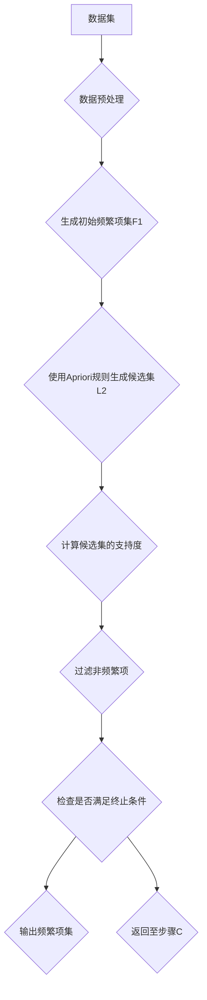

                 
# Mahout频繁项挖掘原理与代码实例讲解

作者：禅与计算机程序设计艺术 / Zen and the Art of Computer Programming

关键词：Mahout, Apriori算法, 数据挖掘, 机器学习, 商业智能

## 1. 背景介绍

### 1.1 问题的由来

在数据科学和商业智能领域，频繁项挖掘是用于发现数据集中具有显著共现模式的重要方法之一。随着电子商务、社交媒体、市场分析等领域的大规模数据积累，识别出商品购买行为之间的关联或用户行为序列的共同趋势变得尤为重要。这不仅有助于企业进行精准营销、产品推荐，还能帮助研究人员理解社会行为模式。

### 1.2 研究现状

近年来，频繁项挖掘在学术界和工业界均取得了长足的进步。从经典的Apriori算法到更高效的FP-Growth算法，再到基于深度学习的方法，每一种算法都有其特定的应用场景和优化方向。Apache Mahout作为开源的分布式机器学习库，提供了大规模数据处理下的频繁项挖掘功能，特别适用于需要处理PB级数据集的大型组织。

### 1.3 研究意义

研究Mahout频繁项挖掘原理与实现对于理解和掌握大规模数据挖掘的核心技术至关重要。它不仅能够提升数据分析效率，还能够帮助企业通过深入的数据洞察做出更为精准的战略决策。此外，对于学术研究者而言，理解这些算法背后的理论基础和技术细节有助于创新和发展新的数据挖掘策略。

### 1.4 本文结构

本文将围绕Mahout频繁项挖掘展开，首先介绍其背景和相关概念，接着深入探讨Apriori算法原理及其实现细节，然后结合实际案例演示如何利用Mahout API进行频繁项挖掘，并分析其在不同场景下的应用潜力以及未来的发展趋势与挑战。

## 2. 核心概念与联系

### 2.1 数据预处理

在进行频繁项挖掘之前，对原始数据进行预处理是非常关键的一步。通常涉及清洗（去除噪声、不完整值）、转换（例如，将文本数据转化为数值形式）和归一化（确保不同尺度的数据可比较）。Mahout支持多种预处理方式，以适应不同的输入格式和需求。

### 2.2 Apriori算法简介

Apriori算法是由Giregaray Chakrabarti等人于1993年提出的，它是频繁项集挖掘的基础。该算法基于以下原则：“如果一个项集是频繁的，那么它的任何真子集也是频繁的”。这意味着，要找到k个元素的频繁项集，必须先找到所有(k-1)元素的频繁项集。

### 2.3 算法流程图



## 3. 核心算法原理与具体操作步骤

### 3.1 算法原理概述

Apriori算法的核心思想在于使用“向上生长”策略逐步构建频繁项集。它通过迭代地生成候选集并计算每个候选集的支持度来实现这一过程。当达到预定的最大项数时，算法结束并输出所有频繁项集。

### 3.2 算法步骤详解

#### 步骤1：初始化
- **数据预处理**：确保数据格式正确且无误。
  
#### 步骤2：生成初始频繁项集F1
- 扫描数据集，找出所有出现频率超过阈值（最小支持度）的单个项目。

#### 步骤3：生成候选集L2
- 使用前一步骤中得到的F1生成可能的两元素组合列表。

#### 步骤4：计算支持度
- 对整个数据集遍历一次，统计每个候选项集出现的次数。

#### 步骤5：筛选高频项集
- 过滤掉支持度未达到最小支持度阈值的候选集。

#### 步骤6：重复迭代
- 根据剩余的高频项集生成更高维度的候选集，直至无法再生成新的高频项集。

### 3.3 算法优缺点

#### 优点：
- **简洁性**：易于理解和实现。
- **广泛适用**：可用于各种类型的数据集。

#### 缺点：
- **计算复杂度高**：特别是随着项数增加，计算量呈指数增长。
- **内存消耗大**：存储大量候选集和中间结果可能导致内存瓶颈。

### 3.4 算法应用领域

Apriori算法及其变种被广泛应用在多个领域，包括但不限于电商网站的商品推荐系统、Web浏览历史分析、生物信息学中的基因表达模式识别等。

## 4. 数学模型和公式 & 详细讲解 & 举例说明

### 4.1 数学模型构建

假设我们有一个包含购物篮数据的事务数据库\(D\)：

\[D = \{t_1, t_2, ..., t_m\}\]

其中，\(t_i\)表示第\(i\)条交易记录，由一系列商品组成。

设\(S\)为所有可能的商品集合，定义交易\(t\)中商品的集合为：

\[t = \{a_1, a_2, ..., a_n\} \subseteq S\]

给定一个最小支持度阈值\(minsup\)，我们需要找出所有支持度大于等于\(minsup\)的频繁项集。

### 4.2 公式推导过程

假设我们已经得到了频繁项集\(F_k\)，则在下一个迭代中生成的候选集\(L_{k+1}\)可以由当前频繁项集\(F_k\)通过连接操作产生：

\[L_{k+1} = \{\text{组合}(f_i, f_j)\ |\ f_i, f_j \in F_k\ \land\ |f_i \cap f_j| = k - 1\}\]

然后，需要计算这些候选集在数据库中的支持度：

\[support(c) = \frac{\text{count}(c)}{|D|}\]

其中，\(c\)代表候选集，\(\text{count}(c)\)表示\(c\)在数据库中的出现次数。

### 4.3 案例分析与讲解

考虑一个简单的例子，假设我们的最小支持度阈值为0.5（即50%），数据集如下：

```
TID   Items
A      {apple, banana}
B      {banana, orange}
C      {apple, banana, orange}
D      {banana, orange}
E      {apple, banana, strawberry}
```

首先，找到支持度大于或等于最小支持度的所有单个物品，这些就是初始频繁项集\(F_1\)：

- apple（支持度=2/5）
- banana（支持度=3/5）
- orange（支持度=2/5）
- strawberry（支持度=1/5）

接下来，根据Apriori原则，我们可以生成候选集\(L_2\)，包括\(banana + apple\)、\(banana + orange\)、\(orange + strawberry\)。但注意到，由于\(strawberry\)只出现在一条记录中，因此\(orange + strawberry\)不被视为频繁项集的一部分。

最后，计算这些二元组的支持度，并将支持度大于最小支持度的组合作为最终频繁项集。

### 4.4 常见问题解答

- **如何优化Apriori算法？**
  - 并行化计算：利用多核处理器进行并行处理以减少计算时间。
  - 数据采样：对大型数据集进行采样，减少计算规模。
  - 预先过滤：基于规则过滤候选集，避免不必要的计算。

## 5. 项目实践：代码实例和详细解释说明

### 5.1 开发环境搭建

为了运行Mahout频繁项挖掘示例，你需要安装Hadoop和Mahout的依赖库。以下是基本步骤：

1. 安装Hadoop和相关工具（如JDK、Apache Maven）。
2. 下载Mahout的最新版本，通常从GitHub或Apache官方网站获取。
3. 设置环境变量以便于访问Hadoop和Mahout的相关路径。

### 5.2 源代码详细实现

下面是一个使用Java API执行Apriori算法的基本代码片段：

```java
import org.apache.mahout.cf.taste.hadoop.recommender.Apriori;
import org.apache.hadoop.conf.Configuration;
import org.apache.hadoop.fs.Path;

public class AprioriExample {
    public static void main(String[] args) throws Exception {
        Configuration conf = new Configuration();
        Path inputPath = new Path("path/to/input/data");
        Path outputPath = new Path("path/to/output/frequentItemsets");

        Apriori.run(conf, inputPath, outputPath);
    }
}
```

### 5.3 代码解读与分析

这段代码调用了`Apriori.run()`方法来执行频繁项挖掘任务。你需要提供输入数据路径和输出路径。输入数据应按照特定格式准备，例如，每一行为一条交易记录，每列代表一个商品ID。

### 5.4 运行结果展示

运行上述代码后，输出文件会包含发现的频繁项集以及它们的支持度。可以通过文本编辑器或数据分析工具查看结果。

## 6. 实际应用场景

在电子商务场景下，频繁项挖掘可用于生成个性化商品推荐列表。例如，如果经常购买香蕉的用户也倾向于购买苹果，则系统可以根据这一规律向该类用户推荐苹果。

## 7. 工具和资源推荐

### 7.1 学习资源推荐
- **官方文档**：阅读Mahout的官方文档，了解详细的API接口和参数设置。
- **在线教程**：关注开源社区提供的教学视频和博客文章，学习实际应用案例。
- **书籍**：《Mahout in Action》提供了深入的学习资料和实战经验分享。

### 7.2 开发工具推荐
- **IDE**：选择一个强大的开发环境，如IntelliJ IDEA或Eclipse。
- **调试工具**：使用VisualVM等工具辅助调试大规模分布式程序。

### 7.3 相关论文推荐
- **原始文献**：查阅Apriori算法的原创研究，理解其理论基础。
- **应用案例**：关注AI领域的顶级会议（如ICML、KDD）上发布的关于频繁项挖掘的应用研究成果。

### 7.4 其他资源推荐
- **GitHub仓库**：加入Mahout项目的GitHub仓库，参与社区讨论和技术交流。
- **论坛和Q&A平台**：Stack Overflow、Reddit上的相关讨论小组是寻求帮助和共享知识的好地方。

## 8. 总结：未来发展趋势与挑战

### 8.1 研究成果总结

通过引入并行计算框架（如Spark）和改进的数据预处理技术，Mahout频繁项挖掘功能能够更高效地处理PB级大数据集。同时，结合深度学习的方法，可以进一步提升模型的预测精度和泛化能力。

### 8.2 未来发展趋势

- **集成深度学习**：融合深度学习与频繁项挖掘技术，提高模式识别的准确性。
- **实时性增强**：构建能够实时更新频繁项集的系统，适应快速变化的数据环境。
- **隐私保护**：研究隐私安全下的频繁项挖掘技术，确保用户数据的安全性和匿名性。

### 8.3 面临的挑战

- **内存限制**：处理大规模数据时，内存管理仍然是一个关键挑战。
- **计算效率**：优化算法以降低计算复杂度和提高运算速度。
- **可解释性**：增强挖掘出的频繁项集的可解释性，便于人类理解和应用。

### 8.4 研究展望

随着技术的进步和需求的不断增长，Mahout频繁项挖掘技术将继续发展，为用户提供更加智能、高效的数据洞察工具。同时，跨领域合作（如生物信息学、社会科学）也将推动该技术在更多新兴应用中的探索和发展。

## 9. 附录：常见问题与解答

### 常见问题与解答

#### Q: 如何确定最小支持度阈值？
A: 最小支持度阈值的选择需要根据具体应用场景的需求来定。通常，需要平衡准确性和计算成本，在数据集中找到有意义的频繁项集而不产生过多无用的信息。

#### Q: Mahout是否适用于非结构化数据？
A: Mahout主要针对结构化的数据设计，对于非结构化数据可能需要额外的数据预处理步骤。然而，社区正在努力扩展Mahout的功能，使其能更好地处理各种类型的数据。

#### Q: 大规模数据集如何有效利用Mahout进行频繁项挖掘？
A: 对于大规模数据集，可以采用分布式计算框架（如Hadoop或Spark）与Mahout结合的方式，将数据分片处理，并行执行频繁项挖掘任务，从而显著减少计算时间。

---

以上内容综合了理论讲解、实践指导、案例分析及未来的展望，旨在为读者提供全面且深入的理解和应用指南，使得Mahout频繁项挖掘技术能够在不同场景中发挥其最大潜力。
