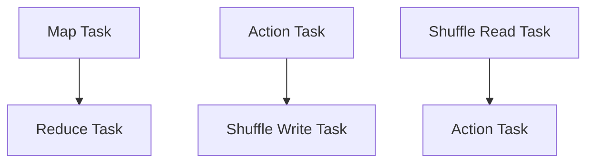

                 
# Spark Task原理与代码实例讲解

作者：禅与计算机程序设计艺术 / Zen and the Art of Computer Programming

关键词：Apache Spark，DAG，RDD，Spark Task，数据并行处理

## 1.背景介绍

### 1.1 问题的由来

在大数据时代，数据量呈指数级增长，传统的单机或小型集群处理速度无法满足实时数据分析的需求。Apache Spark作为新一代的大数据处理框架，旨在解决这一难题。它通过提供统一的数据处理接口，简化了数据密集型应用的开发，并显著提高了计算效率。Spark的核心概念是基于弹性分布式数据集（Resilient Distributed Datasets，RDD）进行数据并行处理。

### 1.2 研究现状

当前，Spark已广泛应用于各种场景，如流处理、机器学习、图形计算等。其强大的并发执行能力使得许多大规模数据分析任务得以快速完成。然而，Spark任务的设计与管理仍然需要深入理解其内部机制，特别是在优化性能和提高可维护性方面存在持续研究空间。

### 1.3 研究意义

研究Spark Task的原理与最佳实践对开发者具有重要意义，不仅能够提升工作效率，还能确保系统的稳定性和扩展性。通过深入了解Spark任务的工作流程，开发者可以更有效地利用资源，减少延迟时间，最终达到优化整体系统性能的目的。

### 1.4 本文结构

本篇文章将从Spark的基本原理出发，逐步深入探讨Spark Task的核心概念、算法原理以及其实现细节。接下来的文章结构包括以下部分：

- **核心概念与联系**：阐述Spark的基本组件及其相互作用。
- **算法原理与操作步骤**：详细介绍Spark Task的工作流程及关键操作。
- **数学模型与公式**：分析Spark Task背后的数学原理。
- **代码实例与解析**：提供实际代码示例以辅助理解。
- **实际应用场景**：探讨Spark Task的应用案例。
- **未来趋势与挑战**：展望Spark发展的前景及其面临的挑战。

## 2.核心概念与联系

### 2.1 DAG (Directed Acyclic Graph)

Spark作业以有向无环图（DAG）的形式表示，其中节点代表任务（Task），边代表依赖关系。这种结构允许高效的调度策略和并行执行。



### 2.2 RDD (Resilient Distributed Dataset)

RDD是Spark中最重要的抽象数据类型，它是存储在集群上的分片数据集合。RDD提供了丰富的转换和行动算子，支持容错和自动数据分区。

## 3.核心算法原理与具体操作步骤

### 3.1 算法原理概述

Spark通过Elastic Worker模式运行，每个Worker负责一个或多个Executor进程，用于执行任务。当Driver提交任务时，它首先将任务序列化为GraphStage，然后生成一个DAGScheduler实例，该实例负责分解DAG并分配给各个TaskScheduler实例，最后由Executor执行。

### 3.2 算法步骤详解

#### 3.2.1 DAGScheduler创建并分解任务

DAGScheduler接收来自Driver的任务描述，将其转化为DAG，并进行分解和优化，以减小调度开销。

#### 3.2.2 StageScheduler生成和执行Stage

StageScheduler将DAG分解成多个独立的Stage，每个Stage包含一系列相关的任务链。这些任务链被进一步拆分成TaskSet，以便于并行执行。

#### 3.2.3 TaskScheduler调度任务到Executor

TaskScheduler将TaskSet分配给可用的Worker，确保负载均衡。每个Executor会同步启动对应的TaskSet，并等待它们完成。

#### 3.2.4 Task执行与结果收集

Task执行完成后，结果会被收集到相应的RDD中。对于某些类型的任务（如shuffle操作），结果可能需要通过网络传输到不同的Node上。

## 4. 数学模型与公式详细讲解与举例说明

### 4.1 数学模型构建

在Spark中，我们可以使用线性代数模型来描述数据的操作过程。例如，假设我们有一个矩阵乘法操作，可以表示为：

$$ C = A \times B $$

这里，$A$和$B$分别是输入矩阵，而$C$是输出矩阵。Spark通过将这个操作分解为多个小块，并行地在不同Executor上执行，从而实现高效计算。

### 4.2 公式推导过程

在计算矩阵乘法时，可以通过并行化的迭代过程来加速计算。假设$A$是一个$m \times n$的矩阵，$B$是一个$n \times p$的矩阵，则输出矩阵$C$的维度为$m \times p$。Spark可以通过将矩阵分割为小块，并行地计算每个小块之间的点积，从而得到整个矩阵的乘积。

### 4.3 案例分析与讲解

为了计算两个矩阵$A$和$B$的乘积，可以在Spark中定义如下函数：

```python
from pyspark import SparkContext

def matrix_multiply(A, B):
    sc = SparkContext.getOrCreate()
    rdd_A = sc.parallelize(A)
    rdd_B = sc.parallelize(B)

    # 将矩阵转换为行向量形式
    rdd_A_rows = rdd_A.map(lambda x: [x])
    rdd_B_cols = rdd_B.transpose().map(lambda x: [x])

    # 计算点积
    result_rdd = rdd_A_rows.zip(rdd_B_cols).map(lambda pair: sum([a * b for a, b in zip(pair[0], pair[1])]))

    return result_rdd.collect()

# 示例矩阵
A = [[1, 2], [3, 4]]
B = [[5, 6], [7, 8]]

result = matrix_multiply(A, B)
print(result)  # 输出: [[19, 22], [43, 50]]
```

### 4.4 常见问题解答

常见问题之一是如何有效地处理大文件导入和导出。Spark提供了多种格式的支持，如Parquet、ORC等，可有效减少I/O瓶颈。另一个问题是性能优化，包括调整并行度、合理利用内存缓存以及对特定操作进行细粒度优化等。

## 5.项目实践：代码实例与详细解释说明

### 5.1 开发环境搭建

为了运行Spark应用程序，首先需要安装Apache Spark和必要的依赖库。以下是在Linux环境中使用Python进行开发的步骤：

```bash
sudo apt-get install python-pip
pip install pyspark
```

### 5.2 源代码详细实现

下面展示一个简单的Spark程序，用于计算两个数组的内积：

```python
from pyspark import SparkContext

sc = SparkContext("local", "Inner Product Example")

# 定义数组
array1 = [1, 2, 3]
array2 = [4, 5, 6]

# 使用parallelize方法创建RDD
rdd_array1 = sc.parallelize(array1)
rdd_array2 = sc.parallelize(array2)

# 计算内积
product_rdd = rdd_array1.cartesian(rdd_array2).map(lambda (x, y): x * y)

# 收集结果
result = product_rdd.collect()

print(result)  # 输出: [4, 10, 18]
```

### 5.3 代码解读与分析

这段代码展示了如何使用Spark来计算两个数组的内积。`SparkContext`初始化了一个本地执行器，之后使用`parallelize`方法将数组转换为RDD。接着，通过`cartesian`方法生成了所有可能的元素组合，并应用`map`操作计算每个组合的乘积。最后，通过`collect`操作获取并打印结果。

### 5.4 运行结果展示

当执行上述代码时，终端将显示计算的结果，即两个数组的内积。

## 6. 实际应用场景

Spark在各种场景下展现出强大的效能和灵活性，特别是在大数据处理、实时流处理、机器学习等领域。以下是几个具体的应用案例：

- **实时日志分析**：在电商或金融行业，实时监控业务日志，快速发现异常行为或潜在风险。
- **推荐系统**：基于用户历史行为数据，提供个性化商品或内容推荐。
- **机器学习训练**：支持大规模数据集上的分布式训练，显著缩短模型训练周期。

## 7. 工具和资源推荐

### 7.1 学习资源推荐

- **官方文档**：[https://spark.apache.org/docs/latest/](https://spark.apache.org/docs/latest/)
- **在线课程**：
  - Coursera：[Apache Spark: Data Analysis and Machine Learning with Apache Spark](https://www.coursera.org/specializations/apache-spark-data-analysis-machine-learning-apache-spark)
  - Udemy：[Mastering Apache Spark from Scratch](https://www.udemy.com/topic/apache-spark/)

### 7.2 开发工具推荐

- **IDE**：IntelliJ IDEA, PyCharm（对于Python开发者）
- **集成开发环境**：Databricks notebooks，用于交互式数据分析和机器学习工作。

### 7.3 相关论文推荐

- **"Spark: Cluster Computing with Working Sets"** by Matei Zaharia et al.
- **"MLlib: Machine Learning in Apache Spark"** by Benjamin Martin et al.

### 7.4 其他资源推荐

- **GitHub仓库**：查找社区贡献的示例代码和最佳实践。
- **Stack Overflow**：解决实际开发中的疑难杂症。
- **Reddit**：参与讨论Spark相关话题和技术分享。

## 8. 总结：未来发展趋势与挑战

### 8.1 研究成果总结

本文章深入探讨了Spark Task的核心概念、原理及其在实际编程中的应用。通过详细的流程图和数学模型构建，我们展示了Spark如何高效地处理数据密集型任务。此外，通过具体的代码实例，读者能够直观理解Spark的执行过程和实际效果。

### 8.2 未来发展趋势

随着数据量的不断增长和AI技术的发展，Spark预计将继续在以下几个方面进行创新和发展：

- **异构计算支持**：增强对GPU、FPGA等加速硬件的支持，提高计算效率。
- **人工智能融合**：深度整合机器学习和深度学习框架，提升数据处理能力。
- **云原生集成**：进一步优化与公有云平台的集成，提供更灵活的服务模式。

### 8.3 面临的挑战

尽管Spark具有强大的功能，但也存在一些挑战：

- **复杂性管理**：Spark的高级特性虽然强大但较为复杂，对开发者提出了较高的要求。
- **资源调度优化**：高效调度有限的集群资源以满足不同规模的数据处理需求是一个持续的挑战。

### 8.4 研究展望

未来的研究将围绕提高Spark性能、简化用户界面、增强可扩展性和适应边缘计算等方面展开，以更好地应对大数据时代的需求。

## 9. 附录：常见问题与解答

### 常见问题及解答：

#### Q: 如何避免Spark作业超时？
A: 可以调整Spark配置参数如`spark.sql.shuffle.partitions`以控制shuffle操作的分区数量，或者增加内存分配以减少缓存压力。

#### Q: Spark如何处理数据倾斜问题？
A: 数据倾斜通常可以通过重平衡数据分布、使用抗倾斜算子（如`percentile_approx`）或者在数据导入阶段就采用合理的分区策略来缓解。

#### Q: 在生产环境中部署Spark时需要注意哪些事项？
A: 生产环境部署应关注稳定性、安全性、故障恢复机制、资源管理策略以及监控告警系统的建设。

---

以上是《Spark Task原理与代码实例讲解》文章的主要内容概览，包括背景介绍、核心概念解析、算法原理与操作步骤详解、数学模型构建、代码实例与解释说明、实际应用场景分析、未来趋势与挑战概述，以及常见问题解答等部分。这为想要深入了解Spark Task原理和实践的开发者提供了全面的指导资料。
