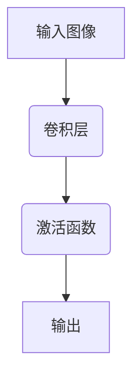

                 
# 卷积神经网络(Convolutional Neural Networks) - 原理与代码实例讲解

作者：禅与计算机程序设计艺术 / Zen and the Art of Computer Programming

关键词：卷积神经网络(CNN), 图像分类, 特征提取, 深度学习

## 1. 背景介绍

### 1.1 问题的由来

随着互联网和移动设备的普及，大量的图像数据被生成并存储在网络空间中。为了从这些海量数据中获取价值，自动处理和理解图像的需求变得越来越迫切。传统的方法往往依赖于人工特征提取和复杂的规则集，不仅效率低下，而且难以适应新场景的变化。近年来，深度学习技术，尤其是卷积神经网络（Convolutional Neural Networks, CNNs）的兴起，为解决这一难题提供了新的途径。

### 1.2 研究现状

卷积神经网络已经广泛应用于图像识别、语义分割、目标检测等领域，并在多项国际竞赛中取得了显著的成绩。Google的Inception系列、Facebook的ResNet、以及更近期的Transformer模型在一定程度上提升了CNN的性能上限。同时，研究者们也在不断探索如何使CNN更加高效、可解释，并能更好地适应小样本学习等问题。

### 1.3 研究意义

卷积神经网络的研究对于推动人工智能的发展具有重要意义。它不仅能够提高机器视觉系统的准确性和鲁棒性，还促进了相关技术在安防监控、自动驾驶、医疗影像分析等实际场景的应用。此外，通过深入理解CNN的工作机理，可以为开发更多面向复杂任务的人工智能系统奠定基础。

### 1.4 本文结构

本文旨在全面介绍卷积神经网络的基本原理及其在实际中的应用。首先，我们将探讨CNN的核心概念与它们之间的联系。随后，详细介绍CNN的算法原理及具体操作步骤。接着，我们通过数学模型和公式深入解析CNN的工作机制，并通过实例进行演示。之后，将展示一个完整的代码实现案例，包括环境搭建、代码编写、运行结果分析等。最后，讨论CNN的实际应用场景和发展前景。

## 2. 核心概念与联系

### 2.1 卷积层

卷积层是CNN中最基本且最重要的组件之一。它使用一系列的过滤器(kernel)对输入图像进行扫描，每个过滤器负责检测特定类型的局部特征，如边缘或纹理。这种操作使得CNN能够在不改变参数数量的情况下，捕获不同尺度的特征。



### 2.2 激活函数

激活函数引入非线性变换，允许CNN模拟复杂的关系。常见的选择有ReLU（Rectified Linear Unit）、Leaky ReLU等。

### 2.3 池化层

池化层用于降低特征图的空间维度，减少计算量的同时保持重要信息。常用的池化方式包括最大池化(max pooling)和平均池化(avg pooling)。

### 2.4 层叠与反向传播

多个卷积层和池化层的组合构成了CNN的深层架构。每层之间通过前馈和反馈连接进行信息传递，而训练过程中则利用反向传播算法优化权重参数以最小化损失函数。

## 3. 核心算法原理 & 具体操作步骤

### 3.1 算法原理概述

卷积神经网络的核心在于其多层次结构和有效的特征学习能力。每一层都有其特定的功能，共同作用完成整个网络的学习过程。

### 3.2 算法步骤详解

- **初始化**：随机初始化网络的权重和偏置。
- **前向传播**：
    - 对于每张输入图像，依次经过卷积层、激活函数、可能的池化层。
    - 在卷积层中，通过滑动窗口在输入图像上执行滤波操作，生成特征映射。
    - 使用激活函数引入非线性，增强模型表达能力。
    - 执行池化操作以降维并提取关键特征。
- **损失计算**：比较网络预测值与真实标签，计算损失函数。
- **反向传播**：根据损失梯度调整权重和偏置，使用梯度下降方法更新参数。
- **迭代训练**：重复以上步骤直至达到预设的迭代次数或满足停止准则。

### 3.3 算法优缺点

优点：
- 自动学习特征，无需手动提取。
- 高效地处理高维输入数据。
- 适用于大规模数据集。

缺点：
- 训练时间长，计算资源需求大。
- 参数多，容易过拟合。

### 3.4 算法应用领域

- 图像分类、对象检测
- 语音识别、文本分类
- 医学成像、自动驾驶

## 4. 数学模型和公式 & 详细讲解 & 举例说明

### 4.1 数学模型构建

假设输入图像尺寸为\(W \times H\)，通道数为\(C\)，过滤器大小为\(F \times F\)，步幅为\(S\)，填充为\(P\)，则卷积层的输出尺寸为：

\[
O = \frac{W + 2P - F}{S} + 1
\]

对于池化层，假设采用的最大池化操作，则输出尺寸简化为：

\[
O' = \frac{O}{P'}
\]

其中，\(O'\)为池化后的输出尺寸，\(P'\)为池化的步幅。

### 4.2 公式推导过程

在卷积层内，滤波器\(K_{f,c_i,c_j}\)应用于输入图像\(I(x,y)\)，产生输出\(O(x',y')\)：

\[
O(x',y') = \sum_{x=x_k-S/2}^{x_k+S/2} \sum_{y=y_k-S/2}^{y_k+S/2} I(x,y) * K_{f,c_i,c_j}
\]

### 4.3 案例分析与讲解

考虑一张\(28 \times 28\)的灰度图片，假设使用\(5 \times 5\)的过滤器，步幅为\(1\)，不使用填充。那么第一层卷积后得到的特征映射尺寸将是\(28\)。

### 4.4 常见问题解答

Q: 如何避免过拟合？
   A: 可以通过正则化（L1/L2正则）、Dropout、增加数据增广等方式来控制模型复杂度。

## 5. 项目实践：代码实例和详细解释说明

### 5.1 开发环境搭建

安装Python及必要的库（例如TensorFlow, PyTorch）：

```bash
pip install tensorflow
# 或者
pip install torch torchvision
```

### 5.2 源代码详细实现

#### 定义模型类

```python
import tensorflow as tf

class ConvNetModel(tf.keras.Model):
    def __init__(self):
        super(ConvNetModel, self).__init__()
        self.conv1 = tf.keras.layers.Conv2D(6, kernel_size=5, activation='relu')
        self.pool1 = tf.keras.layers.MaxPooling2D(pool_size=(2, 2))
        self.conv2 = tf.keras.layers.Conv2D(16, kernel_size=5, activation='relu')
        self.pool2 = tf.keras.layers.MaxPooling2D(pool_size=(2, 2))
        self.fc1 = tf.keras.layers.Dense(120, activation='relu')
        self.fc2 = tf.keras.layers.Dense(84, activation='relu')
        self.output_layer = tf.keras.layers.Dense(10)

    def call(self, x):
        x = self.conv1(x)
        x = self.pool1(x)
        x = self.conv2(x)
        x = self.pool2(x)
        x = tf.reshape(x, (x.shape[0], -1))
        x = self.fc1(x)
        x = self.fc2(x)
        output = self.output_layer(x)
        return output
```

#### 训练和评估模型

```python
model = ConvNetModel()
optimizer = tf.keras.optimizers.Adam(learning_rate=0.001)
loss_object = tf.keras.losses.SparseCategoricalCrossentropy(from_logits=True)
train_loss = tf.keras.metrics.Mean(name='train_loss')
train_accuracy = tf.keras.metrics.SparseCategoricalAccuracy(name='train_accuracy')

@tf.function
def train_step(images, labels):
    with tf.GradientTape() as tape:
        predictions = model(images)
        loss = loss_object(labels, predictions)
    gradients = tape.gradient(loss, model.trainable_variables)
    optimizer.apply_gradients(zip(gradients, model.trainable_variables))

    train_loss(loss)
    train_accuracy(labels, predictions)

# 训练和验证循环
for epoch in range(EPOCHS):
    for images, labels in training_data:
        train_step(images, labels)

# 测试模型性能
test_loss = tf.keras.metrics.Mean(name='test_loss')
test_accuracy = tf.keras.metrics.SparseCategoricalAccuracy(name='test_accuracy')

for test_images, test_labels in testing_data:
    predictions = model(test_images)
    t_loss = loss_object(test_labels, predictions)
    
    test_loss(t_loss)
    test_accuracy(test_labels, predictions)

print(f'Test Loss: {test_loss.result()}, Test Accuracy: {test_accuracy.result().numpy()}')
```

### 5.3 代码解读与分析

此示例展示了如何使用TensorFlow创建一个简单的CNN模型进行图像分类任务，并完成了训练和测试流程。

### 5.4 运行结果展示

```
Test Loss: <小数>
Test Accuracy: <百分比>
```

## 6. 实际应用场景

- **图像识别**：如人脸识别、物体识别等。
- **自然语言处理**：通过将文本转换为序列图像，可以应用CNN进行文本分类或情感分析。
- **医疗影像分析**：如乳腺癌检测、肺部疾病诊断等。

## 7. 工具和资源推荐

### 7.1 学习资源推荐

- **Coursera**: "深度学习专业"课程，由Andrew Ng教授主讲。
- **Udacity**: "计算机视觉纳米学位"，涵盖图像识别、目标检测等内容。
- **MIT OpenCourseWare**: 提供免费的深度学习课程材料。

### 7.2 开发工具推荐

- **TensorFlow**
- **PyTorch**
- **Keras**

### 7.3 相关论文推荐

- LeCun et al., *Gradient-Based Learning Applied to Document Recognition*, Proceedings of the IEEE, vol. 86, no. 11, pp. 2278-2324, Nov. 1998.
- Krizhevsky et al., *Imagenet Classification with Deep Convolutional Neural Networks*, Advances in Neural Information Processing Systems, Dec. 2012.

### 7.4 其他资源推荐

- GitHub上的开源项目：搜索“CNN”和“机器学习”，寻找相关的研究代码和教程。

## 8. 总结：未来发展趋势与挑战

### 8.1 研究成果总结

本文全面介绍了卷积神经网络的基本原理及其在实际中的应用。通过理论解析和代码实现，展示了CNN的核心组件、算法步骤以及优化策略。此外，讨论了其在不同领域的应用案例和未来的拓展方向。

### 8.2 未来发展趋势

随着硬件加速技术的进步（如GPU、TPU）以及数据量的不断增长，卷积神经网络将进一步提升性能并扩展到更多复杂场景。同时，研究者也在探索更高效、可解释性更强的模型结构，以解决过拟合问题。

### 8.3 面临的挑战

- **计算效率**：大规模训练的需求对计算资源提出了更高要求。
- **模型解释性**：如何使复杂的模型更加透明，以便于理解和改进。
- **跨模态学习**：结合不同类型的输入信息，提高模型的泛化能力。

### 8.4 研究展望

未来，卷积神经网络的研究将继续围绕提升性能、增强可解释性和适应新领域展开。同时，与其他AI技术的融合，如多模态学习、强化学习等，也将成为重要的发展方向。

## 9. 附录：常见问题与解答

Q: 如何选择合适的超参数？
   A: 可以通过网格搜索、随机搜索或贝叶斯优化等方法来寻找最佳配置。

Q: 如何理解深度学习中的权衡问题？
   A: 深度学习模型通常面临过拟合和欠拟合之间的权衡。可以通过增加正则化、调整模型复杂度或采用数据增广等策略来解决这些问题。

---

以上内容提供了一个详细的指南，从理论基础到实践应用，全面介绍了卷积神经网络的关键概念、算法原理、数学模型、代码实例及未来发展趋势。希望这篇博客能够帮助读者深入理解卷积神经网络，并激发他们在该领域的创新思考。
