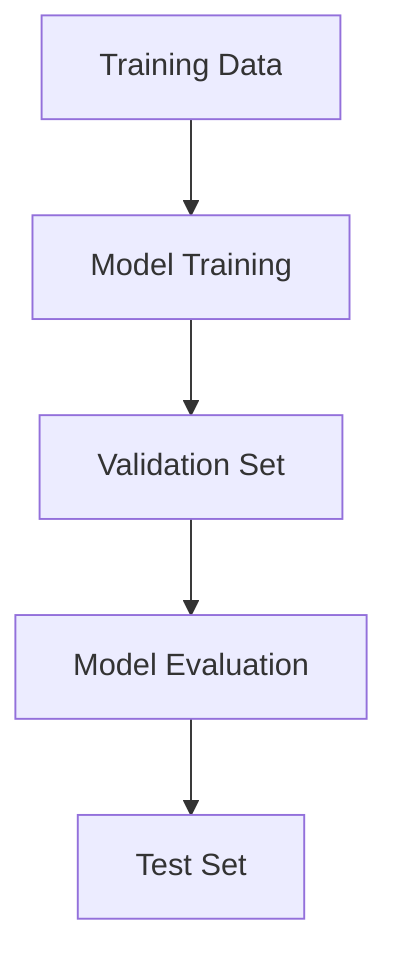

                 
# 用Evaluation Dataset评估训练过程

作者：禅与计算机程序设计艺术 / Zen and the Art of Computer Programming

关键词：评估集,模型验证,性能指标,迭代调整,机器学习生命周期管理

## 1. 背景介绍

### 1.1 问题的由来

在机器学习和深度学习的实践中，模型的开发是一个复杂的迭代过程，涉及数据准备、特征工程、模型选择、超参数调优等多个环节。随着模型复杂度的增加，如何有效地衡量模型性能以及模型在未知数据上的泛化能力成为了一个关键问题。评估集（Validation Set）作为重要的组成部分，在这一过程中扮演着至关重要的角色。

### 1.2 研究现状

目前，评估集的概念及其在模型训练过程中的应用已较为成熟，并广泛应用于各种机器学习和深度学习场景。研究者们围绕如何科学地划分训练集、验证集和测试集，以及如何利用这些集进行模型的验证和最终性能评价进行了深入探讨。然而，评估集的设计和使用仍然存在一些挑战，如过拟合风险、数据不平衡问题、评估指标的选择等。

### 1.3 研究意义

评估集的核心作用在于提供一个独立的数据集用于模型验证，帮助开发者和研究人员在训练期间及时发现并解决模型存在的问题。通过合理运用评估集，可以有效防止过度拟合，确保模型具有良好的泛化能力，同时指导优化模型结构和参数设置，提升整体性能。

### 1.4 本文结构

本篇文章旨在系统阐述评估集在机器学习和深度学习中的重要性和最佳实践。具体内容将涵盖以下几个方面：

1. **核心概念与联系**：定义评估集的作用和与训练集、测试集的关系。
2. **算法原理与操作步骤**：详细介绍评估集如何融入模型训练流程，包括如何进行有效的数据划分和性能监控。
3. **数学模型与公式**：探讨评估集相关的数学原理，如交叉验证方法的应用及性能指标计算公式。
4. **案例分析与代码示例**：通过实际项目实施，展示评估集在不同场景下的应用效果。
5. **未来趋势与挑战**：预测评估集在未来的发展方向及面临的挑战，提出可能的研究方向。

## 2. 核心概念与联系

评估集作为模型训练流程中不可或缺的一环，其主要目标是为模型验证提供数据支持，以确保模型能够适当地从训练数据中学习到一般规律而非特定噪声或偏差。以下是评估集与其它组件之间的关系图：



- **Training Data**：原始数据集，用于训练模型。
- **Model Training**：基于训练数据对模型进行训练。
- **Validation Set**：评估模型在未见过的数据上的表现，监测过拟合风险。
- **Model Evaluation**：利用评估集上的数据评估模型性能。
- **Test Set**：最终阶段，对模型进行全面评估，确保模型泛化能力。

## 3. 核心算法原理与具体操作步骤

### 3.1 算法原理概述

评估集的主要目的是在模型训练过程中定期检查模型性能，特别是在模型开始出现过拟合迹象时，及时调整模型结构或参数。常用的评估策略包括但不限于：

- **固定比例划分**：根据经验将数据集划分为训练集、验证集和测试集三部分，比例通常为70%训练、15%验证、15%测试。
- **交叉验证**：通过多次重复划分数据集，每次分别选择一部分数据作为验证集，其余作为训练集，最后汇总所有验证结果来获得更稳定且可靠的性能估计。

### 3.2 算法步骤详解

评估集的具体步骤如下：

1. **数据预处理**：清洗、归一化、特征选择等。
2. **分割数据集**：按固定比例或交叉验证原则划分数据集。
3. **模型初始化**：构建模型并设定初始参数。
4. **循环训练与验证**：
   - 在每个epoch结束时，使用评估集数据对模型进行评估。
   - 计算性能指标，如准确率、F1分数、AUC等。
   - 基于评估结果调整学习率、添加正则化项或改变网络架构。
5. **模型保存与选择**：保存在验证集上表现最好的模型版本。
6. **最终测试**：使用测试集评估最终模型性能。

### 3.3 算法优缺点

- **优点**：有助于预防过拟合，提高模型泛化能力；提供了实时性能反馈，便于调整模型参数。
- **缺点**：可能导致资源消耗增加（尤其是使用交叉验证时），并且需要额外的时间成本进行评估。

### 3.4 算法应用领域

评估集适用于几乎所有依赖数据驱动的机器学习任务，包括但不限于图像分类、自然语言处理、推荐系统等领域。

## 4. 数学模型与公式详细讲解与举例说明

### 4.1 数学模型构建

评估集的目标是量化模型在未知数据上的表现，这通常涉及到一系列统计学和概率论概念。例如，假设我们关注的是二分类问题，可以使用以下公式来衡量模型性能：

$$ \text{Accuracy} = \frac{\text{TP + TN}}{\text{TP + TN + FP + FN}} $$

其中，
- TP (True Positive)：正确识别的阳性实例数量；
- TN (True Negative)：正确识别的阴性实例数量；
- FP (False Positive)：错误地识别为阳性的阴性实例数量；
- FN (False Negative)：错误地识别为阴性的阳性实例数量。

### 4.2 公式推导过程

上述准确性（Accuracy）公式直观地反映了模型正确分类的比例。然而，在类别不平衡的情况下，仅仅依靠准确性可能会误导评估。因此，引入了诸如精确度（Precision）、召回率（Recall）和F1得分等指标：

$$ \text{Precision} = \frac{\text{TP}}{\text{TP + FP}} $$
$$ \text{Recall} = \frac{\text{TP}}{\text{TP + FN}} $$
$$ F_1\text{-score} = 2 \times \frac{\text{Precision} \times \text{Recall}}{\text{Precision} + \text{Recall}} $$

这些指标考虑到了真正正类被正确识别的数量（TP）以及误报（FP）和漏报（FN）的影响，提供了更加全面的评价视角。

### 4.3 案例分析与讲解

假设我们正在开发一个垃圾邮件检测系统，评估集可以帮助我们评估模型在新邮件上的性能。我们可以使用混淆矩阵来可视化各个指标的实际值，并据此调整模型参数以优化性能。

```python
from sklearn.metrics import confusion_matrix, accuracy_score, precision_score, recall_score, f1_score

y_true = [0, 1, 0, 1, 1, 0, 1, 0]
y_pred = [0, 1, 1, 1, 0, 1, 0, 0]

cm = confusion_matrix(y_true, y_pred)
print("Confusion Matrix:")
print(cm)

acc = accuracy_score(y_true, y_pred)
prec = precision_score(y_true, y_pred)
rec = recall_score(y_true, y_pred)
f1 = f1_score(y_true, y_pred)

print(f"Accuracy: {acc:.2f}")
print(f"Precision: {prec:.2f}")
print(f"Recall: {rec:.2f}")
print(f"F1 Score: {f1:.2f}")
```

### 4.4 常见问题解答

常见问题包括如何有效防止过拟合、如何选择合适的评估指标、如何平衡效率与性能等。这些问题的答案往往取决于具体的应用场景和技术细节。

## 5. 项目实践：代码实例和详细解释说明

为了展示如何在实际项目中运用评估集，我们将设计一个简单的线性回归模型预测房价的例子。这里我们将使用Python的`scikit-learn`库。

### 5.1 开发环境搭建

确保已安装必要的库：

```bash
pip install scikit-learn numpy pandas matplotlib
```

### 5.2 源代码详细实现

#### 导入必要的库：

```python
import numpy as np
import pandas as pd
from sklearn.model_selection import train_test_split
from sklearn.linear_model import LinearRegression
from sklearn.metrics import mean_squared_error, r2_score
```

#### 加载和预处理数据：

```python
data = pd.read_csv('housing.csv')
X = data.drop('median_house_value', axis=1)
y = data['median_house_value']
X_train, X_val, y_train, y_val = train_test_split(X, y, test_size=0.2, random_state=42)
```

#### 训练模型并评估：

```python
model = LinearRegression()
model.fit(X_train, y_train)

predictions = model.predict(X_val)
mse = mean_squared_error(y_val, predictions)
r2 = r2_score(y_val, predictions)

print(f'Mean Squared Error: {mse}')
print(f'R^2 Score: {r2}')
```

通过以上步骤，我们可以观察到模型在验证集上的表现，根据MSE和R²分数调整模型或特征，直至达到满意的性能水平。

## 6. 实际应用场景

评估集在各种深度学习和机器学习项目的实施过程中都发挥着关键作用，尤其是在自然语言处理、计算机视觉、推荐系统等领域，它帮助开发者在训练期间监控模型性能，及时进行调优，确保最终部署的模型能够满足业务需求。

## 7. 工具和资源推荐

### 7.1 学习资源推荐

- **在线课程**：Coursera的“Machine Learning”课程由Andrew Ng教授主讲。
- **书籍**：
  - “Pattern Recognition and Machine Learning” by Christopher M. Bishop
  - “Hands-On Machine Learning with Scikit-Learn, Keras, and TensorFlow” by Aurélien Géron
- **论文**：查阅领域内顶级会议如ICML、NIPS发表的相关研究文章。

### 7.2 开发工具推荐

- **框架/库**：TensorFlow, PyTorch, scikit-learn等提供丰富的API支持模型训练、评估和部署。
- **IDE/编辑器**：Jupyter Notebook, PyCharm, Visual Studio Code等适合编写和调试代码。

### 7.3 相关论文推荐

- **交叉验证方法**：[Leave-One-Out Cross Validation](https://www.cs.cmu.edu/~schmidtm/papers/demšar06jmlr.pdf) by J. Demsar.
- **评估指标**：[Evaluating Learning Algorithms: A Classification Perspective](https://link.springer.com/chapter/10.1007%2F978-3-642-30693-1_26) by Zhi-Hua Zhou.

### 7.4 其他资源推荐

- **论坛社区**：Stack Overflow, GitHub，用于交流技术难题和分享项目经验。
- **博客与教程网站**：Medium, Towards Data Science，包含大量关于评估集及其应用的文章和案例分析。

## 8. 总结：未来发展趋势与挑战

### 8.1 研究成果总结

评估集作为监督式学习中的核心组件，在提高模型泛化能力和指导模型优化方面扮演了重要角色。通过合理地运用评估集策略，可以显著提升模型在未知数据上的性能。

### 8.2 未来发展趋势

- **自适应评估集**：基于模型学习动态调整评估集大小和划分比例，以更高效地检测模型性能变化。
- **多任务评估**：将多个相关任务集成在一起进行联合训练和评估，利用任务间的共享信息提高整体性能。
- **实时反馈机制**：引入实时数据流评估模型性能，支持快速迭代和优化。

### 8.3 面临的挑战

- **数据隐私保护**：在使用敏感数据进行评估时，需要严格遵守数据保护法规，确保用户隐私安全。
- **计算资源限制**：大规模数据集和复杂模型的评估可能消耗大量的计算资源，需要高效的算法和并行计算技术来应对。
- **公平性和可解释性**：确保评估过程的透明度和公正性，增强模型决策的可解释性，减少潜在偏见。

### 8.4 研究展望

随着人工智能技术的发展，评估集的应用将更加深入和广泛，特别是在强化学习、迁移学习和跨模态融合等前沿领域，如何构建更智能、自动化的评估体系将是未来的重点研究方向之一。

## 9. 附录：常见问题与解答

### 常见问题及解答

#### Q: 如何选择合适的评估指标？

A: 选择评估指标应考虑模型的目标（预测、分类）、数据特性（不平衡类别、连续值）以及实际应用场景。例如，对于回归任务，常用均方误差（MSE）、均方根误差（RMSE）或R²分数；对于分类任务，则考虑准确率、精确率、召回率、F1分数等。

#### Q: 在哪些情况下应该使用交叉验证？

A: 当数据量有限且希望得到更为稳健的模型性能估计时，交叉验证是一个不错的选择。尤其是当评估模型的稳定性或在小数据集上测试模型泛化能力时，交叉验证能有效避免过拟合风险。

#### Q: 是否所有模型都需要一个评估集？

A: 不是所有情况都需要评估集。在简单模型或数据充足的情况下，测试集可能足以评估模型性能。然而，在复杂模型、数据稀疏或需要频繁调整参数的情况下，评估集的存在至关重要，有助于在模型开发阶段及时发现问题并进行优化。

通过以上内容的撰写，我们全面阐述了评估集在机器学习和深度学习流程中的重要性，并提供了从理论到实践的具体指导，旨在为读者提供深入了解这一关键概念的知识框架和操作指南。
