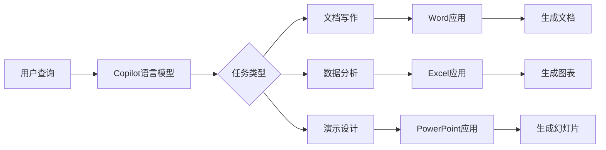

# AIGC从入门到实战：Microsoft 365 Copilot—用 AI 助手轻松驾驭办公软件

关键词：AIGC, Microsoft 365, Copilot, 人工智能, 办公软件, 生产力, 自然语言处理

## 1. 背景介绍
### 1.1 问题的由来
随着人工智能技术的飞速发展,AI正在深刻改变我们的工作和生活方式。在办公领域,传统的办公软件虽然功能强大,但学习曲线陡峭,普通用户往往需要花费大量时间和精力才能掌握。这导致很多人无法充分利用办公软件的强大功能,工作效率受到限制。

### 1.2 研究现状
为了解决这一问题,微软推出了革命性的Microsoft 365 Copilot,将人工智能与传统办公软件相结合,为用户提供智能化的辅助功能。通过自然语言交互,用户可以轻松完成各种办公任务,大大提升工作效率。目前,该技术已经引起了业界的广泛关注,被视为办公软件领域的重大突破。

### 1.3 研究意义
深入研究Microsoft 365 Copilot的原理和应用,对于推动人工智能在办公领域的应用具有重要意义。一方面,它可以帮助普通用户快速掌握办公软件的使用方法,提高工作效率;另一方面,它也为人工智能技术在其他领域的应用提供了宝贵的经验和启示。

### 1.4 本文结构
本文将从以下几个方面对Microsoft 365 Copilot进行深入探讨:

- 介绍Microsoft 365 Copilot的核心概念和工作原理 
- 分析其背后的关键算法和数学模型
- 通过代码实例和应用场景说明其具体实现和应用
- 总结Microsoft 365 Copilot的研究现状和未来发展趋势
- 为读者提供学习资源和常见问题解答

## 2. 核心概念与联系

Microsoft 365 Copilot是微软基于OpenAI的GPT(Generative Pre-trained Transformer)语言模型,为Microsoft 365办公套件开发的智能助手。它利用自然语言处理(NLP)和机器学习技术,可以理解用户的自然语言指令,并根据上下文智能生成相应的内容或执行相应的操作。

Copilot与传统的办公助手相比,具有以下优势:

- 强大的语言理解能力,可以处理复杂的自然语言查询
- 基于海量数据训练,具有广博的知识和强大的生成能力  
- 与Office应用深度集成,可以根据应用上下文提供智能建议
- 支持多种任务,如文档撰写、数据分析、演示设计等

下图展示了Microsoft 365 Copilot的总体架构和工作流程:



可以看出,Copilot作为核心引擎,连接了用户查询和各个Office应用。它根据用户输入的自然语言查询,判断所需执行的任务类型,并调用相应的Office应用进行内容生成或操作执行。这种架构使得用户可以用自然语言操控Office应用,大大降低了使用门槛。

## 3. 核心算法原理 & 具体操作步骤

### 3.1 算法原理概述

Microsoft 365 Copilot的核心是基于Transformer架构的大型语言模型。Transformer是一种用于处理序列数据的神经网络架构,通过自注意力机制(Self-Attention)实现了并行计算和长程依赖建模。GPT(Generative Pre-trained Transformer)是在Transformer基础上发展的一类生成式预训练语言模型,通过在大规模无标注文本上进行预训练,可以学习到丰富的语言知识和生成能力。

Copilot所采用的GPT模型,是在海量的网页文本和Office文档语料上训练得到的。通过这种自监督学习,模型掌握了丰富的百科知识、常识推理能力以及办公领域知识,使其能够处理各种办公场景下的自然语言任务。

### 3.2 算法步骤详解

Copilot的工作流程可以分为以下几个步骤:

1. 查询理解:用户以自然语言形式输入查询,Copilot首先对查询进行理解和分析,提取其中的关键信息,如意图、实体、上下文等。常用的技术包括命名实体识别(NER)、关键词提取、依存分析等。

2. 任务判断:根据提取的查询信息,Copilot判断用户想要执行的任务类型,如文档撰写、数据分析、演示设计等。这一步可以使用意图识别、文本分类等技术实现。

3. 内容生成:根据任务类型,Copilot调用相应的Office应用(如Word、Excel、PowerPoint),并根据查询生成相应的文档内容。这一步主要利用预训练语言模型的文本生成能力,通过Prompt Engineering技术引导模型生成符合要求的内容。

4. 信息抽取与填充:对于一些结构化的内容生成任务,如报告、演示文稿等,Copilot还需要从生成的文本中抽取关键信息,并填充到相应的模板中。这一步可以使用信息抽取、文本匹配等技术实现。

5. 结果优化:Copilot生成的初始结果可能存在语法错误、数据误差等问题,需要进一步优化和调整。可以使用基于规则或模型的错误检测和校正技术,如语法纠错、数值计算、引用格式规范化等。

6. 交互式反馈:Copilot支持与用户进行多轮对话交互,根据用户的反馈动态调整生成结果。用户可以通过自然语言指令对生成结果进行修改、补充、优化等。Copilot根据反馈指令,在已生成结果的基础上进行二次生成,不断迭代优化,直到满足用户需求。

### 3.3 算法优缺点

Copilot所采用的大型语言模型算法,具有以下优点:

- 知识覆盖广泛,可以处理多领域的办公任务
- 语言理解和生成能力强,能够处理复杂的自然语言交互
- 通过预训练学习海量语料,减少了针对特定任务的训练成本  
- 支持少样本学习,可以通过Prompt引导实现样本高效的任务适配

同时,该算法也存在一些局限性:

- 模型参数量巨大,推理计算开销高,对硬件要求较高
- 基于概率生成,输出结果不确定性较大,可能出现事实性错误
- 对于一些强逻辑推理、数值计算类任务,表现不够精准
- 容易产生有偏见、有害的内容,需要加强伦理约束和内容过滤

### 3.4 算法应用领域

除了办公软件领域,大型语言模型在其他领域也有广泛应用,如:

- 智能客服:利用多轮对话能力,提供个性化客户服务
- 智能写作:根据主题、关键词自动生成文章、新闻、评论等
- 代码生成:根据自然语言描述,自动生成程序代码
- 知识问答:利用海量知识,回答用户的百科类问题
- 逻辑推理:通过上下文推理,解决数学、常识推理题

## 4. 数学模型和公式 & 详细讲解 & 举例说明

### 4.1 数学模型构建

Transformer的核心是自注意力机制和前馈神经网络。自注意力用于计算序列中元素之间的相关性,前馈网络用于对特征进行非线性变换。

给定一个输入序列$\mathbf{x}=(x_1,\dots,x_n)$,Transformer首先将其转换为连续向量表示$\mathbf{z}^0=(z_1^0,\dots,z_n^0)$,然后通过堆叠$L$层Transformer Block对其进行编码。

第$l$层Transformer Block的计算过程如下:

$$
\begin{aligned}
\mathbf{z}^l &= \text{LayerNorm}(\mathbf{z}^{l-1} + \text{SelfAttention}(\mathbf{z}^{l-1})) \\
\mathbf{z}^l &= \text{LayerNorm}(\mathbf{z}^l + \text{FeedForward}(\mathbf{z}^l))
\end{aligned}
$$

其中,$\text{LayerNorm}$是层归一化操作,$\text{SelfAttention}$是自注意力层,$\text{FeedForward}$是前馈网络层。

自注意力层将输入$\mathbf{z}^{l-1}$线性映射为查询矩阵$\mathbf{Q}$、键矩阵$\mathbf{K}$和值矩阵$\mathbf{V}$,然后计算注意力分数:

$$
\text{Attention}(\mathbf{Q}, \mathbf{K}, \mathbf{V}) = \text{softmax}(\frac{\mathbf{Q}\mathbf{K}^T}{\sqrt{d_k}})\mathbf{V}
$$

其中$d_k$是查询/键向量的维度。

前馈网络层由两层全连接网络组成,对输入进行非线性变换:

$$
\text{FeedForward}(\mathbf{z}) = \text{max}(0, \mathbf{z}\mathbf{W}_1 + \mathbf{b}_1)\mathbf{W}_2 + \mathbf{b}_2
$$

其中$\mathbf{W}_1, \mathbf{W}_2$是权重矩阵,$\mathbf{b}_1, \mathbf{b}_2$是偏置向量。

经过$L$层Transformer Block,可以得到输入序列的最终编码表示$\mathbf{z}^L$。

对于生成任务,Transformer的解码器与编码器结构类似,但在生成每个token时,只能看到之前生成的token。解码器的自注意力层使用掩码矩阵(Mask Matrix)来屏蔽后续位置的信息。

### 4.2 公式推导过程

Transformer的训练目标是最大化生成序列的似然概率:

$$
\mathcal{L}(\theta) = \sum_{i=1}^N \log p_\theta(\mathbf{y}_i|\mathbf{x}_i)
$$

其中$\theta$是模型参数,$\mathbf{x}_i$是第$i$个样本的输入序列,$\mathbf{y}_i$是对应的输出序列。

根据链式法则,生成序列的概率可以分解为:

$$
p_\theta(\mathbf{y}|\mathbf{x}) = \prod_{t=1}^T p_\theta(y_t|y_{<t}, \mathbf{x})
$$

其中$y_t$是生成序列的第$t$个token,$y_{<t}$是之前生成的token序列。

在训练过程中,模型参数$\theta$通过最小化负对数似然损失进行优化:

$$
\mathcal{J}(\theta) = -\frac{1}{N}\sum_{i=1}^N \log p_\theta(\mathbf{y}_i|\mathbf{x}_i)
$$

优化器如Adam通过梯度下降法对参数进行更新:

$$
\theta \leftarrow \theta - \eta \nabla_\theta \mathcal{J}(\theta)
$$

其中$\eta$是学习率。

### 4.3 案例分析与讲解

下面以一个文本生成任务为例,说明Copilot的工作流程。

假设用户输入的查询为"帮我写一篇关于人工智能的文章"。

1. 查询理解:Copilot对查询进行分析,提取出关键信息:
   - 意图:写作
   - 主题:人工智能
   
2. 任务判断:根据提取的意图,Copilot判断该任务属于文档撰写类型,需要调用Word应用。

3. 内容生成:Copilot将提取的主题信息作为Prompt,输入到GPT模型中,生成关于人工智能的文章正文:

   ```
   人工智能是计算机科学的一个分支,旨在创造能够执行通常需要人类智能的任务的智能机器。它包括机器学习、自然语言处理、计算机视觉、专家系统等多个领域。
   
   人工智能的发展可以追溯到1950年代图灵提出的"图灵测试"。此后