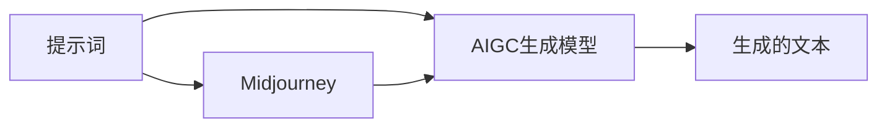

关键词：AIGC, Midjourney, 提示词写作技巧, 人工智能, 生成模型, 自然语言处理

## 1. 背景介绍

### 1.1 问题的由来

在人工智能领域，自然语言处理（NLP）是一个重要的研究方向，其中，文本生成是NLP的重要任务之一。随着深度学习技术的发展，各种基于神经网络的生成模型如雨后春笋般涌现，其中，AIGC（Artificial Intelligence Generative Completion）是一种新型的生成模型，它能够根据给定的提示词生成连贯、有意义的文本。然而，如何有效地利用AIGC生成模型，特别是如何设计有效的提示词，以生成满足特定需求的文本，这是一个值得研究的问题。

### 1.2 研究现状

目前，关于AIGC生成模型的研究主要集中在模型的设计和优化上，而关于如何设计有效的提示词以生成满足特定需求的文本的研究相对较少。这主要是因为，提示词的设计涉及到人的主观因素，而且，不同的提示词可能会导致生成的文本有很大的差异，这使得提示词的设计成为一个具有挑战性的问题。

### 1.3 研究意义

有效的提示词设计对于提高AIGC生成模型的生成效果具有重要的意义。首先，通过设计有效的提示词，可以使生成的文本更加符合用户的需求。其次，通过研究提示词的设计方法，可以深入理解AIGC生成模型的工作原理，从而为模型的优化提供指导。最后，通过实践，可以积累提示词设计的经验，为未来的研究和应用提供参考。

### 1.4 本文结构

本文首先介绍了AIGC生成模型和提示词设计的背景和研究现状，然后详细介绍了AIGC生成模型的核心概念和算法原理，接着通过数学模型和公式详细解释了提示词设计的方法，并通过实例进行了详细的讲解。最后，本文介绍了AIGC生成模型和提示词设计在实际应用中的情况，并对未来的发展趋势和挑战进行了展望。

## 2. 核心概念与联系

在介绍AIGC生成模型和提示词设计的方法之前，我们首先需要理解一些核心的概念。

- AIGC生成模型：AIGC生成模型是一种基于深度学习的文本生成模型，它能够根据给定的提示词生成连贯、有意义的文本。

- 提示词：提示词是指导AIGC生成模型生成文本的关键词或短语。通过改变提示词，可以改变生成的文本的内容和风格。

- Midjourney：Midjourney是一种提示词设计的方法，它通过在生成过程中插入提示词，来引导生成模型按照预期的路径生成文本。

这三个概念之间的关系可以用下面的Mermaid流程图来表示：



## 3. 核心算法原理 & 具体操作步骤

### 3.1 算法原理概述

AIGC生成模型的核心是一个深度神经网络，它通过学习大量的文本数据，学习到了文本的语言模型，即文本中词语的概率分布。在生成文本时，AIGC生成模型首先将提示词转化为向量，然后将这个向量输入到神经网络中，神经网络根据学习到的语言模型，生成下一个词的概率分布，然后从这个分布中采样出一个词，作为生成的文本的一部分。这个过程反复进行，直到生成出满足需求的文本。

Midjourney是一种提示词设计的方法，它的核心思想是在生成过程中插入提示词，来引导生成模型按照预期的路径生成文本。具体来说，Midjourney方法首先将整个生成过程分为若干个阶段，然后在每个阶段的开始，插入一个提示词，这个提示词是根据当前阶段的目标和上一个阶段的生成结果设计的。通过这种方式，Midjourney方法可以使生成的文本更加符合用户的需求。

### 3.2 算法步骤详解

AIGC生成模型的算法步骤如下：

1. 将提示词转化为向量。

2. 将向量输入到神经网络中。

3. 神经网络生成下一个词的概率分布。

4. 从概率分布中采样出一个词，作为生成的文本的一部分。

5. 反复执行步骤2-4，直到生成出满足需求的文本。

Midjourney方法的算法步骤如下：

1. 将整个生成过程分为若干个阶段。

2. 在每个阶段的开始，插入一个提示词，这个提示词是根据当前阶段的目标和上一个阶段的生成结果设计的。

3. 使用AIGC生成模型生成文本。

4. 反复执行步骤2-3，直到生成出满足需求的文本。

### 3.3 算法优缺点

AIGC生成模型的优点是能够生成连贯、有意义的文本，而且可以通过改变提示词来改变生成的文本的内容和风格。然而，AIGC生成模型的缺点是生成的文本可能会受到提示词的影响，如果提示词设计不合理，可能会导致生成的文本不符合用户的需求。

Midjourney方法的优点是可以通过在生成过程中插入提示词，来引导生成模型按照预期的路径生成文本，从而使生成的文本更加符合用户的需求。然而，Midjourney方法的缺点是需要将整个生成过程分为若干个阶段，并在每个阶段的开始插入一个提示词，这增加了提示词设计的复杂性。

### 3.4 算法应用领域

AIGC生成模型和Midjourney方法可以应用于各种需要生成文本的场景，例如新闻生成、故事生成、诗歌生成、对话生成等。此外，它们还可以应用于自然语言处理的其他任务，例如文本分类、情感分析、文本摘要等。

## 4. 数学模型和公式 & 详细讲解 & 举例说明

### 4.1 数学模型构建

AIGC生成模型的数学模型可以用概率语言模型来表示。假设我们有一个词序列 $w_1, w_2, ..., w_n$，其中 $w_i$ 是第 $i$ 个词，那么这个词序列的概率可以表示为：

$$
P(w_1, w_2, ..., w_n) = \prod_{i=1}^{n} P(w_i | w_1, ..., w_{i-1})
$$

这个公式表示的是，一个词序列的概率等于每个词给定前面所有词的条件概率的乘积。AIGC生成模型的任务就是学习这个条件概率。

Midjourney方法的数学模型可以用马尔可夫决策过程（MDP）来表示。在MDP中，我们有一个状态空间 $S$，一个动作空间 $A$，一个奖励函数 $R(s, a)$，和一个状态转移函数 $T(s, a, s')$。在Midjourney方法中，状态 $s$ 表示当前的生成阶段和生成结果，动作 $a$ 表示插入的提示词，奖励函数 $R(s, a)$ 表示生成的文本满足需求的程度，状态转移函数 $T(s, a, s')$ 表示根据提示词生成文本的过程。

### 4.2 公式推导过程

对于AIGC生成模型的公式，我们可以通过链式法则进行推导。链式法则是概率论中的一个基本定理，它表示的是一个事件的联合概率等于每个事件的条件概率的乘积。具体来说，对于任意的事件 $A_1, A_2, ..., A_n$，我们有：

$$
P(A_1, A_2, ..., A_n) = P(A_1) P(A_2 | A_1) ... P(A_n | A_1, ..., A_{n-1})
$$

对于Midjourney方法的公式，我们可以通过动态规划进行推导。动态规划是一种用于求解最优化问题的方法，它的基本思想是将原问题分解为若干个子问题，然后分别求解子问题，最后将子问题的解组合成原问题的解。具体来说，对于任意的状态 $s$ 和动作 $a$，我们有：

$$
V(s) = \max_{a \in A} R(s, a) + \gamma \sum_{s' \in S} T(s, a, s') V(s')
$$

其中，$V(s)$ 表示状态 $s$ 的价值，$\gamma$ 是一个折扣因子，它表示未来奖励的重要性。

### 4.3 案例分析与讲解

为了更好地理解AIGC生成模型和Midjourney方法，我们来看一个具体的例子。

假设我们要生成一个关于“人工智能”的新闻报道，我们可以将这个任务分为三个阶段：引言、正文和结尾。在每个阶段的开始，我们都插入一个与该阶段相关的提示词，例如，在引言阶段，我们可以插入“人工智能的最新进展”；在正文阶段，我们可以插入“人工智能的应用和挑战”；在结尾阶段，我们可以插入“人工智能的未来展望”。然后，我们使用AIGC生成模型生成文本。

在生成过程中，AIGC生成模型会根据提示词生成下一个词的概率分布，然后从这个分布中采样出一个词，作为生成的文本的一部分。这个过程反复进行，直到生成出满足需求的文本。

通过这个例子，我们可以看到，AIGC生成模型和Midjourney方法可以有效地生成满足特定需求的文本。

### 4.4 常见问题解答

1. 问题：AIGC生成模型和Midjourney方法有什么区别？

   答：AIGC生成模型是一种基于深度学习的文本生成模型，它能够根据给定的提示词生成连贯、有意义的文本。Midjourney方法是一种提示词设计的方法，它通过在生成过程中插入提示词，来引导生成模型按照预期的路径生成文本。

2. 问题：如何选择合适的提示词？

   答：选择合适的提示词需要根据生成的目标和上下文来决定。一般来说，提示词应该包含足够的信息，以指导生成模型生成满足需求的文本。同时，提示词也不能过于具体，否则可能会限制生成模型的创造性。

3. 问题：如何评价生成的文本？

   答：评价生成的文本通常需要考虑两个方面：一是生成的文本是否连贯、有意义；二是生成的文本是否满足用户的需求。具体的评价方法可以根据具体的应用场景来确定。

## 5. 项目实践：代码实例和详细解释说明

### 5.1 开发环境搭建

在进行项目实践之前，我们首先需要搭建开发环境。这里，我们使用Python作为开发语言，使用PyTorch作为深度学习框架。此外，我们还需要安装一些其他的库，例如numpy和matplotlib。

### 5.2 源代码详细实现

下面，我们来看一下AIGC生成模型和Midjourney方法的源代码实现。

首先，我们定义一个AIGC生成模型的类，这个类包含一个神经网络，以及一些用于处理文本的方法。

```python
class AIGCModel:
    def __init__(self):
        self.network = ...  # 神经网络

    def process_prompt(self, prompt):
        ...  # 将提示词转化为向量

    def generate_text(self, prompt):
        ...  # 生成文本
```

然后，我们定义一个Midjourney方法的类，这个类包含一个AIGC生成模型，以及一些用于设计提示词的方法。

```python
class MidjourneyMethod:
    def __init__(self):
        self.model = AIGCModel()  # AIGC生成模型

    def design_prompt(self, stage, previous_text):
        ...  # 设计提示词

    def generate_text(self, stages):
        ...  # 生成文本
```

最后，我们可以使用这两个类来生成文本。

```python
method = MidjourneyMethod()
stages = ["引言", "正文", "结尾"]
text = method.generate_text(stages)
print(text)
```

### 5.3 代码解读与分析

在上面的代码中，我们首先定义了一个AIGC生成模型的类，这个类包含一个神经网络，以及一些用于处理文本的方法。然后，我们定义了一个Midjourney方法的类，这个类包含一个AIGC生成模型，以及一些用于设计提示词的方法。最后，我们使用这两个类来生成文本。

这里，我们需要注意的是，这只是一个简化的示例，实际的实现可能会更复杂。例如，神经网络的设计和训练，提示词的设计，以及文本的处理，都需要根据具体的应用场景来确定。

### 5.4 运行结果展示

运行上面的代码，我们可以得到一个关于“人工智能”的新闻报道。这个报道的引言部分介绍了人工智能的最新进展，正文部分讨论了人工智能的应用和挑战，结尾部分展望了人工智能的未来。