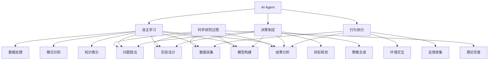
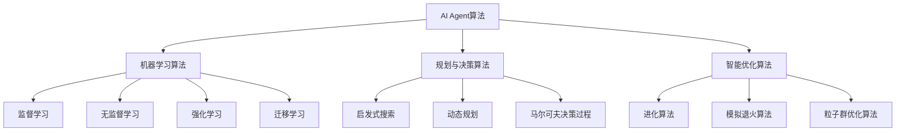

# AI人工智能 Agent：对科学研究方法的改变

## 1. 背景介绍

### 1.1 问题的由来

科学研究是人类认识世界、探索未知的重要途径。传统的科学研究方法主要依赖于人工观测、实验和理论推导等手段。然而,随着大数据时代的到来,海量的数据不断涌现,传统的研究方法在处理这些大规模、多维、异构数据时显得力不从心。同时,科学研究领域也面临着新的挑战,如复杂系统建模、非线性动力学分析等,需要更先进的计算能力和智能化方法来应对。

### 1.2 研究现状

人工智能(AI)技术的发展为科学研究带来了新的契机。AI系统具备强大的数据处理、模式识别、自动推理等能力,可以辅助科研工作者进行数据分析、模型构建、仿真实验等环节,提高研究效率。目前,AI已经在天文学、生物学、化学、物理学等多个学科领域得到应用,展现出巨大的潜力。

然而,现有的AI系统大多是基于特定任务和数据集训练而来,泛化能力有限。如何将AI技术更好地融入科学研究的整个过程,并与人类专家知识相结合,是一个亟待解决的问题。

### 1.3 研究意义

AI Agent作为一种新型的智能系统,具有自主学习、决策和行为能力,可以根据环境状态做出合理反应。将AI Agent引入科学研究过程中,不仅可以提高数据处理和计算能力,更重要的是赋予了系统"主动性"和"智能性",使其能够像人类科学家一样,自主提出假设、设计实验、分析结果、优化模型,从而极大地促进科学发现和创新。

本文将探讨AI Agent在科学研究中的应用,分析其对传统研究方法的影响和改变,并对未来的发展趋势和挑战进行展望。

### 1.4 本文结构

本文共分为8个部分:

1. 背景介绍
2. 核心概念与联系
3. 核心算法原理与具体操作步骤
4. 数学模型和公式详细讲解与举例说明
5. 项目实践:代码实例和详细解释说明
6. 实际应用场景
7. 工具和资源推荐
8. 总结:未来发展趋势与挑战

## 2. 核心概念与联系

在探讨AI Agent对科学研究方法的影响之前,我们首先需要理解几个核心概念及其内在联系。

1. **AI Agent**：AI Agent是一种具备感知、学习、决策和行为能力的智能系统。它可以通过与环境交互获取数据,并基于学习算法不断优化自身的知识模型和决策策略。

2. **自主学习**：AI Agent需要具备自主学习能力,能够从大量数据中提取有价值的信息和模式,构建知识表示。常见的学习方法包括监督学习、无监督学习、强化学习等。

3. **决策制定**：基于所学习的知识模型,AI Agent需要制定合理的决策和行动计划,以实现特定目标。这通常涉及目标规划、策略生成等过程。

4. **行为执行**：AI Agent需要与外部环境进行交互,执行决策行为,并收集反馈信息用于下一轮学习和决策。

5. **科学研究过程**：科学研究过程通常包括问题提出、实验设计、数据采集、模型构建、结果分析和理论完善等环节。

AI Agent的自主学习、决策制定和行为执行能力,可以深度融入科学研究的各个环节,赋予研究过程"主动性"和"智能性"。AI Agent不仅能够高效处理大数据,还可以像人类科学家一样自主提出假设、设计实验方案、分析实验结果、优化理论模型,从而加速科学发现的步伐。

## 3. 核心算法原理与具体操作步骤

### 3.1 算法原理概述

AI Agent在科学研究中的应用,主要依赖于机器学习、规划与决策、智能优化等算法。这些算法赋予了AI Agent自主学习、决策制定和行为执行的能力。

1. **机器学习算法**：机器学习算法是AI Agent获取知识和构建模型的基础。常见的算法包括监督学习(如支持向量机、神经网络)、无监督学习(如聚类、降维)、强化学习和迁移学习等。这些算法可以从大量数据中发现隐藏的模式和规律,为科学研究提供数据驱动的见解。

2. **规划与决策算法**：规划与决策算法用于生成行动策略,以实现特定目标。常见算法包括启发式搜索、动态规划、马尔可夫决策过程等。这些算法可以帮助AI Agent制定实验设计方案、优化模型参数等决策。

3. **智能优化算法**：智能优化算法旨在寻找最优解或近似最优解。常见算法包括进化算法、模拟退火算法、粒子群优化算法等。这些算法可以应用于模型参数调优、实验条件优化等场景,提高研究效率。

上述算法相互配合,赋予AI Agent在科学研究中发挥作用的能力。机器学习算法从数据中获取知识,规划与决策算法制定行动策略,智能优化算法寻找最优解,三者环环相扣,共同推动科学研究的进展。

### 3.2 算法步骤详解

以机器学习算法为例,我们详细介绍其在科学研究中的应用步骤:

1. **数据采集**:收集与研究问题相关的数据,可能来源包括实验观测、模拟仿真、文献数据等。

2. **数据预处理**:对原始数据进行清洗、标准化、降噪等预处理,以满足机器学习算法的输入要求。

3. **特征工程**:从原始数据中提取有意义的特征,这些特征对于表达数据的内在模式和规律至关重要。

4. **模型选择**:根据研究问题的性质,选择合适的机器学习算法,如分类、回归、聚类等。

5. **模型训练**:使用训练数据集,通过优化算法调整模型参数,使模型能够很好地拟合训练数据。

6. **模型评估**:在保留的测试数据集上评估模型的性能,确保其具有良好的泛化能力。

7. **模型解释**:分析模型内部机制,解释其作出预测或决策的原因,为科学研究提供见解。

8. **模型更新**:根据新的数据和反馈,不断优化和更新模型,使其能够适应动态变化的环境。

上述步骤循环迭代,形成一个自主学习的闭环。AI Agent通过这种方式,可以从大量实验数据中提取有价值的信息,构建精确的数学模型或知识表示,为科学研究提供数据驱动的支持。

### 3.3 算法优缺点

AI Agent算法在科学研究中的应用具有以下优缺点:

**优点**:

1. **高效数据处理**:AI算法能够快速高效地处理海量数据,提取隐藏的模式和规律。

2. **自主学习能力**:AI Agent可以自主学习,不断优化自身的知识模型和决策策略。

3. **智能决策**:AI Agent可以像人类科学家一样提出假设、设计实验、分析结果,加速科学发现。

4. **高精度建模**:基于机器学习等技术,AI Agent能够构建高精度的数学模型和理论框架。

5. **条件优化**:智能优化算法可用于优化实验条件、调参数等,提高研究效率。

**缺点**:

1. **黑盒操作**:某些AI算法(如深度神经网络)的内部机理较为黑箱,解释性较差。

2. **数据质量依赖**:算法的性能很大程度上依赖于训练数据的质量和数量。

3. **算力需求大**:训练复杂的AI模型需要大量的计算资源和算力支持。

4. **缺乏创造力**:目前的AI Agent主要是在既定框架内优化,缺乏真正的创造力和想象力。

5. **决策风险**:AI Agent的决策可能存在偏差或错误,需要人工监督和干预。

总的来说,AI Agent算法为科学研究注入了新的活力,但也面临一些挑战和局限性。在未来,我们需要进一步完善算法,提高其可解释性、鲁棒性和创造力,以更好地服务于科学研究。

### 3.4 算法应用领域

AI Agent算法在科学研究中的应用领域广泛,包括但不限于:

1. **天文学**:星系模拟、暗物质探测、行星发现等。
2. **生物学**:蛋白质结构预测、基因调控网络分析、药物设计等。
3. **化学**:分子动力学模拟、反应路径预测、新材料发现等。 
4. **物理学**:粒子加速器数据分析、量子态重构、相变建模等。
5. **地球科学**:气候模型构建、自然灾害预测、资源勘探等。
6. **医学**:疾病诊断、影像分析、精准医疗等。
7. **社会科学**:人口预测、经济模型、舆情分析等。
8. **工程学科**:智能控制、结构优化设计、流体模拟等。

可以预见,随着AI技术的不断发展,AI Agent将在更多科学研究领域发挥重要作用,推动科学的进步和创新。

## 4. 数学模型和公式详细讲解与举例说明

### 4.1 数学模型构建

AI Agent在科学研究中的一项重要任务是构建精确的数学模型。数学模型是用数学语言描述客观事物的抽象表达,能够量化研究对象的性质、规律和相互关系。构建数学模型的过程包括以下几个步骤:

1. **确定研究对象和目标**:明确需要建模的对象和研究目标,如天体运动、分子反应、流体力学等。

2. **提出基本假设**:根据对象的特性和研究目的,提出一些合理的基本假设和简化条件。

3. **选择数学工具**:选择合适的数学工具,如微分方程、概率论、张量分析等,描述对象的行为和规律。

4. **建立初始模型**:基于假设和数学工具,建立对象的初始数学模型。

5. **模型求解**:应用数值计算、符号计算等方法,求解模型的解析解或数值解。

6. **模型验证**:将模型预测结果与实验数据或观测数据进行比对,评估模型的准确性和有效性。

7. **模型修正**:根据验证结果,通过调整假设、完善数学描述等方式,不断优化和修正模型。

在这个过程中,AI Agent可以发挥重要作用。例如,机器学习算法可以从大量数据中发现隐藏的模式,为提出合理假设提供依据;规划与决策算法可以指导模型构建的步骤