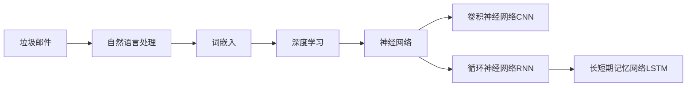

# AI人工智能深度学习算法：在垃圾邮件检测中的应用

关键词：人工智能、深度学习、垃圾邮件检测、神经网络、自然语言处理

## 1. 背景介绍

### 1.1  问题的由来

随着互联网的快速发展,电子邮件已成为人们日常生活和工作中不可或缺的通信工具。然而,伴随着电子邮件使用量的激增,垃圾邮件也日益泛滥,给用户和邮件服务提供商带来了诸多困扰。垃圾邮件不仅浪费存储空间和网络带宽,还可能包含恶意软件、诈骗信息,甚至侵犯个人隐私。因此,如何有效地识别和过滤垃圾邮件,成为了亟待解决的问题。

### 1.2  研究现状

传统的垃圾邮件检测方法主要基于规则和统计学习,如贝叶斯分类、支持向量机等。这些方法在一定程度上取得了不错的效果,但仍存在误判率高、难以应对垃圾邮件变种等缺陷。近年来,随着人工智能技术的蓬勃发展,深度学习在垃圾邮件检测领域展现出了巨大潜力。深度学习通过构建多层神经网络,能够自动学习邮件内容的深层特征表示,从而显著提升检测精度。

### 1.3  研究意义

研究深度学习在垃圾邮件检测中的应用,具有重要的理论和实践意义:

(1)丰富垃圾邮件检测技术体系。深度学习为垃圾邮件检测提供了新的思路和方法,有助于推动该领域的技术进步。

(2)提高垃圾邮件检测效果。通过引入深度学习算法,可以克服传统方法的不足,实现更高的准确率和召回率。

(3)改善用户使用体验。精准过滤垃圾邮件,可减轻用户信息过载,提升邮件服务质量,为用户创造洁净的网络环境。

(4)降低企业运营成本。垃圾邮件给企业带来了额外的存储、带宽压力,采用先进的深度学习技术,有利于节约 IT 资源。

### 1.4  本文结构

本文将重点探讨深度学习在垃圾邮件检测中的应用。第2部分介绍相关的核心概念;第3部分阐述核心算法原理和操作步骤;第4部分建立数学模型并给出公式推导;第5部分通过代码实例演示具体实现;第6部分分析实际应用场景;第7部分推荐学习资源和工具;第8部分总结全文并展望未来;第9部分列举常见问题解答。

## 2. 核心概念与联系

在利用深度学习进行垃圾邮件检测的过程中,涉及到以下几个核心概念:

- 垃圾邮件(Spam):未经请求而发送的大量电子邮件,内容通常包括广告、诈骗信息等。

- 深度学习(Deep Learning):一种基于人工神经网络的机器学习方法,通过构建多层网络结构,实现对原始数据的层层抽象和特征表示学习。

- 神经网络(Neural Network):由大量神经元组成的网络结构,每个神经元通过激活函数对输入信号进行非线性变换,多层神经元的级联形成了复杂的映射关系。

- 自然语言处理(Natural Language Processing):研究计算机处理人类语言的一门学科,主要任务包括文本分类、情感分析、机器翻译等。

- 词嵌入(Word Embedding):将词语映射为低维实值向量的技术,使得语义相近的词语在向量空间中距离较近。常见的词嵌入模型有 Word2Vec、GloVe 等。

- 卷积神经网络(Convolutional Neural Network, CNN):一种基于卷积运算的深度神经网络,善于提取局部特征,广泛应用于图像识别领域。

- 循环神经网络(Recurrent Neural Network, RNN):一种适合处理序列数据的神经网络,通过引入循环连接,实现了对前序信息的记忆。

- 长短期记忆网络(Long Short-Term Memory, LSTM):RNN 的一种改进变体,通过引入门控机制,缓解了梯度消失问题,能够建模长距离依赖。

深度学习在垃圾邮件检测中的应用,本质上是利用神经网络对邮件文本进行分类。首先对邮件内容进行预处理,如分词、去除停用词等;然后利用词嵌入将文本转化为数值矩阵;接着送入 CNN 或 RNN 等深度学习模型进行特征抽取和分类;最后输出邮件是否为垃圾邮件的判别结果。

整个过程涉及了自然语言处理、表示学习、深度学习等多个领域的交叉融合,下图展示了各个概念之间的关系:

## 3. 核心算法原理 & 具体操作步骤

### 3.1  算法原理概述

深度学习在垃圾邮件检测中的应用,核心在于利用神经网络从邮件文本中自动提取判别性特征。与传统的人工特征工程不同,深度学习能够学习到更加抽象和高级的特征表示。常用的深度学习模型包括 CNN 和 RNN。

CNN 通过卷积和池化操作,提取文本的局部特征,捕捉关键词组合的语义信息。RNN 则通过循环连接,建模文本的序列依赖,挖掘上下文语义。两种模型各有优势,可以根据任务需求进行选择。

### 3.2  算法步骤详解

以 LSTM 为例,详细说明深度学习在垃圾邮件检测中的具体步骤:

(1)数据准备:收集大量正常邮件和垃圾邮件样本,并进行人工标注。

(2)文本预处理:对邮件内容进行分词、去除停用词、转小写等操作,得到规范化的文本序列。

(3)词嵌入:利用 Word2Vec 等词嵌入模型,将每个词映射为固定长度的实值向量,形成词向量矩阵。

(4)构建 LSTM 网络:设计 LSTM 的网络结构,包括输入层、LSTM 层和输出层。LSTM 层的神经元数量、层数可以根据任务复杂度进行调整。

(5)模型训练:将词向量矩阵输入 LSTM 网络,并在标注数据上进行监督学习,通过反向传播算法不断优化模型参数。

(6)模型评估:在测试集上评估模型性能,计算准确率、召回率、F1 值等指标,并进行超参数调优。

(7)模型应用:利用训练好的 LSTM 模型,对新的邮件样本进行预测,输出是否为垃圾邮件的判别结果。

### 3.3  算法优缺点

深度学习在垃圾邮件检测中的优点包括:

- 特征自动提取:无需耗时的人工特征工程,深度学习能够自动学习最优特征表示。
- 精度高:通过构建深层网络,深度学习模型能够挖掘文本的深层语义信息,大幅提升分类精度。
- 泛化能力强:深度学习模型具有良好的泛化性,能够应对垃圾邮件的变种和新型手法。

同时,深度学习也存在一些局限:

- 样本依赖:深度学习是数据驱动的方法,需要大量的标注数据进行训练,样本获取成本较高。 
- 计算开销大:深度学习模型的训练和推理过程计算量巨大,对硬件提出了较高要求。
- 可解释性差:深度学习模型内部的决策过程较为黑盒,缺乏可解释性,排查错误较为困难。

### 3.4  算法应用领域

除了垃圾邮件检测,深度学习还广泛应用于其他文本分类任务,如:

- 情感分析:判断文本的情感倾向,如正面、负面、中性等。
- 主题分类:将文本划分到预定义的主题类别,如体育、科技、财经等。
- 意图识别:判断用户Query的意图,如查询、购买、咨询等。
- 虚假新闻检测:甄别新闻的真实性,识别虚假、夸大或误导性信息。

此外,深度学习在计算机视觉、语音识别、推荐系统等领域也取得了突破性进展。

## 4. 数学模型和公式 & 详细讲解 & 举例说明

### 4.1  数学模型构建

LSTM 的核心思想是通过引入门控机制,控制信息的流动,实现长短期记忆。具体地,LSTM 包含输入门、遗忘门、输出门三种门控单元。

设第 $t$ 时刻的输入为 $x_t$,隐藏状态为 $h_t$,记忆细胞状态为 $c_t$。LSTM 的前向传播公式如下:

输入门:
$$
i_t = \sigma(W_i \cdot [h_{t-1}, x_t] + b_i)
$$

遗忘门:
$$
f_t = \sigma(W_f \cdot [h_{t-1}, x_t] + b_f)  
$$

输出门:
$$
o_t = \sigma(W_o \cdot [h_{t-1}, x_t] + b_o)
$$

候选记忆细胞状态:
$$
\tilde{c}_t = \tanh(W_c \cdot [h_{t-1}, x_t] + b_c)
$$

记忆细胞状态更新:
$$
c_t = f_t \circ c_{t-1} + i_t \circ \tilde{c}_t
$$

隐藏状态更新:
$$
h_t = o_t \circ \tanh(c_t)
$$

其中,$\sigma$是 Sigmoid 激活函数,$\tanh$是双曲正切激活函数,$\circ$表示 Hadamard 积。$W_i, W_f, W_o, W_c$是权重矩阵,$b_i, b_f, b_o, b_c$是偏置项。

### 4.2  公式推导过程

以输入门 $i_t$ 的计算为例,详细说明 LSTM 前向传播公式的推导过程。

首先,将 $t-1$ 时刻的隐藏状态 $h_{t-1}$ 和当前时刻的输入 $x_t$ 拼接成一个更长的向量:
$$
[h_{t-1}, x_t] = \begin{bmatrix} h_{t-1} \\ x_t \end{bmatrix}
$$

然后,与输入门的权重矩阵 $W_i$ 进行矩阵乘法运算,再加上偏置项 $b_i$:
$$
W_i \cdot [h_{t-1}, x_t] + b_i
$$

接着,对上述结果应用 Sigmoid 激活函数,将值映射到 0 到 1 之间:
$$
\sigma(W_i \cdot [h_{t-1}, x_t] + b_i)
$$

最终得到输入门 $i_t$ 的值,控制当前时刻的输入信息有多少保留。

其他门和状态的计算过程与之类似,通过线性变换和非线性激活,动态调整信息流,实现记忆力和表达力的提升。

### 4.3  案例分析与讲解

考虑一个简单的二分类垃圾邮件检测任务。假设词汇表大小为 5000,词向量维度为 100,LSTM 隐藏单元数为 128,批大小为 64。

对于一封邮件,经过分词和词嵌入后,得到尺寸为 $L \times 100$ 的词向量矩阵,其中 $L$ 为邮件长度。将词向量矩阵逐时间步输入 LSTM,即可得到最后一个时间步的隐藏状态 $h_L$,它蕴含了整封邮件的语义信息。

接下来,将 $h_L$ 通过全连接层映射到二维空间,再应用 Softmax 函数得到垃圾邮件和正常邮件的概率分布:

$$
\hat{y} = \text{soft