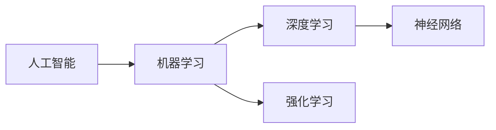

# AI人工智能深度学习算法：学习与适应的算法框架

关键词：人工智能, 深度学习, 学习算法, 自适应算法, 神经网络, 强化学习

## 1. 背景介绍
### 1.1 问题的由来
人工智能作为计算机科学领域的一个重要分支，其目标是让计算机具备类似人类的智能。而要实现这一目标，机器学习算法的发展与创新至关重要。深度学习作为机器学习的一个子领域，近年来取得了令人瞩目的成就，在计算机视觉、自然语言处理、语音识别等多个领域都取得了突破性进展。

### 1.2 研究现状
目前，深度学习算法已经成为人工智能领域的研究热点。各大科技公司和高校纷纷投入大量资源，致力于深度学习算法的优化和创新。从最初的感知机，到卷积神经网络、循环神经网络，再到生成对抗网络等新型网络结构的提出，深度学习算法正变得越来越强大。

### 1.3 研究意义
深入研究深度学习算法的学习与适应机制，对于推动人工智能的发展具有重要意义。一方面，它有助于我们更好地理解人工智能系统的工作原理，为算法的优化和创新提供理论指导。另一方面，高效的学习与适应算法可以让人工智能系统更快地学习新知识、适应新环境，为人工智能在更多领域的应用奠定基础。

### 1.4 本文结构
本文将围绕深度学习算法的学习与适应机制展开讨论。首先介绍相关的核心概念，然后重点阐述几种典型的学习算法原理及其数学模型。接着通过代码实例和应用场景分析，展示这些算法的实际应用。最后总结全文，并对深度学习算法的未来发展趋势和挑战进行展望。

## 2. 核心概念与联系
在深入探讨深度学习算法之前，我们先来了解一下几个核心概念：

- 人工智能：旨在研究、开发能够模拟、延伸和扩展人的智能的理论、方法、技术及应用系统的一门新的技术科学。
- 机器学习：人工智能的核心，主要研究计算机怎样模拟或实现人类的学习行为，以获取新的知识或技能，重新组织已有的知识结构，不断改善自身的性能。  
- 深度学习：机器学习的一个分支，它试图使用包含复杂结构或由多个非线性变换构成的多个处理层对数据进行高层抽象的算法。
- 神经网络：一种模仿生物神经网络（动物的中枢神经系统，特别是大脑）的结构和功能的数学模型或计算模型。
- 强化学习：一种通过环境状态与行为的奖惩反馈，使智能体学习做出最优决策行为的机器学习方法。

这些概念之间有着紧密的联系。人工智能是一个宏大的目标，机器学习则是实现这一目标的主要途径。深度学习作为机器学习的一个重要分支，利用神经网络结构，通过大量数据的学习，使得机器可以自动提取、学习数据中蕴含的高层语义特征。而强化学习则是另一种重要的机器学习范式，通过智能体与环境的交互，学习最优策略，实现从经验中学习的目标。

## 3. 核心算法原理 & 具体操作步骤
### 3.1 算法原理概述
深度学习的核心是利用神经网络结构，通过大量数据的训练，学习数据中蕴含的高层语义特征。神经网络由大量的节点（或称神经元）组成，节点之间通过带权重的连接相连。网络的输入是原始数据，通过逐层的非线性变换，将原始数据转化为更高层次的表示。网络的训练过程就是通过调整神经元之间连接的权重，使得网络的输出与期望输出之间的误差最小化。

### 3.2 算法步骤详解
以监督学习为例，深度学习算法的基本步骤如下：

1. 准备训练数据：将原始数据划分为训练集、验证集和测试集。训练集用于训练模型，验证集用于调参，测试集用于评估模型性能。
2. 构建神经网络：根据具体任务，选择合适的神经网络结构（如卷积神经网络、循环神经网络等），并确定网络的层数、每层的节点数等超参数。
3. 训练网络：利用训练集数据，通过前向传播计算网络的输出，然后通过反向传播算法计算损失函数对各权重参数的梯度，并用优化算法（如随机梯度下降）更新权重，使得损失函数最小化。这个过程不断迭代，直到网络收敛。
4. 评估模型：利用验证集数据评估模型的性能，并根据评估结果调整超参数，如学习率、正则化系数等。不断迭代步骤3和4，直到找到最优模型。
5. 测试模型：利用测试集数据，测试模型的性能，得到模型的最终评估指标。

### 3.3 算法优缺点
深度学习算法的优点在于：
1. 强大的特征学习能力：通过逐层的特征变换，可以自动学习数据中的高层语义特征，无需人工设计特征。
2. 端到端的学习：可以直接从原始数据中学习，不需要复杂的数据预处理。
3. 在多个领域取得了state-of-the-art的性能，如计算机视觉、语音识别、自然语言处理等。

但深度学习算法也存在一些缺点：
1. 需要大量的训练数据和计算资源。
2. 模型的可解释性较差，表现为一个"黑盒"。
3. 对超参数、网络结构较为敏感，调参需要经验。
4. 泛化能力有待提高，容易过拟合。

### 3.4 算法应用领域
深度学习算法已在多个领域得到广泛应用，如：
- 计算机视觉：图像分类、目标检测、语义分割等
- 语音识别：语音转文本、说话人识别等  
- 自然语言处理：机器翻译、情感分析、问答系统等
- 推荐系统：个性化推荐、广告投放等
- 生物医疗：药物发现、基因表达分析等

未来随着算法的不断发展和完善，深度学习必将在更多领域大放异彩。

## 4. 数学模型和公式 & 详细讲解 & 举例说明
### 4.1 数学模型构建
神经网络可以表示为一个多层感知机，每层由多个节点组成，每个节点和上一层的所有节点相连，连接处有一个可学习的权重参数。以一个L层的神经网络为例，定义第 $l$ 层第 $i$ 个节点的输出为 $a_i^{(l)}$，对应的净输入为$z_i^{(l)}$，则：

$$
z_i^{(l)} = \sum_{j=1}^{n_{l-1}} w_{ij}^{(l)} a_j^{(l-1)} + b_i^{(l)}
$$
$$
a_i^{(l)} = f(z_i^{(l)})
$$

其中，$w_{ij}^{(l)}$为第$l-1$层第$j$个节点到第$l$层第$i$个节点的权重，$b_i^{(l)}$为第$l$层第$i$个节点的偏置，$f$为激活函数，常用的有sigmoid、tanh、ReLU等。

对于分类任务，网络的输出层通常采用softmax函数进行归一化：

$$
a_i^{(L)} = \frac{e^{z_i^{(L)}}}{\sum_{j=1}^{n_L} e^{z_j^{(L)}}}
$$

其中，$n_L$为输出层节点数，即类别数。

### 4.2 公式推导过程
网络的训练目标是最小化损失函数，对于分类任务，常用的是交叉熵损失函数：

$$
J(W,b) = -\frac{1}{m} \sum_{i=1}^m \sum_{j=1}^{n_L} y_{ij} \log a_j^{(L)}(x^{(i)})
$$

其中，$m$为训练样本数，$y_{ij}$为样本$i$的真实标签（one-hot向量表示），$a_j^{(L)}(x^{(i)})$为网络在样本$i$上的输出。

网络通过反向传播算法来计算损失函数对各参数的梯度。对于第$l$层第$i$个节点，定义其误差项$\delta_i^{(l)}$为：

$$
\delta_i^{(l)} = \frac{\partial J}{\partial z_i^{(l)}}
$$

则可以推导出误差项的递推公式：

$$
\delta_i^{(l)} = \sum_{j=1}^{n_{l+1}} w_{ji}^{(l+1)} \delta_j^{(l+1)} f'(z_i^{(l)})
$$

其中，$f'$为激活函数的导数。

有了误差项，就可以计算损失函数对权重和偏置的梯度：

$$
\frac{\partial J}{\partial w_{ij}^{(l)}} = a_j^{(l-1)} \delta_i^{(l)}
$$
$$
\frac{\partial J}{\partial b_{i}^{(l)}} = \delta_i^{(l)}
$$

然后利用优化算法（如随机梯度下降）来更新权重和偏置，不断迭代直到模型收敛。

### 4.3 案例分析与讲解
下面我们以手写数字识别为例，来说明如何利用深度学习算法解决实际问题。

手写数字识别是一个典型的图像分类问题，给定一张手写数字图片，判断其对应的数字类别（0~9）。我们可以利用卷积神经网络（CNN）来解决这个问题。CNN在图像处理领域表现出色，它利用卷积、池化等操作来提取图像的局部特征，再通过全连接层来进行分类。

具体地，我们可以设计一个包含两个卷积层、两个池化层和两个全连接层的CNN。输入为28x28的灰度图像，第一个卷积层包含32个5x5的卷积核，第二个卷积层包含64个5x5的卷积核，池化层采用2x2的最大池化，全连接层分别包含1024和10个节点（对应10个数字类别）。激活函数采用ReLU，输出层采用softmax。

在MNIST数据集上训练该网络，可以达到99%以上的识别准确率。这说明深度学习算法在图像识别任务上的强大能力。

### 4.4 常见问题解答
1. 深度学习和传统机器学习有什么区别？
   - 深度学习可以自动学习特征，不需要人工设计特征工程。
   - 深度学习需要更多的数据和计算资源。
   - 深度学习模型更加复杂，包含更多的参数和超参数。

2. 深度学习容易过拟合吗？如何解决？
   - 容易，因为模型复杂，参数众多。
   - 解决方法：增加数据量，采用正则化技术（如L1/L2正则化，Dropout等），提前终止训练等。

3. 如何选择神经网络的超参数（如层数、节点数等）？
   - 通常需要根据具体任务，通过反复试验来选择。
   - 可以先从一个较小的网络开始，根据训练情况逐渐增加网络复杂度。
   - 还可以采用自动机器学习技术，如神经网络架构搜索（NAS）等。

4. 训练深度学习模型需要多少数据？
   - 通常来说，数据越多，模型效果越好。
   - 具体数据量取决于任务的复杂度。一般来说，图像分类任务需要几十万张图片，而语音识别、机器翻译等任务则需要上百万、上千万的数据量。
   - 如果数据量较小，可以考虑采用迁移学习、数据增强等技术。

## 5. 项目实践：代码实例和详细解释说明
### 5.1 开发环境搭建
以Python为例，搭建深度学习开