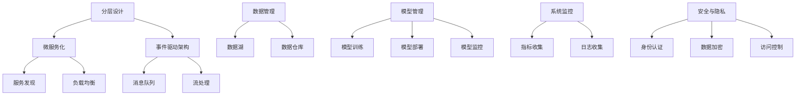

以下是对《AI系统架构原理与代码实战案例讲解》这一主题的完整技术博客文章。

# AI系统架构原理与代码实战案例讲解

## 1. 背景介绍

### 1.1 问题的由来

随着人工智能(AI)技术的不断发展和广泛应用,构建高效、可扩展、健壮的AI系统架构变得至关重要。AI系统需要处理大量数据、执行复杂的计算任务,并提供实时响应和决策支持。然而,设计和实现一个高性能的AI系统架构并非易事,需要考虑诸多因素,如数据管理、模型训练、模型部署、系统扩展性等。

### 1.2 研究现状  

目前,已有多种AI系统架构被广泛采用,如微服务架构、Lambda架构、Kappa架构等。但每种架构都有其适用场景和局限性。微服务架构擅长构建可扩展、灵活的分布式系统,但对数据一致性和事务处理有一定挑战。Lambda架构则专注于大数据处理,但可能在实时数据处理方面存在延迟。Kappa架构试图统一批处理和流处理,但可能增加了系统复杂性。

### 1.3 研究意义

设计一种通用、高效的AI系统架构,可以极大地提高AI应用的开发效率和系统性能。合理的架构设计不仅能够满足AI系统对计算资源、存储资源、网络资源的高需求,还能够确保系统的可扩展性、容错性和安全性。此外,标准化的架构模式有助于提高代码的可重用性和可维护性,降低开发和运维成本。

### 1.4 本文结构

本文将首先介绍AI系统架构设计的核心概念和原理,包括分层设计、微服务化、事件驱动等。接下来,将详细阐述AI系统架构中的核心算法原理,如分布式训练、模型压缩、在线学习等,并给出具体的操作步骤。然后,我们将构建相关的数学模型,推导公式,并通过案例分析加深理解。在此基础上,我们将实现一个完整的AI系统架构,包括代码实现、运行结果展示等。最后,我们将探讨AI系统架构在实际应用中的场景,分享学习资源和工具,并总结未来发展趋势和面临的挑战。

## 2. 核心概念与联系

AI系统架构设计涉及多个核心概念,它们相互关联,共同构建了一个完整的架构体系。下面是这些核心概念及其联系:

1. **分层设计**:将系统按照职责划分为不同的层次,如表示层、业务逻辑层、数据访问层等,有利于代码的模块化和可维护性。
2. **微服务化**:将单一应用程序划分为一组小型服务,每个服务运行在自己的进程中,服务之间通过轻量级机制(如HTTP API)进行通信。
3. **事件驱动架构**:系统的各个组件通过生产和消费事件进行通信,而不是直接相互调用,提高了系统的灵活性和可扩展性。
4. **服务发现**:在分布式环境中,服务实例的网络位置是动态变化的,需要一种机制来自动发现服务实例的位置。
5. **负载均衡**:将请求合理分配到多个服务实例上,提高系统的吞吐量和可用性。
6. **消息队列**:用于在分布式系统中传递异步事件或消息,实现系统解耦和提高可靠性。
7. **流处理**:对实时数据流进行持续的处理和分析,以支持实时决策和响应。
8. **数据管理**:包括数据湖和数据仓库,用于存储和管理海量的训练数据和业务数据。
9. **模型管理**:负责AI模型的训练、部署、监控等全生命周期管理。
10. **系统监控**:收集系统指标和日志,用于监控系统健康状况和故障诊断。
11. **安全与隐私**:包括身份认证、数据加密、访问控制等,确保系统的安全性和用户隐私保护。

## 3. 核心算法原理与具体操作步骤

### 3.1 算法原理概述

AI系统架构中涉及多种核心算法,包括分布式训练、模型压缩、在线学习等,它们共同支撑了AI系统的高效运行。

1. **分布式训练算法**:将训练任务分配到多个计算节点上并行执行,以加快训练速度。常见的分布式训练算法有数据并行、模型并行、管道并行等。
2. **模型压缩算法**:通过网络剪枝、量化、知识蒸馏等技术,压缩模型大小,降低模型的计算和存储开销,方便模型的部署和推理。
3. **在线学习算法**:能够持续地从新数据中学习,不断更新和优化模型,以适应数据分布的变化。常见的在线学习算法有递增学习、核转移学习等。
4. **异构计算加速算法**:利用CPU、GPU、FPGA等异构计算设备的优势,加速模型的训练和推理过程。

### 3.2 算法步骤详解

#### 3.2.1 分布式训练算法

以数据并行为例,分布式训练的步骤如下:

1. **数据分片**:将训练数据划分为多个数据分片,分发到不同的计算节点上。
2. **模型复制**:在每个计算节点上复制一份完整的模型副本。
3. **并行计算**:每个计算节点使用本地数据分片并行训练模型副本。
4. **梯度聚合**:计算节点将各自的模型梯度传递给参数服务器。
5. **模型更新**:参数服务器汇总所有梯度,并更新全局模型参数。
6. **参数广播**:参数服务器将更新后的全局模型参数广播给所有计算节点。
7. **迭代训练**:重复上述步骤,直到模型收敛或达到指定的训练轮次。

#### 3.2.2 模型压缩算法

以网络剪枝为例,模型压缩的步骤如下:

1. **重要性评估**:计算每个网络连接(权重)对模型输出的重要性得分。
2. **连接裁剪**:根据重要性得分,移除重要性较低的连接。
3. **网络精细化**:对裁剪后的稀疏网络进行精细化训练,以恢复性能。
4. **网络压缩**:将稀疏网络编码为压缩格式,减小模型大小。

#### 3.2.3 在线学习算法

以递增学习为例,在线学习的步骤如下:

1. **初始化**:使用初始训练数据集训练初始模型。
2. **增量更新**:当有新的数据批次到来时,将其与初始数据集合并。
3. **微调训练**:使用合并后的数据集对初始模型进行微调训练,得到更新后的模型。
4. **模型替换**:用更新后的模型替换旧模型,作为新的初始模型。
5. **迭代更新**:重复上述步骤,持续从新数据中学习。

### 3.3 算法优缺点

#### 3.3.1 分布式训练算法

**优点**:
- 加速训练过程,缩短训练时间。
- 支持训练大规模模型和处理大数据集。
- 具有良好的扩展性,可以动态调整计算资源。

**缺点**:
- 需要解决数据并行带来的不一致性问题。
- 通信开销较大,需要高效的参数传输机制。
- 需要处理计算节点故障导致的错误和不一致。

#### 3.3.2 模型压缩算法

**优点**:
- 显著减小模型大小,降低计算和存储开销。
- 方便模型的部署和推理,特别是在边缘设备上。
- 可以在一定程度上提高模型的推理速度。

**缺点**:
- 压缩后的模型可能会损失一定的精度。
- 压缩过程可能需要额外的计算资源和时间。
- 不同的压缩技术可能需要针对特定的模型架构进行优化。

#### 3.3.3 在线学习算法

**优点**:
- 能够持续学习,适应数据分布的变化。
- 避免了重新训练整个模型的高昂计算开销。
- 可以及时利用新数据,提高模型的实时性和准确性。

**缺点**:
- 可能会遇到灾难性遗忘的问题,即模型在学习新知识时忘记了旧知识。
-需要设计合理的增量学习策略,平衡新旧知识的重要性。
-模型可能会逐渐变得过于复杂,影响推理效率。

### 3.4 算法应用领域

上述核心算法在AI系统架构中有广泛的应用:

- **分布式训练算法**:常用于训练大规模的深度学习模型,如计算机视觉、自然语言处理等领域。
- **模型压缩算法**:在边缘计算、移动设备等资源受限场景中部署AI模型时非常有用。
- **在线学习算法**:适用于需要持续学习和适应数据变化的场景,如推荐系统、欺诈检测等。
- **异构计算加速算法**:可以加速各种AI任务的训练和推理过程,如图像处理、语音识别等。

## 4. 数学模型和公式详细讲解与举例说明

### 4.1 数学模型构建

在AI系统架构中,我们需要构建数学模型来描述和优化系统的各个组件。以分布式训练为例,我们可以建立如下数学模型:

假设有 $N$ 个计算节点,每个节点持有 $\frac{1}{N}$ 的训练数据。我们的目标是最小化如下损失函数:

$$J(\theta) = \frac{1}{N}\sum_{i=1}^{N}J_i(\theta)$$

其中 $J_i(\theta)$ 是第 $i$ 个计算节点上的局部损失函数,取决于该节点的数据分片。$\theta$ 是需要优化的模型参数。

在每一轮迭代中,每个计算节点计算局部梯度 $g_i = \nabla J_i(\theta)$,并将其传递给参数服务器。参数服务器汇总所有梯度,得到全局梯度:

$$g = \frac{1}{N}\sum_{i=1}^{N}g_i$$

然后,参数服务器使用优化算法(如SGD)更新模型参数:

$$\theta \leftarrow \theta - \eta g$$

其中 $\eta$ 是学习率。更新后的模型参数将广播回所有计算节点,用于下一轮迭代。

### 4.2 公式推导过程

我们来推导一下分布式训练中的全局梯度公式。

首先,根据链式法则,我们有:

$$\nabla J(\theta) = \frac{1}{N}\sum_{i=1}^{N}\nabla J_i(\theta)$$

对于每个局部损失函数 $J_i(\theta)$,应用链式法则:

$$\nabla J_i(\theta) = \frac{\partial J_i}{\partial \theta} = \frac{\partial J_i}{\partial y_i}\frac{\partial y_i}{\partial \theta}$$

其中 $y_i$ 是第 $i$ 个计算节点的模型输出。

将上式代入全局梯度公式,得到:

$$\nabla J(\theta) = \frac{1}{N}\sum_{i=1}^{N}\frac{\partial J_i}{\partial y_i}\frac{\partial y_i}{\partial \theta}$$

令 $g_i = \frac{\partial J_i}{\partial y_i}\frac{\partial y_i}{\partial \theta}$,即第 $i$ 个计算节点的局部梯度,我们可以得到