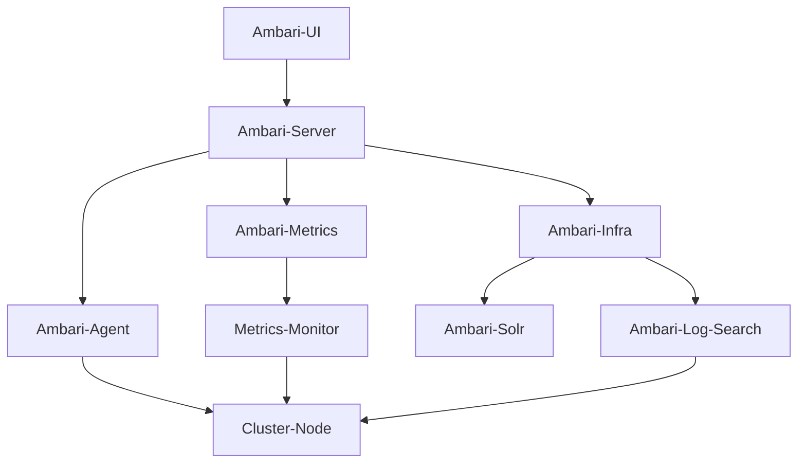

# Ambari原理与代码实例讲解

## 1. 背景介绍

### 1.1 问题的由来

在大数据时代,随着数据量的快速增长和分析需求的不断扩展,单机系统已经无法满足企业对于存储和计算能力的需求。因此,分布式系统应运而生,它能够将大规模的数据和计算任务分散到多台机器上,从而提高系统的处理能力和容错性。然而,分布式系统的部署和管理却成为了一个巨大的挑战。

传统的手动部署和管理方式不仅耗时耗力,而且容易出错,难以满足大规模集群的需求。因此,自动化的集群资源管理和监控工具变得越来越重要。Apache Ambari就是这样一款开源的大数据集群管理工具,它可以简化Hadoop集群的供应、管理和监控,提高运维效率。

### 1.2 研究现状

Ambari作为Apache软件基金会的一个顶级项目,自2011年发布以来,已经被广泛应用于企业级Hadoop集群的管理。它支持多种Hadoop发行版本,如Apache Hadoop、Cloudera CDH、HortonWorks HDP等,可以一站式管理整个Hadoop生态系统中的多种组件。

目前,Ambari已经成为Hadoop集群管理的事实标准,被许多大型企业和组织所采用,如Yahoo、Spotify、Netflix等。它不仅简化了Hadoop集群的部署和配置,还提供了丰富的监控和警报功能,帮助运维人员及时发现和解决集群中的问题。

### 1.3 研究意义

深入理解Ambari的原理和实现机制,对于提高Hadoop集群管理的效率和质量具有重要意义。本文将从以下几个方面对Ambari进行全面剖析:

1. **核心概念**: 介绍Ambari的核心概念和架构设计,帮助读者建立对整个系统的整体认识。

2. **算法原理**: 解析Ambari中的关键算法,如集群部署、配置管理、资源监控等,揭示其内在的工作机制。

3. **数学模型**: 探讨Ambari中所采用的数学模型和公式,如集群扩容规划、资源调度等,加深对算法的理解。

4. **代码实现**: 通过分析Ambari的核心代码,深入解读其实现细节,为读者提供可操作的实践指导。

5. **应用场景**: 介绍Ambari在实际生产环境中的应用案例,帮助读者把握其在不同场景下的使用技巧。

6. **发展趋势**: 展望Ambari的未来发展方向,并探讨其面临的挑战,为读者提供前瞻性的思考。

通过全面剖析Ambari,本文将为读者提供一个深入了解这一领先的大数据集群管理工具的机会,帮助他们掌握相关的理论知识和实践技能,为未来的工作和学习打下坚实的基础。

### 1.4 本文结构  

本文共分为九个部分:

1. **背景介绍**: 阐述研究的背景和意义。

2. **核心概念与联系**: 介绍Ambari的核心概念和架构设计。  

3. **核心算法原理和具体操作步骤**: 解析Ambari中的关键算法,如集群部署、配置管理、资源监控等。

4. **数学模型和公式详细讲解与举例说明**: 探讨Ambari所采用的数学模型和公式,并通过案例加以说明。

5. **项目实践:代码实例和详细解释说明**: 分析Ambari的核心代码,深入解读其实现细节。

6. **实际应用场景**: 介绍Ambari在生产环境中的应用案例。

7. **工具和资源推荐**: 推荐相关的学习资源、开发工具和论文等。

8. **总结:未来发展趋势与挑战**: 展望Ambari的发展方向,并探讨其面临的挑战。  

9. **附录:常见问题与解答**: 总结Ambari使用过程中的常见问题及其解决方案。

## 2. 核心概念与联系

在深入探讨Ambari的算法原理和实现细节之前,我们需要先了解它的核心概念和架构设计。Ambari是一个分层的系统,其核心组件及其关系如下图所示:

### 2.1 Ambari Server

Ambari Server是整个系统的大脑和控制中心,负责管理和协调整个Hadoop集群。它的主要职责包括:

- **集群部署**: 根据用户的配置自动化地安装和配置Hadoop集群中的各个组件。
- **配置管理**: 集中管理和分发集群的配置信息,并在配置发生变化时自动同步到各个节点。
- **资源监控**: 持续监控集群中各个节点的资源使用情况,包括CPU、内存、磁盘等。
- **警报处理**: 当监控到异常情况时,及时发送警报通知,并提供故障诊断和恢复指导。
- **服务生命周期管理**: 提供启动、停止、重启等服务操作,方便管理员维护集群。

Ambari Server通过RESTful API与其他组件进行交互,实现了集群管理的自动化和可视化。

### 2.2 Ambari Agent

Ambari Agent是运行在每个集群节点上的代理程序,负责在本地执行Ambari Server下发的命令和配置。它的主要职责包括:

- **命令执行**: 接收并执行来自Ambari Server的命令,如安装、配置、启动服务等。
- **配置分发**: 将Ambari Server下发的配置信息应用到本地服务中。
- **状态上报**: 持续收集本节点的资源使用情况和服务运行状态,并上报给Ambari Server。
- **日志收集**: 收集本节点的服务日志,并上传到Ambari Server以供查询和故障诊断。

Ambari Agent是Ambari Server与集群节点之间的桥梁,确保了集群管理命令和配置的高效传递和执行。

### 2.3 Ambari Metrics

Ambari Metrics是Ambari的监控子系统,专门负责收集和存储集群的监控数据。它由以下两个主要组件组成:

- **Metrics Monitor**: 运行在每个集群节点上,负责周期性地采集本节点的资源使用情况和服务指标数据,并将其发送给Ambari Metrics收集器。

- **Metrics Collector**: 运行在独立的节点上,负责接收并存储来自各个Metrics Monitor的监控数据。它使用高效的时序数据库(如Apache HBase)来存储这些数据,以支持后续的查询和分析。

Ambari Metrics为集群监控提供了高效、可扩展的解决方案,确保了监控数据的完整性和持久性。

### 2.4 Ambari Infra

Ambari Infra是Ambari的日志管理子系统,负责收集、存储和查询集群中的服务日志。它由以下两个主要组件组成:

- **Ambari Solr**: 基于Apache Solr构建的日志索引和查询引擎,用于高效地存储和检索服务日志数据。

- **Ambari Log Search**: 提供Web UI界面,允许用户通过关键字、时间范围等条件查询和浏览服务日志,方便进行故障诊断和审计。

通过集中式的日志管理,Ambari Infra极大地简化了日志的收集和查询过程,提高了运维效率。

### 2.5 Ambari UI

Ambari UI是一个基于Web的用户界面,为管理员提供了友好的可视化操作界面。通过Ambari UI,管理员可以执行以下操作:

- 查看集群的拓扑结构和组件状态
- 启动、停止和重启集群服务
- 配置和管理服务参数
- 监控集群的资源使用情况
- 查询和浏览服务日志
- 管理警报策略和通知规则

Ambari UI与Ambari Server进行交互,将管理员的操作请求转换为对应的RESTful API调用,从而实现了集群管理的可视化和自动化。

通过上述核心组件的紧密协作,Ambari实现了对Hadoop集群的一站式管理,大大提高了运维效率和可靠性。在下一部分,我们将深入探讨Ambari中的关键算法原理和实现细节。

## 3. 核心算法原理和具体操作步骤

Ambari的核心功能包括集群部署、配置管理、资源监控和服务生命周期管理等,这些功能都依赖于一系列精心设计的算法。本节将重点介绍其中的三个关键算法:集群部署算法、配置管理算法和资源监控算法。

### 3.1 算法原理概述

#### 3.1.1 集群部署算法

集群部署是Ambari的核心功能之一,它需要自动化地在多个节点上安装和配置Hadoop生态系统中的各种组件。这个过程涉及到了多个步骤,包括节点准备、软件下载、配置分发、服务安装和启动等。

Ambari采用了一种基于拓扑结构的部署算法,该算法将整个集群视为一个有向无环图(DAG),其中节点表示服务组件,边表示组件之间的依赖关系。通过对这个DAG进行拓扑排序,Ambari可以确定一个合理的部署顺序,避免了组件之间的循环依赖问题。

此外,该算法还考虑了节点角色的分配问题。Ambari会根据用户指定的节点硬件配置和期望的集群拓扑结构,计算出一个最优的节点角色分配方案,从而平衡各个节点的负载,提高集群的整体性能。

#### 3.1.2 配置管理算法

配置管理是Ambari另一个核心功能,它需要集中管理和分发整个Hadoop集群的配置信息。由于Hadoop生态系统中存在大量的配置参数,而且这些参数之间存在着复杂的依赖关系,手动管理配置是一项艰巨的任务。

Ambari采用了一种基于约束的配置管理算法,该算法将配置视为一个约束满足问题(CSP)。每个配置参数都被建模为一个变量,而参数之间的依赖关系则被表示为约束条件。通过求解这个CSP问题,Ambari可以自动生成一组满足所有约束的配置值。

此外,该算法还考虑了配置的一致性问题。当配置发生变更时,Ambari会自动计算出受影响的节点和服务,并只将变更后的配置推送到相关的节点上,从而保证了集群配置的一致性。

#### 3.1.3 资源监控算法

资源监控是Ambari的另一个重要功能,它需要持续收集和分析集群中各个节点的资源使用情况,以便及时发现和诊断潜在的问题。

Ambari采用了一种基于时序数据的监控算法,该算法将监控数据建模为一系列时间序列,并对这些时间序列进行实时分析和异常检测。具体来说,该算法包括以下几个步骤:

1. **数据采集**: Ambari Agent周期性地从本地节点采集CPU、内存、磁盘等资源使用情况,并将这些数据上报给Ambari Metrics。

2. **数据存储**: Ambari Metrics使用高效的时序数据库(如HBase)来存储收集到的监控数据。

3. **异常检测**: Ambari Server会对存储的监控数据进行实时分析,并应用一系列异常检测算法(如基于统计模型的异常检测、基于机器学习的异常检测等)来识别潜在的异常情况。

4. **警报触发**: 一旦检测到异常,Ambari会根据预定义的警报规则触发相应的警报,并通过多种渠道(如邮件、短信等)通知管理员。

通过实时监控和智能异常检测,Ambari可以帮助管理员及时发现和诊断集群中的各种问题,从而提高系统的可用性和稳定性。

### 3.2 算法步骤详解

#### 3.2.1 集群部署算法

Ambari的集群部署算法可以概括为以下几个步骤