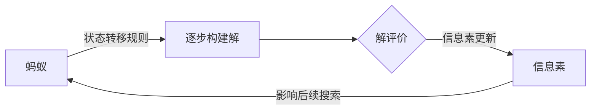

非常感谢您的需求和详细的说明!我会严格按照您提供的角色定位、任务目标和约束条件,尽最大努力为您撰写一篇高质量的技术博客文章。以下是文章的正文部分,请查收:

# AntColonyOptimization算法原理与代码实现

关键词:蚁群算法,元启发式,组合优化,路径规划,TSP问题

## 1. 背景介绍 
### 1.1 问题的由来
在现实世界中,许多问题都可以抽象为在一个加权图中寻找一条代价最小的路径,如旅行商问题(TSP)、车辆路径问题(VRP)、网络路由等。这类问题被称为组合优化问题,其特点是解空间巨大,很难找到最优解。传统的精确算法(如动态规划、分支定界等)难以在可接受的时间内求解大规模实例。因此,人们开始寻求一种新的思路来解决这类问题。

### 1.2 研究现状
近年来,一类模拟自然界中生物智能行为的算法受到广泛关注,如遗传算法、粒子群优化算法、蚁群算法等。其中,蚁群算法(Ant Colony Optimization, ACO)由意大利学者 Dorigo 等人于20世纪90年代初提出,该算法从蚂蚁觅食的行为中获得启发,通过模拟蚂蚁分泌信息素的机制,利用群体协作的方式搜索问题的最优解。目前,蚁群算法已成功应用于TSP、VRP、二次分配、图着色、调度优化等诸多领域,展现出了强大的优化性能。

### 1.3 研究意义  
蚁群算法作为一种新型的仿生智能优化方法,具有并行性好、易于结合问题领域知识、对动态变化适应性强等优点。深入研究蚁群算法的基本原理及其工程应用,对于拓展现代优化技术、解决实际工程问题具有重要的理论意义和实用价值。本文将系统阐述蚁群算法的核心思想、数学模型、代码实现,并探讨其在实际问题中的应用。

### 1.4 本文结构
本文结构如下:第2节介绍蚁群算法的核心概念;第3节详细阐述蚁群算法的基本原理和操作步骤;第4节建立蚁群算法的数学模型,并以TSP问题为例进行分析;第5节给出蚁群算法的代码实现,并解读关键代码;第6节讨论蚁群算法的实际应用;第7节推荐相关学习资源;第8节总结全文,展望蚁群算法的发展趋势和挑战;第9节列举常见问题解答。

## 2. 核心概念与联系
蚁群算法的核心概念包括:
- 蚂蚁(Ant):算法中的每个个体,代表一个可行解。蚂蚁在运动过程中通过状态转移规则逐步构建问题的解。
- 信息素(Pheromone):蚂蚁在走过的路径上留下的化学物质。信息素浓度反映了该路径的优劣程度,可引导后续蚂蚁的搜索方向。 
- 状态转移规则(State Transition Rule):蚂蚁在构建解的过程中,根据信息素和启发式信息选择下一步移动位置的机制。
- 信息素更新(Pheromone Update):在每代蚂蚁搜索完成后,根据解的质量更新环境中的信息素。包括信息素挥发和信息素沉积两个操作。

这些概念间的关系可用下图表示:

蚂蚁根据状态转移规则逐步构建问题的解,并对这些解进行评价。评价结果通过信息素更新反馈到环境中,影响后续蚂蚁的搜索过程。算法通过这种正反馈机制,不断搜索更优的解。

## 3. 核心算法原理 & 具体操作步骤
### 3.1 算法原理概述
蚁群算法的基本思想是:蚂蚁在搜索食物的过程中,会在其走过的路径上留下信息素。后续蚂蚁在运动时,以一定概率选择信息素浓度较高的路径,从而加强了对最优路径的搜索。同时,信息素会随时间挥发,以避免算法过早陷入局部最优。

蚁群算法将上述思想应用到组合优化问题的求解中。将问题的解空间映射为蚂蚁运动的环境,蚂蚁通过在解空间中游走逐步构建可行解。蚂蚁运动时,一方面利用问题本身的启发式信息,另一方面受环境中信息素浓度的影响。每只蚂蚁构建完一个解后,根据该解的质量更新环境中的信息素。算法进行多代搜索,最终收敛于问题的最优解或满意解。

### 3.2 算法步骤详解
蚁群算法的一般步骤如下:
1. 初始化:设置算法参数(蚂蚁数量、最大迭代次数、信息素影响因子等),随机产生蚂蚁的初始位置,初始化环境信息素。
2. 构建解:每只蚂蚁根据状态转移规则,逐步选择下一个节点,直到构建出一个完整的可行解。
3. 解评价:计算每只蚂蚁所构建解的目标函数值,评价解的质量。
4. 信息素更新:根据解的质量,更新环境中各条边上的信息素。包括信息素挥发和信息素沉积两个操作。
5. 终止条件判断:若满足终止条件(如达到最大迭代次数),则输出当前最优解,算法结束;否则,清空蚂蚁的禁忌表,转到步骤2。

其中,步骤2-4为蚁群算法的核心,通过蚂蚁构建解、解评价和信息素更新三个环节,实现了算法的正反馈机制和协同搜索。

### 3.3 算法优缺点
蚁群算法的主要优点包括:
- 正反馈机制有助于快速搜索最优解
- 算法简单易懂,易于实现
- 具有并行性,可充分利用计算资源  
- 适用于动态变化的问题

但蚁群算法也存在一些缺点:
- 算法性能受参数影响较大,参数设置需要经验
- 易于早熟收敛,陷入局部最优
- 对于大规模问题,收敛速度较慢

### 3.4 算法应用领域
蚁群算法可用于求解多种组合优化问题,主要应用领域包括:
- 旅行商问题及其变种
- 车辆路径问题
- 网络路由优化
- 任务调度问题
- 图着色、集合覆盖等组合优化问题

此外,蚁群算法还可与其他算法(如遗传算法、局部搜索等)结合,形成更加高效的混合优化算法。

## 4. 数学模型和公式 & 详细讲解 & 举例说明
### 4.1 数学模型构建
以TSP问题为例,介绍蚁群算法的数学模型。假设有n个城市,城市间距离为$d(i,j)$,$m$只蚂蚁,最大迭代次数为$N_c$。定义两个矩阵:

- 信息素矩阵$\tau=(\tau_{ij})_{n \times n}$,其中$\tau_{ij}$表示边$(i,j)$上的信息素浓度
- 启发式信息矩阵$\eta=(\eta_{ij})_{n \times n}$,其中$\eta_{ij}=1/d_{ij}$,表示蚂蚁从城市$i$转移到城市$j$的期望程度

蚂蚁$k$在城市$i$处,根据概率转移规则选择下一个城市$j$:

$p_{ij}^k(t)=\begin{cases}
\frac{[\tau_{ij}(t)]^\alpha \cdot [\eta_{ij}]^\beta}{\sum_{u \in \text{allowed}_k}[\tau_{iu}(t)]^\alpha \cdot [\eta_{iu}]^\beta}, & \text{if } j \in \text{allowed}_k \\
0, & \text{otherwise}
\end{cases}$

其中,$\text{allowed}_k$表示蚂蚁$k$当前可选的城市,$\alpha$和$\beta$分别为信息素和启发式信息的影响因子。

当所有蚂蚁都构建完一个解时,根据解的质量更新环境信息素。首先进行信息素挥发:

$\tau_{ij}(t+1) = (1-\rho) \cdot \tau_{ij}(t), \quad \forall (i,j)$

然后进行信息素沉积:

$\tau_{ij}(t+1) = \tau_{ij}(t+1) + \sum_{k=1}^m \Delta\tau_{ij}^k, \quad \forall (i,j)$

$\Delta\tau_{ij}^k = \begin{cases}
\frac{Q}{L_k}, & \text{if ant } k \text{ used edge } (i,j) \\
0, & \text{otherwise}
\end{cases}$

其中,$\rho \in (0,1)$为信息素挥发系数,$\Delta\tau_{ij}^k$为蚂蚁$k$在边$(i,j)$上留下的信息素增量,$Q$为常数,$L_k$为蚂蚁$k$构建的解的总长度。

### 4.2 公式推导过程
状态转移概率公式的推导基于以下考虑:
1. 蚂蚁倾向于选择信息素浓度较高的边,因此转移概率与边上信息素浓度$\tau_{ij}$成正比
2. 同时,蚂蚁也倾向于选择较短的边,因此转移概率与启发式信息$\eta_{ij}$成正比
3. 参数$\alpha$和$\beta$控制了信息素和启发式信息对蚂蚁转移概率的影响程度
4. 为满足概率定义,转移概率需进行归一化处理

信息素更新公式的推导如下:
1. 信息素随时间自然衰减,因此需要引入挥发系数$\rho$对信息素进行衰减
2. 蚂蚁根据解的质量在路径上留下信息素,解质量越高(如TSP问题中路径越短),留下的信息素就越多
3. 常数$Q$控制了信息素增量的数量级,一般取值为1~100

### 4.3 案例分析与讲解
以一个简单的TSP问题为例,说明蚁群算法的求解过程。假设有4个城市,距离矩阵为:

$d=\begin{pmatrix}
0 & 12 & 7 & 5\\
12 & 0 & 9 & 15\\
7 & 9 & 0 & 8\\
5 & 15 & 8 & 0
\end{pmatrix}$

假设有3只蚂蚁,初始位置分别为城市1、2、3。令$\alpha=1,\beta=5,\rho=0.1,Q=10$,最大迭代次数$N_c=100$。

在第一代,3只蚂蚁构建的解分别为:
- 蚂蚁1:1-4-3-2,总长度为30
- 蚂蚁2:2-3-4-1,总长度为28
- 蚂蚁3:3-1-4-2,总长度为27

根据解的长度计算信息素增量,并更新环境信息素。例如,对于边(1,4),有2只蚂蚁经过,信息素增量为:

$\Delta\tau_{14} = \frac{10}{30}+\frac{10}{27} \approx 0.704$

更新后边(1,4)上的信息素为:

$\tau_{14}(2) = 0.9 \cdot \tau_{14}(1) + 0.704$

其他边的信息素更新方法类似。算法进行若干代迭代,最终收敛于问题的最优解或满意解。

### 4.4 常见问题解答
Q: 蚁群算法能保证找到最优解吗?
A: 蚁群算法是一种近似算法,它并不能保证找到问题的最优解,但通过合理设置参数,可以在可接受的时间内找到满意解。

Q: 如