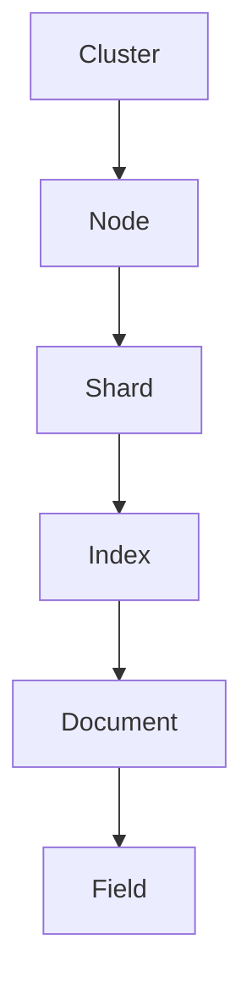

# ElasticSearch分布式搜索引擎原理与代码实例讲解

## 1. 背景介绍

### 1.1 问题的由来

在当今的信息时代,数据量呈现出爆炸式增长,如何高效地存储、检索和分析这些海量数据成为了一个巨大的挑战。传统的关系型数据库在处理结构化数据方面表现出色,但在处理非结构化数据(如文本、日志、图像等)时却显得力不从心。这就催生了全文搜索引擎的诞生,它能够高效地对非结构化数据进行索引和搜索。

作为当前最流行的开源分布式搜索引擎之一,ElasticSearch凭借其高可扩展性、高性能和易于使用的特点,在各大公司和组织中广泛应用。它不仅能够满足全文搜索的需求,还能够进行数据分析、日志处理等多种应用场景。然而,ElasticSearch的底层原理和实现细节对于很多开发者来说仍然是一个黑盒子,这就需要我们去深入探究和剖析。

### 1.2 研究现状

ElasticSearch作为一款成熟的开源产品,其核心原理和实现细节一直是研究热点。目前,已有大量的文献、博客和在线资源对ElasticSearch进行了介绍和分析,但大多数资料都停留在使用层面,缺乏对底层机制的深入解读。

一些著名的技术书籍,如"Elasticsearch服务器开发"(Elastic公司出品)、"ElasticSearch实战"等,对ElasticSearch的架构、集群管理、查询语法等方面进行了较为全面的阐述,但对核心原理的剖析仍显不足。另外,也有一些博客文章和在线课程对ElasticSearch的某些特定方面(如分布式设计、索引管理等)进行了深入探讨,但缺乏系统性和完整性。

### 1.3 研究意义

深入探究ElasticSearch的核心原理和实现细节,对于以下几个方面具有重要意义:

1. **提高开发效率**:透彻理解ElasticSearch的内部工作机制,能够帮助开发者更高效地使用和定制该搜索引擎,避免由于对底层原理缺乏认知而导致的性能bottleneck和错误使用。

2. **优化系统性能**:掌握ElasticSearch的分布式架构、索引管理、查询优化等核心原理,有助于开发者对系统进行合理配置和调优,最大限度地发挥ElasticSearch的性能潜力。

3. **促进技术创新**:深入剖析ElasticSearch的源代码实现,有助于开发者发现其中的不足之处,并提出改进方案,推动搜索引擎技术的发展和创新。

4. **培养技术人才**:通过对ElasticSearch原理的深入解读,能够帮助开发者提升对分布式系统、搜索引擎等领域的理解能力,培养复合型技术人才。

### 1.4 本文结构

本文将全面深入地探讨ElasticSearch分布式搜索引擎的核心原理和实现细节,内容主要包括以下几个方面:

1. ElasticSearch的核心概念,如索引、文档、分片、集群等,以及它们之间的关联关系。

2. ElasticSearch的分布式架构设计,包括集群发现、故障转移、数据分片和路由等机制。

3. ElasticSearch的索引管理策略,如创建、更新和删除索引,以及索引的数据结构和存储方式。

4. ElasticSearch的查询处理流程,包括查询解析、相关性计算、分布式查询等环节。

5. ElasticSearch的代码实现,对核心模块(如分布式模块、索引模块、查询模块等)的源代码进行解读和分析。

6. ElasticSearch的实际应用场景,如电商网站、日志分析、数据分析等领域的最佳实践。

7. ElasticSearch的发展趋势和面临的挑战,以及未来的研究方向。

在探讨每个核心主题时,本文将结合大量的实例、案例和代码示例,力求通过浅显易懂的语言,帮助读者透彻理解ElasticSearch的本质。

## 2. 核心概念与联系

在深入探讨ElasticSearch的核心原理之前,我们有必要先了解一些基本概念,这些概念贯穿于ElasticSearch的整个架构和实现之中。

### 2.1 索引(Index)

索引是ElasticSearch中的核心概念,它相当于关系型数据库中的"数据库"。一个索引由若干个分片(Shard)组成,每个分片存储该索引的一部分数据。索引的主要作用是对文档进行分类和分组,方便后续的搜索和分析操作。

在ElasticSearch中,我们可以为不同类型的数据创建不同的索引,如产品索引、日志索引、用户索引等。每个索引都有自己的映射(Mapping),用于定义文档的结构和字段类型。

### 2.2 文档(Document)

文档是ElasticSearch中最小的数据单元,相当于关系型数据库中的一行记录。一个文档由多个字段(Field)组成,每个字段都有自己的数据类型和值。文档在ElasticSearch中以JSON格式存储和传输。

ElasticSearch是面向文档的,这意味着它直接存储整个文档,而不是将文档拆分成行和列。这种设计使得ElasticSearch在处理非结构化数据(如文本、日志等)时具有天然的优势。

### 2.3 分片(Shard)

分片是ElasticSearch实现分布式和水平扩展的关键。一个索引可以被拆分为多个分片,每个分片存储该索引的一部分数据。分片可以在集群中的不同节点上进行分布式存储和并行处理,从而提高系统的吞吐量和可用性。

ElasticSearch支持两种类型的分片:主分片(Primary Shard)和副本分片(Replica Shard)。主分片用于存储原始数据,而副本分片是主分片的完整副本,用于提供数据冗余和负载均衡。当主分片出现故障时,副本分片可以接管并继续提供服务。

### 2.4 集群(Cluster)

集群是ElasticSearch的核心架构单元,由一个或多个节点(Node)组成。每个节点都是一个独立的ElasticSearch实例,可以存储数据,也可以参与集群的协调和管理工作。

集群的主要作用是提供分布式存储和处理能力,以及高可用性和容错性。当集群中的某个节点出现故障时,其他节点可以接管该节点的工作,确保系统的正常运行。集群还支持动态扩展和缩减节点,以应对不断变化的数据量和负载需求。

### 2.5 这些概念的关系

上述概念之间存在着密切的关联关系,如下图所示:

- 一个集群由多个节点组成
- 每个节点可以存储多个分片
- 一个索引由多个分片组成
- 每个分片存储多个文档
- 每个文档由多个字段组成

这种层级关系使得ElasticSearch能够实现高度的可扩展性和容错性。当数据量增长时,我们可以简单地添加更多的节点和分片,而不会影响整个系统的性能和可用性。同时,分片的冗余副本机制也确保了数据的高可靠性。

## 3. 核心算法原理 & 具体操作步骤

### 3.1 算法原理概述

ElasticSearch的核心算法主要包括以下几个方面:

1. **倒排索引算法**:用于构建索引和实现高效的全文搜索。
2. **分布式路由算法**:用于在集群中定位文档所在的分片。
3. **相关性算法**:用于计算查询结果与查询条件的相关程度,并对结果进行排序。
4. **分布式查询算法**:用于在集群中并行执行查询,并合并查询结果。

#### 倒排索引算法

倒排索引是ElasticSearch实现全文搜索的核心算法。它的基本思想是将文档中的每个词条与该词条所在的文档列表相关联,从而实现由词条到文档的反向查找。

具体来说,倒排索引的构建过程包括以下几个步骤:

1. 收集文档,对文档进行分词(Tokenization)和语义分析(Analysis)。
2. 为每个词条创建一个倒排索引项,并将包含该词条的文档ID添加到该索引项的文档列表中。
3. 为每个索引项计算词条频率(Term Frequency)和文档频率(Document Frequency)等统计信息。
4. 对倒排索引进行压缩和优化,以减小索引的存储空间。

在搜索时,ElasticSearch会根据查询条件,从倒排索引中找到包含相关词条的文档列表,再根据相关性算法对结果进行排序和过滤。

#### 分布式路由算法

ElasticSearch采用哈希算法将文档均匀分布到不同的分片上,这样可以实现并行处理和水平扩展。具体来说,ElasticSearch会基于文档的ID或者自定义的路由字段,计算出一个哈希值,然后根据这个哈希值将文档路由到对应的分片上。

这种路由算法可以保证具有相同ID或路由字段值的文档总是被分配到同一个分片上,从而避免数据重复和不一致的问题。同时,由于哈希算法的均匀分布特性,文档也可以被均匀地分布到不同的分片上,实现负载均衡。

#### 相关性算法

ElasticSearch使用基于词条频率和文档频率的TF-IDF算法来计算查询结果与查询条件的相关程度。具体来说,TF-IDF算法包括以下两个主要因素:

1. **词条频率(Term Frequency, TF)**: 表示一个词条在文档中出现的频率。词条在文档中出现次数越多,则该文档与该词条的相关性就越高。

2. **逆文档频率(Inverse Document Frequency, IDF)**: 表示一个词条在整个索引中的稀有程度。一个词条在索引中出现的文档越少,则该词条的discriminative power就越强,与查询条件的相关性也就越高。

TF-IDF算法将这两个因素相乘,得到每个词条对文档的权重分数。然后,ElasticSearch会将所有词条的权重分数相加,得到文档与查询条件的最终相关性分数。

除了TF-IDF算法之外,ElasticSearch还支持其他相关性算法,如BM25、DFR等,用户可以根据实际需求进行选择和配置。

#### 分布式查询算法

由于ElasticSearch采用分布式架构,查询需要在集群中的多个分片上并行执行。ElasticSearch的分布式查询算法主要包括以下几个步骤:

1. **查询解析**:将查询请求解析为内部的查询对象。
2. **查询路由**:根据查询条件,计算出需要查询的分片列表。
3. **并行查询**:在每个相关分片上并行执行查询操作。
4. **结果合并**:将各个分片的查询结果进行合并和排序,得到最终的查询结果。

在并行查询的过程中,ElasticSearch会根据查询类型(如term查询、match查询等)采用不同的查询执行策略,以提高查询效率。同时,ElasticSearch还支持各种查询优化技术,如查询重写、缓存重用等,进一步提升查询性能。

### 3.2 算法步骤详解

#### 倒排索引算法步骤

1. **文档收集和预处理**

   ElasticSearch首先需要收集待索引的文档,并对文档进行预处理,包括分词(Tokenization)和语义分析(Analysis)等步骤。

   分词是将文档内容拆分成一个个词条(Term)的过程。ElasticSearch支持多种分词器,如标准分词器、字符分词器、正则分词器等,用户可以根据实际需求进行选择和配置。

   语义分析则是对分词后的词条进行进一步处理,如去除停用词、词形还原、同义词扩展等。这一步骤可以提高索引的质量和搜索的准确性。

2. **创建倒排索引**

   对于每个唯一的词条,ElasticSearch会创建一个倒排索引项,并将包含该词条的文档ID添加到该索引项的文