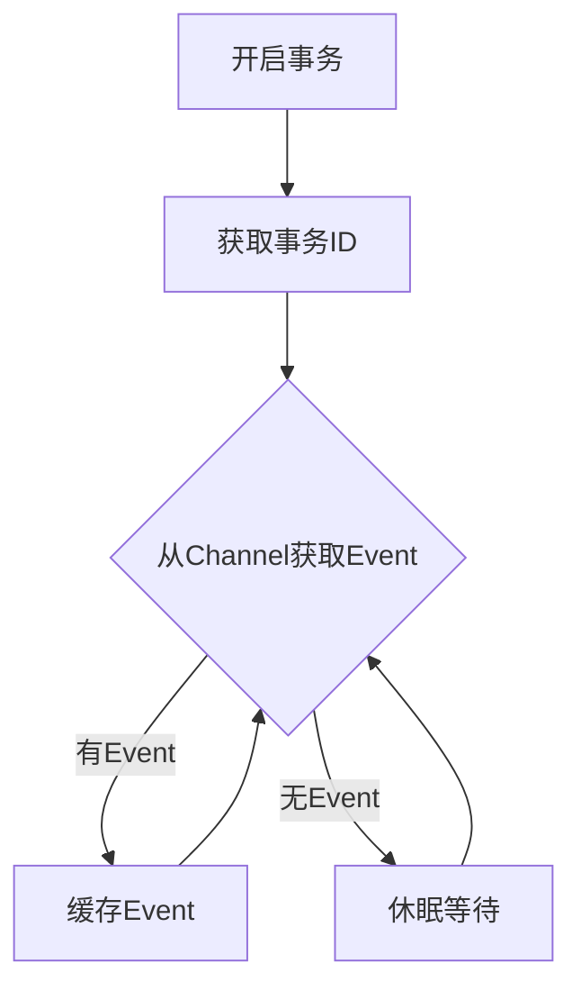
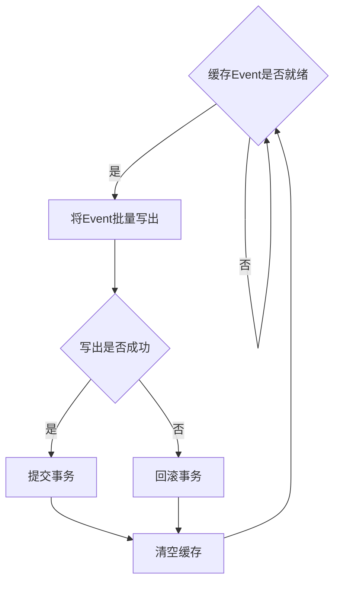

# Flume Sink原理与代码实例讲解

作者：禅与计算机程序设计艺术 / Zen and the Art of Computer Programming 

关键词：Flume、Sink、数据传输、可靠性、容错性、可扩展性

## 1. 背景介绍

### 1.1 问题的由来

在大数据时代,海量数据的实时采集和传输是一个巨大的挑战。企业需要一个高效、可靠、分布式的系统来收集、聚合和移动大量数据。Apache Flume应运而生,成为了业界广泛采用的分布式、可靠的数据采集系统。而Flume中的Sink组件在其中扮演着至关重要的角色。

### 1.2 研究现状

目前业界对于Flume Sink的研究主要集中在以下几个方面:

1. Sink的可靠性与容错性研究,如何保证数据在各种异常情况下不丢失。

2. Sink的吞吐量与性能优化,提高Sink的数据写入速度与效率。

3. 拓展Sink的功能,支持更多的数据输出方式与存储系统。

4. Sink在实际生产环境中的最佳实践与应用经验总结。

### 1.3 研究意义

深入研究Flume Sink的工作原理,对于构建一个高可靠、高性能的大数据采集与传输平台具有重要意义:

1. 明确Sink的技术原理,有助于我们根据自身需求选择和定制Sink。

2. 掌握Sink的容错与恢复机制,从而构建健壮的数据管道。  

3. 了解Sink的性能影响因素,优化系统吞吐量,提升数据处理效率。

4. 借鉴Sink的设计思想,为其他类似系统的设计实现提供有益参考。

### 1.4 本文结构

本文将从以下几个方面展开对Flume Sink原理的讲解:

1. Flume Sink的核心概念与工作原理概述 
2. Sink的分类、特点及适用场景分析
3. Sink的可靠性保障机制与数据传输算法详解
4. 结合代码实例讲解Sink的配置、使用与自定义开发
5. Sink的性能调优方法和最佳实践总结
6. 介绍常用的Sink组件和相关工具
7. 展望Sink技术的未来发展趋势与挑战

## 2. 核心概念与联系

在深入讲解Flume Sink原理之前,我们先来了解几个核心概念:

* Event:Flume数据传输的基本单元,本质是一个数据流中的独立数据包。
* Source:数据采集组件,用于接收数据并封装成Event。
* Channel:数据传输通道组件,用于临时存储接收到的Event。
* Sink:数据输出组件,负责将Event写出到目标存储系统。

它们之间的关系可以用下图来表示:


可见,Source、Channel和Sink三者协同工作,构成了Flume数据传输的基本流程:

1. Source采集数据,封装为Event写入Channel
2. Sink从Channel读取Event,再写出到目标存储
3. Channel起到了数据的缓冲作用,解耦了输入输出

## 3. 核心算法原理 & 具体操作步骤

### 3.1 算法原理概述

Flume Sink的核心算法可以概括为可靠的数据读取与写出。具体来说涉及到以下几点:

1. 从Channel可靠地读取Event,不重不漏
2. 将读取的Event写出到目标存储,保证一致性
3. 根据Event的处理结果更新Channel,保证可靠性
4. 实现Sink的负载均衡、故障转移与恢复

### 3.2 算法步骤详解

接下来我们详细讲解Sink算法的步骤:

#### 1) 初始化阶段 
Sink启动时,会创建一个专属的事务,用于跟Channel交互,同时会建立到目标存储的连接。

#### 2) 循环读取Event
Sink源源不断地从Channel读取Event,具体流程如下:



#### 3) 批量写出Event
当缓存的Event达到一定数量或者超时时,Sink将缓存的Event批量写出到目标存储中。



#### 4) 事务提交与回滚
根据Event的写出结果,Sink将选择提交或回滚事务:
- 若写出成功,提交事务,从Channel移除对应Event
- 若写出失败,回滚事务,Event仍保留在Channel中,等待下次重试

这个过程借助了Channel的事务机制,确保了Event的处理具有原子性,不会因为Sink的故障而丢失数据。

### 3.3 算法优缺点

Flume Sink算法的优点有:

1. 数据传输可靠,不丢不重,即便节点故障也能恢复
2. 实现了Sink的负载均衡与水平扩展,提升吞吐量
3. 具备良好的容错性,单点故障不会影响全局

当然它也有一些不足之处:

1. 算法与具体的Channel实现有一定耦合
2. 面对超高并发写入场景,容易成为性能瓶颈
3. 回滚重试机制可能引入数据重复的问题

### 3.4 算法应用领域

Flume Sink的算法广泛应用于各种数据采集与传输场景,比如:

- 日志收集:将分布式系统产生的日志统一收集到HDFS、Kafka等存储
- 数据库同步:将MySQL Binlog实时同步到其他异构数据库
- 跨数据中心:将一个数据中心的数据实时备份到另一个数据中心

同时Sink的设计思想也被许多其他系统借鉴,成为了数据传输领域的经典算法模式。

## 4. 数学模型和公式 & 详细讲解 & 举例说明

### 4.1 数学模型构建

为了更好地理解Flume Sink的工作原理,我们尝试建立一个简化的数学模型。

我们将Sink的吞吐量定义为单位时间内成功传输的Event数量,记为$T$。影响$T$的主要因素有:

- $v$:Sink从Channel读取Event的速率
- $u$:Sink将Event写出到存储的速率
- $c$:Channel中可用Event的数量
- $n$:Sink的并行度,即同时运行的Sink实例数

于是我们可以得到吞吐量$T$的表达式:

$$
T=\min(v,u,\frac{c}{n})
$$

这个公式可以这样理解:Sink的吞吐量取决于读取速率、写出速率、Channel可用数据量三者中的短板,同时也受限于Sink的并行度。

### 4.2 公式推导过程

我们来分别推导一下$v$、$u$、$c$三个变量的表达式。

#### 1) 读取速率$v$
$v$主要取决于Channel的实现。例如内存Channel的$v$远高于文件Channel。我们可以用Little定律来估算$v$:

$$
v=\frac{N}{S}
$$

其中$N$表示Channel中平均存在的Event数量,$S$表示一个Event在Channel中的平均停留时间。

#### 2) 写出速率$u$
$u$取决于目标存储的写入性能,不同的存储系统差异很大。比如Kafka的$u$一般优于HDFS。我们用$I$和$L$分别表示单个Event的平均写入时间和大小,则有:

$$
u=\frac{L}{I}
$$

#### 3) Channel可用数据量$c$
$c$取决于Channel的容量$C$以及当前的使用率$r$,两者的乘积即为$c$:

$$
c=C \times r
$$

### 4.3 案例分析与讲解

我们用一个具体的例子来说明该模型的应用。

假设某个Flume系统的参数如下:
- 使用内存Channel,平均Event驻留时间为20ms,Channel最多缓存1000个Event
- 目标存储为HDFS,单个Event的平均写入时间为50ms,Event大小为1KB
- 部署了3个Sink实例

则我们可以计算:

$$
\begin{aligned}
v & = \frac{1000}{20ms} = 50000 (Event/s) \\
u & = \frac{1KB}{50ms} = 20 (Event/s) \\
c & = 1000 \times 100\% = 1000 (Event) \\
T & = \min(50000, 20, \frac{1000}{3}) \approx 20 (Event/s)
\end{aligned}
$$

可见此时系统的瓶颈在于HDFS的写入速度,Sink的吞吐量被限制在了20 Event/s。

### 4.4 常见问题解答

问题1:如何提高Sink的吞吐量?

根据上面的模型,我们可以从以下几个方面来提升Sink的性能:
1. 提高$u$,选用更高效的存储系统,比如从HDFS换成Kafka
2. 提高$c$,增大Channel的容量,尽量避免Channel空闲
3. 提高$n$,增加Sink的并行度,充分利用Channel中的数据

问题2:Channel的容量设置多大合适?

Channel的容量$C$需要根据实际的数据规模和传输延迟来设置:
- $C$要足够大,能缓冲一定时间的数据,避免因瞬时写入高峰而阻塞
- $C$也不宜过大,否则会占用过多内存,引入额外的维护开销
- 一般建议$C$的值能够缓存至少几分钟的数据量

## 5. 项目实践：代码实例和详细解释说明

接下来我们结合代码实例,讲解如何在实际项目中使用和开发Flume Sink。

### 5.1 开发环境搭建

首先我们需要搭建Flume的开发环境,主要步骤如下:

1. 安装JDK,Flume要求至少JDK 1.8版本
2. 下载Flume发行包,解压到本地目录
3. 将Flume的bin目录加入到环境变量PATH中
4. 创建一个Maven项目,添加Flume依赖:

```xml
<dependency>
  <groupId>org.apache.flume</groupId>
  <artifactId>flume-ng-core</artifactId>
  <version>1.9.0</version>
</dependency>
```

### 5.2 自定义Sink的实现

Flume支持自定义Sink,只需要实现`Sink`接口即可。下面是一个自定义的`MySink`的代码示例:

```java
public class MySink extends AbstractSink implements Configurable {
  private String myProp;
  
  @Override
  public void configure(Context context) {
    String myProp = context.getString("myProp", "defaultValue");  
  }
  
  @Override
  public Status process() throws EventDeliveryException {
    Status status = null;
    // Start transaction
    Channel ch = getChannel();
    Transaction txn = ch.getTransaction();
    txn.begin();
    try {
      // 从Channel读取Event
      Event event = ch.take(); 
      if (event != null) {
        // 处理Event
        doSomethingWithEvent(event);
      }
      txn.commit();
      status = Status.READY;
    } catch (Throwable t) {
      txn.rollback();
      status = Status.BACKOFF;
    } finally {
      txn.close();
    }
    return status;
  }
  
  private void doSomethingWithEvent(Event event) {
    // 根据需求实现自己的处理逻辑
    String body = new String(event.getBody());
    // ...
  }
}
```

要点说明:
1. 继承`AbstractSink`类,实现`Configurable`接口
2. 覆盖`configure`方法,读取配置参数
3. 覆盖`process`方法,在其中实现主要逻辑:
   - 开启事务
   - 从Channel读取Event
   - 处理Event
   - 提交或回滚事务
4. 自行实现Event的处理逻辑

### 5.3 配置使用自定义Sink

要让Flume使用我们自定义的Sink,需要在配置文件中进行如下配置:

```properties
a1.sinks.k1.type = com.example.MySink
a1.sinks.k1.myProp = myValue
```

其