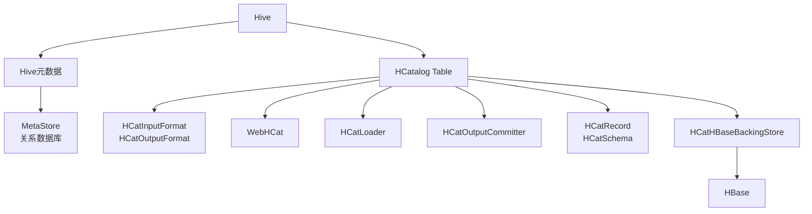
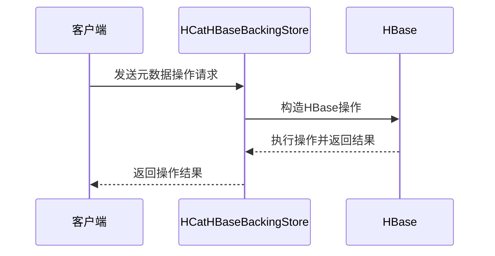
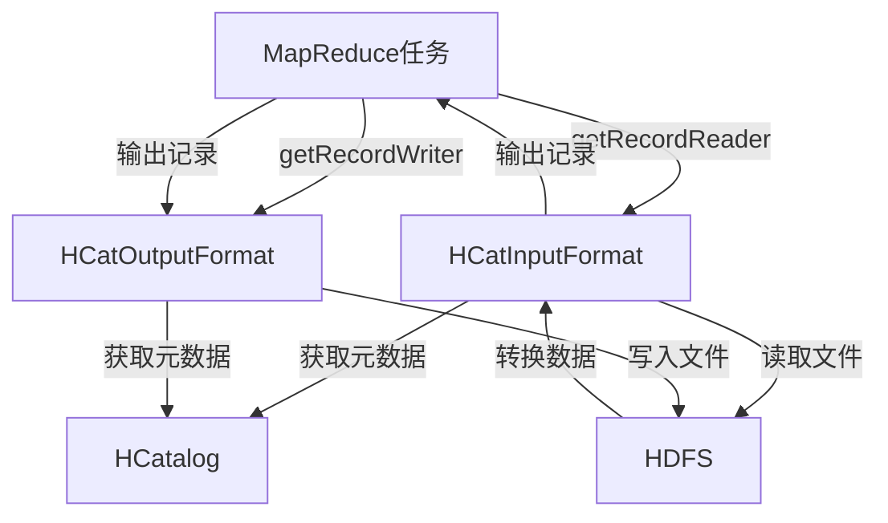
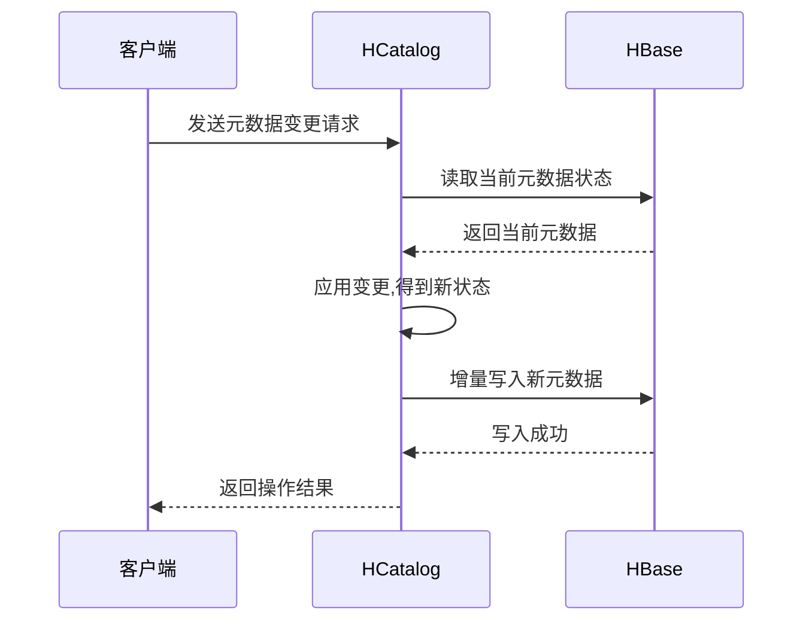
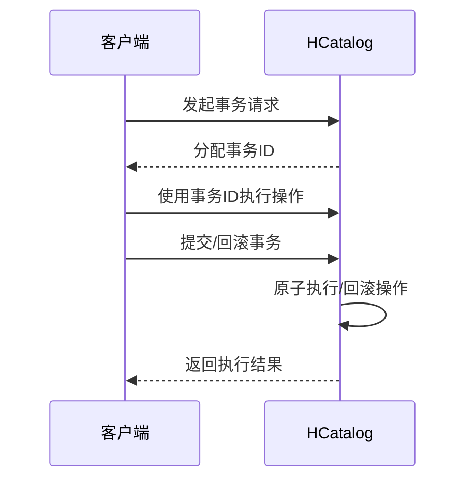
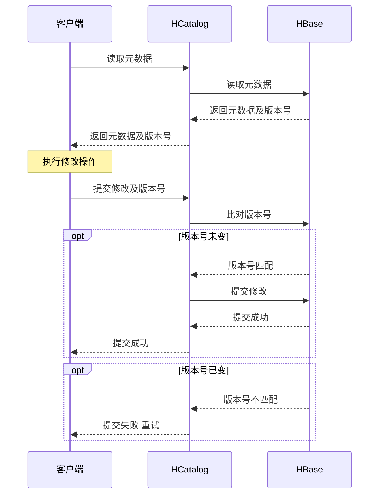

# HCatalog Table原理与代码实例讲解

## 1. 背景介绍

### 1.1 问题的由来

在大数据时代,数据存储和管理成为了一个重要的挑战。Apache Hive作为基于Hadoop的数据仓库工具,为结构化数据提供了高效的查询和分析功能。然而,随着数据量的急剧增长和数据类型的多样化,传统的Hive元数据存储方式(MetaStore)已经无法满足企业级应用的需求,包括:

1. **数据管理能力有限**:MetaStore只能存储表的元数据,无法存储表的数据内容,导致数据管理效率低下。
2. **可扩展性差**:MetaStore使用关系数据库存储元数据,随着表的增多,其性能将迅速下降。
3. **并发能力弱**:多个客户端同时访问MetaStore时,会产生严重的性能瓶颈。

为了解决这些问题,Apache社区推出了HCatalog,作为Hive的表和存储管理层,提供了一种新的元数据存储方式。

### 1.2 研究现状  

HCatalog最初是为了解决Hive中的一些限制而设计的,例如:

- Hive只能访问存储在HDFS中的数据
- Hive缺乏标准的数据格式
- Hive缺乏标准的表访问接口

HCatalog通过引入表和存储管理层,为Hadoop生态系统中的多种工具提供了统一的元数据服务,包括Pig、MapReduce、Hive等。它支持多种文件格式(RCFile、SequenceFile、TextFile等),并提供了RESTful接口,使得其他工具能够高效地访问Hive中的表。

目前,越来越多的公司和开源项目开始采用HCatalog作为其大数据平台的元数据管理组件,例如Facebook的数据仓库工具Hive-Hadoop-Ingestion、Netflix的大数据平台等。

### 1.3 研究意义

深入研究HCatalog的原理和实现,对于构建高效、可扩展的大数据平台具有重要意义:

1. **提高数据管理效率**:HCatalog将表的元数据和数据内容分离存储,提高了数据访问和管理的效率。
2. **增强系统可扩展性**:HCatalog采用Hbase等NoSQL数据库存储元数据,具有很强的水平扩展能力。
3. **支持多种数据格式**:HCatalog支持多种文件格式,使得用户可以灵活选择适合自己需求的格式。
4. **提供统一的表访问接口**:HCatalog为Hadoop生态系统中的多种工具提供了统一的表访问接口,促进了工具间的无缝集成。

### 1.4 本文结构

本文将全面介绍HCatalog Table的原理和实现,内容安排如下:

1. 核心概念与联系
2. 核心算法原理与具体操作步骤  
3. 数学模型和公式详细讲解与案例分析
4. 项目实践:代码实例和详细解释说明
5. 实际应用场景
6. 工具和资源推荐
7. 总结:未来发展趋势与挑战
8. 附录:常见问题与解答

## 2. 核心概念与联系

在介绍HCatalog Table的原理之前,我们先了解一些核心概念:

### 2.1 Hive元数据

Hive中的元数据主要包括:

- **表(Tables)**: 描述数据的逻辑视图和访问方式
- **分区(Partitions)**: 表数据的物理组织方式
- **Schema(模式)**: 描述表的列信息

这些元数据最初都存储在关系数据库(如MySQL)中,被称为MetaStore。

### 2.2 HCatalog

HCatalog引入了表和存储管理层,用于管理Hive中的表和存储元数据。它的主要组件包括:

- **HCatInputFormat/OutputFormat**: 用于访问HCatalog表数据的InputFormat和OutputFormat实现
- **WebHCat**: 提供RESTful接口,允许其他系统访问HCatalog中的元数据和数据
- **HCatLoader**: 用于将文件数据映射到HCatalog表中
- **HCatOutputCommitter**: 用于从MapReduce任务中输出数据到HCatalog表
- **HCatRecord/HCatSchema**: 表示HCatalog表的记录和模式信息
- **HCatHBaseBackingStore**: 将HCatalog元数据持久化存储到HBase中

### 2.3 HBase

Apache HBase是一个分布式、可伸缩的NoSQL数据库,被HCatalog用作存储元数据的后端。相比关系数据库,HBase具有以下优势:

- 高可扩展性 
- 高吞吐量
- 高并发能力

这使得HBase非常适合存储大量的元数据。

### 2.4 关系梳理

HCatalog Table作为Hive的表和存储管理层,与Hive元数据、HBase等其他组件有着密切的关系,如下图所示:

HCatalog Table通过HCatHBaseBackingStore将元数据存储到HBase中,并提供HCatInputFormat、HCatOutputFormat等组件访问表数据,同时支持WebHCat RESTful接口供其他系统集成。

## 3. 核心算法原理与具体操作步骤

### 3.1 算法原理概述

HCatalog Table的核心算法原理可以概括为以下几个方面:

1. **元数据存储**: 使用HBase作为后端存储,将Hive的表、分区、Schema等元数据持久化。
2. **表数据访问**: 通过HCatInputFormat和HCatOutputFormat实现对表数据的读写访问。
3. **增量式设计**: 支持对元数据的增量式更新,避免全量重建开销。
4. **事务支持**: 提供事务支持,确保元数据操作的原子性。
5. **并发控制**: 采用乐观并发控制机制,提高并发性能。

### 3.2 算法步骤详解  

#### 3.2.1 元数据存储

HCatalog使用HBase存储元数据,其中:

- 每个Database对应HBase中的一个Table
- 每个Table对应HBase中的一个ColumnFamily
- 每个Partition对应HBase中的一个ColumnFamily中的一行数据

元数据存储的具体步骤如下:

1. 客户端通过Thrift接口向HCatHBaseBackingStore发送元数据操作请求
2. HCatHBaseBackingStore构造HBase Put/Get/Scan等操作,并通过HBase客户端执行
3. HBase根据请求在底层的Region Server上执行数据操作
4. 操作结果返回给HCatHBaseBackingStore
5. HCatHBaseBackingStore将结果返回给客户端

#### 3.2.2 表数据访问

HCatalog通过HCatInputFormat和HCatOutputFormat实现对表数据的读写访问,流程如下:

1. **读取表数据**:
   - MapReduce任务通过HCatInputFormat.getRecordReader()获取HCatRecordReader
   - HCatRecordReader从HCatalog中获取表的元数据信息
   - 根据元数据信息,确定要读取的文件路径和文件格式
   - HCatRecordReader读取文件数据,并将其转换为标准的HCatRecord格式输出

2. **写入表数据**:  
   - MapReduce任务通过HCatOutputFormat.getRecordWriter()获取HCatRecordWriter
   - HCatRecordWriter从HCatalog中获取表的元数据信息
   - 根据元数据信息,确定要写入的文件路径和文件格式  
   - HCatRecordWriter将HCatRecord数据写入对应的文件

#### 3.2.3 增量式设计

为了提高效率,HCatalog采用增量式设计,只更新发生变化的元数据,而不是全量重建。

增量更新的步骤:

1. 客户端向HCatalog发送元数据变更请求
2. HCatalog读取HBase中的当前元数据状态作为基线
3. 对基线元数据应用变更操作,得到新的元数据状态
4. 将新的元数据状态增量式地写回HBase

#### 3.2.4 事务支持

为了确保元数据操作的原子性,HCatalog提供了事务支持。事务实现步骤:

1. 客户端向HCatalog发起事务请求
2. HCatalog为事务分配一个唯一的事务ID
3. 客户端使用事务ID执行一系列元数据操作
4. 客户端提交或回滚事务
5. HCatalog根据事务ID,原子地执行或回滚操作

#### 3.2.5 并发控制

为了提高并发性能,HCatalog采用乐观并发控制机制,而不是传统的悲观锁定。

乐观并发控制步骤:

1. 客户端读取元数据时,HCatalog为元数据记录生成版本号(Version)
2. 客户端基于该版本号的元数据执行修改操作
3. 客户端提交修改时,HCatalog比对元数据的当前版本号
4. 如果版本号未变,则提交修改,否则重试该过程

### 3.3 算法优缺点

#### 优点

1. **高性能**:通过HBase存储元数据,可以获得高吞吐、高并发的读写性能。
2. **高可扩展性**:HBase天生支持水平扩展,能够应对大规模元数据存储需求。
3. **事务支持**:提供事务支持,确保元数据操作的原子性和一致性。
4. **增量更新**:只需更新变更的部分,避免全量重建的开销。

#### 缺点  

1. **复杂性**:引入HBase作为存储后端,系统复杂度增加。
2. **学习成本**:开发人员需要同时掌握Hive和HBase的知识。
3. **资源占用**:HBase集群本身需